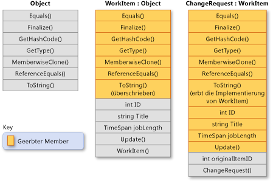

# Vererbung (C#-Programmierhandbuch)
Vererbung ist, gemeinsam mit Kapselung und Polymorphie, eines der drei primären Merkmale \(oder *Pfeiler*\) der objektorientierten Programmierung.  Vererbung ermöglicht die Erstellung neuer Klassen, die in anderen Klassen definiertes Verhalten wieder verwenden, erweitern und ändern.  Die Klasse, deren Member vererbt werden, wird *Basisklasse* genannt, und die Klasse, die diese Member erbt, wird *abgeleitete Klasse* genannt.  Eine abgeleitete Klasse kann nur über eine direkte Basisklasse verfügen.  Allerdings ist die Vererbung transitiv.  Wenn ClassC von ClassB und ClassB von ClassA abgeleitet wird, erbt ClassC die in ClassB und ClassA deklarierten Member.  
  
> [!NOTE]
>  Strukturen unterstützen keine Vererbung, sie können jedoch Schnittstellen implementieren.  Weitere Informationen finden Sie unter [Schnittstellen](../../../csharp/programming-guide/interfaces/index.md).  
  
 Vom Konzept her ist eine abgeleitete Klasse eine Spezialisierung der Basisklasse.  Eine Basisklasse `Animal` kann beispielsweise eine abgeleitete Klasse mit dem Namen `Mammal` und eine weitere abgeleitete Klasse mit dem Namen `Reptile` haben.  Ein `Mammal` ist ein `Animal`, und ein `Reptile` ist ein `Animal`, jede abgeleitete Klasse stellt jedoch unterschiedliche Spezialisierungen der Basisklasse dar.  
  
 Wenn eine Klasse so definiert wird, dass sie von einer anderen Klasse abgeleitet wird, erhält die abgeleitete Klasse implizit alle Member der Basisklasse, mit Ausnahme ihrer Konstruktoren und Destruktoren.  In der abgeleiteten Klasse wird dadurch der Code der Basisklasse wieder verwendet, ohne dass dieser erneut implementiert werden muss.  In der abgeleiteten Klasse können zusätzliche Member hinzugefügt werden.  Auf diese Weise erweitert die abgeleitete Klasse die Funktionalität der Basisklasse.  
  
 In der folgenden Abbildung ist die Klasse `WorkItem` dargestellt, die ein Arbeitselement in einem Geschäftsprozess darstellt.  Wie alle Klassen ist diese Klasse von <xref:System.Object?displayProperty=fullName> abgeleitet und erbt alle ihre Methoden.  `WorkItem` fügt selbst fünf Elemente hinzu.  Enthält auch einen Konstruktor, da Konstruktoren nicht geerbt werden.  Klasse `ChangeRequest` erbt von `WorkItem` und stellt eine bestimmte Art von Arbeitsaufgabe dar.  `ChangeRequest` fügt den Membern, die es von `WorkItem` und <xref:System.Object> erbt, zwei weitere Member hinzu.  Sie muss den einen eigenen Konstruktor hinzufügen und fügt auch `originalItemID` hinzu.  Die Eigenschaft `originalItemID` aktiviert die `ChangeRequest`\-Instanz, die der ursprünglichen `WorkItem` zugeordnet werden soll, für die die Änderungsanforderung gilt.  
  
   
Klassenvererbung  
  
 Im folgenden Beispiel wird dargestellt, wie die in der vorherigen Abbildung veranschaulichten Klassenbeziehungen in C\# ausgedrückt werden.  Das Beispiel zeigt auch, wie `WorkItem` die virtuelle Methode <xref:System.Object.ToString%2A?displayProperty=fullName> überschreibt, und wie die Klasse `ChangeRequest` die `WorkItem`\-Implementierung der Methode erbt.  
  
 [!code-cs[csProgGuideInheritance#49](../../../csharp/programming-guide/classes-and-structs/codesnippet/CSharp/inheritance_1.cs)]  
  
## Abstrakte und virtuelle Methoden  
 Wenn in einer Basisklasse eine Methode als [virtuell](../../../csharp/language-reference/keywords/virtual.md) deklariert wird, kann die Methode in einer abgeleiteten Klasse mit einer eigenen Implementierung [überschrieben](../../../csharp/language-reference/keywords/override.md) werden.  Wenn in einer Basisklasse ein Member als [abstrakt](../../../csharp/language-reference/keywords/abstract.md) deklariert wird, muss diese Methode in jeder nicht abstrakten Klasse, die direkt von dieser Klasse erbt, überschrieben werden.  Wenn eine abgeleitete Klasse selbst abstrakt ist, erbt diese abstrakte Member, ohne sie zu implementieren.  Abstrakte und virtuelle Member sind die Grundlage für Polymorphie, die das zweite primäre Merkmal der objektorientierten Programmierung darstellt.  Weitere Informationen finden Sie unter [Polymorphismus](../../../csharp/programming-guide/classes-and-structs/polymorphism.md).  
  
## Abstrakte Basisklassen  
 Eine Klasse kann als [abstrakt](../../../csharp/language-reference/keywords/abstract.md) deklariert werden, wenn eine direkte Instanziierung mit dem Schlüsselwort [new](../../../csharp/language-reference/keywords/new.md) verhindert werden soll.  In diesem Fall kann die Klasse nur verwendet werden, wenn eine neue Klasse von ihr abgeleitet wird.  Eine abstrakte Klasse kann eine oder mehrere Methodensignaturen enthalten, die selbst als abstrakt deklariert sind.  Diese Signaturen geben die Parameter und den Rückgabewert an, haben jedoch keine Implementierung \(Methodentext\).  Eine abstrakte Klasse muss keine abstrakte Member enthalten. Wenn eine Klasse jedoch abstrakte Member enthält, muss die Klasse als abstrakt deklariert sein.  Abgeleitete Klassen, die selbst nicht abstrakt sind, müssen die Implementierung für jede abstrakte Methode aus einer abstrakten Basisklasse bereitstellen.  Weitere Informationen finden Sie unter [Abstrakte und versiegelte Klassen und Klassenmember](../../../csharp/programming-guide/classes-and-structs/abstract-and-sealed-classes-and-class-members.md).  
  
## Schnittstellen  
 Eine *Schnittstelle* ist ein Referenztyp, der einer abstrakten Basisklasse ähnelt, die nur aus abstrakten Membern besteht.  Wenn eine Klasse eine Schnittstelle implementiert, muss diese eine Implementierung für alle Member dieser Schnittstelle bereitstellen.  Ein Klasse kann viele Schnittstellen implementieren, obwohl sie nur von einer einzigen direkten Basisklasse abgeleitet sein kann.  
  
 Schnittstellen werden verwendet, um spezifische Fähigkeiten für Klassen zu definieren, die nicht notwendigerweise in einer "ist ein"\-Beziehung zu einander stehen.  Beispielsweise kann die <xref:System.IEquatable%601?displayProperty=fullName>\-Schnittstelle durch jede Klasse oder Struktur implementiert werden, die es Clientcode ermöglichen muss, zu ermitteln, ob zwei Objekte des Typs äquivalent sind \(dabei definiert allerdings der Typ die Äquivalenz\).  <xref:System.IEquatable%601> impliziert nicht die gleiche Art nicht "ist ein"\-Beziehung, die zwischen einer Basisklasse und einer abgeleiteten Klasse besteht \(z. B. ist ein `Mammal` ein `Animal`\).  Weitere Informationen finden Sie unter [Schnittstellen](../../../csharp/programming-guide/interfaces/index.md).  
  
## Zugriff der abgeleiteten Klasse auf Member der Basisklasse  
 Eine abgeleitete Klasse hat Zugriff auf die öffentlichen, geschützten, internen und geschützten internen Member einer Basisklasse.  Auch wenn eine abgeleitete Klasse die privaten Member einer Basisklasse erbt, kann sie nicht auf diese Member zugreifen.  Diese privaten Member sind jedoch noch in der abgeleiteten Klasse vorhanden und können die gleichen Aufgaben übernehmen, die sie in der Basisklasse übernehmen würden.  Wenn beispielsweise eine geschützte Basisklassenmethode auf ein privates Feld zugreift,  muss dieses Feld in der abgeleiteten Klasse vorhanden sein, damit die vererbte Basisklassenmethode ordnungsgemäß funktioniert.  
  
## Verhindern weiterer Ableitung  
 Eine Klasse kann andere Klassen daran hindern, von ihr oder einem ihrer Member zu erben, indem sie oder der Member als [versiegelt](../../../csharp/language-reference/keywords/sealed.md) deklariert wird.  Weitere Informationen finden Sie unter [Abstrakte und versiegelte Klassen und Klassenmember](../../../csharp/programming-guide/classes-and-structs/abstract-and-sealed-classes-and-class-members.md).  
  
## Verdecken von Basisklassenmembern in abgeleiteten Klassen  
 In einer abgeleiteten Klasse können Member der Basisklasse verdeckt werden, indem Member mit demselben Namen und derselben Signatur deklariert werden.  Der [new](../../../csharp/language-reference/keywords/new.md)\-Modifizierer kann verwendet werden, um explizit anzugeben, dass der Member nicht als Überschreibung des Basismembers vorgesehen ist.  Die Verwendung von [new](../../../csharp/language-reference/keywords/new.md) ist nicht erforderlich. Es wird jedoch eine Compilerwarnung erstellt, wenn [new](../../../csharp/language-reference/keywords/new.md) nicht verwendet wird.  Weitere Informationen finden Sie unter [Versionsverwaltung mit den Schlüsselwörtern "override" und "new"](../../../csharp/programming-guide/classes-and-structs/versioning-with-the-override-and-new-keywords.md) und [Wann müssen die Schlüsselwörter "override" und "new" verwendet werden?](../../../csharp/programming-guide/classes-and-structs/knowing-when-to-use-override-and-new-keywords.md).  
  
## Siehe auch  
 [C\#\-Programmierhandbuch](../../../csharp/programming-guide/index.md)   
 [Klassen und Strukturen](../../../csharp/programming-guide/classes-and-structs/index.md)   
 [Klasse](../../../csharp/language-reference/keywords/class.md)   
 [struct](../../../csharp/language-reference/keywords/struct.md)