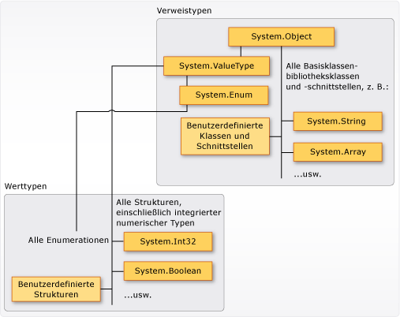

# <a name="types-c-programming-guide"></a><span data-ttu-id="6bb01-102">Typen (C#-Programmierhandbuch)</span><span class="sxs-lookup"><span data-stu-id="6bb01-102">Types (C# Programming Guide)</span></span>
## <a name="types-variables-and-values"></a><span data-ttu-id="6bb01-103">Typen, Variablen und Werte</span><span class="sxs-lookup"><span data-stu-id="6bb01-103">Types, Variables, and Values</span></span>  
 <span data-ttu-id="6bb01-104">C# ist eine stark typisierte Sprache.</span><span class="sxs-lookup"><span data-stu-id="6bb01-104">C# is a strongly-typed language.</span></span> <span data-ttu-id="6bb01-105">Jede Variable und jede Konstante verfügt über einen Typ, genau wie jeder Ausdruck, der zu einem Wert ausgewertet wird.</span><span class="sxs-lookup"><span data-stu-id="6bb01-105">Every variable and constant has a type, as does every expression that evaluates to a value.</span></span> <span data-ttu-id="6bb01-106">Jede Methodensignatur gibt für jeden Eingabeparameter und den Rückgabewert einen Typ an.</span><span class="sxs-lookup"><span data-stu-id="6bb01-106">Every method signature specifies a type for each input parameter and for the return value.</span></span> <span data-ttu-id="6bb01-107">In der .NET Framework-Klassenbibliothek sind integrierte numerische Typen sowie komplexere Typen definiert, die eine große Anzahl logischer Konstrukte darstellen, z. B. das Dateisystem, Netzwerkverbindungen, Auflistungen und Arrays von Objekten sowie Datumsangaben.</span><span class="sxs-lookup"><span data-stu-id="6bb01-107">The .NET Framework class library defines a set of built-in numeric types as well as more complex types that represent a wide variety of logical constructs, such as the file system, network connections, collections and arrays of objects, and dates.</span></span> <span data-ttu-id="6bb01-108">In einem typischen C#-Programm werden Typen aus der Klassenbibliothek sowie benutzerdefinierte Typen verwendet, die die Konzepte für das Problemfeld des Programms modellieren.</span><span class="sxs-lookup"><span data-stu-id="6bb01-108">A typical C# program uses types from the class library as well as user-defined types that model the concepts that are specific to the program's problem domain.</span></span>  
  
 <span data-ttu-id="6bb01-109">Folgende Informationen können in einem Typ gespeichert sein:</span><span class="sxs-lookup"><span data-stu-id="6bb01-109">The information stored in a type can include the following:</span></span>  
  
-   <span data-ttu-id="6bb01-110">Der Speicherplatz, den eine Variable des Typs erfordert</span><span class="sxs-lookup"><span data-stu-id="6bb01-110">The storage space that a variable of the type requires.</span></span>  
  
-   <span data-ttu-id="6bb01-111">Die maximalen und minimalen Werte, die diese darstellen kann</span><span class="sxs-lookup"><span data-stu-id="6bb01-111">The maximum and minimum values that it can represent.</span></span>  
  
-   <span data-ttu-id="6bb01-112">Die enthaltenen Member (Methoden, Felder, Ereignisse usw.)</span><span class="sxs-lookup"><span data-stu-id="6bb01-112">The members (methods, fields, events, and so on) that it contains.</span></span>  
  
-   <span data-ttu-id="6bb01-113">Der Basistyp, von dem geerbt wird</span><span class="sxs-lookup"><span data-stu-id="6bb01-113">The base type it inherits from.</span></span>  
  
-   <span data-ttu-id="6bb01-114">Die Position, an der der Arbeitsspeicher für Variablen zur Laufzeit belegt wird</span><span class="sxs-lookup"><span data-stu-id="6bb01-114">The location where the memory for variables will be allocated at run time.</span></span>  
  
-   <span data-ttu-id="6bb01-115">Die Arten von zulässigen Vorgängen</span><span class="sxs-lookup"><span data-stu-id="6bb01-115">The kinds of operations that are permitted.</span></span>  
  
 <span data-ttu-id="6bb01-116">Der Compiler verwendet Typinformationen, um sicherzustellen, dass alle im Code ausgeführten Vorgänge *typsicher* sind.</span><span class="sxs-lookup"><span data-stu-id="6bb01-116">The compiler uses type information to make sure that all operations that are performed in your code are *type safe*.</span></span> <span data-ttu-id="6bb01-117">Wenn Sie z.B. eine Variable vom Typ [int](../../../csharp/language-reference/keywords/int.md) deklarieren, können Sie mit dem Compiler die Variable für Additions- und Subtraktionsvorgänge verwenden.</span><span class="sxs-lookup"><span data-stu-id="6bb01-117">For example, if you declare a variable of type [int](../../../csharp/language-reference/keywords/int.md), the compiler allows you to use the variable in addition and subtraction operations.</span></span> <span data-ttu-id="6bb01-118">Wenn Sie dieselben Vorgänge für eine Variable vom Typ [bool](../../../csharp/language-reference/keywords/bool.md) ausführen möchten, generiert der Compiler einen Fehler, wie im folgenden Beispiel dargestellt:</span><span class="sxs-lookup"><span data-stu-id="6bb01-118">If you try to perform those same operations on a variable of type [bool](../../../csharp/language-reference/keywords/bool.md), the compiler generates an error, as shown in the following example:</span></span>  
  
 <span data-ttu-id="6bb01-119">[!code-cs[csProgGuideTypes#42](../../../csharp/programming-guide/nullable-types/codesnippet/CSharp/index_1.cs)]</span><span class="sxs-lookup"><span data-stu-id="6bb01-119">[!code-cs[csProgGuideTypes#42](../../../csharp/programming-guide/nullable-types/codesnippet/CSharp/index_1.cs)]</span></span>  
  
> [!NOTE]
>  <span data-ttu-id="6bb01-120">C- und C++-Entwickler sollten beachten, dass in C# [bool](../../../csharp/language-reference/keywords/bool.md) nicht in [int](../../../csharp/language-reference/keywords/int.md) konvertiert werden kann.</span><span class="sxs-lookup"><span data-stu-id="6bb01-120">C and C++ developers, notice that in C#, [bool](../../../csharp/language-reference/keywords/bool.md) is not convertible to [int](../../../csharp/language-reference/keywords/int.md).</span></span>  
  
 <span data-ttu-id="6bb01-121">Der Compiler bettet die Typinformationen als Metadaten in die ausführbare Datei ein.</span><span class="sxs-lookup"><span data-stu-id="6bb01-121">The compiler embeds the type information into the executable file as metadata.</span></span> <span data-ttu-id="6bb01-122">Die Common Language Runtime (CLR) verwendet diese Metadaten zur Laufzeit, um die Typsicherheit zu gewährleisten, wenn Speicherplatz belegt und freigegeben wird.</span><span class="sxs-lookup"><span data-stu-id="6bb01-122">The common language runtime (CLR) uses that metadata at run time to further guarantee type safety when it allocates and reclaims memory.</span></span>  
  
### <a name="specifying-types-in-variable-declarations"></a><span data-ttu-id="6bb01-123">Angeben von Typen in Variablendeklarationen</span><span class="sxs-lookup"><span data-stu-id="6bb01-123">Specifying Types in Variable Declarations</span></span>  
 <span data-ttu-id="6bb01-124">Wenn Sie eine Variable oder Konstante in einem Programm deklarieren, müssen Sie ihren Typ festlegen oder das [var](../../../csharp/language-reference/keywords/var.md)-Schlüsselwort verwenden, damit der Typ vom Compiler abgeleitet wird.</span><span class="sxs-lookup"><span data-stu-id="6bb01-124">When you declare a variable or constant in a program, you must either specify its type or use the [var](../../../csharp/language-reference/keywords/var.md) keyword to let the compiler infer the type.</span></span> <span data-ttu-id="6bb01-125">Im folgenden Beispiel werden einige Variablendeklarationen dargestellt, die sowohl integrierte numerische Typen als auch komplexe benutzerdefinierte Typen verwenden:</span><span class="sxs-lookup"><span data-stu-id="6bb01-125">The following example shows some variable declarations that use both built-in numeric types and complex user-defined types:</span></span>  
  
 <span data-ttu-id="6bb01-126">[!code-cs[csProgGuideTypes#36](../../../csharp/programming-guide/nullable-types/codesnippet/CSharp/index_2.cs)]</span><span class="sxs-lookup"><span data-stu-id="6bb01-126">[!code-cs[csProgGuideTypes#36](../../../csharp/programming-guide/nullable-types/codesnippet/CSharp/index_2.cs)]</span></span>  
  
 <span data-ttu-id="6bb01-127">Die Methodenparameter- und Rückgabewerttypen werden in der Methodensignatur angegeben.</span><span class="sxs-lookup"><span data-stu-id="6bb01-127">The types of method parameters and return values are specified in the method signature.</span></span> <span data-ttu-id="6bb01-128">Die folgende Signatur zeigt eine Methode, für die ein [int](../../../csharp/language-reference/keywords/int.md) als Eingabeargument benötigt wird und die eine Zeichenfolge zurückgibt:</span><span class="sxs-lookup"><span data-stu-id="6bb01-128">The following signature shows a method that requires an [int](../../../csharp/language-reference/keywords/int.md) as an input argument and returns a string:</span></span>  
  
 <span data-ttu-id="6bb01-129">[!code-cs[csProgGuideTypes#35](../../../csharp/programming-guide/nullable-types/codesnippet/CSharp/index_3.cs)]</span><span class="sxs-lookup"><span data-stu-id="6bb01-129">[!code-cs[csProgGuideTypes#35](../../../csharp/programming-guide/nullable-types/codesnippet/CSharp/index_3.cs)]</span></span>  
  
 <span data-ttu-id="6bb01-130">Nachdem eine Variable deklariert wurde, kann sie nicht erneut mit einem neuen Typ deklariert werden. Außerdem kann ihr kein Wert zugewiesen werden, der nicht mit dem deklarierten Typ kompatibel ist.</span><span class="sxs-lookup"><span data-stu-id="6bb01-130">After a variable is declared, it cannot be re-declared with a new type, and it cannot be assigned a value that is not compatible with its declared type.</span></span> <span data-ttu-id="6bb01-131">Zum Beispiel können Sie eine [int](../../../csharp/language-reference/keywords/int.md) nicht deklarieren und dieser dann den booleschen Wert [true](../../../csharp/language-reference/keywords/true-literal.md) zuweisen.</span><span class="sxs-lookup"><span data-stu-id="6bb01-131">For example, you cannot declare an [int](../../../csharp/language-reference/keywords/int.md) and then assign it a Boolean value of [true](../../../csharp/language-reference/keywords/true-literal.md).</span></span> <span data-ttu-id="6bb01-132">Werte können jedoch in andere Typen konvertiert werden, z. B., wenn diese neuen Variablen zugewiesen oder als Methodenargumente übergeben werden.</span><span class="sxs-lookup"><span data-stu-id="6bb01-132">However, values can be converted to other types, for example when they are assigned to new variables or passed as method arguments.</span></span> <span data-ttu-id="6bb01-133">Eine *Typkonvertierung*, die keinen Datenverlust verursacht, wird automatisch vom Compiler ausgeführt.</span><span class="sxs-lookup"><span data-stu-id="6bb01-133">A *type conversion* that does not cause data loss is performed automatically by the compiler.</span></span> <span data-ttu-id="6bb01-134">Eine Konvertierung, die möglicherweise Datenverlust verursacht, erfordert eine *Umwandlung* in den Quellcode.</span><span class="sxs-lookup"><span data-stu-id="6bb01-134">A conversion that might cause data loss requires a *cast* in the source code.</span></span>  
  
 <span data-ttu-id="6bb01-135">Weitere Informationen finden Sie unter [Umwandlung und Typkonvertierungen](../../../csharp/programming-guide/types/casting-and-type-conversions.md).</span><span class="sxs-lookup"><span data-stu-id="6bb01-135">For more information, see [Casting and Type Conversions](../../../csharp/programming-guide/types/casting-and-type-conversions.md).</span></span>  
  
## <a name="built-in-types"></a><span data-ttu-id="6bb01-136">Integrierte Typen</span><span class="sxs-lookup"><span data-stu-id="6bb01-136">Built-in Types</span></span>  
 <span data-ttu-id="6bb01-137">C# liefert einen Standardsatz mit integrierten numerischen Typen zur Darstellung von ganzen Zahlen, Gleitkommawerten, booleschen Ausdrücken, Textzeichen, Dezimalwerten und anderen Datentypen.</span><span class="sxs-lookup"><span data-stu-id="6bb01-137">C# provides a standard set of built-in numeric types to represent integers, floating point values, Boolean expressions, text characters, decimal values, and other types of data.</span></span> <span data-ttu-id="6bb01-138">Es gibt auch integrierte `string`-Typen und `object`-Typen.</span><span class="sxs-lookup"><span data-stu-id="6bb01-138">There are also built-in `string` and `object` types.</span></span> <span data-ttu-id="6bb01-139">Diese können Sie in jedem C#-Programm verwenden.</span><span class="sxs-lookup"><span data-stu-id="6bb01-139">These are available for you to use in any C# program.</span></span> <span data-ttu-id="6bb01-140">Weitere Informationen über die integrierten Typen finden Sie unter [Referenztabellen für Typen](../../../csharp/language-reference/keywords/reference-tables-for-types.md).</span><span class="sxs-lookup"><span data-stu-id="6bb01-140">For more information about the built-in types, see [Reference Tables for Types](../../../csharp/language-reference/keywords/reference-tables-for-types.md).</span></span>  
  
## <a name="custom-types"></a><span data-ttu-id="6bb01-141">Benutzerdefinierte Typen</span><span class="sxs-lookup"><span data-stu-id="6bb01-141">Custom Types</span></span>  
 <span data-ttu-id="6bb01-142">Sie verwenden die Konstrukte [struct](../../../csharp/language-reference/keywords/struct.md), [class](../../../csharp/language-reference/keywords/class.md), [interface](../../../csharp/language-reference/keywords/interface.md) und [enum](../../../csharp/language-reference/keywords/enum.md), um eigene benutzerdefinierte Typen zu erstellen.</span><span class="sxs-lookup"><span data-stu-id="6bb01-142">You use the [struct](../../../csharp/language-reference/keywords/struct.md), [class](../../../csharp/language-reference/keywords/class.md), [interface](../../../csharp/language-reference/keywords/interface.md), and [enum](../../../csharp/language-reference/keywords/enum.md) constructs to create your own custom types.</span></span> <span data-ttu-id="6bb01-143">Die .NET Framework-Klassenbibliothek ist eine Auflistung benutzerdefinierter, von Microsoft bereitgestellter Typen, die Sie in Ihren eigenen Anwendungen verwenden können.</span><span class="sxs-lookup"><span data-stu-id="6bb01-143">The .NET Framework class library itself is a collection of custom types provided by Microsoft that you can use in your own applications.</span></span> <span data-ttu-id="6bb01-144">Standardmäßig sind die am häufigsten verwendeten Typen in der Klassenbibliothek in jedem C#-Programm verfügbar.</span><span class="sxs-lookup"><span data-stu-id="6bb01-144">By default, the most frequently used types in the class library are available in any C# program.</span></span> <span data-ttu-id="6bb01-145">Andere stehen nur zur Verfügung, wenn Sie ausdrücklich einen Projektverweis auf die Assembly hinzufügen, in der diese definiert sind.</span><span class="sxs-lookup"><span data-stu-id="6bb01-145">Others become available only when you explicitly add a project reference to the assembly in which they are defined.</span></span> <span data-ttu-id="6bb01-146">Wenn der Compiler über einen Verweis auf die Assembly verfügt, können Sie Variablen (und Konstanten) des in dieser Assembly deklarierten Typs im Quellcode deklarieren.</span><span class="sxs-lookup"><span data-stu-id="6bb01-146">After the compiler has a reference to the assembly, you can declare variables (and constants) of the types declared in that assembly in source code.</span></span> <span data-ttu-id="6bb01-147">Weitere Informationen finden Sie in der Dokumentation zur [.NET Framework-Klassenbibliothek](http://go.microsoft.com/fwlink/?LinkID=217856).</span><span class="sxs-lookup"><span data-stu-id="6bb01-147">For more information, see [.NET Framework Class Library](http://go.microsoft.com/fwlink/?LinkID=217856).</span></span>  
  
## <a name="the-common-type-system"></a><span data-ttu-id="6bb01-148">Das allgemeine Typsystem</span><span class="sxs-lookup"><span data-stu-id="6bb01-148">The Common Type System</span></span>  
 <span data-ttu-id="6bb01-149">Mit zwei grundlegenden Punkten über das System der Typen in [!INCLUDE[dnprdnshort](~/includes/dnprdnshort-md.md)] sollten Sie vertraut sein:</span><span class="sxs-lookup"><span data-stu-id="6bb01-149">It is important to understand two fundamental points about the type system in the [!INCLUDE[dnprdnshort](~/includes/dnprdnshort-md.md)]:</span></span>  
  
-   <span data-ttu-id="6bb01-150">Es unterstützt das Prinzip der Vererbung.</span><span class="sxs-lookup"><span data-stu-id="6bb01-150">It supports the principle of inheritance.</span></span> <span data-ttu-id="6bb01-151">Typen können von anderen Typen abgeleitet werden, die als *Basistypen* bezeichnet werden.</span><span class="sxs-lookup"><span data-stu-id="6bb01-151">Types can derive from other types, called *base types*.</span></span> <span data-ttu-id="6bb01-152">Der abgeleitete Typ erbt (mit einigen Beschränkungen) die Methoden, Eigenschaften und anderen Member des Basistyps.</span><span class="sxs-lookup"><span data-stu-id="6bb01-152">The derived type inherits (with some restrictions) the methods, properties, and other members of the base type.</span></span> <span data-ttu-id="6bb01-153">Der Basistyp kann wiederum von einem anderen Typ abgeleitet sein. In diesem Fall erbt der abgeleitete Typ die Member beider Basistypen in der Vererbungshierarchie.</span><span class="sxs-lookup"><span data-stu-id="6bb01-153">The base type can in turn derive from some other type, in which case the derived type inherits the members of both base types in its inheritance hierarchy.</span></span> <span data-ttu-id="6bb01-154">Alle Typen, einschließlich integrierter numerischer Typen, z. B. <xref:System.Int32?displayProperty=fullName> (C#-Schlüsselwort: [int](../../../csharp/language-reference/keywords/int.md)), werden letztendlich von einem einzelnen Basistyp abgeleitet, nämlich <xref:System.Object?displayProperty=fullName> (C#-Schlüsselwort: [object](../../../csharp/language-reference/keywords/object.md)).</span><span class="sxs-lookup"><span data-stu-id="6bb01-154">All types, including built-in numeric types such as <xref:System.Int32?displayProperty=fullName> (C# keyword: [int](../../../csharp/language-reference/keywords/int.md)), derive ultimately from a single base type, which is <xref:System.Object?displayProperty=fullName> (C# keyword: [object](../../../csharp/language-reference/keywords/object.md)).</span></span> <span data-ttu-id="6bb01-155">Diese einheitliche Typhierarchie wird als [Allgemeines Typsystem](../../../standard/base-types/common-type-system.md) (CTS) bezeichnet.</span><span class="sxs-lookup"><span data-stu-id="6bb01-155">This unified type hierarchy is called the [Common Type System](../../../standard/base-types/common-type-system.md) (CTS).</span></span> <span data-ttu-id="6bb01-156">Weitere Informationen zur Vererbung in C# finden Sie unter [Vererbung](../../../csharp/programming-guide/classes-and-structs/inheritance.md).</span><span class="sxs-lookup"><span data-stu-id="6bb01-156">For more information about inheritance in C#, see [Inheritance](../../../csharp/programming-guide/classes-and-structs/inheritance.md).</span></span>  
  
-   <span data-ttu-id="6bb01-157">Jeder Typ im CTS ist als *Werttyp* oder *Referenztyp* definiert.</span><span class="sxs-lookup"><span data-stu-id="6bb01-157">Each type in the CTS is defined as either a *value type* or a *reference type*.</span></span> <span data-ttu-id="6bb01-158">Dies betrifft auch alle benutzerdefinierten Typen in der .NET Framework-Klassenbibliothek und Ihre eigenen benutzerdefinierten Typen.</span><span class="sxs-lookup"><span data-stu-id="6bb01-158">This includes all custom types in the .NET Framework class library and also your own user-defined types.</span></span> <span data-ttu-id="6bb01-159">Typen, die Sie mithilfe des [struct](../../../csharp/language-reference/keywords/struct.md)-Schlüsselworts definieren, sind Werttypen. Alle integrierten numerischen Typen sind `structs`.</span><span class="sxs-lookup"><span data-stu-id="6bb01-159">Types that you define by using the [struct](../../../csharp/language-reference/keywords/struct.md) keyword are value types; all the built-in numeric types are `structs`.</span></span> <span data-ttu-id="6bb01-160">Typen, die Sie mithilfe des [class](../../../csharp/language-reference/keywords/class.md)-Schlüsselworts definieren, sind Referenztypen.</span><span class="sxs-lookup"><span data-stu-id="6bb01-160">Types that you define by using the [class](../../../csharp/language-reference/keywords/class.md) keyword are reference types.</span></span> <span data-ttu-id="6bb01-161">Für Referenztypen und Werttypen gelten unterschiedliche Kompilierzeitregeln und ein anderes Laufzeitverhalten.</span><span class="sxs-lookup"><span data-stu-id="6bb01-161">Reference types and value types have different compile-time rules, and different run-time behavior.</span></span>  
  
 <span data-ttu-id="6bb01-162">In der folgenden Abbildung wird die Beziehung zwischen Werttypen und Referenztypen im CTS dargestellt.</span><span class="sxs-lookup"><span data-stu-id="6bb01-162">The following illustration shows the relationship between value types and reference types in the CTS.</span></span>  
  
 <span data-ttu-id="6bb01-163">![Wert- und Verweistypen] (../../../csharp/programming-guide/types/media/valuetypescts.png "ValueTypeCTS")</span><span class="sxs-lookup"><span data-stu-id="6bb01-163"></span></span>  
<span data-ttu-id="6bb01-164">Werttypen und Referenztypen im CTS</span><span class="sxs-lookup"><span data-stu-id="6bb01-164">Value types and reference types in the CTS</span></span>  
  
> [!NOTE]
>  <span data-ttu-id="6bb01-165">Wie Sie sehen, sind die am häufigsten verwendeten Typen alle im <xref:System>-Namespace organisiert.</span><span class="sxs-lookup"><span data-stu-id="6bb01-165">You can see that the most commonly used types are all organized in the <xref:System> namespace.</span></span> <span data-ttu-id="6bb01-166">Jedoch ist es für den Namespace, in dem ein Typ enthalten ist, unerheblich, ob es sich um einen Werttyp oder einen Referenztyp handelt.</span><span class="sxs-lookup"><span data-stu-id="6bb01-166">However, the namespace in which a type is contained has no relation to whether it is a value type or reference type.</span></span>  
  
### <a name="value-types"></a><span data-ttu-id="6bb01-167">Werttypen</span><span class="sxs-lookup"><span data-stu-id="6bb01-167">Value Types</span></span>  
 <span data-ttu-id="6bb01-168">Werttypen werden von <xref:System.ValueType?displayProperty=fullName> abgeleitet, was wiederum von <xref:System.Object?displayProperty=fullName> abgeleitet wird.</span><span class="sxs-lookup"><span data-stu-id="6bb01-168">Value types derive from <xref:System.ValueType?displayProperty=fullName>, which derives from <xref:System.Object?displayProperty=fullName>.</span></span> <span data-ttu-id="6bb01-169">Typen, die von <xref:System.ValueType?displayProperty=fullName> abgeleitet werden, weisen ein besonderes Verhalten in der CLR auf.</span><span class="sxs-lookup"><span data-stu-id="6bb01-169">Types that derive from <xref:System.ValueType?displayProperty=fullName> have special behavior in the CLR.</span></span> <span data-ttu-id="6bb01-170">Werttypvariablen enthalten die zugehörigen Werte direkt, d. h., der Speicher wird inline in dem Kontext belegt, in dem die Variable deklariert ist.</span><span class="sxs-lookup"><span data-stu-id="6bb01-170">Value type variables directly contain their values, which means that the memory is allocated inline in whatever context the variable is declared.</span></span> <span data-ttu-id="6bb01-171">Für Werttypvariablen erfolgt keine getrennte Heapzuordnung oder ein Mehraufwand für die Garbage Collection.</span><span class="sxs-lookup"><span data-stu-id="6bb01-171">There is no separate heap allocation or garbage collection overhead for value-type variables.</span></span>  
  
 <span data-ttu-id="6bb01-172">Zwei Kategorien von Werttypen sind verfügbar: [struct](../../../csharp/language-reference/keywords/struct.md) und [enum](../../../csharp/language-reference/keywords/enum.md).</span><span class="sxs-lookup"><span data-stu-id="6bb01-172">There are two categories of value types: [struct](../../../csharp/language-reference/keywords/struct.md) and [enum](../../../csharp/language-reference/keywords/enum.md).</span></span>  
  
 <span data-ttu-id="6bb01-173">Die integrierten numerischen Typen sind Strukturen und verfügen über Eigenschaften und Methoden, auf die Sie zugreifen können:</span><span class="sxs-lookup"><span data-stu-id="6bb01-173">The built-in numeric types are structs, and they have properties and methods that you can access:</span></span>  
  
```csharp  
// Static method on type Byte.  
byte b = Byte.MaxValue;  
```  
  
 <span data-ttu-id="6bb01-174">Sie deklarieren diese jedoch und weisen ihnen Werte zu, als wären es einfache, nicht aggregierte Typen:</span><span class="sxs-lookup"><span data-stu-id="6bb01-174">But you declare and assign values to them as if they were simple non-aggregate types:</span></span>  
  
```csharp  
byte num = 0xA;  
int i = 5;  
char c = 'Z';  
```  
  
 <span data-ttu-id="6bb01-175">Werttypen sind *versiegelt* (sealed). Dies bedeutet z.B., dass Sie keinen Typ von <xref:System.Int32?displayProperty=fullName> ableiten können und dass eine Struktur nicht von einer benutzerdefinierten Klasse oder Struktur erben kann, weil eine Struktur nur von <xref:System.ValueType?displayProperty=fullName> erben kann.</span><span class="sxs-lookup"><span data-stu-id="6bb01-175">Value types are *sealed*, which means, for example, that you cannot derive a type from <xref:System.Int32?displayProperty=fullName>, and you cannot define a struct to inherit from any user-defined class or struct because a struct can only inherit from <xref:System.ValueType?displayProperty=fullName>.</span></span> <span data-ttu-id="6bb01-176">Eine Struktur kann jedoch eine oder mehrere Schnittstellen implementieren.</span><span class="sxs-lookup"><span data-stu-id="6bb01-176">However, a struct can implement one or more interfaces.</span></span> <span data-ttu-id="6bb01-177">Sie können einen Strukturtyp in einen Schnittstellentyp umwandeln. Dadurch wird ein *Boxing*-Vorgang gestartet, mit dem die Struktur von einem Referenztypobjekt im verwalteten Heap umschlossen wird.</span><span class="sxs-lookup"><span data-stu-id="6bb01-177">You can cast a struct type to an interface type; this causes a *boxing* operation to wrap the struct inside a reference type object on the managed heap.</span></span> <span data-ttu-id="6bb01-178">Boxing-Vorgänge werden auch ausgeführt, wenn Sie einen Werttyp an eine Methode übergeben, die <xref:System.Object?displayProperty=fullName> als Eingabeparameter akzeptiert.</span><span class="sxs-lookup"><span data-stu-id="6bb01-178">Boxing operations occur when you pass a value type to a method that takes a <xref:System.Object?displayProperty=fullName> as an input parameter.</span></span> <span data-ttu-id="6bb01-179">Weitere Informationen finden Sie unter [Boxing und Unboxing](../../../csharp/programming-guide/types/boxing-and-unboxing.md).</span><span class="sxs-lookup"><span data-stu-id="6bb01-179">For more information, see [Boxing and Unboxing](../../../csharp/programming-guide/types/boxing-and-unboxing.md).</span></span>  
  
 <span data-ttu-id="6bb01-180">Sie können das [struct](../../../csharp/language-reference/keywords/struct.md)-Schlüsselwort verwenden, um eigene benutzerdefinierte Werttypen zu erstellen.</span><span class="sxs-lookup"><span data-stu-id="6bb01-180">You use the [struct](../../../csharp/language-reference/keywords/struct.md) keyword to create your own custom value types.</span></span> <span data-ttu-id="6bb01-181">In der Regel wird eine Struktur als Container für einen kleinen Satz verwandter Variablen verwendet, wie im folgenden Beispiel dargestellt:</span><span class="sxs-lookup"><span data-stu-id="6bb01-181">Typically, a struct is used as a container for a small set of related variables, as shown in the following example:</span></span>  
  
 <span data-ttu-id="6bb01-182">[!code-cs[csProgGuideObjects#1](../../../csharp/programming-guide/classes-and-structs/codesnippet/CSharp/index_4.cs)]</span><span class="sxs-lookup"><span data-stu-id="6bb01-182">[!code-cs[csProgGuideObjects#1](../../../csharp/programming-guide/classes-and-structs/codesnippet/CSharp/index_4.cs)]</span></span>  
  
 <span data-ttu-id="6bb01-183">Weitere Informationen über Strukturen finden Sie unter [Strukturen](../../../csharp/programming-guide/classes-and-structs/structs.md).</span><span class="sxs-lookup"><span data-stu-id="6bb01-183">For more information about structs, see [Structs](../../../csharp/programming-guide/classes-and-structs/structs.md).</span></span> <span data-ttu-id="6bb01-184">Weitere Informationen über Werttypen in [!INCLUDE[dnprdnshort](~/includes/dnprdnshort-md.md)] finden Sie unter [Allgemeines Typsystem](../../../standard/base-types/common-type-system.md).</span><span class="sxs-lookup"><span data-stu-id="6bb01-184">For more information about value types in the [!INCLUDE[dnprdnshort](~/includes/dnprdnshort-md.md)], see [Common Type System](../../../standard/base-types/common-type-system.md).</span></span>  
  
 <span data-ttu-id="6bb01-185">Die andere Kategorie von Werttypen ist [enum](../../../csharp/language-reference/keywords/enum.md).</span><span class="sxs-lookup"><span data-stu-id="6bb01-185">The other category of value types is [enum](../../../csharp/language-reference/keywords/enum.md).</span></span> <span data-ttu-id="6bb01-186">Eine Enumeration definiert einen Satz benannter ganzzahliger Konstanten.</span><span class="sxs-lookup"><span data-stu-id="6bb01-186">An enum defines a set of named integral constants.</span></span> <span data-ttu-id="6bb01-187">So enthält z. B. die <xref:System.IO.FileMode?displayProperty=fullName>-Enumeration in der .NET Framework-Klassenbibliothek einen Satz benannter ganzzahliger Konstanten, die festlegen, wie eine Datei geöffnet werden soll.</span><span class="sxs-lookup"><span data-stu-id="6bb01-187">For example, the <xref:System.IO.FileMode?displayProperty=fullName> enumeration in the .NET Framework class library contains a set of named constant integers that specify how a file should be opened.</span></span> <span data-ttu-id="6bb01-188">Die Definition erfolgt wie im folgenden Beispiel:</span><span class="sxs-lookup"><span data-stu-id="6bb01-188">It is defined as shown in the following example:</span></span>  
 
 <span data-ttu-id="6bb01-189">[!code-cs[csProgGuideTypes#44](../../../csharp/programming-guide/nullable-types/codesnippet/CSharp/index_5.cs)]</span><span class="sxs-lookup"><span data-stu-id="6bb01-189">[!code-cs[csProgGuideTypes#44](../../../csharp/programming-guide/nullable-types/codesnippet/CSharp/index_5.cs)]</span></span>  
  
 <span data-ttu-id="6bb01-190">Die `System.IO.FileMode.Create`-Konstante besitzt den Wert 2.</span><span class="sxs-lookup"><span data-stu-id="6bb01-190">The `System.IO.FileMode.Create` constant has a value of 2.</span></span> <span data-ttu-id="6bb01-191">Der Name ist jedoch für Personen, die den Quellcode lesen, viel aussagekräftiger. Aus diesem Grund ist es besser, anstelle von Konstantenliteralen Enumerationen zu verwenden.</span><span class="sxs-lookup"><span data-stu-id="6bb01-191">However, the name is much more meaningful for humans reading the source code, and for that reason it is better to use enumerations instead of constant literal numbers.</span></span> <span data-ttu-id="6bb01-192">Weitere Informationen finden Sie unter <xref:System.IO.FileMode?displayProperty=fullName>.</span><span class="sxs-lookup"><span data-stu-id="6bb01-192">For more information, see <xref:System.IO.FileMode?displayProperty=fullName>.</span></span>  
  
 <span data-ttu-id="6bb01-193">Alle Enumerationen erben von <xref:System.Enum?displayProperty=fullName>, was wiederum von <xref:System.ValueType?displayProperty=fullName> erbt.</span><span class="sxs-lookup"><span data-stu-id="6bb01-193">All enums inherit from <xref:System.Enum?displayProperty=fullName>, which inherits from <xref:System.ValueType?displayProperty=fullName>.</span></span> <span data-ttu-id="6bb01-194">Alle Regeln, die für Strukturen gelten, gelten auch für Enumerationen.</span><span class="sxs-lookup"><span data-stu-id="6bb01-194">All the rules that apply to structs also apply to enums.</span></span> <span data-ttu-id="6bb01-195">Weitere Informationen über Enumerationen finden Sie unter [Enumerationstypen](../../../csharp/programming-guide/enumeration-types.md).</span><span class="sxs-lookup"><span data-stu-id="6bb01-195">For more information about enums, see [Enumeration Types](../../../csharp/programming-guide/enumeration-types.md).</span></span>  
  
### <a name="reference-types"></a><span data-ttu-id="6bb01-196">Verweistypen</span><span class="sxs-lookup"><span data-stu-id="6bb01-196">Reference Types</span></span>  
 <span data-ttu-id="6bb01-197">Ein Typ, der als [Klasse](../../../csharp/language-reference/keywords/class.md), [Delegat](../../../csharp/language-reference/keywords/delegate.md), Array oder [Schnittstelle](../../../csharp/language-reference/keywords/interface.md) definiert ist, ist ein *Referenztyp*.</span><span class="sxs-lookup"><span data-stu-id="6bb01-197">A type that is defined as a [class](../../../csharp/language-reference/keywords/class.md), [delegate](../../../csharp/language-reference/keywords/delegate.md), array, or [interface](../../../csharp/language-reference/keywords/interface.md) is a *reference type*.</span></span> <span data-ttu-id="6bb01-198">Wenn Sie zur Laufzeit eine Variable eines Referenztyps deklarieren, enthält die Variable zunächst den Wert [NULL](../../../csharp/language-reference/keywords/null.md), bis Sie explizit eine Instanz des Objekts mithilfe des Operators [new](../../../csharp/language-reference/keywords/new.md) erstellen oder ihr ein Objekt zuweisen, das an anderer Stelle mithilfe des Operators `new` erstellt wurde, wie im folgenden Beispiel gezeigt wird:</span><span class="sxs-lookup"><span data-stu-id="6bb01-198">At run time, when you declare a variable of a reference type, the variable contains the value [null](../../../csharp/language-reference/keywords/null.md) until you explicitly create an instance of the object by using the [new](../../../csharp/language-reference/keywords/new.md) operator, or assign it an object that has been created elsewhere by using `new`, as shown in the following example:</span></span>
  
```csharp  
MyClass mc = new MyClass();  
MyClass mc2 = mc;  
```  
   <span data-ttu-id="6bb01-199">Eine Schnittstelle muss zusammen mit einem Klassenobjekt initialisiert werden, von dem sie implementiert wird.</span><span class="sxs-lookup"><span data-stu-id="6bb01-199">An interface must be initialized together with a class object that implements it.</span></span> <span data-ttu-id="6bb01-200">Wenn `MyClass` von `IMyInterface` implementiert wird, erstellen Sie eine Instanz von `IMyInterface`, wie im folgenden Beispiel dargestellt:</span><span class="sxs-lookup"><span data-stu-id="6bb01-200">If `MyClass` implements `IMyInterface`, you create an instance of `IMyInterface` as shown in the following example:</span></span>  
  
```csharp  
IMyInterface iface = new MyClass();  
```  
  
 <span data-ttu-id="6bb01-201">Beim Erstellen des Objekts wird der Speicher im verwalteten Heap belegt. Die Variable enthält lediglich einen Verweis auf den Speicherort des Objekts.</span><span class="sxs-lookup"><span data-stu-id="6bb01-201">When the object is created, the memory is allocated on the managed heap, and the variable holds only a reference to the location of the object.</span></span> <span data-ttu-id="6bb01-202">Für Typen im verwalteten Heap ist Mehraufwand erforderlich, wenn sie zugewiesen werden und wenn sie von der automatischen Speicherverwaltungsfunktion der CLR freigegeben werden, was als *Garbage Collection* bezeichnet wird.</span><span class="sxs-lookup"><span data-stu-id="6bb01-202">Types on the managed heap require overhead both when they are allocated and when they are reclaimed by the automatic memory management functionality of the CLR, which is known as *garbage collection*.</span></span> <span data-ttu-id="6bb01-203">Die Garbage Collection ist jedoch auch stark optimiert. In den meisten Szenarien führt sie nicht zu einem Leistungsproblem.</span><span class="sxs-lookup"><span data-stu-id="6bb01-203">However, garbage collection is also highly optimized, and in most scenarios it does not create a performance issue.</span></span> <span data-ttu-id="6bb01-204">Weitere Informationen zur Garbage Collection finden Sie unter [Automatische Speicherverwaltung](../../../standard/automatic-memory-management.md).</span><span class="sxs-lookup"><span data-stu-id="6bb01-204">For more information about garbage collection, see [Automatic Memory Management](../../../standard/automatic-memory-management.md).</span></span>  
  
 <span data-ttu-id="6bb01-205">Alle Arrays sind Referenztypen, selbst wenn ihre Elemente Werttypen sind.</span><span class="sxs-lookup"><span data-stu-id="6bb01-205">All arrays are reference types, even if their elements are value types.</span></span> <span data-ttu-id="6bb01-206">Arrays werden implizit von der <xref:System.Array?displayProperty=fullName>-Klasse abgeleitet. Sie deklarieren und verwenden diese jedoch mit der vereinfachten, von C# bereitgestellten Syntax, wie im folgenden Beispiel dargestellt:</span><span class="sxs-lookup"><span data-stu-id="6bb01-206">Arrays implicitly derive from the <xref:System.Array?displayProperty=fullName> class, but you declare and use them with the simplified syntax that is provided by C#, as shown in the following example:</span></span>  
  
 <span data-ttu-id="6bb01-207">[!code-cs[csProgGuideTypes#45](../../../csharp/programming-guide/nullable-types/codesnippet/CSharp/index_6.cs)]</span><span class="sxs-lookup"><span data-stu-id="6bb01-207">[!code-cs[csProgGuideTypes#45](../../../csharp/programming-guide/nullable-types/codesnippet/CSharp/index_6.cs)]</span></span>  
  
 <span data-ttu-id="6bb01-208">Referenztypen bieten volle Vererbungsunterstützung.</span><span class="sxs-lookup"><span data-stu-id="6bb01-208">Reference types fully support inheritance.</span></span> <span data-ttu-id="6bb01-209">Wenn Sie eine Klasse erstellen, können Sie von einer anderen Schnittstelle oder Klasse erben, die nicht als [versiegelt](../../../csharp/language-reference/keywords/sealed.md) definiert ist. Andere Klassen können von Ihrer Klasse erben und die virtuellen Methoden überschreiben.</span><span class="sxs-lookup"><span data-stu-id="6bb01-209">When you create a class, you can inherit from any other interface or class that is not defined as [sealed](../../../csharp/language-reference/keywords/sealed.md), and other classes can inherit from your class and override your virtual methods.</span></span> <span data-ttu-id="6bb01-210">Weitere Informationen zum Erstellen eigener Klassen finden Sie unter [Klassen und Strukturen](../../../csharp/programming-guide/classes-and-structs/index.md).</span><span class="sxs-lookup"><span data-stu-id="6bb01-210">For more information about how to create your own classes, see [Classes and Structs](../../../csharp/programming-guide/classes-and-structs/index.md).</span></span> <span data-ttu-id="6bb01-211">Weitere Informationen zur Vererbung und zu virtuellen Methoden finden Sie unter [Vererbung](../../../csharp/programming-guide/classes-and-structs/inheritance.md).</span><span class="sxs-lookup"><span data-stu-id="6bb01-211">For more information about inheritance and virtual methods, see [Inheritance](../../../csharp/programming-guide/classes-and-structs/inheritance.md).</span></span>  
  
## <a name="types-of-literal-values"></a><span data-ttu-id="6bb01-212">Typen von Literalwerten</span><span class="sxs-lookup"><span data-stu-id="6bb01-212">Types of Literal Values</span></span>  
 <span data-ttu-id="6bb01-213">In C# erhalten Literalwerte einen Typ vom Compiler.</span><span class="sxs-lookup"><span data-stu-id="6bb01-213">In C#, literal values receive a type from the compiler.</span></span> <span data-ttu-id="6bb01-214">Sie können festlegen, wie ein numerisches Literal eingegeben werden soll, indem Sie am Ende der Zahl einen Buchstaben anfügen.</span><span class="sxs-lookup"><span data-stu-id="6bb01-214">You can specify how a numeric literal should be typed by appending a letter to the end of the number.</span></span> <span data-ttu-id="6bb01-215">Um z. B. anzugeben, dass der Wert 4.56 als Gleitkommazahl behandelt werden soll, fügen Sie nach der Zahl `4.56f` ein "f" oder "F" an:</span><span class="sxs-lookup"><span data-stu-id="6bb01-215">For example, to specify that the value 4.56 should be treated as a float, append an "f" or "F" after the number: `4.56f`.</span></span> <span data-ttu-id="6bb01-216">Wenn kein Buchstabe angefügt wird, leitet der Compiler einen Typ für das Literal ab.</span><span class="sxs-lookup"><span data-stu-id="6bb01-216">If no letter is appended, the compiler will infer a type for the literal.</span></span> <span data-ttu-id="6bb01-217">Weitere Informationen darüber, welche Typen mit Buchstabensuffixen angegeben werden können, finden Sie auf den Referenzseiten für einzelne Typen unter [Werttypen](../../../csharp/language-reference/keywords/value-types.md).</span><span class="sxs-lookup"><span data-stu-id="6bb01-217">For more information about which types can be specified with letter suffixes, see the reference pages for individual types in [Value Types](../../../csharp/language-reference/keywords/value-types.md).</span></span>  
  
 <span data-ttu-id="6bb01-218">Da Literale typisiert sind und alle Typen letztlich von <xref:System.Object?displayProperty=fullName> abgeleitet werden, können Sie Code der folgenden Art erstellen und kompilieren:</span><span class="sxs-lookup"><span data-stu-id="6bb01-218">Because literals are typed, and all types derive ultimately from <xref:System.Object?displayProperty=fullName>, you can write and compile code such as the following:</span></span>  
  
 <span data-ttu-id="6bb01-219">[!code-cs[csProgGuideTypes#37](../../../csharp/programming-guide/nullable-types/codesnippet/CSharp/index_7.cs)]</span><span class="sxs-lookup"><span data-stu-id="6bb01-219">[!code-cs[csProgGuideTypes#37](../../../csharp/programming-guide/nullable-types/codesnippet/CSharp/index_7.cs)]</span></span>  
  
## <a name="generic-types"></a><span data-ttu-id="6bb01-220">Generische Typen</span><span class="sxs-lookup"><span data-stu-id="6bb01-220">Generic Types</span></span>  
 <span data-ttu-id="6bb01-221">Ein Typ kann mit einem oder mehreren *Typparametern* deklariert werden, die als Platzhalter für den eigentlichen Typ verwendet werden (den *konkreten Typ*), der vom Clientcode beim Erstellen einer Instanz des Typs bereitgestellt wird.</span><span class="sxs-lookup"><span data-stu-id="6bb01-221">A type can be declared with one or more *type parameters* that serve as a placeholder for the actual type (the *concrete type*) that client code will provide when it creates an instance of the type.</span></span> <span data-ttu-id="6bb01-222">Solche Typen werden als *generische Typen* bezeichnet.</span><span class="sxs-lookup"><span data-stu-id="6bb01-222">Such types are called *generic types*.</span></span> <span data-ttu-id="6bb01-223">Beispielsweise besitzt der .NET Framework-Typ <xref:System.Collections.Generic.List%601?displayProperty=fullName> einen Typparameter, dem üblicherweise der Name *T* gegeben wird. Beim Erstellen einer Instanz des Typs geben Sie die Objekte an, die die Liste enthalten soll, z. B. string:</span><span class="sxs-lookup"><span data-stu-id="6bb01-223">For example, the .NET Framework type <xref:System.Collections.Generic.List%601?displayProperty=fullName> has one type parameter that by convention is given the name *T*. When you create an instance of the type, you specify the type of the objects that the list will contain, for example, string:</span></span>  
 
```csharp
List<string> stringList = new List<string>();
stringList.Add("String example");
// compile time error adding a type other than a string:
stringList.Add(4);
```
 <span data-ttu-id="6bb01-224">Die Verwendung des Typparameters ermöglicht die Wiederverwendung der Klasse für beliebige Elementtypen, ohne die einzelnen Elemente in [object](../../../csharp/language-reference/keywords/object.md) konvertieren zu müssen.</span><span class="sxs-lookup"><span data-stu-id="6bb01-224">The use of the type parameter makes it possible to reuse the same class to hold any type of element, without having to convert each element to [object](../../../csharp/language-reference/keywords/object.md).</span></span> <span data-ttu-id="6bb01-225">Generische Auflistungsklassen werden als *stark typisierte Auflistungen* bezeichnet, weil der Compiler den jeweiligen Typ der Elemente in der Auflistung kennt und zur Kompilierzeit einen Fehler auslösen kann, wenn Sie beispielsweise versuchen, dem `strings`-Objekt im vorherigen Beispiel eine ganze Zahl hinzuzufügen.</span><span class="sxs-lookup"><span data-stu-id="6bb01-225">Generic collection classes are called *strongly-typed collections* because the compiler knows the specific type of the collection's elements and can raise an error at compile-time if, for example, you try to add an integer to the `strings` object in the previous example.</span></span> <span data-ttu-id="6bb01-226">Weitere Informationen finden Sie unter [Generika](../../../csharp/programming-guide/generics/index.md).</span><span class="sxs-lookup"><span data-stu-id="6bb01-226">For more information, see [Generics](../../../csharp/programming-guide/generics/index.md).</span></span>  
  
## <a name="implicit-types-anonymous-types-and-nullable-types"></a><span data-ttu-id="6bb01-227">Implizite Typen, anonyme Typen und Typen, die NULL-Werte zulassen</span><span class="sxs-lookup"><span data-stu-id="6bb01-227">Implicit Types, Anonymous Types, and Nullable Types</span></span>  
 <span data-ttu-id="6bb01-228">Wie bereits zuvor erläutert, können Sie eine lokale Variable (jedoch keine Klassenmember) implizit eingeben, indem Sie das [var](../../../csharp/language-reference/keywords/var.md)-Schlüsselwort verwenden.</span><span class="sxs-lookup"><span data-stu-id="6bb01-228">As stated previously, you can implicitly type a local variable (but not class members) by using the [var](../../../csharp/language-reference/keywords/var.md) keyword.</span></span> <span data-ttu-id="6bb01-229">Die Variable erhält weiterhin zur Kompilierzeit einen Typ, aber der Typ wird vom Compiler bereitgestellt.</span><span class="sxs-lookup"><span data-stu-id="6bb01-229">The variable still receives a type at compile time, but the type is provided by the compiler.</span></span> <span data-ttu-id="6bb01-230">Weitere Informationen zu finden Sie unter [Implizit typisierte lokale Variablen](../../../csharp/programming-guide/classes-and-structs/implicitly-typed-local-variables.md).</span><span class="sxs-lookup"><span data-stu-id="6bb01-230">For more information, see [Implicitly Typed Local Variables](../../../csharp/programming-guide/classes-and-structs/implicitly-typed-local-variables.md).</span></span>  
  
 <span data-ttu-id="6bb01-231">In einigen Fällen ist es unpraktisch, einen benannten Typ für einfache Sätze verwandter Werte zu erstellen, die nicht außerhalb von Methodengrenzen gespeichert oder übergeben werden sollen.</span><span class="sxs-lookup"><span data-stu-id="6bb01-231">In some cases, it is inconvenient to create a named type for simple sets of related values that you do not intend to store or pass outside method boundaries.</span></span> <span data-ttu-id="6bb01-232">Sie können für diesen Zweck *anonyme Typen* erstellen.</span><span class="sxs-lookup"><span data-stu-id="6bb01-232">You can create *anonymous types* for this purpose.</span></span> <span data-ttu-id="6bb01-233">Weitere Informationen finden Sie unter [Anonyme Typen](../../../csharp/programming-guide/classes-and-structs/anonymous-types.md).</span><span class="sxs-lookup"><span data-stu-id="6bb01-233">For more information, see [Anonymous Types](../../../csharp/programming-guide/classes-and-structs/anonymous-types.md).</span></span>  
  
 <span data-ttu-id="6bb01-234">Gewöhnliche Werttypen können den Wert [NULL](../../../csharp/language-reference/keywords/null.md) nicht aufweisen.</span><span class="sxs-lookup"><span data-stu-id="6bb01-234">Ordinary value types cannot have a value of [null](../../../csharp/language-reference/keywords/null.md).</span></span> <span data-ttu-id="6bb01-235">Sie können jedoch auf NULL festlegbare Werttypen erstellen, indem Sie nach dem Typ ein `?` anfügen.</span><span class="sxs-lookup"><span data-stu-id="6bb01-235">However, you can create nullable value types by affixing a `?` after the type.</span></span> <span data-ttu-id="6bb01-236">Zum Beispiel ist `int?` ein `int`-Typ, der auch den Wert [NULL](../../../csharp/language-reference/keywords/null.md) aufweisen kann.</span><span class="sxs-lookup"><span data-stu-id="6bb01-236">For example, `int?` is an `int` type that can also have the value [null](../../../csharp/language-reference/keywords/null.md).</span></span> <span data-ttu-id="6bb01-237">Im CTS sind Typen, die NULL-Werte zulassen, Instanzen vom generischen Strukturtyp <xref:System.Nullable%601?displayProperty=fullName>.</span><span class="sxs-lookup"><span data-stu-id="6bb01-237">In the CTS, nullable types are instances of the generic struct type <xref:System.Nullable%601?displayProperty=fullName>.</span></span> <span data-ttu-id="6bb01-238">Typen, die NULL-Werte zulassen, sind besonders hilfreich, wenn Sie Daten an und aus Datenbanken übergeben, in denen die numerischen Werte NULL sein können.</span><span class="sxs-lookup"><span data-stu-id="6bb01-238">Nullable types are especially useful when you are passing data to and from databases in which numeric values might be null.</span></span> <span data-ttu-id="6bb01-239">Weitere Informationen finden Sie unter [Nullable-Typen](../../../csharp/programming-guide/nullable-types/index.md).</span><span class="sxs-lookup"><span data-stu-id="6bb01-239">For more information, see [Nullable Types](../../../csharp/programming-guide/nullable-types/index.md).</span></span>  
  
## <a name="related-sections"></a><span data-ttu-id="6bb01-240">Verwandte Abschnitte</span><span class="sxs-lookup"><span data-stu-id="6bb01-240">Related Sections</span></span>  
 <span data-ttu-id="6bb01-241">Weitere Informationen finden Sie unter den folgenden Themen:</span><span class="sxs-lookup"><span data-stu-id="6bb01-241">For more information, see the following topics:</span></span>  
  
-   [<span data-ttu-id="6bb01-242">Umwandlung und Typkonvertierungen</span><span class="sxs-lookup"><span data-stu-id="6bb01-242">Casting and Type Conversions</span></span>](../../../csharp/programming-guide/types/casting-and-type-conversions.md)  
  
-   [<span data-ttu-id="6bb01-243">Boxing und Unboxing</span><span class="sxs-lookup"><span data-stu-id="6bb01-243">Boxing and Unboxing</span></span>](../../../csharp/programming-guide/types/boxing-and-unboxing.md)  
  
-   [<span data-ttu-id="6bb01-244">Verwenden von dynamischen Typen</span><span class="sxs-lookup"><span data-stu-id="6bb01-244">Using Type dynamic</span></span>](../../../csharp/programming-guide/types/using-type-dynamic.md)  
  
-   [<span data-ttu-id="6bb01-245">Werttypen</span><span class="sxs-lookup"><span data-stu-id="6bb01-245">Value Types</span></span>](../../../csharp/language-reference/keywords/value-types.md)  
  
-   [<span data-ttu-id="6bb01-246">Verweistypen</span><span class="sxs-lookup"><span data-stu-id="6bb01-246">Reference Types</span></span>](../../../csharp/language-reference/keywords/reference-types.md)  
  
-   [<span data-ttu-id="6bb01-247">Klassen und Strukturen</span><span class="sxs-lookup"><span data-stu-id="6bb01-247">Classes and Structs</span></span>](../../../csharp/programming-guide/classes-and-structs/index.md)  
  
-   [<span data-ttu-id="6bb01-248">Anonyme Typen</span><span class="sxs-lookup"><span data-stu-id="6bb01-248">Anonymous Types</span></span>](../../../csharp/programming-guide/classes-and-structs/anonymous-types.md)  
  
-   [<span data-ttu-id="6bb01-249">Generika</span><span class="sxs-lookup"><span data-stu-id="6bb01-249">Generics</span></span>](../../../csharp/programming-guide/generics/index.md)  

## <a name="c-language-specification"></a><span data-ttu-id="6bb01-250">C#-Programmiersprachenspezifikation</span><span class="sxs-lookup"><span data-stu-id="6bb01-250">C# Language Specification</span></span>  
 [!INCLUDE[CSharplangspec](~/includes/csharplangspec-md.md)]  
  
## <a name="see-also"></a><span data-ttu-id="6bb01-251">Siehe auch</span><span class="sxs-lookup"><span data-stu-id="6bb01-251">See Also</span></span>  
 <span data-ttu-id="6bb01-252">[C#-Referenz](../../../csharp/language-reference/index.md) </span><span class="sxs-lookup"><span data-stu-id="6bb01-252">[C# Reference](../../../csharp/language-reference/index.md) </span></span>  
 <span data-ttu-id="6bb01-253">[C#-Programmierhandbuch](../../../csharp/programming-guide/index.md) </span><span class="sxs-lookup"><span data-stu-id="6bb01-253">[C# Programming Guide](../../../csharp/programming-guide/index.md) </span></span>  
 <span data-ttu-id="6bb01-254">[Konvertierung von XML-Datentypen](../../../standard/data/xml/conversion-of-xml-data-types.md) </span><span class="sxs-lookup"><span data-stu-id="6bb01-254">[Conversion of XML Data Types](../../../standard/data/xml/conversion-of-xml-data-types.md) </span></span>  
 [<span data-ttu-id="6bb01-255">Tabelle ganzzahliger Typen</span><span class="sxs-lookup"><span data-stu-id="6bb01-255">Integral Types Table</span></span>](../../../csharp/language-reference/keywords/integral-types-table.md)

