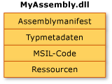
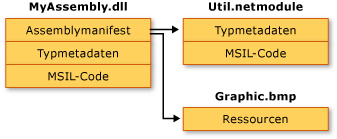

# Assemblyinhalte
Im Allgemeinen kann eine statische Assembly vier Elemente enthalten:  
  
-   Das [Assemblymanifest](../../../docs/framework/app-domains/assembly-manifest.md), das die Assemblymetadaten enthält.  
  
-   Die Typmetadaten.  
  
-   MSIL-Code (Microsoft Intermediate Language), der die Typen implementiert.  
  
-   Eine Gruppe von Ressourcen.  
  
 Von diesen ist nur das Assemblymanifest erforderlich. Um der Assembly jedoch eine sinnvolle Funktion zu geben, sind entweder Typen oder Ressourcen erforderlich.  
  
 Es gibt eine Reihe von Möglichkeiten, diese Elemente in einer Assembly zusammenzufassen. Sie können alle Elemente in einer einzelnen physischen Datei gruppieren, wie in der folgenden Abbildung dargestellt.  
  
   
Einzeldateiassembly  
  
 Wahlweise können die Elemente einer Assembly auch in mehreren Dateien enthalten sein. Diese Dateien können Module aus kompiliertem Code (NETMODULE-Dateien), Ressourcen (beispielsweise BMP- oder JPG-Dateien) oder andere von der Anwendung benötigte Dateien sein. Sie erstellen eine Mehrfachdateiassembly, wenn Sie Module kombinieren möchten, die in verschiedenen Sprachen geschrieben sind, oder um das Herunterladen einer Anwendung zu optimieren, indem Sie selten verwendete Typen in einem Modul ablegen, das nur bei Bedarf heruntergeladen wird.  
  
 In der folgenden Abbildung hat der Entwickler einer hypothetischen Anwendung Code eines Dienstprogramms in einem anderen Modul abgelegt. In der Originaldatei ist eine umfangreiche Ressourcendatei gespeichert (hier eine BMP-Grafik). Eine Datei wird nur dann von .NET Framework heruntergeladen, wenn auf diese verwiesen wird. Das Herunterladen von Code wird optimiert, wenn Code, auf den selten verwiesen wird, statt in der Anwendung in einer zusätzlichen Datei abgelegt ist.  
  
   
Mehrfachdateiassembly  
  
> [!NOTE]
>  Die Dateien, die zu einer Mehrfachdateiassembly gehören, werden vom Dateisystem nicht physisch verknüpft. Stattdessen sind sie über das Assemblymanifest verbunden, und die Common Language Runtime verwaltet sie als Einheit.  
  
 In dieser Abbildung gehören alle drei Dateien zu einer Assembly, wie im Assemblymanifest in MyAssembly.dll beschrieben. Das Dateisystem betrachtet diese als drei getrennte Dateien. Beachten Sie, dass die Datei "Util.netmodule" als Modul kompiliert wurde, da sie keine Assemblyinformationen enthält. Beim Erstellen der Assembly wurde das Assemblymanifest "MyAssembly.dll" hinzugefügt, um die Beziehungen zwischen den Dateien "Util.netmodule" und "Graphic.bmp" anzuzeigen.  
  
 Wenn Sie gegenwärtig Quellcode schreiben, treffen Sie explizite Entscheidungen darüber, wie die Funktionen einer Anwendung in eine oder mehrere Dateien aufgeteilt werden. Beim Entwerfen von .NET Framework-Code werden Sie in Zukunft ähnliche Entscheidungen darüber treffen, wie Sie Funktionen in eine oder mehrere Assemblys aufteilen.  
  
## Siehe auch
- [Assemblys in der Common Language Runtime (CLR)](../../../docs/framework/app-domains/assemblies-in-the-common-language-runtime.md)
- [Assemblymanifest](../../../docs/framework/app-domains/assembly-manifest.md)
- [Überlegungen zur Assemblysicherheit](../../../docs/framework/app-domains/assembly-security-considerations.md)
