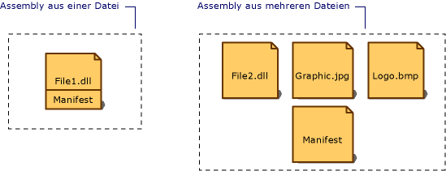

# AssemblymanifestAssembly Manifest
Jede Assembly, ob statisch oder dynamisch, enthält eine Auflistung von Daten, in der beschrieben ist, wie die Elemente in der Assembly miteinander verknüpft sind.Every assembly, whether static or dynamic, contains a collection of data that describes how the elements in the assembly relate to each other. Das Assemblymanifest enthält diese Assemblymetadaten.The assembly manifest contains this assembly metadata. Ein Assemblymanifest enthält alle Metadaten, die zum Angeben von Versionsanforderungen und Sicherheitsidentität der Assembly erforderlich sind, sowie alle Metadaten, die zum Definieren des Gültigkeitsbereichs der Assembly und zum Auflösen von Verweisen auf Ressourcen und Klassen benötigt werden.An assembly manifest contains all the metadata needed to specify the assembly's version requirements and security identity, and all metadata needed to define the scope of the assembly and resolve references to resources and classes. Das Assemblymanifest kann entweder in einer PE-Datei (eine EXE- oder DLL-Datei) mit MSIL-Code (Microsoft Intermediate Language) oder in einer eigenständigen PE-Datei gespeichert sein, die ausschließlich Informationen aus dem Assemblymanifest enthält.The assembly manifest can be stored in either a PE file (an .exe or .dll) with Microsoft intermediate language (MSIL) code or in a standalone PE file that contains only assembly manifest information.  
  
 Die folgende Abbildung stellt verschiedene Möglichkeiten zum Speichern des Manifests dar.The following illustration shows the different ways the manifest can be stored.  
  
   
Typen von AssemblysTypes of assemblies  
  
 Bei einer Assembly mit einer zugeordneten Datei ist das Manifest in die PE-Datei eingebunden, sodass eine Einzeldateiassembly entsteht.For an assembly with one associated file, the manifest is incorporated into the PE file to form a single-file assembly. Beim Erstellen einer Mehrfachdateiassembly können Sie eine eigenständige Manifestdatei verwenden, oder Sie beziehen das Manifest in eine der PE-Dateien der Assembly ein.You can create a multifile assembly with a standalone manifest file or with the manifest incorporated into one of the PE files in the assembly.  
  
 Jedes Manifest einer Assembly hat folgende Funktionen:Each assembly's manifest performs the following functions:  
  
-   Auflisten der Dateien, aus denen die Assembly besteht.Enumerates the files that make up the assembly.  
  
-   Steuern, wie Verweise auf die Typen und Ressourcen der Assembly den Dateien zugeordnet sind, die die entsprechenden Deklarationen und Implementierungen enthalten.Governs how references to the assembly's types and resources map to the files that contain their declarations and implementations.  
  
-   Auflisten anderer Assemblys, von denen die Assembly abhängig ist.Enumerates other assemblies on which the assembly depends.  
  
-   Bereitstellen einer Dereferenzierungsebene zwischen den Consumern der Assembly und den Implementierungsdetails der Assembly.Provides a level of indirection between consumers of the assembly and the assembly's implementation details.  
  
-   Wiedergabe der Selbstbeschreibung der Assembly.Renders the assembly self-describing.  
  
## Inhalt des AssemblymanifestsAssembly Manifest Contents  
 Die folgende Tabelle enthält die im Assemblymanifest enthaltenen Informationen.The following table shows the information contained in the assembly manifest. Die Identität einer Assembly setzt sich aus den ersten vier Elementen zusammen (Assemblyname, Versionsnummer, Kultur und Informationen über den starken Namen).The first four items—the assembly name, version number, culture, and strong name information—make up the assembly's identity.  
  
|InformationInformation|descriptionDescription|  
|-----------------|-----------------|  
|AssemblynameAssembly name|Eine Zeichenfolge, die den Namen der Assembly angibt.A text string specifying the assembly's name.|  
|VersionsnummerVersion number|Eine Haupt- und Nebenversionsnummer und eine Revisions- und Buildnummer.A major and minor version number, and a revision and build number. Die Common Language Runtime verwendet diese Nummern, um die Versionsrichtlinien zu erzwingen.The common language runtime uses these numbers to enforce version policy.|  
|cultureCulture|Informationen über die Kultur oder Sprache, die die Assembly unterstützt.Information on the culture or language the assembly supports. Diese Informationen dürfen nur verwendet werden, um eine Assembly als Satellitenassembly festzulegen, die kultur- oder sprachspezifische Informationen enthält.This information should be used only to designate an assembly as a satellite assembly containing culture- or language-specific information. (Eine Assembly mit Kulturinformationen wird automatisch als Satellitenassembly betrachtet.)(An assembly with culture information is automatically assumed to be a satellite assembly.)|  
|Informationen über den starken NamenStrong name information|Der öffentliche Schlüssel des Herausgebers, falls der Assembly ein starker Name zugewiesen wurde.The public key from the publisher if the assembly has been given a strong name.|  
|Liste aller Dateien in der AssemblyList of all files in the assembly|Ein Hash für jede in der Assembly enthaltene Datei und ein Dateiname.A hash of each file contained in the assembly and a file name. Beachten Sie, dass alle zur Assembly gehörenden Dateien in demselben Verzeichnis wie die Datei mit dem Assemblymanifest abgelegt sein müssen.Note that all files that make up the assembly must be in the same directory as the file containing the assembly manifest.|  
|TypverweisinformationenType reference information|Informationen, mit denen die Common Language Runtime einen Typverweis auf die Datei zuordnet, die ihre Deklaration und Implementierung enthält.Information used by the runtime to map a type reference to the file that contains its declaration and implementation. Wird für Typen verwendet, die aus der Assembly exportiert werden.This is used for types that are exported from the assembly.|  
|Informationen über Assemblys, auf die verwiesen wirdInformation on referenced assemblies|Eine Liste mit anderen Assemblys, auf die statische Verweise in der Assembly vorhanden sind.A list of other assemblies that are statically referenced by the assembly. Ein Verweis umfasst den Namen der abhängigen Assembly, die Assemblymetadaten (Version, Kultur, Betriebssystem usw.) und den öffentlichen Schlüssel, wenn die Assembly einen starken Namen besitzt.Each reference includes the dependent assembly's name, assembly metadata (version, culture, operating system, and so on), and public key, if the assembly is strong named.|  
  
 Im Assemblymanifest können Sie Informationen hinzufügen oder ändern. Dazu müssen Sie Assemblyattribute im Code verwenden.You can add or change some information in the assembly manifest by using assembly attributes in your code. Sie können Versionsinformationen und Informationsattribute ändern, einschließlich Marke, Urheberrecht, Produkt, Firma und Informationsversion.You can change version information and informational attributes, including Trademark, Copyright, Product, Company, and Informational Version. Eine vollständige Liste von Assemblyattributen finden Sie unter [Setting Assembly Attributes (Festlegen von Assemblyattributen)](../../../docs/framework/app-domains/set-assembly-attributes.md).For a complete list of assembly attributes, see [Setting Assembly Attributes](../../../docs/framework/app-domains/set-assembly-attributes.md).  
  
## Siehe auchSee Also  
 [AssemblyinhalteAssembly Contents](../../../docs/framework/app-domains/assembly-contents.md)  
 [AssemblyversionenAssembly Versioning](../../../docs/framework/app-domains/assembly-versioning.md)  
 [Erstellen von SatellitenassemblysCreating Satellite Assemblies](../../../docs/framework/resources/creating-satellite-assemblies-for-desktop-apps.md)  
 [Assemblys mit starkem NamenStrong-Named Assemblies](../../../docs/framework/app-domains/strong-named-assemblies.md)
