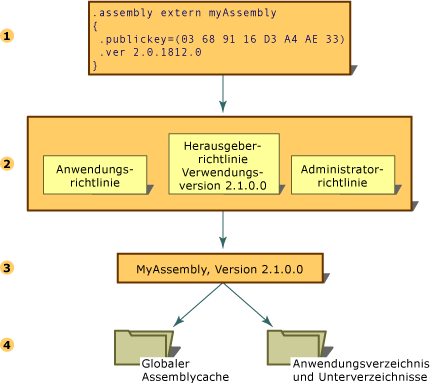

# AssemblyversionenAssembly Versioning
Jede Version einer Assembly, die die Common Language Runtime verwendet, wird auf Assemblyebene erstellt.All versioning of assemblies that use the common language runtime is done at the assembly level. Die spezifische Version einer Assembly sowie die Versionen der abhängigen Assemblys sind im Assemblymanifest aufgezeichnet.The specific version of an assembly and the versions of dependent assemblies are recorded in the assembly's manifest. Der Standardversionsrichtlinie für die Laufzeit zufolge werden Anwendungen nur in der Version ausgeführt, in der sie erstellt und getestet wurden, sofern dies nicht durch eine explizite Versionsrichtlinie in den Konfigurationsdateien (die Anwendungskonfigurationsdatei, die Herausgeberrichtliniendatei und die Administratorkonfigurationsdatei für den Computer) überschrieben wird.The default version policy for the runtime is that applications run only with the versions they were built and tested with, unless overridden by explicit version policy in configuration files (the application configuration file, the publisher policy file, and the computer's administrator configuration file).  
  
> [!NOTE]
>  Versionen werden nur bei Assemblys mit starken Namen erstellt.Versioning is done only on assemblies with strong names.  
  
 Zur Auflösung einer Assemblybindungsanforderung werden von der Laufzeit mehrere Schritte ausgeführt:The runtime performs several steps to resolve an assembly binding request:  
  
1.  Überprüft den ursprünglichen Assemblyverweis, um zu bestimmen, welche Version der Assembly gebunden werden soll.Checks the original assembly reference to determine the version of the assembly to be bound.  
  
2.  Überprüft alle anwendbaren Konfigurationsdateien, um die Versionsrichtlinie anzuwenden.Checks for all applicable configuration files to apply version policy.  
  
3.  Ermittelt die richtige Assembly aus dem ursprünglichen Assemblyverweis und allen Umleitungen, die in den Konfigurationsdateien angegeben sind, und bestimmt die Version, die an die aufrufende Assembly gebunden werden soll.Determines the correct assembly from the original assembly reference and any redirection specified in the configuration files, and determines the version that should be bound to the calling assembly.  
  
4.  Überprüft den globalen Assemblycache, jede in den Konfigurationsdateien angegebene CodeBase und danach das Anwendungsverzeichnis und die Unterverzeichnisse anhand der Überprüfungsregeln, die in [How the Runtime Locates Assemblies (So sucht die Runtime nach Assemblys)](../../../docs/framework/deployment/how-the-runtime-locates-assemblies.md) erklärt werden.Checks the global assembly cache, codebases specified in configuration files, and then checks the application's directory and subdirectories using the probing rules explained in [How the Runtime Locates Assemblies](../../../docs/framework/deployment/how-the-runtime-locates-assemblies.md).  
  
 Diese Schritte sind in der folgenden Abbildung dargestellt.The following illustration shows these steps.  
  
   
Auflösen einer AssemblybindungsanforderungResolving an assembly binding request  
  
 Weitere Informationen zum Konfigurieren von Anwendungen finden Sie unter [Configuring Apps (Konfigurieren von Apps)](../../../docs/framework/configure-apps/index.md).For more information about configuring applications, see [Configuring Apps](../../../docs/framework/configure-apps/index.md). Weitere Informationen finden Sie unter [How the Runtime Locates Assemblies (So sucht die Runtime nach Assemblys)](../../../docs/framework/deployment/how-the-runtime-locates-assemblies.md).For more information about binding policy, see [How the Runtime Locates Assemblies](../../../docs/framework/deployment/how-the-runtime-locates-assemblies.md).  
  
## VersionsinformationenVersion Information  
 Jede Assembly besitzt zwei unterschiedliche Methoden zur Darstellung der Versionsinformationen:Each assembly has two distinct ways of expressing version information:  
  
-   Die Versionsnummer der Assembly, die zusammen mit dem Assemblynamen und den Kulturinformationen zur Identität der Assembly gehört.The assembly's version number, which, together with the assembly name and culture information, is part of the assembly's identity. Diese Nummer wird von der Common Language Runtime zum Erzwingen von Versionsrichtlinien verwendet und spielt zur Laufzeit eine Schlüsselrolle im Vorgang der Typauflösung.This number is used by the runtime to enforce version policy and plays a key part in the type resolution process at run time.  
  
-   Eine Informationsversion, d. h. eine Zeichenfolge, die zusätzliche Versionsinformationen enthält und ausschließlich Informationszwecken dient.An informational version, which is a string that represents additional version information included for informational purposes only.  
  
### AssemblyversionsnummerAssembly Version Number  
 Die Versionsnummer ist Teil der Identität einer Assembly.Each assembly has a version number as part of its identity. Daher betrachtet die Common Language Runtime zwei Assemblys mit unterschiedlichen Versionsnummern als zwei völlig verschiedene Assemblys.As such, two assemblies that differ by version number are considered by the runtime to be completely different assemblies. Diese Versionsnummer wird physisch als vierteilige Zeichenfolge im folgenden Format dargestellt:This version number is physically represented as a four-part string with the following format:  
  
 \<*hauptversion*>.\<*nebenversion*>.\<*buildnummer*>.\<*revision*>\<*major version*>.\<*minor version*>.\<*build number*>.\<*revision*>  
  
 Die Version 1.5.1254.0 z. B. gibt 1 als Hauptversion, 5 als Nebenversion, 1254 als Buildnummer und 0 als Revisionsnummer an.For example, version 1.5.1254.0 indicates 1 as the major version, 5 as the minor version, 1254 as the build number, and 0 as the revision number.  
  
 Die Versionsnummer wird im Assemblymanifest zusammen mit anderen Informationen zur Identität gespeichert, einschließlich des Assemblynamens und des öffentlichen Schlüssels sowie der Informationen über Beziehungen und Identitäten anderer Assemblys, die mit der Anwendung verbunden sind.The version number is stored in the assembly manifest along with other identity information, including the assembly name and public key, as well as information on relationships and identities of other assemblies connected with the application.  
  
 Beim Erstellen einer Assembly zeichnet das Entwicklungstool die Abhängigkeitsinformationen für jede Assembly auf, auf die im Assemblymanifest verwiesen wird.When an assembly is built, the development tool records dependency information for each assembly that is referenced in the assembly manifest. Die Laufzeit verwendet diese Versionsnummern zusammen mit den Konfigurationsinformationen, die von einem Administrator, einer Anwendung oder einem Herausgeber festgelegt wurden, um die richtige Version einer Assembly zu laden, auf die verwiesen wird.The runtime uses these version numbers, in conjunction with configuration information set by an administrator, an application, or a publisher, to load the proper version of a referenced assembly.  
  
 Die Laufzeit unterscheidet zum Zweck der Versionskontrolle zwischen normalen Assemblys und Assemblys mit starkem Namen.The runtime distinguishes between regular and strong-named assemblies for the purposes of versioning. Die Version wird nur bei Assemblys mit starkem Namen überprüft.Version checking only occurs with strong-named assemblies.  
  
 Weitere Informationen zum Festlegen von Versionsbindungsrichtlinien finden Sie unter [Configuring Apps (Konfigurieren von Apps)](../../../docs/framework/configure-apps/index.md).For information about specifying version binding policies, see [Configuring Apps](../../../docs/framework/configure-apps/index.md). Informationen darüber, wie die Runtime die Versionsinformationen bei der Suche nach einer bestimmten Assembly verwendet, finden Sie unter [So sucht die Runtime nach Assemblys](../../../docs/framework/deployment/how-the-runtime-locates-assemblies.md).For information about how the runtime uses version information to find a particular assembly, see [How the Runtime Locates Assemblies](../../../docs/framework/deployment/how-the-runtime-locates-assemblies.md).  
  
### AssemblyinformationsversionAssembly Informational Version  
 Die Informationsversion ist eine Zeichenfolge, die zusätzliche Versionsinformationen an eine Assembly anfügt und ausschließlich Informationszwecken dient. Die Informationen werden nicht zur Laufzeit verwendet.The informational version is a string that attaches additional version information to an assembly for informational purposes only; this information is not used at run time. Die textbasierte Informationsversion entspricht dem Marketingtext des Produkts, der Verpackung oder dem Produktnamen und wird nicht zur Laufzeit verwendet.The text-based informational version corresponds to the product's marketing literature, packaging, or product name and is not used by the runtime. Eine Informationsversion könnte z. B. wie folgt lauten: "Common Language Runtime Version 1.0" oder "NET Control SP 2".For example, an informational version could be "Common Language Runtime version 1.0" or "NET Control SP 2". Diese Angabe wird in Microsoft Windows im Eigenschaftendialogfeld der Datei auf der Registerkarte Version als Eintrag "Produktversion" angezeigt.On the Version tab of the file properties dialog in Microsoft Windows, this information appears in the item "Product Version".  
  
> [!NOTE]
>  Obwohl Sie einen beliebigen Text eingeben können, wird beim Kompilieren eine Warnung angezeigt, wenn die Zeichenfolge nicht das für die Versionsnummer der Assembly verwendete Format aufweist oder das Format zwar korrekt ist, die Zeichenfolge jedoch Platzhalterzeichen enthält.Although you can specify any text, a warning message appears on compilation if the string is not in the format used by the assembly version number, or if it is in that format but contains wildcards. Sie können diese Warnung ignorieren.This warning is harmless.  
  
 Die Informationsversion wird mit dem benutzerdefinierten Attribut <xref:System.Reflection.AssemblyInformationalVersionAttribute?displayProperty=nameWithType> dargestellt.The informational version is represented using the custom attribute <xref:System.Reflection.AssemblyInformationalVersionAttribute?displayProperty=nameWithType>. Weitere Informationen über das Informationsversionsattribut finden Sie unter [Setting Assembly Attributes (Festlegen von Assemblyattributen)](../../../docs/framework/app-domains/set-assembly-attributes.md).For more information about the informational version attribute, see [Setting Assembly Attributes](../../../docs/framework/app-domains/set-assembly-attributes.md).  
  
## Siehe auchSee Also  
 [So sucht Common Language Runtime nach AssemblysHow the Runtime Locates Assemblies](../../../docs/framework/deployment/how-the-runtime-locates-assemblies.md)  
 [Konfigurieren von AppsConfiguring Apps](../../../docs/framework/configure-apps/index.md)  
 [Festlegen von AssemblyattributenSetting Assembly Attributes](../../../docs/framework/app-domains/set-assembly-attributes.md)  
 [Assemblys in der Common Language Runtime (CLR)Assemblies in the Common Language Runtime](../../../docs/framework/app-domains/assemblies-in-the-common-language-runtime.md)
