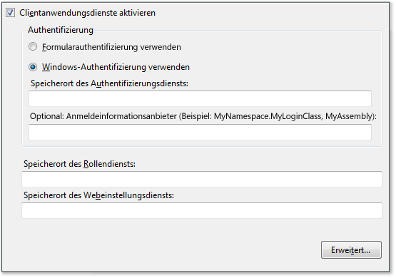
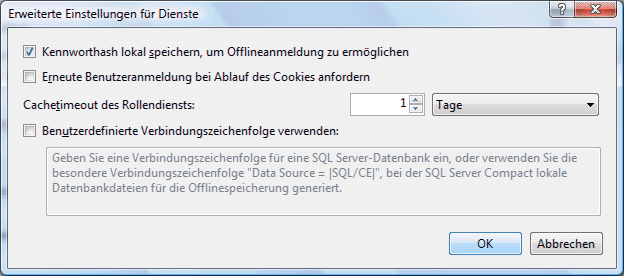

# <a name="how-to-configure-client-application-services"></a><span data-ttu-id="4426a-102">Gewusst wie: Konfigurieren von Clientanwendungsdiensten</span><span class="sxs-lookup"><span data-stu-id="4426a-102">How to: Configure Client Application Services</span></span>
<span data-ttu-id="4426a-103">In diesem Thema wird beschrieben, wie Sie den Visual Studio-**Projekt-Designer** zum Aktivieren und Konfigurieren von Clientanwendungsdiensten verwenden.</span><span class="sxs-lookup"><span data-stu-id="4426a-103">This topic describes how to use the Visual Studio **Project Designer** to enable and configure client application services.</span></span> <span data-ttu-id="4426a-104">Sie können Clientanwendungsdienste verwenden, um Benutzer zu überprüfen sowie um Benutzerrollen und Einstellungen von einem vorhandenen [!INCLUDE[ajax_current_short](../../../includes/ajax-current-short-md.md)]-Anwendungsdienst abzurufen.</span><span class="sxs-lookup"><span data-stu-id="4426a-104">You can use client application services to validate users and retrieve user roles and settings from an existing [!INCLUDE[ajax_current_short](../../../includes/ajax-current-short-md.md)] application service.</span></span> <span data-ttu-id="4426a-105">Nach der Konfiguration können Sie auf die aktivierten Dienste im Anwendungscode zugreifen, wie unter [Übersicht über Clientanwendungsdienste](../../../docs/framework/common-client-technologies/client-application-services-overview.md) beschrieben.</span><span class="sxs-lookup"><span data-stu-id="4426a-105">After configuration, you can access the enabled services in your application code as described in [Client Application Services Overview](../../../docs/framework/common-client-technologies/client-application-services-overview.md).</span></span> <span data-ttu-id="4426a-106">Weitere Informationen zu den [!INCLUDE[ajax_current_short](../../../includes/ajax-current-short-md.md)]-Anwendungsdiensten finden Sie unter [Übersicht über ASP.NET-Anwendungsdienste](http://msdn.microsoft.com/library/1162e529-0d70-44b2-b3ab-83e60c695013).</span><span class="sxs-lookup"><span data-stu-id="4426a-106">For more information about the [!INCLUDE[ajax_current_short](../../../includes/ajax-current-short-md.md)] application services, see [ASP.NET Application Services Overview](http://msdn.microsoft.com/library/1162e529-0d70-44b2-b3ab-83e60c695013).</span></span>  
  
 <span data-ttu-id="4426a-107">Sie können die Clientanwendungsdienste auf der Seite **Dienste** im **Projekt-Designer** aktivieren und konfigurieren.</span><span class="sxs-lookup"><span data-stu-id="4426a-107">You can enable and configure client application services on the **Services** page of the **Project Designer**.</span></span> <span data-ttu-id="4426a-108">Die Seite **Dienste** aktualisiert die Werte in der Datei „App.config“ des Projekts.</span><span class="sxs-lookup"><span data-stu-id="4426a-108">The **Services** page updates values in your project's App.config file.</span></span> <span data-ttu-id="4426a-109">Verwenden Sie den Befehl **Eigenschaften** im Menü **Projekt**, um den **Projekt-Designer** zu öffnen.</span><span class="sxs-lookup"><span data-stu-id="4426a-109">To access the **Project Designer**, use the **Properties** command on the **Project** menu.</span></span> <span data-ttu-id="4426a-110">Weitere Informationen zur Seite **Dienste** finden Sie unter [Services-Seite, Projekt-Designer](https://msdn.microsoft.com/library/bb398109).</span><span class="sxs-lookup"><span data-stu-id="4426a-110">For more information about the **Services** page, see [Services Page, Project Designer](https://msdn.microsoft.com/library/bb398109).</span></span>  
  
 <span data-ttu-id="4426a-111">Das folgende Verfahren beschreibt die grundlegende Konfiguration für Clientanwendungsdienste.</span><span class="sxs-lookup"><span data-stu-id="4426a-111">The following procedure describes how to perform basic configuration for client application services.</span></span> <span data-ttu-id="4426a-112">Erweiterte Konfigurationsoptionen werden in späteren Abschnitten beschrieben.</span><span class="sxs-lookup"><span data-stu-id="4426a-112">Advanced configuration options are described in later sections.</span></span>  
  
### <a name="to-configure-client-application-services"></a><span data-ttu-id="4426a-113">So konfigurieren Sie Clientanwendungsdienste</span><span class="sxs-lookup"><span data-stu-id="4426a-113">To configure client application services</span></span>  
  
1.  <span data-ttu-id="4426a-114">Wählen Sie im **Projektmappen-Explorer** einen Projektknoten aus und klicken Sie dann im Menü **Projekt** auf **Eigenschaften**.</span><span class="sxs-lookup"><span data-stu-id="4426a-114">In **Solution Explorer**, select a project node and then on the **Project** menu, click **Properties**.</span></span>  
  
     <span data-ttu-id="4426a-115">Der **Projekt-Designer** wird angezeigt.</span><span class="sxs-lookup"><span data-stu-id="4426a-115">The **Project Designer** appears.</span></span>  
  
2.  <span data-ttu-id="4426a-116">Klicken Sie auf die Registerkarte **Dienste**. Die Seite **Dienste** wird angezeigt, wie in der folgenden Abbildung dargestellt.</span><span class="sxs-lookup"><span data-stu-id="4426a-116">Click the **Services** tab. The **Services** page appears, as shown in the following illustration.</span></span>  
  
     <span data-ttu-id="4426a-117"></span><span class="sxs-lookup"><span data-stu-id="4426a-117"></span></span>  
  
3.  <span data-ttu-id="4426a-118">Wählen Sie auf der Seite **Dienste** die Option **Clientanwendungsdienste aktivieren**.</span><span class="sxs-lookup"><span data-stu-id="4426a-118">On the **Services** page, select **Enable client application services**.</span></span>  
  
    > [!NOTE]
    >  <span data-ttu-id="4426a-119">Clientanwendungsdienste erfordern die Vollversion von .NET Framework und werden im .NET Framework Client Profile nicht unterstützt.</span><span class="sxs-lookup"><span data-stu-id="4426a-119">Client application services require the full version of the .NET Framework, and are not supported in the .NET Framework Client Profile.</span></span> <span data-ttu-id="4426a-120">Wenn das Kontrollkästchen **Clientanwendungsdienste aktivieren** deaktiviert ist, stellen Sie sicher, dass als **Zielframework** das .NET Framework 3.5 oder höher festgelegt ist.</span><span class="sxs-lookup"><span data-stu-id="4426a-120">If the **Enable client application services** check box is disabled, verify that the **Target framework** is set to the .NET Framework 3.5 or later.</span></span> <span data-ttu-id="4426a-121">Um die Einstellung **Zielframework** in C# anzuzeigen, öffnen Sie den Projekt-Designer, und klicken Sie dann auf die Seite **Anwendung**.</span><span class="sxs-lookup"><span data-stu-id="4426a-121">To view the **Target framework** setting in C#, open the Project Designer and then click the **Application** page.</span></span> <span data-ttu-id="4426a-122">Um die Einstellung **Zielframework** in Visual Basic anzuzeigen, öffnen Sie den Projekt-Designer, klicken Sie auf die Seite **Kompilieren** und dann auf **Erweiterte Kompilierungsoptionen**.</span><span class="sxs-lookup"><span data-stu-id="4426a-122">To view the **Target framework** setting in Visual Basic, open the Project Designer, click the **Compile** page, and then click **Advanced Compile Options**.</span></span>  
  
4.  <span data-ttu-id="4426a-123">Wählen Sie **Formularauthentifizierung verwenden**, wenn Sie Ihre eigenen Anmeldesteuerelemente oder ein eigenes Dialogfeld bereitstellen möchten, oder wählen Sie **Windows-Authentifizierung verwenden**, um die vom Betriebssystem bereitgestellte Identität zu verwenden.</span><span class="sxs-lookup"><span data-stu-id="4426a-123">Select **Use Forms authentication** if you plan to provide your own login controls or dialog box, or select **Use Windows authentication** to use the identity supplied by the operating system.</span></span> <span data-ttu-id="4426a-124">Weitere Informationen finden Sie unter [Übersicht über Clientanwendungsdienste](../../../docs/framework/common-client-technologies/client-application-services-overview.md).</span><span class="sxs-lookup"><span data-stu-id="4426a-124">For more information, see [Client Application Services Overview](../../../docs/framework/common-client-technologies/client-application-services-overview.md).</span></span>  
  
    > [!NOTE]
    >  <span data-ttu-id="4426a-125">Bei Auswahl von **Windows-Authentifizierung verwenden** werden Clientanwendungsdienste automatisch konfiguriert, sodass sie eine SQL Server Compact-Datenbank verwenden.</span><span class="sxs-lookup"><span data-stu-id="4426a-125">If you select **Use Windows authentication**, client application services will automatically be configured to use a SQL Server Compact database.</span></span> <span data-ttu-id="4426a-126">Dies wird im Dialogfeld **Erweiterte Einstellungen für Dienste** angegeben, wie im nächsten Abschnitt beschrieben.</span><span class="sxs-lookup"><span data-stu-id="4426a-126">This is indicated in the **Advanced Settings for Services** dialog box as described in the next section.</span></span> <span data-ttu-id="4426a-127">Wenn Sie dann **Formularauthentifizierung verwenden** auswählen, wird die Einstellung **Benutzerdefinierte Verbindungszeichenfolge verwenden** nicht automatisch gelöscht.</span><span class="sxs-lookup"><span data-stu-id="4426a-127">If you then select **Use Forms authentication**, the **Use custom connection string** setting will not be cleared automatically.</span></span> <span data-ttu-id="4426a-128">Dies kann zu Fehlern führen, wenn die [!INCLUDE[ssEW](../../../includes/ssew-md.md)]-Datenbank bereits für die Verwendung mit Windows-Authentifizierung generiert wurde.</span><span class="sxs-lookup"><span data-stu-id="4426a-128">This could result in errors if the [!INCLUDE[ssEW](../../../includes/ssew-md.md)] database has already been generated for use with Windows authentication.</span></span> <span data-ttu-id="4426a-129">Um diese Fehler zu beheben, deaktivieren Sie die Einstellung **Benutzerdefinierte Verbindungszeichenfolge verwenden** im Dialogfeld **Erweiterte Einstellungen für Dienste**.</span><span class="sxs-lookup"><span data-stu-id="4426a-129">To fix these errors, clear the **Use custom connection string** setting in the **Advanced Settings for Services** dialog box.</span></span>  
  
5.  <span data-ttu-id="4426a-130">Bei Auswahl von **Formularauthentifizierung verwenden** geben Sie im Feld **Speicherort des Authentifizierungsdiensts** die URL des Diensthosts ohne den Dateinamen an.</span><span class="sxs-lookup"><span data-stu-id="4426a-130">If you selected **Use Forms authentication**, in the **Authentication service location** box, specify the URL of the service host, not including the file name.</span></span> <span data-ttu-id="4426a-131">Der Designer fügt den Standarddateinamen (Authentication_JSON_AppService.axd) automatisch an, wenn der Wert in die Konfigurationsdatei geschrieben wird.</span><span class="sxs-lookup"><span data-stu-id="4426a-131">The designer will automatically append the standard file name (Authentication_JSON_AppService.axd) when it writes the value to the configuration file.</span></span>  
  
6.  <span data-ttu-id="4426a-132">Wenn Sie **Formularauthentifizierung verwenden** ausgewählt haben, können Sie optional einen Wert im Feld **Anmeldeinformationsanbieter** angeben.</span><span class="sxs-lookup"><span data-stu-id="4426a-132">Optionally, if you selected **Use Forms authentication**, you can specify a value in the **Credentials provider** box.</span></span> <span data-ttu-id="4426a-133">Der Anmeldeinformationsanbieter muss die <xref:System.Web.ClientServices.Providers.IClientFormsAuthenticationCredentialsProvider>-Schnittstelle implementieren.</span><span class="sxs-lookup"><span data-stu-id="4426a-133">The credentials provider must implement the <xref:System.Web.ClientServices.Providers.IClientFormsAuthenticationCredentialsProvider> interface.</span></span> <span data-ttu-id="4426a-134">Durch Verwenden eines Anmeldeinformationsanbieters können Sie die Anmeldebenutzeroberfläche vom übrigen Anwendungscode trennen.</span><span class="sxs-lookup"><span data-stu-id="4426a-134">By using a credentials provider, you can separate your login user interface from your other application code.</span></span> <span data-ttu-id="4426a-135">Dadurch können Sie ein einzelnes Anmeldedialogfeld erstellen, das in mehreren Anwendungen verwendet wird.</span><span class="sxs-lookup"><span data-stu-id="4426a-135">This enables you to create a single login dialog box for use in multiple applications.</span></span> <span data-ttu-id="4426a-136">Weitere Informationen finden Sie unter [Vorgehensweise: Implementieren einer Benutzeranmeldung mit Clientanwendungsdiensten](../../../docs/framework/common-client-technologies/how-to-implement-user-login-with-client-application-services.md).</span><span class="sxs-lookup"><span data-stu-id="4426a-136">For more information, see [How to: Implement User Login with Client Application Services](../../../docs/framework/common-client-technologies/how-to-implement-user-login-with-client-application-services.md).</span></span>  
  
     <span data-ttu-id="4426a-137">Wenn Sie einen Anmeldeinformationsanbieter angeben, müssen Sie ihn als einen von der Assembly qualifizierten Typnamen angeben.</span><span class="sxs-lookup"><span data-stu-id="4426a-137">If you specify a credentials provider, you must specify it as an assembly-qualified type name.</span></span> <span data-ttu-id="4426a-138">Weitere Informationen finden Sie unter <xref:System.Type.AssemblyQualifiedName%2A?displayProperty=nameWithType> und [Assemblynamen](../../../docs/framework/app-domains/assembly-names.md).</span><span class="sxs-lookup"><span data-stu-id="4426a-138">For more information, see <xref:System.Type.AssemblyQualifiedName%2A?displayProperty=nameWithType> and [Assembly Names](../../../docs/framework/app-domains/assembly-names.md).</span></span> <span data-ttu-id="4426a-139">In seiner einfachsten Form sieht ein von der Assembly qualifizierter Typname wie im folgenden Beispiel aus:</span><span class="sxs-lookup"><span data-stu-id="4426a-139">In its simplest form, an assembly-qualified type name looks similar to the following example:</span></span>  
  
    ```  
    MyNamespace.MyLoginClass, MyAssembly  
    ```  
  
7.  <span data-ttu-id="4426a-140">In den Feldern **Speicherort des Rollendiensts** und **Speicherort des Webeinstellungsdiensts** geben Sie den Speicherort für jeden Dienst ohne den Dateinamen an.</span><span class="sxs-lookup"><span data-stu-id="4426a-140">In the **Roles service location** and **Web settings service location** text boxes, specify the service location for each service, not including the file name.</span></span> <span data-ttu-id="4426a-141">Der Designer fügt die Standarddateinamen (Role_JSON_AppService.axd und Profile_JSON_AppService.axd) automatisch an, wenn der Wert in die Konfigurationsdatei geschrieben wird.</span><span class="sxs-lookup"><span data-stu-id="4426a-141">The designer will automatically append the standard file names (Role_JSON_AppService.axd and Profile_JSON_AppService.axd) when it writes the value to the configuration file.</span></span>  
  
8.  <span data-ttu-id="4426a-142">Klicken Sie optional auf **Erweitert**, um die erweiterten Einstellungen zu ändern, z. B. das Verhalten bei der lokalen Zwischenspeicherung.</span><span class="sxs-lookup"><span data-stu-id="4426a-142">Optionally, click **Advanced** to modify advanced settings, such as the local caching behavior.</span></span> <span data-ttu-id="4426a-143">Weitere Informationen finden Sie in der nächsten Verfahrensbeschreibung.</span><span class="sxs-lookup"><span data-stu-id="4426a-143">For more information, see the next procedure.</span></span>  
  
## <a name="advanced-configuration"></a><span data-ttu-id="4426a-144">Erweiterte Konfiguration</span><span class="sxs-lookup"><span data-stu-id="4426a-144">Advanced Configuration</span></span>  
 <span data-ttu-id="4426a-145">Die folgenden Verfahren beschreiben, wie Sie Clientanwendungsdienste für weniger häufig vorkommende Szenarien konfigurieren.</span><span class="sxs-lookup"><span data-stu-id="4426a-145">The following procedures describe how to configure client application services for less common scenarios.</span></span> <span data-ttu-id="4426a-146">Beispielsweise können Sie diese Konfigurationsoptionen für Anwendungen verwenden, die an öffentlichen Speicherorten bereitgestellt werden, oder um eine verschlüsselte SQL Server Compact-Datenbank als Cache für die lokalen Daten zu verwenden.</span><span class="sxs-lookup"><span data-stu-id="4426a-146">For example, you can use these configuration options for applications deployed in public locations, or to use an encrypted SQL Server Compact database as the local data cache.</span></span>  
  
#### <a name="to-configure-advanced-settings-for-client-application-services"></a><span data-ttu-id="4426a-147">So konfigurieren Sie erweiterte Einstellungen für Clientanwendungsdienste</span><span class="sxs-lookup"><span data-stu-id="4426a-147">To configure advanced settings for client application services</span></span>  
  
1.  <span data-ttu-id="4426a-148">Klicken Sie im **Projekt-Designer** auf der Seite **Dienste** auf **Erweitert**.</span><span class="sxs-lookup"><span data-stu-id="4426a-148">On the **Services** page of the **Project Designer**, click **Advanced**.</span></span>  
  
     <span data-ttu-id="4426a-149">Das Dialogfeld **Erweiterte Einstellungen für Dienste** wird angezeigt, wie in der folgenden Abbildung dargestellt.</span><span class="sxs-lookup"><span data-stu-id="4426a-149">The **Advanced Settings for Services** dialog box appears, as shown in the following illustration.</span></span> <span data-ttu-id="4426a-150">Weitere Informationen zu diesem Dialogfeld finden Sie unter [Dialogfeld „Erweiterte Einstellungen für Dienste“](/visualstudio/ide/reference/advanced-settings-for-services-dialog-box).</span><span class="sxs-lookup"><span data-stu-id="4426a-150">For more information about this dialog box, see [Advanced Settings for Services Dialog Box](/visualstudio/ide/reference/advanced-settings-for-services-dialog-box).</span></span>  
  
     <span data-ttu-id="4426a-151"></span><span class="sxs-lookup"><span data-stu-id="4426a-151"></span></span>  
  
2.  <span data-ttu-id="4426a-152">Aktivieren oder deaktivieren Sie **Kennworthash lokal speichern, um Offlineanmeldung zu ermöglichen**.</span><span class="sxs-lookup"><span data-stu-id="4426a-152">Select or clear **Save password hash locally to enable offline login**.</span></span> <span data-ttu-id="4426a-153">Wenn Sie diese Option auswählen, wird das Benutzerkennwort in verschlüsselter Form lokal zwischengespeichert.</span><span class="sxs-lookup"><span data-stu-id="4426a-153">When you select this option, an encrypted form of the user's password will be cached locally.</span></span> <span data-ttu-id="4426a-154">Dies ist nützlich, wenn Sie den Offlinemodus für die Anwendung implementieren.</span><span class="sxs-lookup"><span data-stu-id="4426a-154">This is useful if you implement offline mode for your application.</span></span> <span data-ttu-id="4426a-155">Bei ausgewählter Option können Sie die Benutzer überprüfen, selbst wenn die Eigenschaft <xref:System.Web.ClientServices.ConnectivityStatus.IsOffline%2A> auf `true` gesetzt wurde.</span><span class="sxs-lookup"><span data-stu-id="4426a-155">With this option selected, you can validate users even when the <xref:System.Web.ClientServices.ConnectivityStatus.IsOffline%2A> property has been set to `true`.</span></span>  
  
3.  <span data-ttu-id="4426a-156">Aktivieren oder deaktivieren Sie **Erneute Benutzeranmeldung bei Ablauf des Cookies anfordern**.</span><span class="sxs-lookup"><span data-stu-id="4426a-156">Select or clear **Require users to log on again whenever the server cookie expires**.</span></span> <span data-ttu-id="4426a-157">Das Authentifizierungscookie ist für den Remotedienst konfiguriert und gibt an, wie lange eine Benutzeranmeldung aktiv bleibt.</span><span class="sxs-lookup"><span data-stu-id="4426a-157">The authentication cookie is configured on the remote service, and indicates how long a user's login will remain active.</span></span> <span data-ttu-id="4426a-158">Weitere Informationen zum Konfigurieren des Cookies finden Sie im Abschnitt zum `timeout`-Attribut im [forms-Element für Authentifizierung (ASP.NET-Einstellungsschema)](http://msdn.microsoft.com/library/8163b8b5-ea6c-46c8-b5a9-c4c3de31c0b3).</span><span class="sxs-lookup"><span data-stu-id="4426a-158">For more information about how to configure the cookie, see the `timeout` attribute in [forms Element for authentication (ASP.NET Settings Schema)](http://msdn.microsoft.com/library/8163b8b5-ea6c-46c8-b5a9-c4c3de31c0b3).</span></span>  
  
     <span data-ttu-id="4426a-159">Bei ausgewählter Option wird beim Versuch, auf die Remoterollen oder Webeinstellungsdienste zuzugreifen, eine <xref:System.Net.WebException> ausgelöst, nachdem das Authentifizierungscookie abgelaufen ist.</span><span class="sxs-lookup"><span data-stu-id="4426a-159">If you select this option, attempting to access the remote roles or Web settings services after the authentication cookie has expired will throw a <xref:System.Net.WebException>.</span></span> <span data-ttu-id="4426a-160">Sie können diese Ausnahme behandeln und ein Anmeldedialogfeld anzeigen, um Benutzer erneut zu überprüfen.</span><span class="sxs-lookup"><span data-stu-id="4426a-160">You can handle this exception and display a login dialog box to revalidate users.</span></span> <span data-ttu-id="4426a-161">Ein Beispiel für dieses Verhalten finden Sie unter [Exemplarische Vorgehensweise: Verwenden von Clientanwendungsdiensten](../../../docs/framework/common-client-technologies/walkthrough-using-client-application-services.md).</span><span class="sxs-lookup"><span data-stu-id="4426a-161">For an example of this behavior, see [Walkthrough: Using Client Application Services](../../../docs/framework/common-client-technologies/walkthrough-using-client-application-services.md).</span></span> <span data-ttu-id="4426a-162">Diese Option ist nützlich für Anwendungen, die an öffentlichen Speicherorten bereitgestellt werden, um sicherzustellen, dass Benutzer, die die Anwendung nach Gebrauch weiterhin ausführen, nicht auf unbestimmte Zeit authentifiziert bleiben.</span><span class="sxs-lookup"><span data-stu-id="4426a-162">This option is useful for applications deployed in public locations to make sure that users who leave the application running after use will not remain authenticated indefinitely.</span></span>  
  
     <span data-ttu-id="4426a-163">Wenn Sie diese Option deaktivieren und versuchen, auf die Remotedienste zuzugreifen, nachdem das Authentifizierungscookie abgelaufen ist, werden Benutzer automatisch neu überprüft.</span><span class="sxs-lookup"><span data-stu-id="4426a-163">If you clear this option and attempt to access the remote services after the authentication cookie has expired, users will be revalidated automatically.</span></span>  
  
4.  <span data-ttu-id="4426a-164">Geben Sie einen Wert für **Cachetimeout des Rollendiensts** an.</span><span class="sxs-lookup"><span data-stu-id="4426a-164">Specify a value for **Role service cache timeout**.</span></span> <span data-ttu-id="4426a-165">Legen Sie dieses Zeitintervall auf einen kleinen Wert fest, wenn Rollen häufig aktualisiert werden, oder auf einen höheren Wert, wenn Rollen seltener aktualisiert werden.</span><span class="sxs-lookup"><span data-stu-id="4426a-165">Set this time interval to a small value when roles are updated frequently or to a larger value when roles are updated infrequently.</span></span> <span data-ttu-id="4426a-166">Wenn Sie den Offlinemodus implementieren, legen Sie das Zeitintervall auf einen hohen Wert, um zu verhindern, dass die Rolleninformationen ablaufen, während die Anwendung offline ist.</span><span class="sxs-lookup"><span data-stu-id="4426a-166">If you implement offline mode, set the time interval to a large value to prevent the role information from expiring while the application is offline.</span></span>  
  
     <span data-ttu-id="4426a-167">Der Rollenanbieter greift auf die zwischengespeicherten Rollenwerte oder den Rollendienst zu, wenn Sie die <xref:System.Web.Security.RolePrincipal.IsInRole%2A>-Methode aufrufen.</span><span class="sxs-lookup"><span data-stu-id="4426a-167">The role provider accesses the cached role values or the roles service when you call the <xref:System.Web.Security.RolePrincipal.IsInRole%2A> method.</span></span> <span data-ttu-id="4426a-168">Um den Cache programmgesteuert zurückzusetzen und einen Zugriff auf den Remotedienst durch diese Methode zu erzwingen, rufen Sie die <xref:System.Web.ClientServices.Providers.ClientRoleProvider.ResetCache%2A>-Methode auf.</span><span class="sxs-lookup"><span data-stu-id="4426a-168">To programmatically reset the cache and force this method to access the remote service, call the <xref:System.Web.ClientServices.Providers.ClientRoleProvider.ResetCache%2A> method.</span></span>  
  
5.  <span data-ttu-id="4426a-169">Aktivieren oder deaktivieren Sie **Benutzerdefinierte Verbindungszeichenfolge verwenden**.</span><span class="sxs-lookup"><span data-stu-id="4426a-169">Select or clear **Use custom connection string**.</span></span> <span data-ttu-id="4426a-170">Weitere Informationen finden Sie in der nächsten Verfahrensbeschreibung.</span><span class="sxs-lookup"><span data-stu-id="4426a-170">For more information, see the next procedure.</span></span>  
  
#### <a name="to-configure-client-application-services-to-use-a-database-for-the-local-cache"></a><span data-ttu-id="4426a-171">So konfigurieren Sie die Clientanwendungsdienste, um eine Datenbank für den lokalen Cache zu verwenden</span><span class="sxs-lookup"><span data-stu-id="4426a-171">To configure client application services to use a database for the local cache</span></span>  
  
1.  <span data-ttu-id="4426a-172">Klicken Sie im **Projekt-Designer** auf der Seite **Dienste** auf **Erweitert**.</span><span class="sxs-lookup"><span data-stu-id="4426a-172">On the **Services** page of the **Project Designer**, click **Advanced**.</span></span>  
  
     <span data-ttu-id="4426a-173">Das Dialogfeld **Erweiterte Einstellungen für Dienste** wird angezeigt.</span><span class="sxs-lookup"><span data-stu-id="4426a-173">The **Advanced Settings for Services** dialog box appears.</span></span>  
  
2.  <span data-ttu-id="4426a-174">Wählen Sie **Benutzerdefinierte Verbindungszeichenfolge verwenden**.</span><span class="sxs-lookup"><span data-stu-id="4426a-174">Select **Use custom connection string**.</span></span>  
  
     <span data-ttu-id="4426a-175">Der Standardwert von `Data Source = |SQL/CE|` wird im Textfeld angezeigt.</span><span class="sxs-lookup"><span data-stu-id="4426a-175">The default value of `Data Source = |SQL/CE|` appears in the text box.</span></span>  
  
3.  <span data-ttu-id="4426a-176">Behalten Sie den Standardwert für die Verbindungszeichenfolge bei, um eine SQL Server Compact-Datenbank zu generieren und zu verwenden.</span><span class="sxs-lookup"><span data-stu-id="4426a-176">To generate and use a SQL Server Compact database, keep the default connection string value.</span></span> <span data-ttu-id="4426a-177">Visual Studio generiert eine Datenbankdatei und speichert sie im Verzeichnis, das von der <xref:System.Windows.Forms.Application.UserAppDataPath%2A?displayProperty=nameWithType>-Eigenschaft angegeben wird.</span><span class="sxs-lookup"><span data-stu-id="4426a-177">Visual Studio will generate a database file and put it in the directory indicated by the <xref:System.Windows.Forms.Application.UserAppDataPath%2A?displayProperty=nameWithType> property.</span></span>  
  
4.  <span data-ttu-id="4426a-178">Fügen Sie zum Generieren und Verwenden einer verschlüsselten [!INCLUDE[ssEW](../../../includes/ssew-md.md)]-Datenbank der Verbindungszeichenfolge die Werte `password` und `encrypt database` hinzu, wie im folgenden Beispiel gezeigt.</span><span class="sxs-lookup"><span data-stu-id="4426a-178">To generate and use an encrypted [!INCLUDE[ssEW](../../../includes/ssew-md.md)] database, add `password` and `encrypt database` values to the connection string as shown in the following example.</span></span>  
  
    > [!NOTE]
    >  <span data-ttu-id="4426a-179">Achten Sie darauf, dass Sie ein sicheres Kennwort angeben.</span><span class="sxs-lookup"><span data-stu-id="4426a-179">Be sure to specify a strong password.</span></span> <span data-ttu-id="4426a-180">Sie können das Kennwort nicht mehr ändern, nachdem die Datenbank generiert wurde.</span><span class="sxs-lookup"><span data-stu-id="4426a-180">You cannot change the password after the database is generated.</span></span>  
  
    ```  
    Data Source = |SQL/CE|;password=<password>;encrypt database=true  
    ```  
  
5.  <span data-ttu-id="4426a-181">Geben Sie Ihre eigene Verbindungszeichenfolge an, um Ihre eigene SQL Server-Datenbank zu verwenden.</span><span class="sxs-lookup"><span data-stu-id="4426a-181">To use your own SQL Server database, specify your own connection string.</span></span> <span data-ttu-id="4426a-182">Informationen über gültige Verbindungszeichenfolgenformate finden Sie in der SQL Server-Dokumentation.</span><span class="sxs-lookup"><span data-stu-id="4426a-182">For information about valid connection string formats, see the SQL Server documentation.</span></span> <span data-ttu-id="4426a-183">Diese Datenbank wird nicht automatisch generiert.</span><span class="sxs-lookup"><span data-stu-id="4426a-183">This database is not generated automatically.</span></span> <span data-ttu-id="4426a-184">Die Verbindungszeichenfolge muss auf eine vorhandene Datenbank verweisen, die Sie mit den folgenden SQL-Anweisungen erstellen können.</span><span class="sxs-lookup"><span data-stu-id="4426a-184">The connection string must refer to an existing database that you can create using the following SQL statements.</span></span>  
  
    ```  
    CREATE TABLE ApplicationProperties (PropertyName nvarchar(256),  
        PropertyValue nvarchar(256))  
    CREATE TABLE UserProperties (PropertyName nvarchar(256),  
        PropertyValue nvarchar(256))  
    CREATE TABLE Roles (UserName nvarchar(256),   
        RoleName nvarchar(256))  
    CREATE TABLE Settings (PropertyName nvarchar(256),   
        PropertyStoredAs nvarchar(1), PropertyValue nvarchar(2048))  
    ```  
  
## <a name="using-custom-providers"></a><span data-ttu-id="4426a-185">Verwenden von benutzerdefinierten Anbietern</span><span class="sxs-lookup"><span data-stu-id="4426a-185">Using Custom Providers</span></span>  
 <span data-ttu-id="4426a-186">Die Clientanwendungsdienste-Funktion verwendet standardmäßig die Anbieter im <xref:System.Web.ClientServices.Providers?displayProperty=nameWithType>-Namespace.</span><span class="sxs-lookup"><span data-stu-id="4426a-186">By default, the client application services feature uses the providers in the <xref:System.Web.ClientServices.Providers?displayProperty=nameWithType> namespace.</span></span> <span data-ttu-id="4426a-187">Wenn Sie die Anwendung mithilfe der Seite **Dienste** im **Projekt-Designer** konfigurieren, werden der Datei „App.config“ Verweise auf diese Anbieter hinzugefügt.</span><span class="sxs-lookup"><span data-stu-id="4426a-187">When you configure your application by using the **Services** page of the **Project Designer**, references to these providers are added to your App.config file.</span></span> <span data-ttu-id="4426a-188">Diese Standardanbieter greifen auf entsprechende Anbieter auf dem Server zu.</span><span class="sxs-lookup"><span data-stu-id="4426a-188">These default providers access corresponding providers on the server.</span></span> <span data-ttu-id="4426a-189">Webdienste werden häufig so konfiguriert, dass sie über Anbieter, wie z. B. <xref:System.Web.Security.SqlMembershipProvider> und <xref:System.Web.Security.SqlRoleProvider>, auf Benutzerdaten zugreifen.</span><span class="sxs-lookup"><span data-stu-id="4426a-189">Web services are often configured to access user data through providers such as <xref:System.Web.Security.SqlMembershipProvider> and <xref:System.Web.Security.SqlRoleProvider>.</span></span>  
  
 <span data-ttu-id="4426a-190">Wenn Sie benutzerdefinierte Dienstanbieter verwenden möchten, ändern Sie normalerweise die Anbieter auf Serverseite, sodass sie für alle Clientanwendungen gelten, die auf den Server zugreifen.</span><span class="sxs-lookup"><span data-stu-id="4426a-190">If you want to use custom service providers, you will typically change the providers on the server side so that they affect all client applications that access the server.</span></span> <span data-ttu-id="4426a-191">Sie haben allerdings die Möglichkeit, nicht standardmäßige Anbieter auf Clientseite zu verwenden.</span><span class="sxs-lookup"><span data-stu-id="4426a-191">However, you do have the option of using non-default providers on the client side.</span></span> <span data-ttu-id="4426a-192">Sie können benutzerdefinierte Authentifizierungs- oder Rollenanbieter in der Datei "App.config" des Projekts angeben, wie im folgenden Verfahren gezeigt.</span><span class="sxs-lookup"><span data-stu-id="4426a-192">You can specify custom authentication or roles providers in your project's App.config file, as shown in the following procedure.</span></span> <span data-ttu-id="4426a-193">Informationen zum Erstellen von benutzerdefinierten Authentifizierungs- und Rollenanbietern finden Sie unter [Implementieren eines Mitgliedschaftsanbieters](http://msdn.microsoft.com/library/d8658b8e-c962-4f64-95e1-4acce35e4582) und [Implementieren eines Rollenanbieters](http://msdn.microsoft.com/library/851671ce-bf9b-43f2-aba4-bc9d28b11c7d).</span><span class="sxs-lookup"><span data-stu-id="4426a-193">For information about how to create custom authentication and role providers, see [Implementing a Membership Provider](http://msdn.microsoft.com/library/d8658b8e-c962-4f64-95e1-4acce35e4582) and [Implementing a Role Provider](http://msdn.microsoft.com/library/851671ce-bf9b-43f2-aba4-bc9d28b11c7d).</span></span> <span data-ttu-id="4426a-194">Sie können auch einen benutzerdefinierten Einstellungsanbieter verwenden, indem Sie die `Settings`-Klasse (Zugriff als `Properties.Settings.Default` in C# und als `My.Settings` in Visual Basic) in Ihrem Projekt ändern.</span><span class="sxs-lookup"><span data-stu-id="4426a-194">You can also use a custom settings provider by modifying your project's `Settings` class (accessed as `Properties.Settings.Default` in C# and `My.Settings` in Visual Basic).</span></span> <span data-ttu-id="4426a-195">Weitere Informationen finden Sie unter [Architektur der Anwendungseinstellungen](../../../docs/framework/winforms/advanced/application-settings-architecture.md).</span><span class="sxs-lookup"><span data-stu-id="4426a-195">For more information, see [Application Settings Architecture](../../../docs/framework/winforms/advanced/application-settings-architecture.md).</span></span>  
  
#### <a name="to-configure-client-application-services-to-use-non-default-providers"></a><span data-ttu-id="4426a-196">So konfigurieren Sie Clientanwendungsdienste, um nicht standardmäßige Anbieter zu verwenden</span><span class="sxs-lookup"><span data-stu-id="4426a-196">To configure client application services to use non-default providers</span></span>  
  
1.  <span data-ttu-id="4426a-197">Um einen nicht standardmäßigen Authentifizierungs- oder Rollendienstanbieter zu verwenden, führen Sie zuerst alle übrigen Konfigurationseinstellungen mithilfe der Seite **Dienste** durch.</span><span class="sxs-lookup"><span data-stu-id="4426a-197">To use a non-default authentication or roles service provider, first complete all other configuration settings by using the **Services** page.</span></span>  
  
2.  <span data-ttu-id="4426a-198">Schließen Sie den **Projekt-Designer**.</span><span class="sxs-lookup"><span data-stu-id="4426a-198">Close the **Project Designer**.</span></span> <span data-ttu-id="4426a-199">Das ist erforderlich, da die Seite **Dienste** die Datei „App.config“ automatisch aktualisiert, auch wenn Sie keine Einstellungen ändern.</span><span class="sxs-lookup"><span data-stu-id="4426a-199">This is necessary because the **Services** page will automatically update your App.config file even if you do not modify any settings.</span></span> <span data-ttu-id="4426a-200">Wenn Sie die Datei „App.config“, wie in diesem Verfahren beschrieben, manuell ändern und dann wieder zur Seite **Dienste** zurückkehren, werden die Änderungen zurückgesetzt.</span><span class="sxs-lookup"><span data-stu-id="4426a-200">If you manually modify your App.config file as described in this procedure and then return to the **Services** page, your modifications will be reset.</span></span>  
  
3.  <span data-ttu-id="4426a-201">Doppelklicken Sie im **Projektmappen-Explorer** auf die Datei „App.config“.</span><span class="sxs-lookup"><span data-stu-id="4426a-201">In **Solution Explorer**, double-click App.config.</span></span>  
  
     <span data-ttu-id="4426a-202">Die Anwendungskonfigurationsdatei wird im Texteditor geöffnet.</span><span class="sxs-lookup"><span data-stu-id="4426a-202">The application configuration file opens in the text editor.</span></span>  
  
4.  <span data-ttu-id="4426a-203">Gehen Sie zum `<providers>`-Element innerhalb des `<membership>`- oder `<roleManager>`-Elements.</span><span class="sxs-lookup"><span data-stu-id="4426a-203">Find the `<providers>` element within the `<membership>` or `<roleManager>` element.</span></span> <span data-ttu-id="4426a-204">Diese Elemente sind untergeordnete Elemente des `<system.web>`-Elements.</span><span class="sxs-lookup"><span data-stu-id="4426a-204">These elements are children of the `<system.web>` element.</span></span> <span data-ttu-id="4426a-205">Das `<membership>`-Element wird verwendet, um den Authentifizierungsanbieter anzugeben, und das `<roleManager>`-Element wird zur Angabe von Rollenanbietern verwendet.</span><span class="sxs-lookup"><span data-stu-id="4426a-205">The `<membership>` element is used to specify authentication providers, and the `<roleManager>` element is used to specify role providers.</span></span>  
  
5.  <span data-ttu-id="4426a-206">Fügen Sie ein `<add>`-Element als untergeordnetes Element des `<providers>`-Elements hinzu.</span><span class="sxs-lookup"><span data-stu-id="4426a-206">Add an `<add>` element as a child of the `<providers>` element.</span></span> <span data-ttu-id="4426a-207">Sie müssen die `name`- und `type`-Attribute wie im folgenden Beispiel gezeigt festlegen.</span><span class="sxs-lookup"><span data-stu-id="4426a-207">You must specify `name` and `type` attributes as shown in the following example.</span></span> <span data-ttu-id="4426a-208">Der `type`-Attributswert muss ein von einer Assembly qualifizierter Typname sein.</span><span class="sxs-lookup"><span data-stu-id="4426a-208">The `type` attribute value must be an assembly-qualified type name.</span></span> <span data-ttu-id="4426a-209">Weitere Informationen finden Sie unter <xref:System.Type.AssemblyQualifiedName%2A?displayProperty=nameWithType> und [Assemblynamen](../../../docs/framework/app-domains/assembly-names.md).</span><span class="sxs-lookup"><span data-stu-id="4426a-209">For more information, see <xref:System.Type.AssemblyQualifiedName%2A?displayProperty=nameWithType> and [Assembly Names](../../../docs/framework/app-domains/assembly-names.md).</span></span>  
  
    ```xml  
    <add name="MyCustomRoleProvider" type="MyNamespace.MyRoleProvider, MyAssembly" />  
    ```  
  
6.  <span data-ttu-id="4426a-210">Ändern Sie das `defaultProvider`-Attribut des `<membership>`- oder des `<roleManager>`-Elements, um den Namenswert aus dem `<add>`-Element anzugeben, das Sie im vorherigen Schritt hinzugefügt haben.</span><span class="sxs-lookup"><span data-stu-id="4426a-210">Modify the `defaultProvider` attribute of the `<membership>` or `<roleManager>` element to specify the name value from the `<add>` element that you added in the previous step.</span></span>  
  
    ```xml  
    <roleManager enabled="true" defaultProvider="MyCustomRoleProvider">  
    ```  
  
## <a name="see-also"></a><span data-ttu-id="4426a-211">Siehe auch</span><span class="sxs-lookup"><span data-stu-id="4426a-211">See Also</span></span>  
 [<span data-ttu-id="4426a-212">Clientanwendungsdienste</span><span class="sxs-lookup"><span data-stu-id="4426a-212">Client Application Services</span></span>](../../../docs/framework/common-client-technologies/client-application-services.md)  
 [<span data-ttu-id="4426a-213">Übersicht über Clientanwendungsdienste</span><span class="sxs-lookup"><span data-stu-id="4426a-213">Client Application Services Overview</span></span>](../../../docs/framework/common-client-technologies/client-application-services-overview.md)  
 [<span data-ttu-id="4426a-214">Seite „Services“, Projekt-Designer</span><span class="sxs-lookup"><span data-stu-id="4426a-214">Services Page, Project Designer</span></span>](https://msdn.microsoft.com/library/bb398109)  
 [<span data-ttu-id="4426a-215">Dialogfeld „Erweiterte Einstellungen für Dienste“</span><span class="sxs-lookup"><span data-stu-id="4426a-215">Advanced Settings for Services Dialog Box</span></span>](/visualstudio/ide/reference/advanced-settings-for-services-dialog-box)  
 [<span data-ttu-id="4426a-216">Gewusst wie: Implementieren einer Benutzeranmeldung mit Clientanwendungsdiensten</span><span class="sxs-lookup"><span data-stu-id="4426a-216">How to: Implement User Login with Client Application Services</span></span>](../../../docs/framework/common-client-technologies/how-to-implement-user-login-with-client-application-services.md)  
 [<span data-ttu-id="4426a-217">Exemplarische Vorgehensweise: Verwenden von Clientanwendungsdiensten</span><span class="sxs-lookup"><span data-stu-id="4426a-217">Walkthrough: Using Client Application Services</span></span>](../../../docs/framework/common-client-technologies/walkthrough-using-client-application-services.md)  
 [<span data-ttu-id="4426a-218">Implementieren eines </span><span class="sxs-lookup"><span data-stu-id="4426a-218">Implementing a Membership Provider</span></span>](http://msdn.microsoft.com/library/d8658b8e-c962-4f64-95e1-4acce35e4582)  
 [<span data-ttu-id="4426a-219">Implementieren eines Rollenanbieters</span><span class="sxs-lookup"><span data-stu-id="4426a-219">Implementing a Role Provider</span></span>](http://msdn.microsoft.com/library/851671ce-bf9b-43f2-aba4-bc9d28b11c7d)  
 [<span data-ttu-id="4426a-220">Architektur der Anwendungseinstellungen</span><span class="sxs-lookup"><span data-stu-id="4426a-220">Application Settings Architecture</span></span>](../../../docs/framework/winforms/advanced/application-settings-architecture.md)  
 [<span data-ttu-id="4426a-221">Erstellen und Konfigurieren der Datenbank für die Anwendungsdienste für SQL Server</span><span class="sxs-lookup"><span data-stu-id="4426a-221">Creating and Configuring the Application Services Database for SQL Server</span></span>](http://msdn.microsoft.com/library/ab894e83-7e2f-4af8-a116-b1bff8f815b2)
