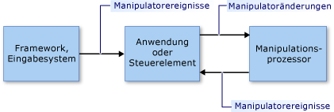

# Überblick über Manipulationen und Trägheit
Mit *Manipulationen* sind Benutzer in der Lage, Elemente der Benutzeroberfläche (User Interface, UI) mithilfe von *Manipulatoren* zu verschieben, zu drehen und in der Größe zu ändern. Ein Manipulator kann eine Maus oder (in einem Touchscreen-Szenario) ein Stift oder ein Finger sein.  
  
 *Trägheit* emuliert das Echtzeitverhalten von UI-Elementen, die sich in Bewegung befinden, indem Reibungskräfte für die Elemente simuliert werden. Damit sind Elemente in der Lage, ihre Bewegung (sowohl linear als auch winkelförmig) graduell zu verlangsamen, bevor die Bewegung angehalten wird. Dieser Artikel enthält eine Einführung in Manipulationen und Trägheit für .NET Framework.  
  
## Manipulationen  
 Bei einer Manipulation wird eine Auflistung von Manipulatoren als ein zusammengesetztes Objekt behandelt. Eine Anwendung kann die Änderungen am zusammengesetzten Objekt anstelle der einzelnen Komponenten nachverfolgen.  
  
 Schauen Sie sich das Bild in der folgende Abbildung an. Der Benutzer kann zwei Manipulatoren verwenden, um das Bild zu verschieben, zu drehen und zu skalieren. Die Änderungen an jedem Manipulator werden zusammen mit den anderen Manipulatoren interpretiert.  
  
 Wenn das Bild beispielsweise zwei Manipulatoren aufweist (1 und 2) und Sie Manipulator 1 in eine +Y-Richtung (nach unten) verschieben, ist die Änderung am Bild davon abhängig, was mit Manipulator 2 passiert. Wenn Manipulator 2 ebenfalls in die +Y-Richtung (nach unten) verschoben wird, wird das Bild einfach in die +Y-Richtung verschoben. Wenn Manipulator 2 jedoch nicht geändert wird oder in -Y-Richtung (nach oben) verschoben wird, wird das Bild verkleinert oder gedreht.  
  
   
  
 Ein Bild, das mit zwei Manipulatoren manipuliert wird.  
  
 Die Manipulationsverarbeitung stellt ein Framework bereit, das eine Teilmenge der Manipulatoren überwacht und diese so interpretiert, als würden sie zusammen und nicht unabhängig voneinander agieren. Sie können mehrere Manipulationsprozessor-Objekte gleichzeitig erstellen, eines für jedes UI-Element, das in einer Anwendung manipuliert werden soll. Ein Manipulationsprozessor wird darüber informiert, welche Eingabegeräte beobachtet werden sollen, und er meldet Manipulationen über [.NET-Ereignisse](../../../docs/standard/events/index.md).  
  
 Ein Manipulationsprozessor hat keine Informationen zu dem speziellen Element, das manipuliert wird. Eine Anwendung wendet die Änderungen separat auf ein anwendungsspezifisches Element an. So wendet eine Anwendung beispielsweise Transformationen auf ein Bild an oder zeichnet es neu, um es an seiner neuen Position oder mit einer neuen Größe oder Ausrichtung darzustellen.  
  
 Manipulationen würden für zweidimensionale (2-D) [affine Transformationen](/windows/desktop/gdiplus/-gdiplus-transformations-use)entwickelt. Zu diesen Transformationen gehören Umsetzen, Drehen und Skalieren.  
  
### Teile einer Manipulation  
 Eine Manipulation ist eine Auflistung von <xref:System.Windows.Input.Manipulations.Manipulator2D>-Objekten. Diese aggregierte Manipulation wird von einem Ursprungspunkt und einer Ellipse dargestellt. Der Ursprungspunkt ist die mittlere Position aller Manipulatoren, mit dem ein Element manipuliert werden kann. Die Ellipse hat einen Radius, der gleich dem mittleren Abstand vom Ursprungspunkt zu jedem der <xref:System.Windows.Input.Manipulations.Manipulator2D>-Objekte ist.  
  
   
  
 Zwei Manipulatoren (1 und 2) ein Ursprungspunkt und eine Ellipse legen eine Manipulation fest.  
  
 Wenn für ein UI-Element Manipulatoren hinzugefügt, verschoben oder entfernt werden, aktualisiert die Anwendung das <xref:System.Windows.Input.Manipulations.ManipulationProcessor2D>-Objekt, indem sie die <xref:System.Windows.Input.Manipulations.ManipulationProcessor2D.ProcessManipulators%2A>-Methode aufruft. Zu Beginn der Manipulation wird das <xref:System.Windows.Input.Manipulations.ManipulationProcessor2D.Started>-Ereignis ausgelöst.  
  
> [!NOTE]
> Die Manipulationsverarbeitung ist effizienter, wenn sie in einer framebasierten Updateumgebung ausgeführt wird. Bei Verwendung der Manipulationsverarbeitung in einer Microsoft XNA-Anwendung ist dies kein Problem, da XNA-Framework framebasierte Updates mithilfe der [Game.Update](https://docs.microsoft.com/previous-versions/windows/xna/bb199616%28v%3dxnagamestudio.41%29)-Methode ermöglicht. In einer anderen Umgebung (wie WinForms) müssen Sie ggf. Ihre eigene framebasierte Logik bereitstellen, um Manipulationen zu sammeln und diese regelmäßig im Batch an die <xref:System.Windows.Input.Manipulations.ManipulationProcessor2D.ProcessManipulators%2A>-Methode senden.  
  
 Wenn sich die Anzahl der Manipulatoren oder deren Position ändert, wird das <xref:System.Windows.Input.Manipulations.ManipulationProcessor2D.Delta>-Ereignis ausgelöst. Eigenschaften des <xref:System.Windows.Input.Manipulations.Manipulation2DDeltaEventArgs>-Objekts, die an den <xref:System.Windows.Input.Manipulations.ManipulationProcessor2D.Delta>-Ereignishandler übergeben werden, geben Änderungen am Ursprungspunkt, an der Skalierung, Drehung und Umsetzung an, die seit dem letzten Ereignis aufgetreten sind. Der Ursprung der Manipulation ändert sich, wenn Manipulatoren verschoben und wenn Manipulatoren hinzugefügt oder entfernt werden. Die Umsetzungswerte geben an, wie viel X- oder Y-Verschiebung die Manipulation umfasst.  
  
 Die Anwendung zeichnet nun das UI-Element unter Verwendung der neuen Werte erneut.  
  
   
  
 Manipulator 1 wird verschoben und bewirkt eine Änderung des Ursprungs  
  
 Wenn der letzte Manipulator, der der Manipulation zugeordnet ist, von dem <xref:System.Windows.Input.Manipulations.ManipulationProcessor2D>-Objekt entfernt wird, wird das <xref:System.Windows.Input.Manipulations.ManipulationProcessor2D.Completed>-Ereignis ausgelöst.  
  
### Das Manipulationsverarbeitungsmodell  
 Ein Manipulationsprozessor verwendet ein Modell für direkte Verwendung. Bei diesem einfachen Modell muss die Anwendung alle Eingabeereignisdetails an den Manipulationsprozessor übergeben. Ein Eingabeereignis kann von jeder Eingabeprimitive wie einer Maus, einem Stift oder einem Finger ausgelöst werden. Dieser Prozess stellt einen direkten Filtermechanismus und ein einfaches Verwendungsmodell bereit, sodass die Anwendung Eingabeereignisse bei Bedarf als Batch übergeben kann.  
  
 Damit eine Anwendung eine Eingabeprimitive in den Manipulationsprozess einschließt, wird eine <xref:System.Windows.Input.Manipulations.Manipulator2D>-Struktur aus den Details der Eingabeprimitive erstellt. Anschließend wird die Struktur mit der <xref:System.Windows.Input.Manipulations.ManipulationProcessor2D.ProcessManipulators%2A>-Methode an den Manipulationsprozessor übergeben. Der Manipulationsprozessor löst dann Ereignisse aus, die von der Anwendung verarbeitet werden müssen, um die visuelle Komponente in geeigneter Weise zu aktualisieren.  
  
   
  
 Das Manipulationsverarbeitungsmodell  
  
## Trägheit  
 Der Trägheitsprozessor versetzt die Anwendung in die Lage, Position, Ausrichtung und andere Eigenschaften eines UI-Elements zu extrapolieren, indem reales Verhalten simuliert wird.  
  
 Wenn ein Benutzer beispielsweise ein Element anstößt, kann es sich weiter bewegen, verlangsamen und dann langsam zum Stillstand kommen. Der Trägheitsprozessor implementiert dieses Verhalten, indem er bewirkt, dass sich die affinen 2D-Werte (Ursprung, Skalierung, Umsetzung und Drehung) über einen angegebenen Zeitraum bei einer angegebenen Verlangsamungsrate ändern.  
  
 Wie bei der Manipulationsverarbeitung verfügt auch ein Trägheitsprozessor nicht über Informationen zu einem bestimmten UI-Element. In Reaktion auf Ereignisse, die für ein <xref:System.Windows.Input.Manipulations.InertiaProcessor2D>-Objekt ausgelöst werden, wendet die Anwendung die Änderungen separat auf ein anwendungsspezifisches Element an.  
  
 Trägheitsverarbeitung und Manipulationsverarbeitung werden häufig zusammen verwendet. Die Schnittstellen sind ähnlich, und die Ereignisse, die ausgelöst werden sind (in einigen Fällen) identisch. Im Allgemeinen beginnt die Trägheitsverarbeitung, wenn die Manipulation des UI-Elements abgeschlossen ist. Dies wird erreicht, indem das <xref:System.Windows.Input.Manipulations.ManipulationProcessor2D.Completed>-Ereignis überwacht und die Trägheitsverarbeitung von diesem Ereignishandler gestartet wird.  
  
## Siehe auch  
 <xref:System.Windows.Input.Manipulations>
