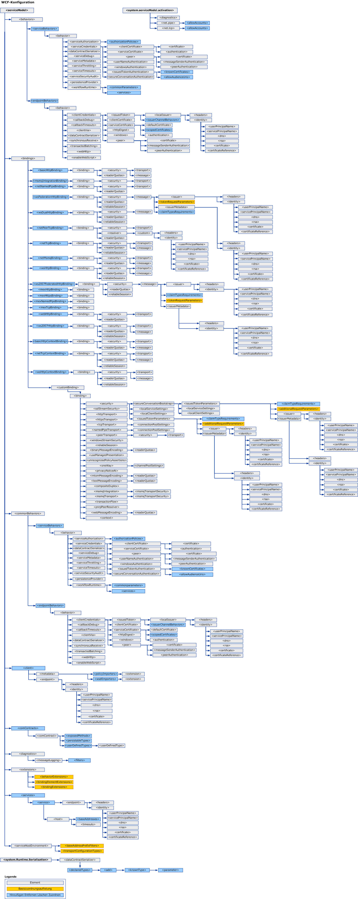

# WCF-KonfigurationsschemaWCF Configuration Schema
[!INCLUDE[indigo1](../../../../../includes/indigo1-md.md)]-Konfigurationselemente ermöglichen Ihnen, [!INCLUDE[indigo2](../../../../../includes/indigo2-md.md)]-Dienst- und -Clientanwendungen zu konfigurieren. configuration elements enable you to configure [!INCLUDE[indigo2](../../../../../includes/indigo2-md.md)] service and client applications. Sie können das [Configuration Editor-Tool (SvcConfigEditor.exe)](../../../../../docs/framework/wcf/configuration-editor-tool-svcconfigeditor-exe.md) verwenden, um Konfigurationsdateien für Clients und Dienste zu erstellen und zu bearbeiten.You can use the [Configuration Editor Tool (SvcConfigEditor.exe)](../../../../../docs/framework/wcf/configuration-editor-tool-svcconfigeditor-exe.md) to create and modify configuration files for clients and services. Da die Konfigurationsdateien als XML formatiert sind, müssen Sie mit XML vertraut sein, wenn Sie diese manuell in einem Texteditor bearbeiten möchten.Since the configuration files are formatted as XML, you must be familiar with XML if you want to manually edit them using a text editor. Andernfalls treten möglicherweise Probleme auf, wie ein nicht gefundenes XML-Elementtag oder -attribut.Otherwise, you may run into issues such as an unfound XML element tag or attribute. Das liegt daran, dass bei XML-Elementtags und -attributen zwischen Groß- und Kleinschreibung unterschieden wird.This is because XML element tags and attributes are case-sensitive.  
  
 Das [!INCLUDE[indigo2](../../../../../includes/indigo2-md.md)]-Konfigurationssystem basiert auf dem <xref:System.Configuration>-Namespace.The [!INCLUDE[indigo2](../../../../../includes/indigo2-md.md)] configuration system is based on the <xref:System.Configuration> namespace. Deshalb können Sie alle Standardfeatures verwenden, die vom <xref:System.Configuration>-Namespace bereitgestellt werden, wie die Konfigurationssperre, die Verschlüsselung und das Zusammenführen, um die Sicherheit Ihrer Anwendung und ihrer Konfiguration zu erhöhen.Therefore, you can use all the standard features provided by the <xref:System.Configuration> namespace, such as configuration locking, encryption and merging to increase the security of your application and its configuration. Weitere Informationen über diese Konzepte finden Sie in den folgenden Themen.For more information on these concepts, see the following topics.  
  
 [Encrypting Configuration Information (Verschlüsseln von Konfigurationsinformationen)Encrypting Configuration Information](http://go.microsoft.com/fwlink/?LinkId=95337)  
  
 [Locking Configuration Settings (Sperren von Konfigurationseinstellungen)Locking Configuration Settings](http://go.microsoft.com/fwlink/?LinkId=95338)  
  
 In diesem Abschnitt werden alle möglichen Werte eines Konfigurationselements sowie seine Interaktion mit anderen WCF-Konfigurationselementen beschrieben.This section describes all possible values of each configuration item, and how it interacts with other WCF configuration elements. Die folgende Zuordnung illustriert das WCF-Konfigurationsschema.The following map illustrates the WCF configuration schema.  
  
   
  
> [!CAUTION]
>  Sie sollten die [!INCLUDE[indigo2](../../../../../includes/indigo2-md.md)]-Konfigurationsabschnitte in den Konfigurationsdateien Ihrer Anwendung (app.config) mit den entsprechenden Zugriffssteuerungslisten (ACL) sichern, um mögliche Sicherheitsrisiken zu verhindern.You should protect [!INCLUDE[indigo2](../../../../../includes/indigo2-md.md)] configuration sections in your application configuration files (app.config) with appropriate Access Control Lists (ACL) to prevent any potential security threats.  So sollten Sie z.&#160;B. sicherstellen, dass nur die entsprechenden Personen auf die Sicherheitseinstellungen von Anwendungsbindungen oder auf den Dienstmodellabschnitt der Konfigurationsdatei eines Diensts zugreifen oder diese ändern können.For example, you should make sure that only the appropriate people can access or modify the security settings on application bindings, or the service model section of the configuration file for a service.  
  
## In diesem AbschnittIn This Section  
 [\<system.serviceModel>\<system.serviceModel>](../../../../../docs/framework/configure-apps/file-schema/wcf/system-servicemodel.md)  
 Beschreibt das `ServiceModel`-Element.Describes the `ServiceModel` element.  
  
 [\<system.serviceModel.activation>\<system.serviceModel.activation>](../../../../../docs/framework/configure-apps/file-schema/wcf/system-servicemodel-activation.md)  
 Konfiguriert das SMSvcHost.exe-Tool.Configures the SMSvcHost.exe tool.  
  
 [\<system.runtime.serialization>\<system.runtime.serialization>](../../../../../docs/framework/configure-apps/file-schema/wcf/system-runtime-serialization.md)  
 Das Element der obersten Ebene zum Festlegen von Optionen für die Verwendung von Serialisierern, wie z. B. <xref:System.Runtime.Serialization.DataContractSerializer>.The top-level element for setting options when using serializers such as the <xref:System.Runtime.Serialization.DataContractSerializer>.  
  
## Verwandte AbschnitteRelated Sections  
 [Konfigurieren von Windows Communication Foundation-AnwendungenConfiguring Windows Communication Foundation Applications](http://msdn.microsoft.com/library/13cb368e-88d4-4c61-8eed-2af0361c6d7a)  
 Beschreibt, wie [!INCLUDE[indigo2](../../../../../includes/indigo2-md.md)]-Dienste und -Clients konfiguriert werden.Describes how to configure [!INCLUDE[indigo2](../../../../../includes/indigo2-md.md)] services and clients.
