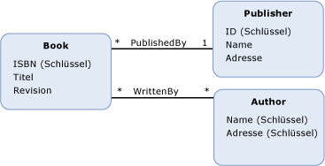

# Multiplizität des Zuordnungsendes
*Zuordnungsendes* definiert die Anzahl der [Entitätstyp](../../../../docs/framework/data/adonet/entity-type.md) -Instanzen, die an einem Ende einer [Zuordnung](../../../../docs/framework/data/adonet/association-type.md).  
  
 Eine Multiplizität des Zuordnungsendes kann einen der folgenden Werte aufweisen:  
  
-   eins (1): Gibt an, dass diese genau eine Entitätstypinstanz am Zuordnungsende vorhanden ist.  
  
-   0 (null) oder eine (0.. 1): Gibt an, dass 0 (null) oder eine Entitätstypinstanz am Zuordnungsende vorhanden ist.  
  
-   viele (*): Gibt an, dass 0 (null), einer oder mehrere Instanzen eines Entitätstyps am Zuordnungsende vorhanden sind.  
  
 Eine Zuordnung wird oft nach ihren Zuordnungsendemultiplizitäten charakterisiert. Wenn die Zuordnungsenden z. B. die Multiplizitäten eins (1) und n (*) aufweisen, wird die Zuordnung als 1:n-Zuordnung bezeichnet. Im Beispiel unten ist die `PublishedBy`-Zuordnung eine 1:n-Zuordnung (ein Verleger veröffentlicht viele Bücher, und ein Buch wird von einem Verleger veröffentlicht). Die `WrittenBy`-Zuordnung ist eine m:n-Zuordnung (ein Buch kann mehrere Autoren haben, und ein Autor kann mehrere Bücher schreiben).  
  
## Beispiel  
 Die unten stehende Abbildung zeigt ein konzeptionelles Modell mit zwei Zuordnungen: `PublishedBy` und `WrittenBy`. Die Zuordnungsenden für die `PublishedBy`-Zuordnung sind die Entitätstypen `Book` und `Publisher`. Die Multiplizität des `Publisher`-Endes ist eins (1), und die Multiplizität des `Book`-Endes ist n (*).  
  
   
  
 Das ADO.NET Entity Framework verwendet eine domänenspezifische Sprache (DSL) Bezeichnung konzeptionelle Schemadefinitionssprache ([CSDL](../../../../docs/framework/data/adonet/ef/language-reference/csdl-specification.md)), konzeptionelle Modelle zu definieren. Die folgende CSDL definiert die in der Abbildung oben gezeigte `PublishedBy`-Zuordnung:  
  
 [!code-xml[EDM_Example_Model#AssociationExample](../../../../samples/snippets/xml/VS_Snippets_Data/edm_example_model/xml/books.edmx#associationexample)]  
  
## Siehe auch
- [Schlüsselkonzepte im Entity Data Model](../../../../docs/framework/data/adonet/entity-data-model-key-concepts.md)
- [Entity Data Model](../../../../docs/framework/data/adonet/entity-data-model.md)
