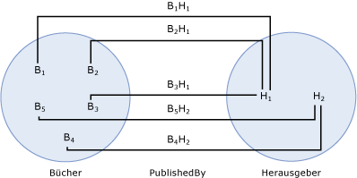

# Zuordnungssatzendeassociation set end
Ein *zuordnungssatzende* identifiziert die [Entitätstyp](../../../../docs/framework/data/adonet/entity-type.md) und die [Entitätenmenge](../../../../docs/framework/data/adonet/entity-set.md) am Ende einer [Zuordnungssatz](../../../../docs/framework/data/adonet/association-set.md).An *association set end* identifies the [entity type](../../../../docs/framework/data/adonet/entity-type.md) and the [entity set](../../../../docs/framework/data/adonet/entity-set.md) at the end of an [association set](../../../../docs/framework/data/adonet/association-set.md). Zuordnungssatzenden werden als Teil eines Zuordnungssatzes definiert. Ein Zuordnungssatz muss genau zwei Zuordnungssatzenden aufweisen.Association set ends are defined as part of an association set; an association set must have exactly two association set ends.  
  
 Die Definition eines Zuordnungssatzendes enthält die folgenden Informationen:An association set end definition contains the following information:  
  
-   Einen der Entitätstypen des Zuordnungssatzes.One of the entity types involved in the association set. (erforderlich)(Required)  
  
-   Die Entitätenmenge für den Entitätstyp im Zuordnungssatz.The entity set for the entity type involved in the association set. (erforderlich)(Required)  
  
## BeispielExample  
 Die unten stehende Abbildung zeigt ein konzeptionelles Modell mit zwei Zuordnungen: `WrittenBy` und `PublishedBy`.The diagram below shows a conceptual model with two associations: `WrittenBy` and `PublishedBy`.  
  
   
  
 Die folgende Abbildung zeigt einen Zuordnungssatz (`PublishedBy`) sowie zwei Entitätenmengen (`Books` und `Publishers`) auf Grundlage des oben gezeigten konzeptionellen Modells.The following diagram shows an association set (`PublishedBy`) and two entity sets (`Books` and `Publishers`) based on the conceptual model shown above. Die Zuordnungssatzenden sind die Entitätenmengen `Books` und `Publishers`.The association set ends are the `Books` and `Publishers` entity sets. BI in der `Books` Entitätenmenge stellt eine Instanz der dem `Book` Entitätstyp zur Laufzeit.Bi in the `Books` entity set represents an instance of the `Book` entity type at run time. Auf ähnliche Weise Pj stellt eine `Publisher` -Instanz in der `Publishers` Entitätenmenge.Similarly, Pj represents a `Publisher` instance in the `Publishers` entity set. BiPj stellt eine Instanz der dem `PublishedBy` Zuordnung in der `PublishedBy` Zuordnungssatz.BiPj represents an instance of the `PublishedBy` association in the `PublishedBy` association set.  
  
   
  
 Die [ADO.NET Entity Framework](../../../../docs/framework/data/adonet/ef/index.md) verwendet eine DSL mit der Bezeichnung konzeptionelle Schemadefinitionssprache ([CSDL](../../../../docs/framework/data/adonet/ef/language-reference/csdl-specification.md)) um konzeptionelle Modelle zu definieren.The [ADO.NET Entity Framework](../../../../docs/framework/data/adonet/ef/index.md) uses a DSL called conceptual schema definition language ([CSDL](../../../../docs/framework/data/adonet/ef/language-reference/csdl-specification.md)) to define conceptual models. Die folgende CSDL definiert einen Entitätscontainer mit einem Zuordnungssatz für jede Zuordnung in der oben gezeigten Abbildung.The following CSDL defines an entity container with one association set for each association in the diagram above. Beachten Sie, dass Zuordnungssatzenden als Teil jeder Zuordnungssatzdefinition definiert werden.Note that association set ends are defined as part of each association set definition.  
  
 [!code-xml[EDM_Example_Model#EntityContainerExample](../../../../samples/snippets/xml/VS_Snippets_Data/edm_example_model/xml/books.edmx#entitycontainerexample)]  
  
## Siehe auchSee Also  
 [Schlüsselkonzepte im Entity Data ModelEntity Data Model Key Concepts](../../../../docs/framework/data/adonet/entity-data-model-key-concepts.md)  
 [Entity Data ModelEntity Data Model](../../../../docs/framework/data/adonet/entity-data-model.md)
