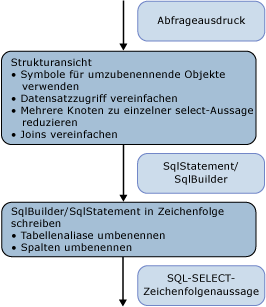

# <a name="architecture-and-design"></a>Architektur und Entwurf

Das SQL-Generierungsmodul im der [Beispielanbieter](https://code.msdn.microsoft.com/windowsdesktop/Entity-Framework-Sample-6a9801d0) wird implementiert, als Besucher für die Ausdrucksbaumstruktur, die die Befehlsstruktur darstellt. Die Generierung erfolgt, indem die Ausdrucksbaumstruktur einmal durchlaufen wird.

Die Knoten der Struktur werden von unten nach oben verarbeitet. Zunächst wird eine Zwischenstruktur erzeugt: SqlSelectStatement oder SqlBuilder, die beide ISqlFragment. Danach wird die SQL-Zeichenfolgenanweisung aus dieser Struktur erzeugt. Es gibt zwei Gründe für die Zwischenstruktur:

- Logisch wird eine SQL SELECT-Anweisung der Reihenfolge nach gefüllt. Auf die Knoten, die in der FROM-Klausel verwendet werden, wird vor den Knoten zugegriffen, die in den WHERE-, GROUP BY- und ORDER BY-Klauseln verwendet werden.

- Um Aliase umzubenennen, müssen Sie alle verwendeten Aliase identifizieren, sodass Konflikte während der Umbenennung vermieden werden. Wenn Sie die Umbenennungsoptionen in SqlBuilder verzögern möchten, können Sie Symbolobjekte verwenden, um die Spalten darzustellen, die für die Umbenennung infrage kommen.



In der ersten Phase während des Zugriffs auf die Ausdrucksstruktur werden Ausdrücke in SqlSelectStatements gruppiert sowie Joins und Joinaliase vereinfacht. Während dieses Durchgangs stellen Symbolobjekte Spalten oder Eingabealiase dar, die möglicherweise umbenannt werden.

In der zweiten Phase, während die tatsächliche Zeichenfolge erzeugt wird, werden Aliase umbenannt.

## <a name="data-structures"></a>Datenstrukturen

In diesem Abschnitt wird erläutert, die Typen in der [Beispielanbieter](https://code.msdn.microsoft.com/windowsdesktop/Entity-Framework-Sample-6a9801d0) , zum Erstellen einer SQL­Anweisung zu verwenden.

### <a name="isqlfragment"></a>ISqlFragment

In diesem Abschnitt werden die Klassen behandelt, die die ISqlFragment-Schnittstelle implementieren. Diese dient zwei Zwecken:

- Als allgemeiner Rückgabetyp für alle Besuchermethoden

- Zur Bereitstellung einer Methode, um die endgültige SQL-Zeichenfolge zu schreiben

```csharp
internal interface ISqlFragment {
   void WriteSql(SqlWriter writer, SqlGenerator sqlGenerator);
}
```

#### <a name="sqlbuilder"></a>SqlBuilder

SqlBuilder ist ein Sammelwerkzeug für die endgültige SQL-Zeichenfolge, ähnlich StringBuilder. Er besteht aus den Zeichenfolgen, die den endgültigen SQL-Code bilden, und ISqlFragments, die in Zeichenfolgen konvertiert werden können.

```csharp
internal sealed class SqlBuilder : ISqlFragment {
   public void Append(object s)
   public void AppendLine()
   public bool IsEmpty
}
```

#### <a name="sqlselectstatement"></a>SqlSelectStatement

SqlSelectStatement stellt eine kanonische SQL SELECT-Anweisung der Form "SELECT... VON.. WHERE... GRUPPIEREN SIE NACH... SORTIERT NACH".

Jede der SQL-Klauseln wird durch einen StringBuilder dargestellt. Außerdem überwacht es, ob "Distinct" angegeben wurde und es sich um die Anweisung auf oberster Ebene handelt. Wenn es sich nicht um die Anweisung auf oberster Ebene handelt, wird die ORDER BY-Klausel weggelassen, es sei denn, die Anweisung verfügt auch über eine TOP-Klausel.

FromExtents enthält die Liste der Eingaben für die SELECT-Anweisung. Darin ist normalerweise nur ein Element enthalten. SELECT-Anweisungen für Joins können vorübergehend über mehr als ein Element verfügen.

Wenn die SELECT-Anweisung von einem Joinknoten erstellt wird, verwaltet SqlSelectStatement eine Liste aller Blöcke, die in dem Join in AllJoinExtents vereinfacht wurden. OuterExtents stellt äußere Verweise des SqlSelectStatement dar und wird zur Umbenennung von Eingabealiasen verwendet.

```csharp
internal sealed class SqlSelectStatement : ISqlFragment {
   internal bool IsDistinct { get, set };
   internal bool IsTopMost

   internal List<Symbol> AllJoinExtents { get, set };
   internal List<Symbol> FromExtents { get};
   internal Dictionary<Symbol, bool> OuterExtents { get};

   internal TopClause Top { get, set };

   internal SqlBuilder Select {get};
   internal SqlBuilder From
   internal SqlBuilder Where
   internal SqlBuilder GroupBy
   public SqlBuilder OrderBy
}
```

#### <a name="topclause"></a>TopClause

TopClause stellt den TOP-Ausdruck in einem SqlSelectStatement dar. Die TopCount-Eigenschaft gibt an, wie viele TOP-Zeilen ausgewählt werden sollen.  Wenn WithTies auf "true" festgelegt ist, wurde die TopClause aus einem DbLimitExpression erstellt.

```csharp
class TopClause : ISqlFragment {
   internal bool WithTies {get}
   internal ISqlFragment TopCount {get}
   internal TopClause(ISqlFragment topCount, bool withTies)
   internal TopClause(int topCount, bool withTies)
}
```

### <a name="symbols"></a>Symbole

Die symbolbezogenen Klassen und die Symboltabelle führen die Umbenennung von Eingabealiasen, die Vereinfachung von Joinaliasen und die Umbenennung von Spaltenaliasen aus.

Die Symbol-Klasse stellt einen Block, eine geschachtelte SELECT-Anweisung oder eine Spalte dar. Sie wird statt eines tatsächlichen Alias verwendet, um das Umbenennen nach der Verwendung zu ermöglichen, und enthält zusätzlich weitere Informationen für das Artefakt, das sie darstellt (beispielsweise den Typ).

```csharp
class Symbol : ISqlFragment {
   internal Dictionary<string, Symbol> Columns {get}
   internal bool NeedsRenaming {get, set}
   internal bool IsUnnest {get, set}   //not used

   public string Name{get}
   public string NewName {get,set}
   internal TypeUsage Type {get, set}

   public Symbol(string name, TypeUsage type)
}
```

In Name wird der ursprüngliche Alias für den dargestellten Block, die geschachtelte SELECT-Anweisung oder eine Spalte gespeichert.

In NewName wird der Alias gespeichert, der in der SQL SELECT-Anweisung verwendet wird. Er ist ursprünglich auf Name festgelegt und wird nur bei Bedarf beim Generieren der endgültigen Zeichenfolgenabfrage umbenannt.

Type ist nur für Symbole von Nutzen, die Blöcke und geschachtelte SELECT-Anweisungen darstellen.

#### <a name="symbolpair"></a>SymbolPair

Die SymbolPair-Klasse dient der Datensatzvereinfachung.

Nehmen Sie den Eigenschaftsausdruck D(v, "j3.j2.j1.a.x") als Beispiel, bei dem v ein VarRef ist, j1, j2, j3 Joins sind, a ein Block ist und x eine Spalte ist.

Dieser Ausdruck muss schließlich in {j'}.{x'} übersetzt werden. Das Quellfeld stellt das äußerste SqlStatement dar, das einen Joinausdruck (etwa j2) darstellt. Dies ist immer ein Joinsymbol. Das Spaltenfeld bewegt sich von einem Joinsymbol zum nächsten, bis es bei einem Symbol stoppt, das kein Joinsymbol ist. Dies wird beim Zugriff auf einen DbPropertyExpression zurückgegeben, wird jedoch nie einem SqlBuilder hinzugefügt.

```csharp
class SymbolPair : ISqlFragment {
   public Symbol Source;
   public Symbol Column;
   public SymbolPair(Symbol source, Symbol column)
}
```

#### <a name="joinsymbol"></a>JoinSymbol

Ein Joinsymbol ist ein Symbol, das eine geschachtelte SELECT-Anweisung mit einem Join oder einer Joineingabe darstellt.

```csharp
internal sealed class JoinSymbol : Symbol {
   internal List<Symbol> ColumnList {get, set}
   internal List<Symbol> ExtentList {get}
   internal List<Symbol> FlattenedExtentList {get, set}
   internal Dictionary<string, Symbol> NameToExtent {get}
   internal bool IsNestedJoin {get, set}

   public JoinSymbol(string name, TypeUsage type, List<Symbol> extents)
}
```

ColumnList stellt die Liste der Spalten in der SELECT-Klausel dar, wenn dieses Symbol eine SQL SELECT-Anweisung darstellt. ExtentList ist die Liste der Blöcke in der SELECT-Klausel. Wenn der Join über mehrere auf der obersten Ebene vereinfachte Blöcke verfügt, überwacht FlattenedExtentList die Blöcke, um sicherzustellen, dass die Blockaliase ordnungsgemäß umbenannt werden.

NameToExtent verfügt über alle Blöcke in ExtentList als Wörterbuch. IsNestedJoin wird verwendet, um zu bestimmen, ob ein JoinSymbol ein gewöhnliches Joinsymbol oder eines ist, das über ein entsprechendes SqlSelectStatement verfügt.

Alle Listen werden genau einmal festgelegt und dann für Suchen oder die Enumeration verwendet.

#### <a name="symboltable"></a>SymbolTable

SymbolTable wird verwendet, um Variablennamen in Symbole aufzulösen. SymbolTable wird als Stapel mit einem neuen Eintrag für jeden Bereich implementiert. Suchen suchen vom Anfang des Stapels abwärts, bis ein Eintrag gefunden wird.

```csharp
internal sealed class SymbolTable {
   internal void EnterScope()
   internal void ExitScope()
   internal void Add(string name, Symbol value)
   internal Symbol Lookup(string name)
}
```

Es gibt nur eine SymbolTable pro Instanz des SQL-Generierungsmoduls. Für jeden relationalen Knoten wird in Bereiche gewechselt und werden diese Bereiche wieder verlassen. Alle Symbole in früheren Bereichen sind für spätere Bereiche sichtbar, es sei denn, sie werden von anderen Symbolen mit dem gleichen Namen ausgeblendet.

### <a name="global-state-for-the-visitor"></a>Globaler Zustand für den Besucher

Wenn Sie die Umbenennung von Aliasen und Spalten unterstützen möchten, sollten Sie eine Liste aller Spaltennamen (AllColumnNames) und Blockaliase (AllExtentNames) vorhalten, die bei der ersten Verarbeitung der Abfragestruktur verwendet wurden.  Die Symboltabelle löst Variablennamen in Symbole auf. IsVarRefSingle wird nur zu Überprüfungszwecken verwendet und ist nicht unbedingt erforderlich.

Mithilfe der beiden über CurrentSelectStatement und IsParentAJoin verwendeten Stapel werden "Parameter" von übergeordneten Knoten an untergeordnete Knoten übergeben, da das Besuchermuster es nicht zulässt, Parameter zu übergeben.

```csharp
internal Dictionary<string, int> AllExtentNames {get}
internal Dictionary<string, int> AllColumnNames {get}
SymbolTable symbolTable = new SymbolTable();
bool isVarRefSingle = false;

Stack<SqlSelectStatement> selectStatementStack;
private SqlSelectStatement CurrentSelectStatement{get}

Stack<bool> isParentAJoinStack;
private bool IsParentAJoin{get}
```

## <a name="common-scenarios"></a>Häufige Szenarien

In diesem Abschnitt werden häufig verwendete Anbieterszenarien erläutert.

### <a name="grouping-expression-nodes-into-sql-statements"></a>Gruppieren von Ausdrucksknoten in SQL-Anweisungen

Ein SqlSelectStatement wird erstellt, wenn beim Zugriff auf die Struktur von unten der erste relationale Knoten (in der Regel ein DbScanExpression-Block) gefunden wird. Wenn Sie eine SQL SELECT-Anweisung mit so wenigen geschachtelten Abfragen wie möglich erzeugen möchten, müssen Sie so viele ihrer übergeordneten Knoten wie möglich in diesem SqlSelectStatement aggregieren.

Die Entscheidung, ob dem aktuellen (beim Zugriff auf die Eingabe zurückgegebenen) SqlSelectStatement ein angegebener (relationaler) Knoten hinzugefügt werden kann oder eine neue Anweisung gestartet werden muss, wird von der IsCompatible-Methode berechnet. Außerdem hängt die Entscheidung vom bereits im SqlSelectStatement vorhandenen Inhalt ab, der wiederum davon abhängt, welche Knoten dem angegebenen Knoten untergeordnet waren.

Wenn SQL-Anweisungsklauseln nach Klauseln ausgewertet werden, bei denen die Knoten, die zum Zusammenführen vorgesehen sind, nicht leer sind, können die Knoten der aktuellen Anweisung normalerweise nicht hinzugefügt werden. Wenn der nächste Knoten z. B. ein Filter ist, kann dieser Knoten nur in das aktuelle SqlSelectStatement integriert werden, wenn Folgendes zutrifft:

- Die SELECT-Liste ist leer. Wenn die SELECT-Liste nicht leer ist, wurde die Auswahlliste von einem Knoten erzeugt, der dem Filter vorausgeht, und das Prädikat verweist möglicherweise auf von dieser SELECT-Liste erzeugte Spalten.

- Die GROUP BY-Klausel ist leer. Wenn die GROUP BY-Klausel nicht leer ist, würde das Hinzufügen des Filters bedeuten, dass vor dem Gruppieren gefiltert würde. Das ist nicht zulässig.

- Die TOP-Klausel ist leer. Wenn die TOP-Klausel nicht leer ist, würde das Hinzufügen des Filters bedeuten, dass vor dem Ausführen der TOP-Klausel gefiltert würde. Das ist nicht zulässig.

Dies gilt nicht für nicht relationale Knoten wie DbConstantExpression oder arithmetische Ausdrücke, da diese immer als Teil eines vorhandenen SqlSelectStatements eingeschlossen sind.

Wird festgestellt, dass es sich um den Stamm der Joinstruktur (ein Joinknoten, der nicht über ein übergeordnetes Joinelement verfügt) handelt, wird ebenfalls ein neues SqlSelectStatement gestartet. Alle zugehörigen linken untergeordneten Joinelemente werden in diesem SqlSelectStatement aggregiert.

Jedes Mal, wenn ein neues SqlSelectStatement gestartet wird und das aktuelle der Eingabe hinzugefügt wird, muss das aktuelle SqlSelectStatement möglicherweise durch das Hinzufügen von Projektionsspalten (eine SELECT-Klausel) abgeschlossen werden, wenn keine vorhanden ist. Dies erfolgt mit der Methode AddDefaultColumns, die die FromExtents des SqlSelectStatements verwendet und alle Spalten zur Liste der projizierten Spalten hinzufügt, die in der Liste der von FromExtents dargestellten Blöcke im Gültigkeitsbereich liegen. Auf diese Weise wird verfahren, da zu diesem Zeitpunkt unbekannt ist, auf welche Spalten die anderen Knoten verweisen. Dies kann so optimiert werden, dass nur die Spalten projiziert werden, die später verwendet werden können.

### <a name="join-flattening"></a>Joinvereinfachung

Die IsParentAJoin-Eigenschaft hilft zu bestimmen, ob ein angegebener Join vereinfacht werden kann. Insbesondere gibt IsParentAJoin `true` nur für das linke untergeordnete Element eines Joins und für jeden DbScanExpression zurück, der eine sofortige Eingabe für einen Join darstellt. In diesem Fall verwendet dieser untergeordnete Knoten das gleiche SqlSelectStatement erneut, das das übergeordnete Element später verwenden würde. Weitere Informationen finden Sie unter "Joinausdrücke".

### <a name="input-alias-redirecting"></a>Eingabealiasumleitung

Die Eingabealiasumleitung erfolgt mithilfe der Symboltabelle.

Um eine Erklärung der eingabealiasumleitung finden Sie im ersten Beispiel in [Generieren von SQL aus Befehlsstrukturen – Best Practices](../../../../../docs/framework/data/adonet/ef/generating-sql-from-command-trees-best-practices.md).  Dort musste "a" in der Projektion zu "b" umgeleitet werden.

Wenn ein SqlSelectStatement-Objekt erstellt wird, wird der Block, der als Eingabe für den Knoten dient, in die From-Eigenschaft des SqlSelectStatements eingefügt. Ein Symbol (\<Symbol_b >) wird erstellt basierend auf den eingabebindungsnamen ("b") um diesen Block darzustellen und "AS" + \<Symbol_b > wird an die From-Klausel angefügt.  Das Symbol wird außerdem der FromExtents-Eigenschaft hinzugefügt.

Das Symbol wird ebenfalls hinzugefügt, der Symboltabelle, um den eingabebindungsnamen damit zu verknüpfen ("b", \<Symbol_b >).

Wenn ein nachfolgender Knoten dieses SqlSelectStatement wiederverwendet, fügt es der Symboltabelle einen Eintrag hinzu, um seinen Eingabebindungsnamen mit diesem Symbol zu verknüpfen. In unserem Beispiel würde der DbProjectExpression mit dem eingabebindungsnamen "a" das SqlSelectStatement wiederverwenden und hinzufügen ("a", \< Symbol_b >) auf die Tabelle.

Wenn Ausdrücke auf den Eingabebindungsnamen des Knotens verweisen, der das SqlSelectStatement wiederverwendet, wird dieser Verweis mithilfe der Symboltabelle in das richtige umgeleitete Symbol aufgelöst. Wenn "a" von "a.x" aufgelöst wird, während der Zugriff auf DbVariableReferenceExpression, der "a" It darstellt, das Symbol aufgelöst wird \<Symbol_b >.

### <a name="join-alias-flattening"></a>Joinaliasvereinfachung

Im Abschnitt mit dem Titel "DbPropertyExpression" wird beschrieben, wie beim Zugriff auf einen DbPropertyExpression die Joinaliasvereinfachung erreicht wird.

### <a name="column-name-and-extent-alias-renaming"></a>Spaltennamen- und Blockaliasumbenennung

Das Problem der Spaltenname und blockaliasumbenennung wird behoben, unter Verwendung von Symbolen, die nur ersetzt werden mit Aliasen in der zweiten Phase der Generierung in der zweiten Phase der SQL-Generierung für Abschnitt beschrieben: Generieren des Zeichenfolgenbefehls an.

## <a name="first-phase-of-the-sql-generation-visiting-the-expression-tree"></a>Erste Phase der SQL-Generierung: Zugriff auf die Ausdrucksbaumstruktur

In diesem Abschnitt wird die erste Phase der SQL-Generierung beschrieben, wenn auf den Ausdruck zugegriffen wird, der die Abfrage darstellt, und eine Zwischenstruktur (entweder ein SqlSelectStatement oder ein SqlBuilder) erzeugt wird.

In diesem Abschnitt werden die Prinzipien des Zugriffs auf unterschiedliche Kategorien von Ausdrucksknoten und Details des Zugriffs auf bestimmte Ausdruckstypen beschrieben.

### <a name="relational-non-join-nodes"></a>Relationale Knoten, die nicht zu einem Join gehören

Die folgenden Ausdruckstypen unterstützen Knoten, die nicht zu einem Join gehören:

- DbDistinctExpression

- DbFilterExpression

- DbGroupByExpression

- DbLimitExpression

- DbProjectExpression

- DbSkipExpression

- DbSortExpression

Der Zugriff auf diese Knoten erfolgt nach dem folgenden Muster:

1. Zugreifen auf die relationale Eingabe und Abrufen des resultierenden SqlSelectStatements. Folgende Eingaben sind bei einem relationalen Knoten möglich:

    - Ein relationaler Knoten, einschließlich eines Blocks (z. B. ein DbScanExpression). Der Zugriff auf einen solchen Knoten gibt ein SqlSelectStatement zurück.

    - Ein Festlegungsausdruck (z. B. UNION ALL). Das Ergebnis muss in Klammern eingeschlossen und in die FROM-Klausel eines neuen SqlSelectStatements eingefügt werden.

2. Überprüfen Sie, ob der aktuelle Knoten dem SqlSelectStatement hinzugefügt werden kann, das von der Eingabe erzeugt wurde. Im Abschnitt mit dem Titel "Gruppieren von Ausdrücken in SQL-Anweisungen" wird dies beschrieben. Wenn das nicht der Fall ist, gehen Sie folgendermaßen vor:

    - Lesen Sie das aktuelle SqlSelectStatement-Objekt aus.

    - Erstellen Sie ein neues SqlSelectStatement-Objekt, und fügen Sie das ausgelesene SqlSelectStatement als FROM-Klausel des neuen SqlSelectStatement-Objekts hinzu.

    - Legen Sie das neue Objekt oben auf dem Stapel ab.

3. Leiten Sie die Eingabeausdruckbindung auf das passende Symbol aus der Eingabe um. Diese Informationen werden im SqlSelectStatement-Objekt verwaltet.

4. Fügen Sie einen neuen SymbolTable-Bereich hinzu.

5. Greifen Sie auf den Teil des Ausdrucks zu (z. B. Projektion und Prädikat), der nicht zur Eingabe gehört.

6. Lesen Sie alle Objekte aus, die den globalen Stapeln hinzugefügt wurden.

 DbSkipExpression hat keine direkte Entsprechung in SQL. Logisch wird es übersetzt in:

```sql
SELECT Y.x1, Y.x2, ..., Y.xn
FROM (
   SELECT X.x1, X.x2, ..., X.xn, row_number() OVER (ORDER BY sk1, sk2, ...) AS [row_number]
   FROM input as X
   ) as Y
WHERE Y.[row_number] > count
ORDER BY sk1, sk2, ...
```

### <a name="join-expressions"></a>Joinausdrücke

Folgende Ausdrücke gelten als Joinausdrücke und werden einheitlich durch die VisitJoinExpression-Methode verarbeitet:

- DbApplyExpression

- DbJoinExpression

- DbCrossJoinExpression

Der Zugriff erfolgt in folgenden Schritten:

Vor dem Zugriff auf die untergeordneten Elemente wird zunächst IsParentAJoin aufgerufen, um zu überprüfen, ob der Joinknoten ein untergeordnetes Element eines Joins der linken Seite ist. Wird false zurückgegeben, wird ein neues SqlSelectStatement gestartet. In dieser Hinsicht unterscheidet sich der Zugriff auf Joins vom Zugriff auf die übrigen Knoten, da das übergeordnete Element (der Joinknoten) das SqlSelectStatement erstellt, das die untergeordneten Elemente ggf. verwenden sollen.

Verarbeiten Sie im zweiten Schritt die Eingaben einzeln. Für jede Eingabe gilt:

1. Greifen Sie auf die Eingabe zu.

2. Verarbeiten Sie das Ergebnis nach dem Zugriff auf die Eingabe durch den Aufruf von ProcessJoinInputResult. Diese Methode ist für die Verwaltung der Symboltabelle nach dem Zugriff auf ein untergeordnetes Element eines Joinausdrucks und gegebenenfalls den Abschluss des vom untergeordneten Element erzeugten SqlSelectStatements zuständig. Das untergeordnete Element kann eines der folgenden Ergebnisse haben:

    - Ein anderes SqlSelectStatement als das, dem das übergeordnete Element hinzugefügt wird. In dem Fall muss es möglicherweise durch das Hinzufügen von Standardspalten vervollständigt werden. Wenn die Eingabe ein Join war, müssen Sie ein neues Joinsymbol erstellen. Erstellen Sie andernfalls ein normales Symbol.

    - Ein Block (z. B. ein DbScanExpression). In diesem Fall wird es einfach der Liste der Eingaben des SqlSelectStatements des übergeordneten Elements hinzugefügt.

    - Kein SqlSelectStatement. In diesem Fall wird es in Klammern eingeschlossen.

    - Das gleiche SqlSelectStatement, dem das übergeordnete Element hinzugefügt wird. In diesem Fall müssen die Symbole in der FromExtents-Liste durch ein einzelnes neues JoinSymbol ersetzt werden, das alle Symbole darstellt.

    - Für die ersten drei Fälle wird AddFromSymbol aufgerufen, um die AS-Klausel hinzuzufügen und die Symboltabelle zu aktualisieren.

Im dritten Schritt wird auf die Joinbedingung (sofern vorhanden) zugegriffen.

### <a name="set-operations"></a>Mengenvorgänge

Die Set-Vorgänge DbUnionAllExpression, DbExceptExpression und DbIntersectExpression werden von der Methode VisitSetOpExpression verarbeitet. Sie erstellt einen SqlBuilder der Form

```xml
<leftSqlSelectStatement> <setOp> <rightSqlSelectStatement>
```

Wo \<LeftSqlSelectStatement > und \<RightSqlSelectStatement > sqlselectstatements, die abgerufen werden, indem Sie zu jeder der Eingaben und \<SetOp > ist der entsprechende Vorgang (z. B. UNION ALL).

### <a name="dbscanexpression"></a>DbScanExpression

Wenn in einem Joinkontext (als Eingabe für einen Join, der ein linkes untergeordnetes Element eines anderen Joins ist) darauf zugegriffen wird, gibt DbScanExpression einen SqlBuilder mit dem SQL-Zielcode für das entsprechende Ziel zurück, der entweder aus einer definierenden Abfrage, einer Tabelle oder einer Ansicht besteht. Andernfalls wird ein neues SqlSelectStatement erstellt, bei dem das FROM-Feld so festgelegt wird, dass es dem entsprechenden Ziel entspricht.

### <a name="dbvariablereferenceexpression"></a>DbVariableReferenceExpression

Der Zugriff auf einen DbVariableReferenceExpression gibt auf Basis einer Suche in der Symboltabelle das Symbol zurück, das diesem Variablenverweisausdruck entspricht.

### <a name="dbpropertyexpression"></a>DbPropertyExpression

Beim Zugriff auf einen DbPropertyExpression wird eine Joinaliasvereinfachung erkannt und verarbeitet.

Zuerst wird auf die Instance-Eigenschaft zugegriffen. Das Ergebnis ist ein Symbol, ein JoinSymbol oder ein SymbolPair. Diese drei Fälle werden folgendermaßen behandelt:

- Wenn ein JoinSymbol zurückgegeben wird, enthält seine NameToExtent-Eigenschaft ein Symbol für die benötigte Eigenschaft. Wenn das Joinsymbol einen geschachtelten Join darstellt, wird ein neues Symbolpaar mit dem Joinsymbol zur Nachverfolgung des Symbols, das als Instanzalias verwendet würde, und dem Symbol, das die tatsächliche Eigenschaft für die weitere Auflösung darstellt, zurückgegeben.

- Wenn ein SymbolPair zurückgegeben wird und der Spaltenteil ein Joinsymbol ist, wird wieder ein Joinsymbol zurückgegeben. Dieses Mal wird die Spalteneigenschaft jedoch aktualisiert, damit sie auf die durch den aktuellen Eigenschaftsausdruck dargestellte Eigenschaft verweist. Andernfalls wird ein SqlBuilder mit der SymbolPair-Quelle als Alias und dem Symbol für die aktuelle Eigenschaft als Spalte zurückgegeben.

- Wenn ein Symbol zurückgegeben wird, gibt die Visit-Methode eine SqlBuilder-Methode mit dieser Instanz als Alias und dem Eigenschaftennamen als Spaltenname zurück.

### <a name="dbnewinstanceexpression"></a>DbNewInstanceExpression

Wenn DbNewInstanceExpression als Projection-Eigenschaft von DbProjectExpression verwendet wird, erzeugt DbNewInstanceExpression eine durch Trennzeichen getrennte Liste der Argumente, um die projizierten Spalten darzustellen.

Wenn die Rückgabe von DbNewInstanceExpression vom Typ Auflistung ist und eine neue Auflistung der Ausdrücke definiert, die als Argumente bereitgestellt wurden, werden die folgenden drei Fälle getrennt behandelt:

- Wenn DbElementExpression das einzige Argument von DbNewInstanceExpression ist, wird er wie folgt übersetzt:

    ```
    NewInstance(Element(X)) =>  SELECT TOP 1 …FROM X
    ```

Wenn DbNewInstanceExpression über keine Argumente verfügt (eine leere Tabelle darstellt), wird DbNewInstanceExpression übersetzt in:

```sql
SELECT CAST(NULL AS <primitiveType>) as X
FROM (SELECT 1) AS Y WHERE 1=0
```

Andernfalls bildet DbNewInstanceExpression eine UNION ALL-Folge der Argumente:

```sql
SELECT <visit-result-arg1> as X
UNION ALL SELECT <visit-result-arg2> as X
UNION ALL …
UNION ALL SELECT <visit-result-argN> as X
```

### <a name="dbfunctionexpression"></a>DbFunctionExpression

Kanonische und integrierte Funktionen werden auf die gleiche Weise verarbeitet: Wenn sie besondere Behandlung benötigen (z. B. TRIM(Zeichenfolge) zu LTRIM(RTRIM(Zeichenfolge)), wird der entsprechende Handler aufgerufen. Andernfalls werden sie in Funktionsname(arg1, arg2, ..., argn) übersetzt.

Um festzustellen, welche Funktionen eine besondere Behandlung benötigen, sowie für die entsprechenden Handler werden Wörterbücher verwendet.

Benutzerdefinierte Funktionen werden in Namespacename.Funktionsname (arg1, arg2,..., Argn) übersetzt.

### <a name="dbelementexpression"></a>DbElementExpression

Die Methode, die auf DbElementExpression zugreift, wird nur für den Zugriff auf einen DbElementExpression aufgerufen, wenn er zur Darstellung einer skalaren Unterabfrage verwendet wird. Daher wird DbElementExpression in ein vollständiges SqlSelectStatement übersetzt und mit Klammern versehen.

### <a name="dbquantifierexpression"></a>DbQuantifierExpression

Abhängig vom Ausdruckstyp (Any oder All) wird DbQuantifierExpression folgendermaßen übersetzt:

```
Any(input, x) => Exists(Filter(input,x))
All(input, x) => Not Exists(Filter(input, not(x))
```

### <a name="dbnotexpression"></a>DbNotExpression

In einigen Fällen ist es möglich, die Übersetzung von DbNotExpression mit seinem Eingabeausdruck zu reduzieren. Zum Beispiel:

```
Not(IsNull(a)) =>  "a IS NOT NULL"
Not(All(input, x) => Not (Not Exists(Filter(input, not(x))) => Exists(Filter(input, not(x))
```

Der Grund für die zweite Reduzierung besteht darin, dass beim Übersetzen von DbQuantifierExpression vom Typ All Ineffizienzen vom Anbieter eingeführt wurden. Daher konnte die Vereinfachung vom Entity Framework nicht ausgeführt werden.

### <a name="dbisemptyexpression"></a>DbIsEmptyExpression

DbIsEmptyExpression wird folgendermaßen übersetzt:

```
IsEmpty(input) = Not Exists(input)
```

## <a name="second-phase-of-sql-generation-generating-the-string-command"></a>Zweite Phase der SQL-Generierung: Generieren des Zeichenfolgenbefehls

Beim Generieren eines SQL-Zeichenfolgenbefehls erzeugt das SqlSelectStatement tatsächliche Aliase für die Symbole. Damit wird das Problem der Umbenennung von Spaltennamen und Blockaliasen gelöst.

Die Blockaliasumbenennung erfolgt beim Schreiben des SqlSelectStatement-Objekts in eine Zeichenfolge. Erstellen Sie zuerst eine Liste aller von den äußeren Blöcken verwendeten Aliase. Jedes Symbol in FromExtents (oder AllJoinExtents, wenn es nicht NULL ist) wird umbenannt, wenn der Name mit einem der äußeren Blöcke übereinstimmt. Wenn eine Umbenennung erforderlich ist, entsteht kein Konflikt mit einem der Blöcke, die in AllExtentNames gesammelt wurden.

Die Umbenennung von Spalten erfolgt beim Schreiben eines Symbol-Objekts in eine Zeichenfolge. AddDefaultColumns hat in der ersten Phase festgestellt, ob ein bestimmtes Spaltensymbol umbenannt werden muss. In der zweiten Phase wird nur die Umbenennung vorgenommen, um sicherzustellen, dass kein Konflikt zwischen dem erzeugten Namen und einem in AllColumnNames verwendeten Namen auftritt.

Um eindeutige Namen sowohl für blockaliase als auch für Spalten zu erstellen, verwenden Sie \<Existing_name > _n, wobei n der kleinste Alias ist, die noch nicht verwendet wurde. Die globale Liste aller Aliase erhöht den Bedarf an wiederholten Umbenennungen.

## <a name="see-also"></a>Siehe auch

- [SQL-Generierung im Beispielanbieter](../../../../../docs/framework/data/adonet/ef/sql-generation-in-the-sample-provider.md)
