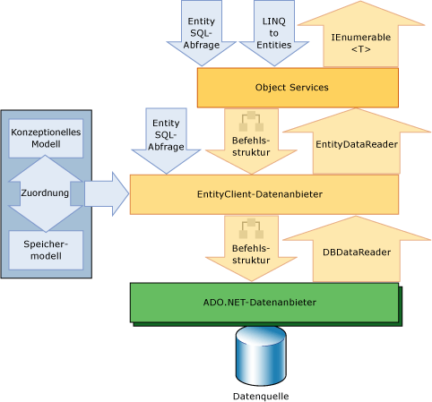

# Übersicht über Entity FrameworkEntity Framework overview

Der Entity Framework ist eine Reihe von Technologien in ADO.net, die die Entwicklung Daten orientierter Softwareanwendungen unterstützen.The Entity Framework is a set of technologies in ADO.NET that support the development of data-oriented software applications. Architekten und Entwickler datenorientierter Anwendungen mussten zwei sehr verschiedene Ziele erreichen.Architects and developers of data-oriented applications have struggled with the need to achieve two very different objectives. Sie mussten die Entitäten, die Beziehungen und die Logik der zu lösenden Geschäftsprobleme modellieren und mit den zum Speichern und Abrufen von Daten verwendeten Daten-Engines arbeiten.They must model the entities, relationships, and logic of the business problems they are solving, and they must also work with the data engines used to store and retrieve the data. Die Daten können auf mehrere Speichersysteme verteilt sein, die jeweils über eigene Protokolle verfügen. Selbst Anwendungen, die mit nur einem Speichersystem arbeiten, müssen ein ausgewogenes Verhältnis zwischen den Anforderungen des Speichersystems und den Anforderungen beim Schreiben von effizientem und verwaltbarem Anwendungscode finden.The data may span multiple storage systems, each with its own protocols; even applications that work with a single storage system must balance the requirements of the storage system against the requirements of writing efficient and maintainable application code.

Der Entity Framework ermöglicht Entwicklern die Arbeit mit Daten in Form von domänenspezifischen Objekten und Eigenschaften, wie z. b. Kunden und Kundenadressen, ohne sich mit den zugrunde liegenden Datenbanktabellen und-Spalten befassen zu müssen, in denen diese Daten gespeichert sind.The Entity Framework enables developers to work with data in the form of domain-specific objects and properties, such as customers and customer addresses, without having to concern themselves with the underlying database tables and columns where this data is stored. Mit Entity Framework können Entwickler beim Umgang mit Daten auf einer höheren Abstraktionsebene arbeiten und datenorientierte Anwendungen mit weniger Code als in herkömmlichen Anwendungen erstellen und verwalten.With the Entity Framework, developers can work at a higher level of abstraction when they deal with data, and can create and maintain data-oriented applications with less code than in traditional applications. Da der Entity Framework eine Komponente des .NET Framework ist, können Entity Framework Anwendungen auf allen Computern ausgeführt werden, auf denen der .NET Framework ab Version 3,5 SP1 installiert ist.Because the Entity Framework is a component of the .NET Framework, Entity Framework applications can run on any computer on which the .NET Framework starting with version 3.5 SP1 is installed.

## Leben von ModellenGive life to models
 Ein seit langem befolgter und verbreiteter Entwurfsansatz beim Erstellen einer Anwendung oder eines Dienstes besteht darin, die Anwendung oder den Dienst in drei Teile aufzuspalten: in ein Domänenmodell, ein logisches Modell und ein physisches Modell.A longstanding and common design approach when building an application or service is the division of the application or service into three parts: a domain model, a logical model, and a physical model. Das Domänenmodell definiert die Entitäten und Beziehungen in dem zu modellierenden System.The domain model defines the entities and relationships in the system that is being modeled. Das logische Modell für eine relationale Datenbank normalisiert die Entitäten und Beziehungen in Tabellen mit Fremdschlüsseleinschränkungen.The logical model for a relational database normalizes the entities and relationships into tables with foreign key constraints. Das physische Modell bezieht sich auf die Funktionen einer bestimmten Daten-Engine und gibt die Speicherdetails, wie z.B. Partitionierung und Indizierung, an.The physical model addresses the capabilities of a particular data engine by specifying storage details such as partitioning and indexing.

 Das physische Modell wird zur Steigerung der Leistung von Datenbankadministratoren verfeinert, während sich Programmierer, die Anwendungscode schreiben, in erster Linie auf die Arbeit mit dem logischen Modell beschränken, indem sie SQL-Abfragen schreiben und gespeicherte Prozeduren aufrufen.The physical model is refined by database administrators to improve performance, but programmers writing application code primarily confine themselves to working with the logical model by writing SQL queries and calling stored procedures. Domänenmodelle werden im Allgemeinen als Werkzeuge zum Erfassen und Kommunizieren der Anwendungsanforderungen, häufig als statische Diagramme, verwendet, die in einer frühen Projektphase betrachtet und diskutiert und dann abgelegt werden.Domain models are generally used as a tool for capturing and communicating the requirements of an application, frequently as inert diagrams that are viewed and discussed in the early stages of a project and then abandoned. Viele Entwicklungsteams lassen das Erstellen eines konzeptionellen Modells aus und beginnen, indem sie Tabellen, Spalten und Schlüssel in einer relationalen Datenbank festlegen.Many development teams skip creating a conceptual model and begin by specifying tables, columns, and keys in a relational database.

 Der Entity Framework bietet Modelle, indem er es Entwicklern ermöglicht, Entitäten und Beziehungen im Domänen Modell abzufragen (als *konzeptionelles* Modell im Entity Framework bezeichnet), während er sich auf den Entity Framework verlässt, um diese Vorgänge in Datenquellen – spezifische Befehle zu übersetzen.The Entity Framework gives life to models by enabling developers to query entities and relationships in the domain model (called a *conceptual* model in the Entity Framework) while relying on the Entity Framework to translate those operations to data source–specific commands. Dadurch werden Anwendungen von hartcodierten Abhängigkeiten einer bestimmten Datenquelle befreit.This frees applications from hard-coded dependencies on a particular data source.

 Bei Verwendung von Code First wird das konzeptionelle Modell dem Speichermodell im Code zugeordnet.When working with Code First, the conceptual model is mapped to the storage model in code. Der Entity Framework kann das konzeptionelle Modell basierend auf den von Ihnen definierten Objekttypen und zusätzlichen Konfigurationen ableiten.The Entity Framework can infer the conceptual model based on the object types and additional configurations that you define. Die Zuordnungsmetadaten werden während der Laufzeit generiert und basieren auf einer Kombination daraus, wie Sie die Domänentypen definiert haben, sowie auf zusätzlichen Konfigurationsinformationen, die Sie im Code bereitstellen.The mapping metadata is generated during run time based on a combination of how you defined your domain types and additional configuration information that you provide in code. Entity Framework generiert die Datenbank basierend auf den Metadaten nach Bedarf.Entity Framework generates the database as needed based on the metadata. Weitere Informationen finden Sie unter [Erstellen eines Modells](/ef/ef6/modeling/).For more information, see [Creating a Model](/ef/ef6/modeling/).

 Bei der Arbeit mit den Entity Data Model-Tools werden das konzeptionelle Modell, das Speichermodell und die Zuordnungen zwischen beiden in XML-basierten Schemas ausgedrückt und in Dateien mit entsprechenden Namenserweiterungen definiert:When working with the Entity Data Model Tools, the conceptual model, the storage model, and the mappings between the two are expressed in XML-based schemas and defined in files that have corresponding name extensions:

- Die konzeptionelle Schemadefinitionssprache (Conceptual Schema Definition Language, CSDL) definiert das konzeptionelle Modell.Conceptual schema definition language (CSDL) defines the conceptual model. CSDL ist die Implementierung des [Entity Data Model](../entity-data-model.md)der Entity Framework.CSDL is the Entity Framework's implementation of the [Entity Data Model](../entity-data-model.md). Die Dateierweiterung ist CSDL.The file extension is .csdl.

- Die Datenspeicherschema-Definitionssprache (Store Schema Definition Language, SSDL) definiert das Speichermodell, das auch als logisches Modell bezeichnet wird.Store schema definition language (SSDL) defines the storage model, which is also called the logical model. Die Dateierweiterung ist SSDL.The file extension is .ssdl.

- Die Mapping-Spezifikationssprache (Mapping Specification Language, MSL) definiert die Zuordnungen zwischen Speichermodell und konzeptionellem Modell.Mapping specification language (MSL) defines the mappings between the storage and conceptual models. Die Dateierweiterung ist MSL.The file extension is .msl.

Das Speichermodell und die Zuordnungen können sich bei Bedarf ändern, ohne dass Änderungen am konzeptionellen Modell, den Datenklassen oder dem Anwendungscode erforderlich werden.The storage model and mappings can change as needed without requiring changes to the conceptual model, data classes, or application code. Da Speichermodelle anbieterspezifisch sind, können Sie mit einem konsistenten konzeptionellen Modell bei verschiedenen Datenquellen arbeiten.Because storage models are provider-specific, you can work with a consistent conceptual model across various data sources.

Der Entity Framework verwendet diese Modell-und Zuordnungsdateien zum Erstellen, lesen, aktualisieren und Löschen von Vorgängen für Entitäten und Beziehungen im konzeptionellen Modell zu äquivalenten Vorgängen in der Datenquelle.The Entity Framework uses these model and mapping files to create, read, update, and delete operations against entities and relationships in the conceptual model to equivalent operations in the data source. Der Entity Framework unterstützt sogar das Mapping von Entitäten im konzeptionellen Modell zu gespeicherten Prozeduren in der Datenquelle.The Entity Framework even supports mapping entities in the conceptual model to stored procedures in the data source. Weitere Informationen finden Sie unter [CSDL-, SSDL-und MSL-Spezifikationen](/ef/ef6/modeling/designer/advanced/edmx/csdl-spec).For more information, see [CSDL, SSDL, and MSL Specifications](/ef/ef6/modeling/designer/advanced/edmx/csdl-spec).

## Zuordnen von Objekten zu DatenMap objects to data
 Die objektorientierte Programmierung stellt eine Herausforderung für die Interaktion mit Datenspeichersystemen dar.Object-oriented programming poses a challenge for interacting with data storage systems. Obwohl die Organisation der Klassen häufig den Aufbau relationaler Datenbanktabellen sehr genau widerspiegelt, passen diese Strukturen nicht perfekt zusammen.Although the organization of classes frequently mirrors the organization of relational database tables, the fit is not perfect. Häufig entsprechen mehrere normalisierte Tabellen einer einzigen Klasse, und Beziehungen zwischen Klassen werden oft anders dargestellt als Beziehungen zwischen Tabellen.Multiple normalized tables frequently correspond to a single class, and relationships between classes are often represented differently than relationships between tables are represented. Um beispielsweise den Kunden für einen Auftrag darzustellen, verwendet die `Order`-Klasse möglicherweise eine Eigenschaft, die einen Verweis auf eine Instanz einer `Customer`-Klasse enthält, während eine Zeile in der `Order`-Tabelle in einer Datenbank jedoch eine Fremdschlüsselspalte (oder mehrere Spalten als Fremdschlüssel) mit einem Wert enthält, der einem Primärschlüsselwert in der `Customer`-Tabelle entspricht.For example, to represent the customer for a sales order, an `Order` class might use a property that contains a reference to an instance of a `Customer` class, while an `Order` table row in a database contains a foreign key column (or set of columns) with a value that corresponds to a primary key value in the `Customer` table. Eine `Customer`-Klasse kann über eine Eigenschaft mit dem Namen `Orders` verfügen, die eine Auflistung von Instanzen der `Order`-Klasse enthält, während die `Customer`-Tabelle in einer Datenbank nicht über eine vergleichbare Spalte verfügt.A `Customer` class might have a property named `Orders` that contains a collection of instances of the `Order` class, while the `Customer` table in a database has no comparable column. Der Entity Framework bietet Entwicklern die Flexibilität, Beziehungen auf diese Weise darzustellen, oder um Beziehungen genauer zu modellieren, wie Sie in der Datenbank dargestellt werden.The Entity Framework provides developers with the flexibility to represent relationships in this way, or to more closely model relationships as they are represented in the database.

 Vorhandene Lösungen haben versucht, diese Lücke, oft als "Impedance Mismatch" bezeichnet, zu füllen, indem nur objektorientierte Klassen und Eigenschaften relationalen Tabellen und Spalten zugeordnet wurden.Existing solutions have tried to bridge this gap, which is frequently called an "impedance mismatch", by only mapping object-oriented classes and properties to relational tables and columns. Anstatt diesen herkömmlichen Ansatz zu verwenden, ordnet die Entity Framework relationale Tabellen, Spalten und Fremdschlüssel Einschränkungen in logischen Modellen Entitäten und Beziehungen in konzeptionellen Modellen zu.Instead of taking this traditional approach, the Entity Framework maps relational tables, columns, and foreign key constraints in logical models to entities and relationships in conceptual models. Dadurch wird sowohl die Definition von Objekten als auch die Optimierung des logischen Modells viel flexibler.This enables greater flexibility both in defining objects and optimizing the logical model. Die Entity Data Model-Tools generieren erweiterbare Daten Klassen, die auf dem konzeptionellen Modell basieren.The Entity Data Model tools generate extensible data classes based on the conceptual model. Diese Klassen sind partielle Klassen, die mit zusätzlichen, vom Entwickler hinzuzufügenden Membern erweitert werden können.These classes are partial classes that can be extended with additional members that the developer adds. Die für ein bestimmtes konzeptionelles Modell erzeugten Klassen werden standardmäßig von Basisklassen abgeleitet, die Dienste zur Umsetzung von Entitäten in Objekte und zum Nachverfolgen und Speichern von Änderungen zur Verfügung stellen.By default, the classes that are generated for a particular conceptual model derive from base classes that provide services for materializing entities as objects and for tracking and saving changes. Entwickler können diese Klassen verwenden, um die Entitäten und Beziehungen als Objekte zu behandeln, die durch Zuordnungen verknüpft sind.Developers can use these classes to work with the entities and relationships as objects related by associations. Entwickler können die für ein konzeptionelles Modell generierten Klassen auch anpassen.Developers can also customize the classes that are generated for a conceptual model. Weitere Informationen finden Sie unter [Arbeiten mit Objekten](working-with-objects.md).For more information, see [Working with Objects](working-with-objects.md).

## Zugreifen auf und Ändern von Entitäts DatenAccess and change entity data

Entity Framework ist mehr als nur eine weitere objektrelationale Mappinglösung. Es dient im Wesentlichen dazu, Anwendungen den Zugriff auf und die Änderung von Daten zu ermöglichen, die als Entitäten und Beziehungen im konzeptionellen Modell dargestellt werden.More than just another object-relational mapping solution, the Entity Framework is fundamentally about enabling applications to access and change data that is represented as entities and relationships in the conceptual model. Der Entity Framework verwendet Informationen in den Modell-und Mapping-Dateien, um Objekt Abfragen für Entitäts Typen, die im konzeptionellen Modell dargestellt werden, in Datenquellen spezifische Abfragen zu übersetzen.The Entity Framework uses information in the model and mapping files to translate object queries against entity types represented in the conceptual model into data source-specific queries. Abfrageergebnisse werden in Objekte materialisiert, die vom Entity Framework verwaltet werden.Query results are materialized into objects that the Entity Framework manages. Die Entity Framework bietet die folgenden Möglichkeiten, um ein konzeptionelles Modell abzufragen und Objekte zurückzugeben:The Entity Framework provides the following ways to query a conceptual model and return objects:

- LINQ to Entities.LINQ to Entities. Bietet Language Integrated Query (LINQ)-Unterstützung zum Abfragen von Entitätstypen, die in einem konzeptionellen Modell definiert sind.Provides Language-Integrated Query (LINQ) support for querying entity types that are defined in a conceptual model. Weitere Informationen finden Sie unter [LINQ to Entities](./language-reference/linq-to-entities.md).For more information, see [LINQ to Entities](./language-reference/linq-to-entities.md).

- [!INCLUDE[esql](../../../../../includes/esql-md.md)].. Ein Speicher unabhängiger Dialekt von SQL, der direkt mit Entitäten im konzeptionellen Modell arbeitet und Entity Data Model Konzepte unterstützt.A storage-independent dialect of SQL that works directly with entities in the conceptual model and that supports Entity Data Model concepts. [!INCLUDE[esql](../../../../../includes/esql-md.md)] wird sowohl für Objekt Abfragen als auch für Abfragen verwendet, die mit dem EntityClient-Anbieter ausgeführt werden.is used both with object queries and queries that are executed by using the EntityClient provider. Weitere Informationen finden Sie unter [Entity SQL Übersicht](./language-reference/entity-sql-overview.md).For more information, see [Entity SQL Overview](./language-reference/entity-sql-overview.md).

Die Entity Framework enthält den EntityClient-Datenanbieter.The Entity Framework includes the EntityClient data provider. Dieser Anbieter verwaltet Verbindungen, übersetzt Entitäts Abfragen in Datenquellen spezifische Abfragen und gibt einen Daten Leser zurück, den der Entity Framework verwendet, um Entitäts Daten in Objekte zu materialisieren.This provider manages connections, translates entity queries into data source-specific queries, and returns a data reader that the Entity Framework uses to materialize entity data into objects. Wenn die Umsetzung in Objekte nicht erforderlich ist, kann der EntityClient-Anbieter auch wie ein ADO.NET-Standarddatenanbieter verwendet werden, indem er Anwendungen das Ausführen von [!INCLUDE[esql](../../../../../includes/esql-md.md)]-Abfragen und die Verarbeitung des zurückgegebenen schreibgeschützten Datenlesers ermöglicht.When object materialization is not required, the EntityClient provider can also be used like a standard ADO.NET data provider by enabling applications to execute [!INCLUDE[esql](../../../../../includes/esql-md.md)] queries and consume the returned read-only data reader. Weitere Informationen finden Sie unter [EntityClient-Anbieter für das Entity Framework](entityclient-provider-for-the-entity-framework.md).For more information, see [EntityClient Provider for the Entity Framework](entityclient-provider-for-the-entity-framework.md).

Das folgende Diagramm illustriert die Entity Framework-Architektur für den Datenzugriff:The following diagram illustrates the Entity Framework architecture for accessing data:

Die Entity Data Model-Tools können eine von oder abgeleitete Klasse generieren `System.Data.Objects.ObjectContext` `System.Data.Entity.DbContext` , die den Entitätencontainer im konzeptionellen Modell darstellt.The Entity Data Model Tools can generate a class derived from `System.Data.Objects.ObjectContext` or `System.Data.Entity.DbContext` that represents the entity container in the conceptual model. Dieser Objektkontext stellt die Funktionen zum Nachverfolgen von Änderungen und zum Verwalten von Identitäten, Parallelität und Beziehungen bereit.This object context provides the facilities for tracking changes and managing identities, concurrency, and relationships. Diese Klasse macht auch eine `SaveChanges`-Methode verfügbar, die Einfügungen, Aktualisierungen und Löschungen in die Datenquelle schreibt.This class also exposes a `SaveChanges` method that writes inserts, updates, and deletes to the data source. Diese Änderungen werden wie bei Abfragen entweder durch automatisch vom System generierte Befehle oder durch vom Entwickler angegebene gespeicherte Prozeduren vorgenommen.Like queries, these changes are either made by commands automatically generated by the system or by stored procedures that are specified by the developer.

## DatenanbieterData providers

Der `EntityClient` Anbieter erweitert das ADO.NET-Anbieter Modell durch den Zugriff auf Daten in Bezug auf konzeptionelle Entitäten und Beziehungen.The `EntityClient` provider extends the ADO.NET provider model by accessing data in terms of conceptual entities and relationships. Es führt Abfragen aus, die [!INCLUDE[esql](../../../../../includes/esql-md.md)] verwenden.It executes queries that use [!INCLUDE[esql](../../../../../includes/esql-md.md)]. [!INCLUDE[esql](../../../../../includes/esql-md.md)] stellt die zugrunde liegende Abfragesprache bereit, die `EntityClient` ermöglicht, mit der Datenbank zu kommunizieren.provides the underlying query language that enables `EntityClient` to communicate with the database. Weitere Informationen finden Sie unter [EntityClient-Anbieter für das Entity Framework](entityclient-provider-for-the-entity-framework.md).For more information, see [EntityClient Provider for the Entity Framework](entityclient-provider-for-the-entity-framework.md).

Die Entity Framework enthält einen aktualisierten SqlClient-Datenanbieter, der kanonische Befehlsstrukturen unterstützt.The Entity Framework includes an updated SqlClient Data Provider that supports canonical command trees. Weitere Informationen finden Sie unter [SqlClient für die Entity Framework](sqlclient-for-the-entity-framework.md).For more information, see [SqlClient for the Entity Framework](sqlclient-for-the-entity-framework.md).

## Entity Data Model-ToolsEntity data model tools

In Verbindung mit der Entity Framework-Laufzeit enthält Visual Studio die Tools für die Zuordnung und Modellierung.Together with the Entity Framework runtime, Visual Studio includes the mapping and modeling tools. Weitere Informationen finden Sie unter [Modellierung und Zuordnung](modeling-and-mapping.md).For more information, see [Modeling and Mapping](modeling-and-mapping.md).

## Erfahren Sie mehrLearn more

Weitere Informationen zum Entity Framework finden Sie unter:To learn more about the Entity Framework, see:

Erste Schritte: enthält Informationen zum [schnellen Einstieg in](getting-started.md) die schnell [Start](/previous-versions/dotnet/netframework-4.0/bb399182(v=vs.100))Anleitung, die zeigt, wie Sie eine einfache Entity Framework Anwendung erstellen.[Getting Started](getting-started.md) - Provides information about how to get up and running quickly using the [Quickstart](/previous-versions/dotnet/netframework-4.0/bb399182(v=vs.100)), which shows how to create a simple Entity Framework application.

[Entity Framework Terminologie](terminology.md) : definiert viele der Begriffe, die durch die Entity Data Model und die Entity Framework eingeführt werden und die in Entity Framework Dokumentation verwendet werden.[Entity Framework Terminology](terminology.md) - Defines many of the terms that are introduced by the Entity Data Model and the Entity Framework and that are used in Entity Framework documentation.

[Entity Framework Ressourcen](resources.md) : enthält Links zu konzeptionellen Themen und Links zu externen Themen und Ressourcen zum Entwickeln von Entity Framework Anwendungen.[Entity Framework Resources](resources.md) - Provides links to conceptual topics and links to external topics and resources for building Entity Framework applications.

## Siehe auchSee also

- [ADO.NET Entity FrameworkADO.NET Entity Framework](index.md)
