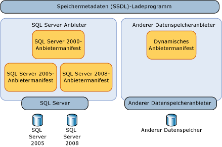
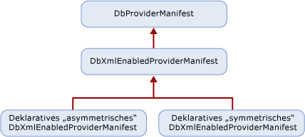

# <a name="provider-manifest-specification"></a><span data-ttu-id="ec673-102">Anbietermanifestspezifikation</span><span class="sxs-lookup"><span data-stu-id="ec673-102">Provider Manifest Specification</span></span>
<span data-ttu-id="ec673-103">In diesem Abschnitt wird erläutert, wie ein Datenspeicheranbieter die Typen und Funktionen im Datenspeicher unterstützen kann.</span><span class="sxs-lookup"><span data-stu-id="ec673-103">This section discusses how a data store provider can support the types and functions in the data store.</span></span>  
  
 <span data-ttu-id="ec673-104">Entitätsdienste werden unabhängig von einem bestimmten Datenspeicheranbieter ausgeführt. Datenanbieter können jedoch explizit definieren, wie Modelle, Zuordnungen und Abfragen mit einem zugrunde liegenden Datenspeicher interagieren.</span><span class="sxs-lookup"><span data-stu-id="ec673-104">Entity Services operates independently of a specific data store provider yet still allows a data provider to explicitly define how models, mappings, and queries interact with an underlying data store.</span></span> <span data-ttu-id="ec673-105">Ohne eine Abstraktionsebene zielen Entitätsdienste lediglich auf einen bestimmten Datenspeicher oder einen Datenanbieter ab.</span><span class="sxs-lookup"><span data-stu-id="ec673-105">Without a layer of abstraction, Entity Services could only be targeted at a specific data store or data provider.</span></span>  
  
 <span data-ttu-id="ec673-106">Vom Anbieter unterstützte Typen werden direkt oder indirekt von der zugrunde liegende Datenbank unterstützt.</span><span class="sxs-lookup"><span data-stu-id="ec673-106">Types that the provider supports are directly or indirectly supported by the underlying database.</span></span> <span data-ttu-id="ec673-107">Bei diesen Typen handelt es sich nicht unbedingt um die genauen Speichertypen, sondern um die Typen, die der Anbieter zur Unterstützung der Entity Framework verwendet.</span><span class="sxs-lookup"><span data-stu-id="ec673-107">These types are not necessarily the exact store types, but the types the provider uses to support the Entity Framework.</span></span> <span data-ttu-id="ec673-108">Anbieter-/Speichertypen werden mit den EDM (Entity Data Model)-Begriffen beschrieben.</span><span class="sxs-lookup"><span data-stu-id="ec673-108">Provider/store types are described in the Entity Data Model (EDM) terms.</span></span>  
  
 <span data-ttu-id="ec673-109">Die Parameter und Rückgabetypen für die vom Datenspeicher unterstützten Funktionen werden in EDM-Begriffen angegeben.</span><span class="sxs-lookup"><span data-stu-id="ec673-109">Parameter and return types for the functions supported by the data store are specified in EDM terms.</span></span>  
  
## <a name="requirements"></a><span data-ttu-id="ec673-110">Anforderungen</span><span class="sxs-lookup"><span data-stu-id="ec673-110">Requirements</span></span>  
 <span data-ttu-id="ec673-111">Der Entity Framework und der Datenspeicher müssen in der Lage sein, Daten in bekannten Typen ohne Datenverlust oder-abschneiden zu übergeben.</span><span class="sxs-lookup"><span data-stu-id="ec673-111">The Entity Framework and the data store need to be able to pass data back and forth in known types without any data loss or truncation.</span></span>  
  
 <span data-ttu-id="ec673-112">Das Anbietermanifest muss zur Entwurfszeit von Tools geladen werden können, ohne eine Verbindung mit dem Datenspeicher öffnen zu müssen.</span><span class="sxs-lookup"><span data-stu-id="ec673-112">The provider manifest must be loadable by tools at design time without having to open a connection to the data store.</span></span>  
  
 <span data-ttu-id="ec673-113">Beim Entity Framework wird die Groß-/Kleinschreibung beachtet, der zugrunde liegende Datenspeicher ist jedoch möglicherweise nicht.</span><span class="sxs-lookup"><span data-stu-id="ec673-113">The Entity Framework is case sensitive, but the underlying data store may not be.</span></span> <span data-ttu-id="ec673-114">Wenn EDM-Artefakte (z. b. Bezeichner und Typnamen) definiert und im Manifest verwendet werden, müssen Sie die Entity Framework Berücksichtigung der Groß-/Kleinschreibung verwenden.</span><span class="sxs-lookup"><span data-stu-id="ec673-114">When EDM artifacts (identifiers and type names, for example) are defined and used in the manifest, they must use the Entity Framework case sensitivity.</span></span> <span data-ttu-id="ec673-115">Wenn das Anbietermanifest Datenspeicherelemente enthält, bei denen die Groß-/Kleinschreibung beachtet werden muss, muss diese im Anbietermanifest beibehalten werden.</span><span class="sxs-lookup"><span data-stu-id="ec673-115">If data store elements that may be case sensitive appear in the provider manifest, that casing needs to be maintained in the provider manifest.</span></span>  
  
 <span data-ttu-id="ec673-116">Für den Entity Framework ist ein Anbieter Manifest für alle Datenanbieter erforderlich.</span><span class="sxs-lookup"><span data-stu-id="ec673-116">The Entity Framework requires a provider manifest for all data providers.</span></span> <span data-ttu-id="ec673-117">Wenn Sie versuchen, einen Anbieter zu verwenden, der nicht über ein Anbieter Manifest mit dem Entity Framework verfügt, wird eine Fehlermeldung angezeigt.</span><span class="sxs-lookup"><span data-stu-id="ec673-117">If you try to use a provider that does not have a provider manifest with the Entity Framework, you will get an error.</span></span>  
  
 <span data-ttu-id="ec673-118">In der folgenden Tabelle werden die Arten von Ausnahmen beschrieben, die von der Entity Framework ausgelöst werden, wenn Ausnahmen durch die Anbieter Interaktion auftreten:</span><span class="sxs-lookup"><span data-stu-id="ec673-118">The following table describes the kinds of exceptions the Entity Framework would throw when exceptions arise through provider interaction:</span></span>  
  
|<span data-ttu-id="ec673-119">Problem</span><span class="sxs-lookup"><span data-stu-id="ec673-119">Issue</span></span>|<span data-ttu-id="ec673-120">-Ausnahme</span><span class="sxs-lookup"><span data-stu-id="ec673-120">Exception</span></span>|  
|-----------|---------------|  
|<span data-ttu-id="ec673-121">Der Anbieter unterstützt GetProviderManifest in DbProviderServices nicht.</span><span class="sxs-lookup"><span data-stu-id="ec673-121">The Provider does not support GetProviderManifest in DbProviderServices.</span></span>|<span data-ttu-id="ec673-122">ProviderIncompatibleException</span><span class="sxs-lookup"><span data-stu-id="ec673-122">ProviderIncompatibleException</span></span>|  
|<span data-ttu-id="ec673-123">Fehlendes Anbietermanifest: Beim Versuch, das Anbietermanifest abzurufen, gibt der Anbieter `null` zurück.</span><span class="sxs-lookup"><span data-stu-id="ec673-123">Missing provider manifest: the provider returns `null` when attempting to retrieve the provider manifest.</span></span>|<span data-ttu-id="ec673-124">ProviderIncompatibleException</span><span class="sxs-lookup"><span data-stu-id="ec673-124">ProviderIncompatibleException</span></span>|  
|<span data-ttu-id="ec673-125">Ungültiges Anbietermanifest: Beim Versuch, das Anbietermanifest abzurufen, gibt der Anbieter ungültiges XML zurück.</span><span class="sxs-lookup"><span data-stu-id="ec673-125">Invalid provider manifest: the provider returns invalid XML when attempting to retrieve the provider manifest.</span></span>|<span data-ttu-id="ec673-126">ProviderIncompatibleException</span><span class="sxs-lookup"><span data-stu-id="ec673-126">ProviderIncompatibleException</span></span>|  
  
## <a name="scenarios"></a><span data-ttu-id="ec673-127">Szenarien</span><span class="sxs-lookup"><span data-stu-id="ec673-127">Scenarios</span></span>  
 <span data-ttu-id="ec673-128">Ein Anbieter sollte die folgenden Szenarien unterstützen:</span><span class="sxs-lookup"><span data-stu-id="ec673-128">A provider should support the following scenarios:</span></span>  
  
### <a name="writing-a-provider-with-symmetric-type-mapping"></a><span data-ttu-id="ec673-129">Schreiben eines Anbieters mit symmetrischer Typzuordnung</span><span class="sxs-lookup"><span data-stu-id="ec673-129">Writing a Provider with Symmetric Type Mapping</span></span>  
 <span data-ttu-id="ec673-130">Sie können einen Anbieter für den Entity Framework schreiben, wobei jeder Speichertyp unabhängig von der Zuordnungs Richtung einem einzelnen EDM-Typ zugeordnet wird.</span><span class="sxs-lookup"><span data-stu-id="ec673-130">You can write a provider for the Entity Framework where each store type maps to a single EDM type, regardless of the mapping direction.</span></span> <span data-ttu-id="ec673-131">Bei Anbietertypen mit einer sehr einfachen Zuordnung, die EDM-Typen entsprechen, können Sie eine symmetrische Lösung verwenden, da das Typsystem einfach ist oder den EDM-Typen entspricht.</span><span class="sxs-lookup"><span data-stu-id="ec673-131">For a provider type that has very simple mapping that corresponds with an EDM type, you can use a symmetric solution because the type system is simple or matches EDM types.</span></span>  
  
 <span data-ttu-id="ec673-132">Sie können die Einfachheit der Domäne nutzen und ein statisches deklaratives Anbietermanifest erstellen.</span><span class="sxs-lookup"><span data-stu-id="ec673-132">You can use the simplicity of their domain and produce a static declarative provider manifest.</span></span>  
  
 <span data-ttu-id="ec673-133">Sie schreiben eine XML-Datei mit zwei Abschnitten:</span><span class="sxs-lookup"><span data-stu-id="ec673-133">You write an XML file that has two sections:</span></span>  
  
- <span data-ttu-id="ec673-134">Eine Liste der hinsichtlich des "EDM-Äquivalents" eines Speichertyps oder einer Funktion ausgedrückten Anbietertypen.</span><span class="sxs-lookup"><span data-stu-id="ec673-134">A list of provider types expressed in terms of the "EDM counterpart" of a store type or function.</span></span> <span data-ttu-id="ec673-135">Speichertypen verfügen über äquivalente EDM-Typen.</span><span class="sxs-lookup"><span data-stu-id="ec673-135">Store types have counterpart EDM types.</span></span> <span data-ttu-id="ec673-136">Speicherfunktionen verfügen über entsprechende EDM-Funktionen.</span><span class="sxs-lookup"><span data-stu-id="ec673-136">Store functions have corresponding EDM functions.</span></span> <span data-ttu-id="ec673-137">So ist "varchar" z. B. ein SQL Server-Typ, der entsprechende EDM-Typ ist jedoch "string".</span><span class="sxs-lookup"><span data-stu-id="ec673-137">For example, varchar is a SQL Server type but the corresponding EDM type is string.</span></span>  
  
- <span data-ttu-id="ec673-138">Eine Liste der vom Anbieter unterstützen Funktionen, wobei die Parameter und Rückgabetypen mit EDM-Begriffen ausgedrückt werden.</span><span class="sxs-lookup"><span data-stu-id="ec673-138">A list of functions supported by the provider where parameter and return types are expressed in EDM terms.</span></span>  
  
### <a name="writing-a-provider-with-asymmetric-type-mapping"></a><span data-ttu-id="ec673-139">Schreiben eines Anbieters mit asymmetrischer Typzuordnung</span><span class="sxs-lookup"><span data-stu-id="ec673-139">Writing a Provider with Asymmetric Type Mapping</span></span>  
 <span data-ttu-id="ec673-140">Wenn Sie einen Datenspeicher Anbieter für den Entity Framework schreiben, unterscheidet sich die EDM-zu-Anbieter-Typzuordnung für einige Typen möglicherweise von der Zuordnung des Anbieters zu EDM-Typen.</span><span class="sxs-lookup"><span data-stu-id="ec673-140">When writing a data store provider for the Entity Framework, the EDM-to-provider type mapping for some types may be different from provider-to-EDM type mapping.</span></span> <span data-ttu-id="ec673-141">So wird beispielsweise "unbounded EDM PrimitiveTypeKind.String" möglicherweise "nvarchar (4000)" für den Anbieter zugeordnet, während "nvarchar (4000)" dem Typ "EDM PrimitiveTypeKind.String(MaxLength=4000)" zugeordnet wird.</span><span class="sxs-lookup"><span data-stu-id="ec673-141">For instance, unbounded EDM PrimitiveTypeKind.String may map to nvarchar(4000) on the provider, while nvarchar(4000) maps to the EDM PrimitiveTypeKind.String(MaxLength=4000).</span></span>  
  
 <span data-ttu-id="ec673-142">Sie schreiben eine XML-Datei mit zwei Abschnitten:</span><span class="sxs-lookup"><span data-stu-id="ec673-142">You write an XML file that has two sections:</span></span>  
  
- <span data-ttu-id="ec673-143">Eine Liste von Anbietertypen in EDM-Begriffen sowie eine Definition der Zuordnung in beide Richtungen: EDM-Anbieter und Anbieter-EDM.</span><span class="sxs-lookup"><span data-stu-id="ec673-143">A list of provider types expressed in EDM terms and define mapping for both direction: EDM-to-provider and provider-to-EDM.</span></span>  
  
- <span data-ttu-id="ec673-144">Eine Liste der vom Anbieter unterstützen Funktionen, wobei die Parameter und Rückgabetypen mit EDM-Begriffen ausgedrückt werden.</span><span class="sxs-lookup"><span data-stu-id="ec673-144">A list of functions supported by the provider where parameter and return types are expressed in EDM terms.</span></span>  
  
## <a name="provider-manifest-discoverability"></a><span data-ttu-id="ec673-145">Ermittelbarkeit des Anbietermanifests</span><span class="sxs-lookup"><span data-stu-id="ec673-145">Provider Manifest Discoverability</span></span>  
 <span data-ttu-id="ec673-146">Das Manifest wird indirekt von mehreren Komponententypen der Entitätsdienste (z. B. Tools oder Abfrage) verwendet. Die direktere Nutzung erfolgt jedoch für die Metadaten mithilfe des Metadaten-Ladeprogramms des Datenspeichers.</span><span class="sxs-lookup"><span data-stu-id="ec673-146">The manifest is used indirectly by several component types in Entity Services (for example Tools or Query) but more directly leveraged by metadata through the use of the data store metadata loader.</span></span>  
  
 <span data-ttu-id="ec673-147"></span><span class="sxs-lookup"><span data-stu-id="ec673-147"></span></span>  
  
 <span data-ttu-id="ec673-148">Anbieter können jedoch unterschiedliche Speicher oder unterschiedliche Versionen des gleichen Speichers unterstützen.</span><span class="sxs-lookup"><span data-stu-id="ec673-148">However, a given provider may support different stores or different versions of the same store.</span></span> <span data-ttu-id="ec673-149">Daher muss ein Anbieter für jeden unterstützten Datenspeicher ein anderes Manifest melden.</span><span class="sxs-lookup"><span data-stu-id="ec673-149">Therefore, a provider must report a different manifest for each supported data store.</span></span>  
  
### <a name="provider-manifest-token"></a><span data-ttu-id="ec673-150">Anbietermanifesttoken</span><span class="sxs-lookup"><span data-stu-id="ec673-150">Provider Manifest Token</span></span>  
 <span data-ttu-id="ec673-151">Beim Öffnen einer Datenspeicherverbindung kann der Anbieter Informationen abfragen, um das richtige Manifest zurückzugeben.</span><span class="sxs-lookup"><span data-stu-id="ec673-151">When a data store connection is opened, the provider can query for information to return the right manifest.</span></span> <span data-ttu-id="ec673-152">Dies kann in Offlineszenarien unmöglich sein, in denen entweder die Verbindungsinformationen nicht zur Verfügung stehen oder keine Verbindung mit dem Datenspeicher hergestellt werden kann.</span><span class="sxs-lookup"><span data-stu-id="ec673-152">This may not be possible in offline scenarios where connection information is not available or when it is not possible to connect to the store.</span></span> <span data-ttu-id="ec673-153">Identifizieren Sie das Manifest mit dem `ProviderManifestToken`-Attribut des `Schema`-Elements in der SSDL-Datei.</span><span class="sxs-lookup"><span data-stu-id="ec673-153">Identify the manifest by using the `ProviderManifestToken` attribute of the `Schema` element in the .ssdl file.</span></span> <span data-ttu-id="ec673-154">Es gibt kein erforderliches Format für dieses Attribut. Der Anbieter wählt die Mindestinformationen aus, die erforderlich sind, um ein Manifest zu identifizieren, ohne eine Verbindung mit dem Speicher zu öffnen.</span><span class="sxs-lookup"><span data-stu-id="ec673-154">There is no required format for this attribute; the provider chooses the minimum information needed to identify a manifest without opening a connection to the store.</span></span>  
  
 <span data-ttu-id="ec673-155">Beispiel:</span><span class="sxs-lookup"><span data-stu-id="ec673-155">For example:</span></span>  
  
```xml  
<Schema Namespace="Northwind" Provider="System.Data.SqlClient" ProviderManifestToken="2005" xmlns:edm="http://schemas.microsoft.com/ado/2006/04/edm/ssdl" xmlns="http://schemas.microsoft.com/ado/2006/04/edm/ssdl">  
```  
  
## <a name="provider-manifest-programming-model"></a><span data-ttu-id="ec673-156">Programmiermodell für das Anbietermanifest</span><span class="sxs-lookup"><span data-stu-id="ec673-156">Provider Manifest Programming Model</span></span>  
 <span data-ttu-id="ec673-157">Anbieter werden von <xref:System.Data.Common.DbXmlEnabledProviderManifest> abgeleitet, sodass die Manifeste deklarativ angegeben werden können.</span><span class="sxs-lookup"><span data-stu-id="ec673-157">Providers derive from <xref:System.Data.Common.DbXmlEnabledProviderManifest>, which allows them to specify their manifests declaratively.</span></span> <span data-ttu-id="ec673-158">In der folgenden Abbildung wird die Klassenhierarchie eines Anbieters dargestellt:</span><span class="sxs-lookup"><span data-stu-id="ec673-158">The following illustration shows the class hierarchy of a provider:</span></span>  
  
 <span data-ttu-id="ec673-159"></span><span class="sxs-lookup"><span data-stu-id="ec673-159"></span></span>  
  
### <a name="discoverability-api"></a><span data-ttu-id="ec673-160">Ermittelbarkeits-API</span><span class="sxs-lookup"><span data-stu-id="ec673-160">Discoverability API</span></span>  
 <span data-ttu-id="ec673-161">Das Anbietermanifest wird vom Speichermetadaten-Ladeprogramm (StoreItemCollection) entweder über eine Datenspeicherverbindung oder mit einem Anbietermanifesttoken geladen.</span><span class="sxs-lookup"><span data-stu-id="ec673-161">The provider manifest is loaded by the Store Metadata loader (StoreItemCollection), either by using a data store connection or a provider manifest token.</span></span>  
  
#### <a name="using-a-data-store-connection"></a><span data-ttu-id="ec673-162">Verwenden einer Datenspeicherverbindung</span><span class="sxs-lookup"><span data-stu-id="ec673-162">Using a Data Store Connection</span></span>  
 <span data-ttu-id="ec673-163">Wenn die Datenspeicher Verbindung verfügbar ist, wird <xref:System.Data.Common.DbProviderServices.GetProviderManifestToken%2A?displayProperty=nameWithType> aufgerufen, um das an die <xref:System.Data.Common.DbProviderServices.GetProviderManifest%2A>-Methode übergebenen Token zurückzugeben, das <xref:System.Data.Common.DbProviderManifest>zurückgibt.</span><span class="sxs-lookup"><span data-stu-id="ec673-163">When the data store connection is available, call <xref:System.Data.Common.DbProviderServices.GetProviderManifestToken%2A?displayProperty=nameWithType> to return the token that is passed to the <xref:System.Data.Common.DbProviderServices.GetProviderManifest%2A> method, which returns <xref:System.Data.Common.DbProviderManifest>.</span></span> <span data-ttu-id="ec673-164">Diese Methode delegiert an die Implementierung von `GetDbProviderManifestToken`des Anbieters.</span><span class="sxs-lookup"><span data-stu-id="ec673-164">This method delegates to the provider's implementation of `GetDbProviderManifestToken`.</span></span>  
  
```csharp
public string GetProviderManifestToken(DbConnection connection);  
public DbProviderManifest GetProviderManifest(string manifestToken);  
```  
  
#### <a name="using-a-provider-manifest-token"></a><span data-ttu-id="ec673-165">Verwenden eines Anbietermanifesttokens</span><span class="sxs-lookup"><span data-stu-id="ec673-165">Using a Provider Manifest Token</span></span>  
 <span data-ttu-id="ec673-166">Für das Offlineszenario wird das Token der SSDL-Darstellung ausgewählt.</span><span class="sxs-lookup"><span data-stu-id="ec673-166">For the offline scenario, the token is picked from SSDL representation.</span></span> <span data-ttu-id="ec673-167">Die SSDL ermöglicht Ihnen das Angeben eines ProviderManifestToken (Weitere Informationen finden Sie unter [Schema-Element (SSDL)](/ef/ef6/modeling/designer/advanced/edmx/ssdl-spec#schema-element-ssdl) ).</span><span class="sxs-lookup"><span data-stu-id="ec673-167">The SSDL allows you to specify a ProviderManifestToken (see [Schema Element (SSDL)](/ef/ef6/modeling/designer/advanced/edmx/ssdl-spec#schema-element-ssdl) for more information).</span></span> <span data-ttu-id="ec673-168">Wenn beispielsweise eine Verbindung nicht geöffnet werden kann, verfügt SSDL über ein Anbietermanifesttoken, das Informationen über das Manifest angibt.</span><span class="sxs-lookup"><span data-stu-id="ec673-168">For example, if a connection cannot be opened, the SSDL has a provider manifest token that specifies information about the manifest.</span></span>  
  
```csharp
public DbProviderManifest GetProviderManifest(string manifestToken);  
```  
  
### <a name="provider-manifest-schema"></a><span data-ttu-id="ec673-169">Anbietermanifestschema</span><span class="sxs-lookup"><span data-stu-id="ec673-169">Provider Manifest Schema</span></span>  
 <span data-ttu-id="ec673-170">Das Schema der für die einzelnen Anbieter definierten Informationen beinhaltet die statischen Informationen, die von Metadaten genutzt werden:</span><span class="sxs-lookup"><span data-stu-id="ec673-170">The schema of information defined for each provider contains the static information to be consumed by metadata:</span></span>  
  
```xml  
<?xml version="1.0" encoding="utf-8"?>  
<xs:schema elementFormDefault="qualified"  
   xmlns:xs="http://www.w3.org/2001/XMLSchema"  
   targetNamespace="http://schemas.microsoft.com/ado/2006/04/edm/providermanifest"  
   xmlns:pm="http://schemas.microsoft.com/ado/2006/04/edm/providermanifest">  
  
  <xs:element name="ProviderManifest">  
    <xs:complexType>  
      <xs:sequence>  
        <xs:element name="Types" type="pm:TTypes" minOccurs="1" maxOccurs="1" />  
        <xs:element name="Functions" type="pm:TFunctions" minOccurs="0" maxOccurs="1"/>  
      </xs:sequence>  
      <xs:attribute name="Namespace" type="xs:string" use="required"/>  
    </xs:complexType>  
  </xs:element>  
  <xs:complexType name="TVersion">  
    <xs:attribute name="Major" type="xs:int" use="required" />  
    <xs:attribute name="Minor" type="xs:int" use="required" />  
    <xs:attribute name="Build" type="xs:int" use="required" />  
    <xs:attribute name="Revision" type="xs:int" use="required" />  
  </xs:complexType>  
  
  <xs:complexType name="TIntegerFacetDescription">  
    <xs:attribute name="Minimum" type="xs:int" use="optional" />  
    <xs:attribute name="Maximum" type="xs:int" use="optional" />  
    <xs:attribute name="DefaultValue" type="xs:int" use="optional" />  
    <xs:attribute name="Constant" type="xs:boolean" default="false" />  
  </xs:complexType>  
  
  <xs:complexType name="TBooleanFacetDescription">  
    <xs:attribute name="DefaultValue" type="xs:boolean" use="optional" />  
    <xs:attribute name="Constant" type="xs:boolean" default="true" />  
  </xs:complexType>  
  
  <xs:complexType name="TDateTimeFacetDescription">  
    <xs:attribute name="Constant" type="xs:boolean" default="false" />  
  </xs:complexType>  
  
  <xs:complexType name="TFacetDescriptions">  
    <xs:choice maxOccurs="unbounded">  
      <xs:element name="Precision" minOccurs="0" maxOccurs="1" type="pm:TIntegerFacetDescription"/>  
      <xs:element name="Scale" minOccurs="0" maxOccurs="1" type="pm:TIntegerFacetDescription"/>  
      <xs:element name="MaxLength" minOccurs="0" maxOccurs="1" type="pm:TIntegerFacetDescription"/>  
      <xs:element name="Unicode" minOccurs="0" maxOccurs="1" type="pm:TBooleanFacetDescription"/>  
      <xs:element name="FixedLength" minOccurs="0" maxOccurs="1" type="pm:TBooleanFacetDescription"/>  
    </xs:choice>  
  </xs:complexType>  
  
  <xs:complexType name="TType">  
    <xs:sequence>  
      <xs:element name="FacetDescriptions" type="pm:TFacetDescriptions" minOccurs="0" maxOccurs="1"/>  
    </xs:sequence>  
    <xs:attribute name="Name" type="xs:string" use="required"/>  
    <xs:attribute name="PrimitiveTypeKind" type="pm:TPrimitiveTypeKind" use="required" />  
  </xs:complexType>  
  
  <xs:complexType name="TTypes">  
    <xs:sequence>  
      <xs:element name="Type" type="pm:TType" minOccurs="0" maxOccurs="unbounded"/>  
    </xs:sequence>  
  </xs:complexType>  
  
  <xs:attributeGroup name="TFacetAttribute">  
    <xs:attribute name="Precision" type="xs:int" use="optional"/>  
    <xs:attribute name="Scale" type="xs:int" use="optional"/>  
    <xs:attribute name="MaxLength" type="xs:int" use="optional"/>  
    <xs:attribute name="Unicode" type="xs:boolean" use="optional"/>  
    <xs:attribute name="FixedLength" type="xs:boolean" use="optional"/>  
  </xs:attributeGroup>  
  
  <xs:complexType name="TFunctionParameter">  
    <xs:attribute name="Name" type="xs:string" use="required" />  
    <xs:attribute name="Type" type="xs:string" use="required" />  
    <xs:attributeGroup ref="pm:TFacetAttribute" />  
    <xs:attribute name="Mode" type="pm:TParameterDirection" use="required" />  
  </xs:complexType>  
  
  <xs:complexType name="TReturnType">  
    <xs:attribute name="Type" type="xs:string" use="required" />  
    <xs:attributeGroup ref="pm:TFacetAttribute" />  
  </xs:complexType>  
  
  <xs:complexType name="TFunction">  
    <xs:choice minOccurs="0" maxOccurs ="unbounded">  
      <xs:element name ="ReturnType" type="pm:TReturnType" minOccurs="0" maxOccurs="1" />  
      <xs:element name="Parameter" type="pm:TFunctionParameter" minOccurs="0" maxOccurs="unbounded"/>  
    </xs:choice>  
    <xs:attribute name="Name" type="xs:string" use="required" />  
    <xs:attribute name="Aggregate" type="xs:boolean" use="optional" />  
    <xs:attribute name="BuiltIn" type="xs:boolean" use="optional" />  
    <xs:attribute name="StoreFunctionName" type="xs:string" use="optional" />  
    <xs:attribute name="NiladicFunction" type="xs:boolean" use="optional" />  
    <xs:attribute name="ParameterTypeSemantics" type="pm:TParameterTypeSemantics" use="optional" default="AllowImplicitConversion" />  
  </xs:complexType>  
  
  <xs:complexType name="TFunctions">  
    <xs:sequence>  
      <xs:element name="Function" type="pm:TFunction" minOccurs="0" maxOccurs="unbounded"/>  
    </xs:sequence>  
  </xs:complexType>  
  
  <xs:simpleType name="TPrimitiveTypeKind">  
    <xs:restriction base="xs:string">  
      <xs:enumeration value="Binary"/>  
      <xs:enumeration value="Boolean"/>  
      <xs:enumeration value="Byte"/>  
      <xs:enumeration value="Decimal"/>  
      <xs:enumeration value="DateTime"/>  
      <xs:enumeration value="Time"/>  
      <xs:enumeration value="DateTimeOffset"/>          
      <xs:enumeration value="Double"/>  
      <xs:enumeration value="Guid"/>  
      <xs:enumeration value="Single"/>  
      <xs:enumeration value="SByte"/>  
      <xs:enumeration value="Int16"/>  
      <xs:enumeration value="Int32"/>  
      <xs:enumeration value="Int64"/>  
      <xs:enumeration value="String"/>  
    </xs:restriction>  
  </xs:simpleType>  
  
  <xs:simpleType name="TParameterDirection">  
    <xs:restriction base="xs:string">  
      <xs:enumeration value="In"/>  
      <xs:enumeration value="Out"/>  
      <xs:enumeration value="InOut"/>  
    </xs:restriction>  
  </xs:simpleType>  
  
  <xs:simpleType name="TParameterTypeSemantics">  
    <xs:restriction base="xs:string">  
      <xs:enumeration value="ExactMatchOnly" />  
      <xs:enumeration value="AllowImplicitPromotion" />  
      <xs:enumeration value="AllowImplicitConversion" />  
    </xs:restriction>  
  </xs:simpleType>  
</xs:schema>  
```  
  
#### <a name="types-node"></a><span data-ttu-id="ec673-171">Typknoten</span><span class="sxs-lookup"><span data-stu-id="ec673-171">Types Node</span></span>  
 <span data-ttu-id="ec673-172">Der Typknoten des Anbietermanifests enthält Informationen über die Typen, die vom Datenspeicher oder Anbieter systemeigen unterstützt werden.</span><span class="sxs-lookup"><span data-stu-id="ec673-172">The Types node in the provider manifest contains information about the Types that are supported natively by the data store or through the provider.</span></span>  
  
##### <a name="type-node"></a><span data-ttu-id="ec673-173">Typknoten</span><span class="sxs-lookup"><span data-stu-id="ec673-173">Type Node</span></span>  
 <span data-ttu-id="ec673-174">Jeder Typknoten definiert einen Anbietertyp mit EDM-Begriffen.</span><span class="sxs-lookup"><span data-stu-id="ec673-174">Each Type node defines a provider type in terms of EDM.</span></span> <span data-ttu-id="ec673-175">Der Typknoten beschreibt den Namen des Anbietertyps, Informationen über den Modelltyp, dem er zugeordnet wird, und die Facets, mit denen die Typzuordnung beschrieben wird.</span><span class="sxs-lookup"><span data-stu-id="ec673-175">The Type node describes the name of the provider type, and information related to the model type it maps to and facets to describe that type mapping.</span></span>  
  
 <span data-ttu-id="ec673-176">Um diese Typinformationen im Anbietermanifest auszudrücken, muss jede TypeInformation-Deklaration mehrere Facetbeschreibungen für die einzelnen Typen definieren:</span><span class="sxs-lookup"><span data-stu-id="ec673-176">In order to express this type information in the provider manifest, each TypeInformation declaration must define several facet descriptions for each Type:</span></span>  
  
|<span data-ttu-id="ec673-177">Attributname</span><span class="sxs-lookup"><span data-stu-id="ec673-177">Attribute Name</span></span>|<span data-ttu-id="ec673-178">Datentyp</span><span class="sxs-lookup"><span data-stu-id="ec673-178">Data Type</span></span>|<span data-ttu-id="ec673-179">Erforderlich</span><span class="sxs-lookup"><span data-stu-id="ec673-179">Required</span></span>|<span data-ttu-id="ec673-180">Standardwert</span><span class="sxs-lookup"><span data-stu-id="ec673-180">Default Value</span></span>|<span data-ttu-id="ec673-181">Beschreibung</span><span class="sxs-lookup"><span data-stu-id="ec673-181">Description</span></span>|  
|--------------------|---------------|--------------|-------------------|-----------------|  
|<span data-ttu-id="ec673-182">-Name</span><span class="sxs-lookup"><span data-stu-id="ec673-182">Name</span></span>|<span data-ttu-id="ec673-183">Zeichenfolge</span><span class="sxs-lookup"><span data-stu-id="ec673-183">String</span></span>|<span data-ttu-id="ec673-184">Ja</span><span class="sxs-lookup"><span data-stu-id="ec673-184">Yes</span></span>|<span data-ttu-id="ec673-185">n/v</span><span class="sxs-lookup"><span data-stu-id="ec673-185">n/a</span></span>|<span data-ttu-id="ec673-186">Anbieterspezifischer Datentypname</span><span class="sxs-lookup"><span data-stu-id="ec673-186">Provider-specific data type name</span></span>|  
|<span data-ttu-id="ec673-187">PrimitiveTypeKind</span><span class="sxs-lookup"><span data-stu-id="ec673-187">PrimitiveTypeKind</span></span>|<span data-ttu-id="ec673-188">PrimitiveTypeKind</span><span class="sxs-lookup"><span data-stu-id="ec673-188">PrimitiveTypeKind</span></span>|<span data-ttu-id="ec673-189">Ja</span><span class="sxs-lookup"><span data-stu-id="ec673-189">Yes</span></span>|<span data-ttu-id="ec673-190">n/v</span><span class="sxs-lookup"><span data-stu-id="ec673-190">n/a</span></span>|<span data-ttu-id="ec673-191">EDM-Typenname</span><span class="sxs-lookup"><span data-stu-id="ec673-191">EDM type name</span></span>|  
  
###### <a name="function-node"></a><span data-ttu-id="ec673-192">Funktionsknoten</span><span class="sxs-lookup"><span data-stu-id="ec673-192">Function Node</span></span>  
 <span data-ttu-id="ec673-193">Jede Funktion definiert eine einzelne, über den Anbieter verfügbare Funktion.</span><span class="sxs-lookup"><span data-stu-id="ec673-193">Each Function defines a single function available through the provider.</span></span>  
  
|<span data-ttu-id="ec673-194">Attributname</span><span class="sxs-lookup"><span data-stu-id="ec673-194">Attribute Name</span></span>|<span data-ttu-id="ec673-195">Datentyp</span><span class="sxs-lookup"><span data-stu-id="ec673-195">Data Type</span></span>|<span data-ttu-id="ec673-196">Erforderlich</span><span class="sxs-lookup"><span data-stu-id="ec673-196">Required</span></span>|<span data-ttu-id="ec673-197">Standardwert</span><span class="sxs-lookup"><span data-stu-id="ec673-197">Default Value</span></span>|<span data-ttu-id="ec673-198">Beschreibung</span><span class="sxs-lookup"><span data-stu-id="ec673-198">Description</span></span>|  
|--------------------|---------------|--------------|-------------------|-----------------|  
|<span data-ttu-id="ec673-199">-Name</span><span class="sxs-lookup"><span data-stu-id="ec673-199">Name</span></span>|<span data-ttu-id="ec673-200">Zeichenfolge</span><span class="sxs-lookup"><span data-stu-id="ec673-200">String</span></span>|<span data-ttu-id="ec673-201">Ja</span><span class="sxs-lookup"><span data-stu-id="ec673-201">Yes</span></span>|<span data-ttu-id="ec673-202">n/v</span><span class="sxs-lookup"><span data-stu-id="ec673-202">n/a</span></span>|<span data-ttu-id="ec673-203">Bezeichner/Name der Funktion</span><span class="sxs-lookup"><span data-stu-id="ec673-203">Identifier/name of the function</span></span>|  
|<span data-ttu-id="ec673-204">ReturnType</span><span class="sxs-lookup"><span data-stu-id="ec673-204">ReturnType</span></span>|<span data-ttu-id="ec673-205">Zeichenfolge</span><span class="sxs-lookup"><span data-stu-id="ec673-205">String</span></span>|<span data-ttu-id="ec673-206">Nein</span><span class="sxs-lookup"><span data-stu-id="ec673-206">No</span></span>|<span data-ttu-id="ec673-207">Void</span><span class="sxs-lookup"><span data-stu-id="ec673-207">Void</span></span>|<span data-ttu-id="ec673-208">Der EDM-Rückgabetyp der Funktion</span><span class="sxs-lookup"><span data-stu-id="ec673-208">The EDM return type of the function</span></span>|  
|<span data-ttu-id="ec673-209">Aggregat</span><span class="sxs-lookup"><span data-stu-id="ec673-209">Aggregate</span></span>|<span data-ttu-id="ec673-210">Boolesch</span><span class="sxs-lookup"><span data-stu-id="ec673-210">Boolean</span></span>|<span data-ttu-id="ec673-211">Nein</span><span class="sxs-lookup"><span data-stu-id="ec673-211">No</span></span>|<span data-ttu-id="ec673-212">False</span><span class="sxs-lookup"><span data-stu-id="ec673-212">False</span></span>|<span data-ttu-id="ec673-213">"True", wenn es sich bei der Funktion um eine Aggregatfunktion handelt.</span><span class="sxs-lookup"><span data-stu-id="ec673-213">True if the function is an aggregate function</span></span>|  
|<span data-ttu-id="ec673-214">BuiltIn</span><span class="sxs-lookup"><span data-stu-id="ec673-214">BuiltIn</span></span>|<span data-ttu-id="ec673-215">Boolesch</span><span class="sxs-lookup"><span data-stu-id="ec673-215">Boolean</span></span>|<span data-ttu-id="ec673-216">Nein</span><span class="sxs-lookup"><span data-stu-id="ec673-216">No</span></span>|<span data-ttu-id="ec673-217">True</span><span class="sxs-lookup"><span data-stu-id="ec673-217">True</span></span>|<span data-ttu-id="ec673-218">"True", wenn die Funktion in den Datenspeicher integriert ist.</span><span class="sxs-lookup"><span data-stu-id="ec673-218">True if the function is built into the data store</span></span>|  
|<span data-ttu-id="ec673-219">StoreFunctionName</span><span class="sxs-lookup"><span data-stu-id="ec673-219">StoreFunctionName</span></span>|<span data-ttu-id="ec673-220">Zeichenfolge</span><span class="sxs-lookup"><span data-stu-id="ec673-220">String</span></span>|<span data-ttu-id="ec673-221">Nein</span><span class="sxs-lookup"><span data-stu-id="ec673-221">No</span></span>|<span data-ttu-id="ec673-222">\<Name ></span><span class="sxs-lookup"><span data-stu-id="ec673-222">\<Name></span></span>|<span data-ttu-id="ec673-223">Funktionsname im Datenspeicher.</span><span class="sxs-lookup"><span data-stu-id="ec673-223">Function Name in the data store.</span></span>  <span data-ttu-id="ec673-224">Ermöglicht eine Umleitungsebene für Funktionsnamen.</span><span class="sxs-lookup"><span data-stu-id="ec673-224">Allows for a level of redirection of function names.</span></span>|  
|<span data-ttu-id="ec673-225">NiladicFunction</span><span class="sxs-lookup"><span data-stu-id="ec673-225">NiladicFunction</span></span>|<span data-ttu-id="ec673-226">Boolesch</span><span class="sxs-lookup"><span data-stu-id="ec673-226">Boolean</span></span>|<span data-ttu-id="ec673-227">Nein</span><span class="sxs-lookup"><span data-stu-id="ec673-227">No</span></span>|<span data-ttu-id="ec673-228">False</span><span class="sxs-lookup"><span data-stu-id="ec673-228">False</span></span>|<span data-ttu-id="ec673-229">"True", wenn die Funktion keine Parameter erfordert und ohne Parameter aufgerufen wird.</span><span class="sxs-lookup"><span data-stu-id="ec673-229">True if the function does not require parameters and is called without any parameters</span></span>|  
|<span data-ttu-id="ec673-230">ParameterType</span><span class="sxs-lookup"><span data-stu-id="ec673-230">ParameterType</span></span><br /><br /> <span data-ttu-id="ec673-231">Semantik</span><span class="sxs-lookup"><span data-stu-id="ec673-231">Semantics</span></span>|<span data-ttu-id="ec673-232">ParameterSemantics</span><span class="sxs-lookup"><span data-stu-id="ec673-232">ParameterSemantics</span></span>|<span data-ttu-id="ec673-233">Nein</span><span class="sxs-lookup"><span data-stu-id="ec673-233">No</span></span>|<span data-ttu-id="ec673-234">AllowImplicit</span><span class="sxs-lookup"><span data-stu-id="ec673-234">AllowImplicit</span></span><br /><br /> <span data-ttu-id="ec673-235">Umwandeln</span><span class="sxs-lookup"><span data-stu-id="ec673-235">Conversion</span></span>|<span data-ttu-id="ec673-236">Hiermit kann ausgewählt werden, wie die Abfragepipeline mit Parametertypersetzung umgehen soll:</span><span class="sxs-lookup"><span data-stu-id="ec673-236">Choice of how the query pipeline should deal with parameter type substitution:</span></span><br /><br /> <span data-ttu-id="ec673-237">-Exactmatchonly</span><span class="sxs-lookup"><span data-stu-id="ec673-237">-   ExactMatchOnly</span></span><br /><span data-ttu-id="ec673-238">-"-Zuordnung"</span><span class="sxs-lookup"><span data-stu-id="ec673-238">-   AllowImplicitPromotion</span></span><br /><span data-ttu-id="ec673-239">-"-Zugebemplicitconversion"</span><span class="sxs-lookup"><span data-stu-id="ec673-239">-   AllowImplicitConversion</span></span>|  
  
 <span data-ttu-id="ec673-240">**Parameter Knoten**</span><span class="sxs-lookup"><span data-stu-id="ec673-240">**Parameters Node**</span></span>  
  
 <span data-ttu-id="ec673-241">Jede Funktion verfügt über eine Auflistung von einem oder mehreren Parameterknoten.</span><span class="sxs-lookup"><span data-stu-id="ec673-241">Each function has a collection of one or more Parameter nodes.</span></span>  
  
|<span data-ttu-id="ec673-242">Attributname</span><span class="sxs-lookup"><span data-stu-id="ec673-242">Attribute Name</span></span>|<span data-ttu-id="ec673-243">Datentyp</span><span class="sxs-lookup"><span data-stu-id="ec673-243">Data Type</span></span>|<span data-ttu-id="ec673-244">Erforderlich</span><span class="sxs-lookup"><span data-stu-id="ec673-244">Required</span></span>|<span data-ttu-id="ec673-245">Standardwert</span><span class="sxs-lookup"><span data-stu-id="ec673-245">Default Value</span></span>|<span data-ttu-id="ec673-246">Beschreibung</span><span class="sxs-lookup"><span data-stu-id="ec673-246">Description</span></span>|  
|--------------------|---------------|--------------|-------------------|-----------------|  
|<span data-ttu-id="ec673-247">-Name</span><span class="sxs-lookup"><span data-stu-id="ec673-247">Name</span></span>|<span data-ttu-id="ec673-248">Zeichenfolge</span><span class="sxs-lookup"><span data-stu-id="ec673-248">String</span></span>|<span data-ttu-id="ec673-249">Ja</span><span class="sxs-lookup"><span data-stu-id="ec673-249">Yes</span></span>|<span data-ttu-id="ec673-250">n/v</span><span class="sxs-lookup"><span data-stu-id="ec673-250">n/a</span></span>|<span data-ttu-id="ec673-251">Bezeichner/Name des Parameters.</span><span class="sxs-lookup"><span data-stu-id="ec673-251">Identifier/name of the parameter.</span></span>|  
|<span data-ttu-id="ec673-252">Geben Sie Folgendes ein:</span><span class="sxs-lookup"><span data-stu-id="ec673-252">Type</span></span>|<span data-ttu-id="ec673-253">Zeichenfolge</span><span class="sxs-lookup"><span data-stu-id="ec673-253">String</span></span>|<span data-ttu-id="ec673-254">Ja</span><span class="sxs-lookup"><span data-stu-id="ec673-254">Yes</span></span>|<span data-ttu-id="ec673-255">n/v</span><span class="sxs-lookup"><span data-stu-id="ec673-255">n/a</span></span>|<span data-ttu-id="ec673-256">Der EDM-Typ des Parameters.</span><span class="sxs-lookup"><span data-stu-id="ec673-256">The EDM type of the parameter.</span></span>|  
|<span data-ttu-id="ec673-257">Modus</span><span class="sxs-lookup"><span data-stu-id="ec673-257">Mode</span></span>|<span data-ttu-id="ec673-258">Parameter</span><span class="sxs-lookup"><span data-stu-id="ec673-258">Parameter</span></span><br /><br /> <span data-ttu-id="ec673-259">Richtung</span><span class="sxs-lookup"><span data-stu-id="ec673-259">Direction</span></span>|<span data-ttu-id="ec673-260">Ja</span><span class="sxs-lookup"><span data-stu-id="ec673-260">Yes</span></span>|<span data-ttu-id="ec673-261">n/v</span><span class="sxs-lookup"><span data-stu-id="ec673-261">n/a</span></span>|<span data-ttu-id="ec673-262">Richtung des Parameters:</span><span class="sxs-lookup"><span data-stu-id="ec673-262">Direction of parameter:</span></span><br /><br /> <span data-ttu-id="ec673-263">-in</span><span class="sxs-lookup"><span data-stu-id="ec673-263">-   in</span></span><br /><span data-ttu-id="ec673-264">-Out</span><span class="sxs-lookup"><span data-stu-id="ec673-264">-   out</span></span><br /><span data-ttu-id="ec673-265">-INOUT</span><span class="sxs-lookup"><span data-stu-id="ec673-265">-   inout</span></span>|  
  
##### <a name="namespace-attribute"></a><span data-ttu-id="ec673-266">Namespace-Attribut</span><span class="sxs-lookup"><span data-stu-id="ec673-266">Namespace Attribute</span></span>  
 <span data-ttu-id="ec673-267">Jeder Datenspeicheranbieter muss einen Namespace oder eine Gruppe von Namespaces für die im Manifest definierten Informationen definieren.</span><span class="sxs-lookup"><span data-stu-id="ec673-267">Each data store provider must define a namespace or group of namespaces for information defined in the manifest.</span></span> <span data-ttu-id="ec673-268">Dieser Namespace kann in Entity SQL-Abfragen verwendet werden, um Namen von Funktionen und Typen aufzulösen.</span><span class="sxs-lookup"><span data-stu-id="ec673-268">This namespace can be used in Entity SQL queries to resolve names of functions and types.</span></span> <span data-ttu-id="ec673-269">Zum Beispiel: SqlServer.</span><span class="sxs-lookup"><span data-stu-id="ec673-269">For instance: SqlServer.</span></span> <span data-ttu-id="ec673-270">Dieser Namespace muss sich vom kanonischen Namespace "EDM" unterscheiden, der von den Entitätsdiensten für Standardfunktionen definiert wird, die von Entity SQL-Abfragen unterstützt werden sollen.</span><span class="sxs-lookup"><span data-stu-id="ec673-270">That namespace must be different from the canonical namespace, EDM, defined by Entity Services for standard functions to be supported by Entity SQL queries.</span></span>  
  
## <a name="see-also"></a><span data-ttu-id="ec673-271">Siehe auch</span><span class="sxs-lookup"><span data-stu-id="ec673-271">See also</span></span>

- [<span data-ttu-id="ec673-272">Schreiben eines Entity Framework-Datenanbieters</span><span class="sxs-lookup"><span data-stu-id="ec673-272">Writing an Entity Framework Data Provider</span></span>](writing-an-ef-data-provider.md)
