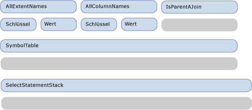
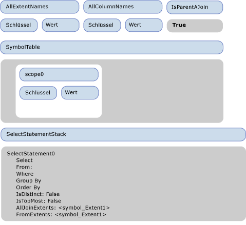
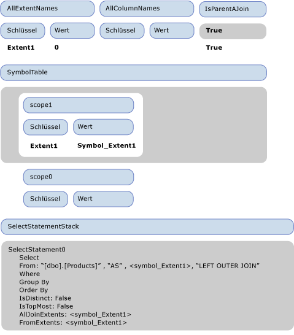
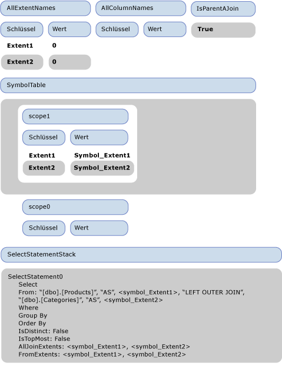
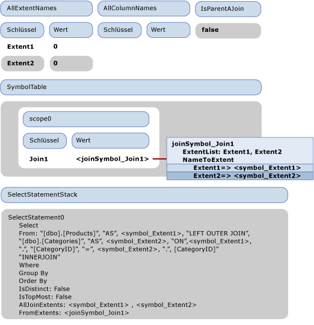
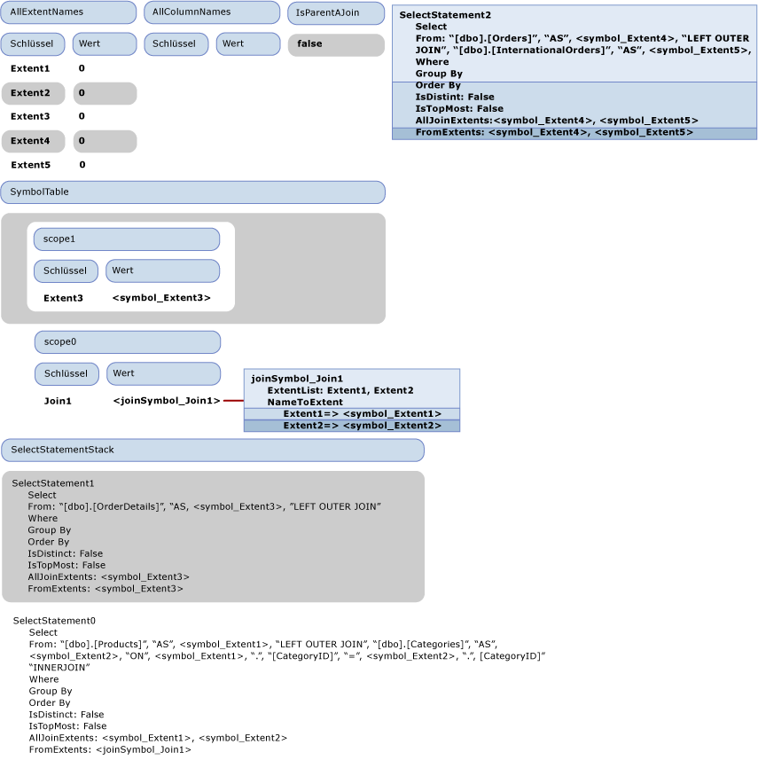
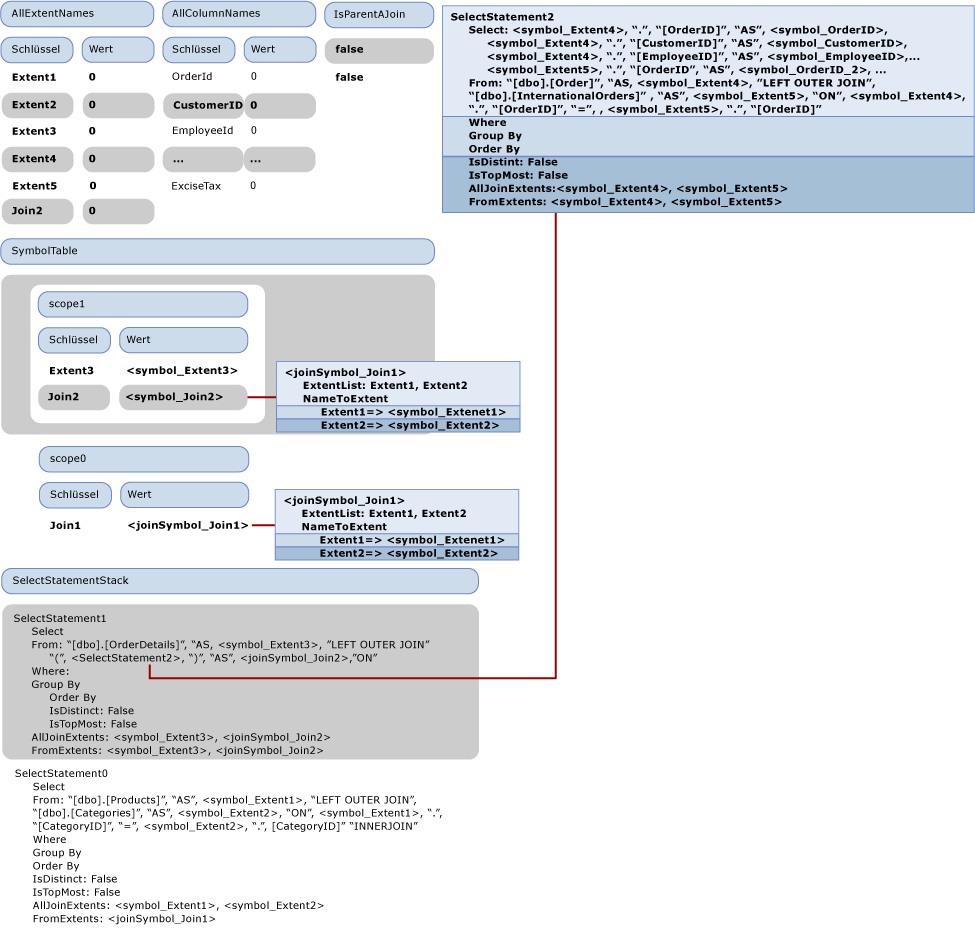

# <a name="walkthrough-sql-generation"></a><span data-ttu-id="be7a2-102">Exemplarische Vorgehensweise: SQL-Generierung</span><span class="sxs-lookup"><span data-stu-id="be7a2-102">Walkthrough: SQL Generation</span></span>

<span data-ttu-id="be7a2-103">In diesem Thema wird veranschaulicht, wie die SQL-Generierung im [Beispiel Anbieter](https://code.msdn.microsoft.com/windowsdesktop/Entity-Framework-Sample-6a9801d0)erfolgt.</span><span class="sxs-lookup"><span data-stu-id="be7a2-103">This topic illustrates how SQL generation occurs in the [Sample Provider](https://code.msdn.microsoft.com/windowsdesktop/Entity-Framework-Sample-6a9801d0).</span></span> <span data-ttu-id="be7a2-104">Die folgende Entity SQL-Abfrage verwendet das im Beispielanbieter enthaltene Modell:</span><span class="sxs-lookup"><span data-stu-id="be7a2-104">The following Entity SQL query uses the model that is included with the sample provider:</span></span>

```sql
SELECT  j1.ProductId, j1.ProductName, j1.CategoryName, j2.ShipCountry, j2.ProductId
FROM (  SELECT P.ProductName, P.ProductId, P.Category.CategoryName
        FROM NorthwindEntities.Products AS P) as j1
INNER JOIN (SELECT OD.ProductId, OD.Order.ShipCountry as ShipCountry
            FROM NorthwindEntities.OrderDetails AS OD) as j2
            ON j1.ProductId == j2.ProductId
```

<span data-ttu-id="be7a2-105">Die Abfrage erzeugt die folgende Ausgabebefehlsstruktur, die an den Anbieter übergeben wird:</span><span class="sxs-lookup"><span data-stu-id="be7a2-105">The query produces the following output command tree that is passed to the provider:</span></span>

```
DbQueryCommandTree
|_Parameters
|_Query : Collection{Record['C1'=Edm.Int32, 'ProductID'=Edm.Int32, 'ProductName'=Edm.String, 'CategoryName'=Edm.String, 'ShipCountry'=Edm.String, 'ProductID1'=Edm.Int32]}
  |_Project
    |_Input : 'Join4'
    | |_InnerJoin
    |   |_Left : 'Join1'
    |   | |_LeftOuterJoin
    |   |   |_Left : 'Extent1'
    |   |   | |_Scan : dbo.Products
    |   |   |_Right : 'Extent2'
    |   |   | |_Scan : dbo.Categories
    |   |   |_JoinCondition
    |   |     |_
    |   |       |_Var(Extent1).CategoryID
    |   |       |_=
    |   |       |_Var(Extent2).CategoryID
    |   |_Right : 'Join3'
    |   | |_LeftOuterJoin
    |   |   |_Left : 'Extent3'
    |   |   | |_Scan : dbo.OrderDetails
    |   |   |_Right : 'Join2'
    |   |   | |_LeftOuterJoin
    |   |   |   |_Left : 'Extent4'
    |   |   |   | |_Scan : dbo.Orders
    |   |   |   |_Right : 'Extent5'
    |   |   |   | |_Scan : dbo.InternationalOrders
    |   |   |   |_JoinCondition
    |   |   |     |_
    |   |   |       |_Var(Extent4).OrderID
    |   |   |       |_=
    |   |   |       |_Var(Extent5).OrderID
    |   |   |_JoinCondition
    |   |     |_
    |   |       |_Var(Extent3).OrderID
    |   |       |_=
    |   |       |_Var(Join2).Extent4.OrderID
    |   |_JoinCondition
    |     |_
    |       |_Var(Join1).Extent1.ProductID
    |       |_=
    |       |_Var(Join3).Extent3.ProductID
    |_Projection
      |_NewInstance : Record['C1'=Edm.Int32, 'ProductID'=Edm.Int32, 'ProductName'=Edm.String, 'CategoryName'=Edm.String, 'ShipCountry'=Edm.String, 'ProductID1'=Edm.Int32]
        |_Column : 'C1'
        | |_1
        |_Column : 'ProductID'
        | |_Var(Join4).Join1.Extent1.ProductID
        |_Column : 'ProductName'
        | |_Var(Join4).Join1.Extent1.ProductName
        |_Column : 'CategoryName'
        | |_Var(Join4).Join1.Extent2.CategoryName
        |_Column : 'ShipCountry'
        | |_Var(Join4).Join3.Join2.Extent4.ShipCountry
        |_Column : 'ProductID1'
          |_Var(Join4).Join3.Extent3.ProductID
```

 <span data-ttu-id="be7a2-106">In diesem Thema wird beschrieben, wie diese Ausgabebefehlsstruktur in die folgenden SQL-Anweisungen übersetzt wird.</span><span class="sxs-lookup"><span data-stu-id="be7a2-106">This topic describes how to translate this output command tree into the following SQL statements.</span></span>

```sql
SELECT
1 AS [C1],
[Extent1].[ProductID] AS [ProductID],
[Extent1].[ProductName] AS [ProductName],
[Extent2].[CategoryName] AS [CategoryName],
[Join3].[ShipCountry] AS [ShipCountry],
[Join3].[ProductID] AS [ProductID1]
FROM   [dbo].[Products] AS [Extent1]
LEFT OUTER JOIN [dbo].[Categories] AS [Extent2] ON [Extent1].[CategoryID] = [Extent2].[CategoryID]
INNER JOIN
(SELECT [Extent3].[OrderID] AS [OrderID1], [Extent3].[ProductID] AS [ProductID], [Extent3].[UnitPrice] AS [UnitPrice], [Extent3].[Quantity] AS [Quantity], [Extent3].[Discount] AS [Discount], [Join2].[OrderID2], [Join2].[CustomerID], [Join2].[EmployeeID], [Join2].[OrderDate], [Join2].[RequiredDate], [Join2].[ShippedDate], [Join2].[Freight], [Join2].[ShipName], [Join2].[ShipAddress], [Join2].[ShipCity], [Join2].[ShipRegion], [Join2].[ShipPostalCode], [Join2].[ShipCountry], [Join2].[OrderID3], [Join2].[CustomsDescription], [Join2].[ExciseTax]
FROM  [dbo].[OrderDetails] AS [Extent3]
LEFT OUTER JOIN
      (SELECT [Extent4].[OrderID] AS [OrderID2], [Extent4].[CustomerID] AS [CustomerID], [Extent4].[EmployeeID] AS [EmployeeID], [Extent4].[OrderDate] AS [OrderDate], [Extent4].[RequiredDate] AS [RequiredDate], [Extent4].[ShippedDate] AS [ShippedDate], [Extent4].[Freight] AS [Freight], [Extent4].[ShipName] AS [ShipName], [Extent4].[ShipAddress] AS [ShipAddress], [Extent4].[ShipCity] AS [ShipCity], [Extent4].[ShipRegion] AS [ShipRegion], [Extent4].[ShipPostalCode] AS [ShipPostalCode], [Extent4].[ShipCountry] AS [ShipCountry], [Extent5].[OrderID] AS [OrderID3], [Extent5].[CustomsDescription] AS [CustomsDescription], [Extent5].[ExciseTax] AS [ExciseTax]
FROM  [dbo].[Orders] AS [Extent4]
LEFT OUTER JOIN [dbo].[InternationalOrders] AS [Extent5] ON [Extent4].[OrderID] = [Extent5].[OrderID]
      ) AS [Join2] ON [Extent3].[OrderID] = [Join2].[OrderID2]
   ) AS [Join3] ON [Extent1].[ProductID] = [Join3].[ProductID]
```

## <a name="first-phase-of-sql-generation-visiting-the-expression-tree"></a><span data-ttu-id="be7a2-107">Erste Phase der SQL-Generierung: Aufrufen der Ausdrucks Baumstruktur</span><span class="sxs-lookup"><span data-stu-id="be7a2-107">First Phase of SQL Generation: Visiting the Expression Tree</span></span>

<span data-ttu-id="be7a2-108">Die folgende Abbildung veranschaulicht den leeren Anfangszustand des Besuchers.</span><span class="sxs-lookup"><span data-stu-id="be7a2-108">The following figure illustrates the initial empty state of the visitor.</span></span>  <span data-ttu-id="be7a2-109">In diesem Thema werden nur die für die Erläuterung der exemplarischen Vorgehensweise relevanten Eigenschaften dargestellt.</span><span class="sxs-lookup"><span data-stu-id="be7a2-109">Throughout this topic, only the properties relevant to the walkthrough explanation are shown.</span></span>

<span data-ttu-id="be7a2-110"></span><span class="sxs-lookup"><span data-stu-id="be7a2-110"></span></span>

<span data-ttu-id="be7a2-111">Wird auf den Projektknoten zugegriffen, wird VisitInputExpression über seine Eingabe (Join4) aufgerufen. Dadurch wird der Zugriff auf Join4 durch die Methode VisitJoinExpression ausgelöst.</span><span class="sxs-lookup"><span data-stu-id="be7a2-111">When the Project  node is visited, VisitInputExpression is called over its input (Join4), which triggers the visit of Join4 by the method VisitJoinExpression.</span></span> <span data-ttu-id="be7a2-112">Da dies ein Join auf oberster Ebene ist, gibt IsParentAJoin false zurück. Es wird ein neues SqlSelectStatement (SelectStatement0) erstellt und auf dem SELECT-Anweisungsstapel abgelegt.</span><span class="sxs-lookup"><span data-stu-id="be7a2-112">Because this is a topmost join, IsParentAJoin returns false and a new SqlSelectStatement (SelectStatement0) is created and pushed on the SELECT statement stack.</span></span> <span data-ttu-id="be7a2-113">Außerdem wird ein neuer Bereich (scope0) in der Symboltabelle eingetragen.</span><span class="sxs-lookup"><span data-stu-id="be7a2-113">Also, a new scope (scope0) is entered in the symbol table.</span></span> <span data-ttu-id="be7a2-114">Vor dem Zugriff auf die erste (linke) Eingabe des Joins wird "true" auf dem IsParentAJoin-Stapel abgelegt.</span><span class="sxs-lookup"><span data-stu-id="be7a2-114">Before the first (left) input of the join is visited, 'true' is pushed on the IsParentAJoin stack.</span></span> <span data-ttu-id="be7a2-115">Bevor der Zugriff auf Join1, der linken Eingabe von Join4, erfolgt, entspricht der Zustand des Besuchers dem in der nächsten Abbildung dargestellten Zustand.</span><span class="sxs-lookup"><span data-stu-id="be7a2-115">Right before Join1, which is the left input of Join4, is visited, the state of the visitor is as shown in the next figure.</span></span>

<span data-ttu-id="be7a2-116"></span><span class="sxs-lookup"><span data-stu-id="be7a2-116"></span></span>

<span data-ttu-id="be7a2-117">Wenn die Joinzugriffsmethode über Join4 aufgerufen wird, hat IsParentAJoin den Wert true. Daher verwendet sie die aktuelle SELECT-Anweisung SelectStatement0 erneut.</span><span class="sxs-lookup"><span data-stu-id="be7a2-117">When the join visit method is invoked over Join4, IsParentAJoin is true, thus it reuses the current select statement SelectStatement0.</span></span> <span data-ttu-id="be7a2-118">Es wird ein neuer Bereich (scope1) eingetragen.</span><span class="sxs-lookup"><span data-stu-id="be7a2-118">A new scope is entered (scope1).</span></span> <span data-ttu-id="be7a2-119">Bevor der Zugriff auf sein linkes untergeordnetes Element (Extent1) erfolgt, wird ein weiterer Wert true auf dem IsParentAJoin-Stapel abgelegt.</span><span class="sxs-lookup"><span data-stu-id="be7a2-119">Before visiting its left child, Extent1, another true is pushed on the IsParentAJoin stack.</span></span>

<span data-ttu-id="be7a2-120">Wenn auf Extent1 zugegriffen wird, weil IsParentAJoin true zurückgibt, wird ein SqlBuilder zurückgegeben, der "[dbo].[Products]" enthält.</span><span class="sxs-lookup"><span data-stu-id="be7a2-120">When Extent1 is visited, because IsParentAJoin returns true, it returns a SqlBuilder containing "[dbo].[Products]".</span></span> <span data-ttu-id="be7a2-121">Die Steuerung wird an die Methode zurückgegeben, die auf Join4 zugreift.</span><span class="sxs-lookup"><span data-stu-id="be7a2-121">The control returns to the method visiting Join4.</span></span> <span data-ttu-id="be7a2-122">Ein Eintrag von IsParentAJoin wird ausgelesen, und ProcessJoinInputResult wird aufgerufen. Diese Methode fügt das Ergebnis des Zugriffs auf Extent1 an die FROM-Klausel von SelectStatement0 an.</span><span class="sxs-lookup"><span data-stu-id="be7a2-122">An entry is popped from IsParentAJoin, and ProcessJoinInputResult is called, which appends the result of visiting Extent1 to the From clause of SelectStatement0.</span></span> <span data-ttu-id="be7a2-123">Es wird ein neues From-Symbol (symbol_Extent1) für den Eingabebindungsnamen "Extent1" erstellt, das den FromExtents von SelectStatement0 hinzugefügt wird. Außerdem werden "AS" und symbol_Extent1 an die FROM-Klausel angefügt.</span><span class="sxs-lookup"><span data-stu-id="be7a2-123">A new from symbol, symbol_Extent1, for the input binding name "Extent1" is created, added to the FromExtents of SelectStatement0, and also "As" and  symbol_Extent1 are appended to the from clause.</span></span> <span data-ttu-id="be7a2-124">AllExtentNames wird ein neuer Eintrag mit dem Wert 0 für "Extent1" hinzugefügt.</span><span class="sxs-lookup"><span data-stu-id="be7a2-124">A new entry is added to AllExtentNames for "Extent1" with the value of 0.</span></span> <span data-ttu-id="be7a2-125">Dem aktuellen Bereich in der Symboltabelle wird ein neuer Eintrag hinzugefügt, um "Extent1" seinem Symbol symbol_Extent1 zuzuordnen.</span><span class="sxs-lookup"><span data-stu-id="be7a2-125">A new entry is added to the current scope in the symbol table to associate "Extent1" with its symbol symbol_Extent1.</span></span> <span data-ttu-id="be7a2-126">Symbol_Extent1 wird außerdem den AllJoinExtents der SqlSelectStatement-Anweisung hinzugefügt.</span><span class="sxs-lookup"><span data-stu-id="be7a2-126">Symbol_Extent1 is also added to the AllJoinExtents of the SqlSelectStatement.</span></span>

<span data-ttu-id="be7a2-127">Bevor der Zugriff auf die rechte Eingabe von Join1 erfolgt, wird der FROM-Klausel von SelectStatement0 "LEFT OUTER JOIN" hinzugefügt.</span><span class="sxs-lookup"><span data-stu-id="be7a2-127">Before the right input of Join1 is visited, "LEFT OUTER JOIN" is added to the From clause of SelectStatement0.</span></span> <span data-ttu-id="be7a2-128">Da die rechte Eingabe ein Scan-Ausdruck ist, wird der Wert true erneut auf dem IsParentAJoin-Stapel abgelegt.</span><span class="sxs-lookup"><span data-stu-id="be7a2-128">Because the right input is a Scan expression, true is again pushed to the IsParentAJoin stack.</span></span> <span data-ttu-id="be7a2-129">Der Zustand vor dem Zugriff auf die rechte Eingabe wird in der nächsten Abbildung dargestellt.</span><span class="sxs-lookup"><span data-stu-id="be7a2-129">The state before visiting the right input as shown in the next figure.</span></span>

<span data-ttu-id="be7a2-130"></span><span class="sxs-lookup"><span data-stu-id="be7a2-130"></span></span>

<span data-ttu-id="be7a2-131">Die rechte Eingabe wird auf die gleiche Weise wie die linke Eingabe verarbeitet.</span><span class="sxs-lookup"><span data-stu-id="be7a2-131">The right input is processed in the same way as the left input.</span></span> <span data-ttu-id="be7a2-132">Der Zustand nach dem Zugriff auf die rechte Eingabe wird in der nächsten Abbildung dargestellt.</span><span class="sxs-lookup"><span data-stu-id="be7a2-132">The state after visiting the right input is shown in the next figure.</span></span>

<span data-ttu-id="be7a2-133"></span><span class="sxs-lookup"><span data-stu-id="be7a2-133"></span></span>

<span data-ttu-id="be7a2-134">Im nächsten Schritt wird "false" auf dem IsParentAJoin-Stapel abgelegt, und die Joinbedingung "Var(Extent1).CategoryID == Var(Extent2).CategoryID" wird verarbeitet.</span><span class="sxs-lookup"><span data-stu-id="be7a2-134">Next "false" is pushed on the IsParentAJoin stack and the join condition Var(Extent1).CategoryID == Var(Extent2).CategoryID is processed.</span></span> <span data-ttu-id="be7a2-135">Var (Extent1) wird nach einer \<Suche in der Symboltabelle in > symbol_Extent1 aufgelöst.</span><span class="sxs-lookup"><span data-stu-id="be7a2-135">Var(Extent1) is resolved to \<symbol_Extent1> after a look up in the symbol table.</span></span> <span data-ttu-id="be7a2-136">Da die-Instanz als Ergebnis der Verarbeitung von var (Extent1) in ein einfaches Symbol aufgelöst wird. CategoryID, ein sqlbuilder mit \<symbol1->. " CategoryID "wird zurückgegeben.</span><span class="sxs-lookup"><span data-stu-id="be7a2-136">Because the instance is resolved to a simple Symbol, as a result of processing Var(Extent1).CategoryID, a SqlBuilder with \<symbol1>."CategoryID" is returned.</span></span> <span data-ttu-id="be7a2-137">Auf ähnliche Weise wird die andere Seite des Vergleichs verarbeitet. Das Ergebnis des Zugriffs auf die Joinbedingung wird an die FROM-Klausel von SelectStatement1 angefügt, und der Wert "false" wird vom IsParentAJoin-Stapel ausgelesen.</span><span class="sxs-lookup"><span data-stu-id="be7a2-137">Similarly the other side of the comparison is processed, and the result of visiting the join condition is appended to the FROM clause of SelectStatement1 and the value "false" is popped from the IsParentAJoin stack.</span></span>

<span data-ttu-id="be7a2-138">Damit wurde Join1 vollständig verarbeitet, und aus der Symboltabelle wird ein Bereich ausgelesen.</span><span class="sxs-lookup"><span data-stu-id="be7a2-138">With this, Join1 has completely been processed, and a scope is popped from the symbol table.</span></span>

<span data-ttu-id="be7a2-139">Die Steuerung wird zur Verarbeitung von Join4, dem übergeordneten Element von Join1, zurückgegeben.</span><span class="sxs-lookup"><span data-stu-id="be7a2-139">Control returns to processing Join4, the parent of Join1.</span></span> <span data-ttu-id="be7a2-140">Da das untergeordnete Element die SELECT-Anweisung wieder verwendet hat, werden die Join1-Blöcke durch \<ein einzelnes joinsymbol joinSymbol_Join1 > ersetzt.</span><span class="sxs-lookup"><span data-stu-id="be7a2-140">Because the child reused the Select statement, the Join1 extents are replaced with a single Join symbol \<joinSymbol_Join1>.</span></span> <span data-ttu-id="be7a2-141">Außerdem wird der Symboltabelle ein neuer Eintrag hinzugefügt, um Join1 \<joinSymbol_Join1 > zuzuordnen.</span><span class="sxs-lookup"><span data-stu-id="be7a2-141">Also a new entry is added to the symbol table to associate Join1 with \<joinSymbol_Join1>.</span></span>

<span data-ttu-id="be7a2-142">Der nächste zu verarbeitende Knoten ist Join3, das zweite untergeordnete Element von Join4.</span><span class="sxs-lookup"><span data-stu-id="be7a2-142">The next node to be processed is Join3, the second child of Join4.</span></span> <span data-ttu-id="be7a2-143">Da es sich um ein rechtes untergeordnetes Element handelt, wird "false" auf dem IsParentAJoin-Stapel abgelegt.</span><span class="sxs-lookup"><span data-stu-id="be7a2-143">As it is a right child, "false" is pushed to the IsParentAJoin stack.</span></span> <span data-ttu-id="be7a2-144">Der Zustand des Besuchers zu diesem Zeitpunkt wird in der nächsten Abbildung veranschaulicht.</span><span class="sxs-lookup"><span data-stu-id="be7a2-144">The state of the visitor at this point is illustrated in the next figure.</span></span>

<span data-ttu-id="be7a2-145"></span><span class="sxs-lookup"><span data-stu-id="be7a2-145"></span></span>

<span data-ttu-id="be7a2-146">Für Join3 gibt IsParentAJoin false zurück und muss ein neues SqlSelectStatement (SelectStatement1) starten und auf dem Stapel ablegen.</span><span class="sxs-lookup"><span data-stu-id="be7a2-146">For Join3, IsParentAJoin returns false and needs to start a new SqlSelectStatement (SelectStatement1) and push it on the stack.</span></span> <span data-ttu-id="be7a2-147">Die Verarbeitung wird wie bei den vorherigen Joins weiter ausgeführt. Es wird ein neuer Bereich auf dem Stapel abgelegt, und die untergeordneten Elemente werden verarbeitet.</span><span class="sxs-lookup"><span data-stu-id="be7a2-147">Processing continues as it did with the previous the previous joins, a new scope is pushed on the stack and the children are processed.</span></span> <span data-ttu-id="be7a2-148">Das linke untergeordnete Element ist ein Block (Extent3), und das Rechte untergeordnete Element ist ein Join (Join2), der ebenfalls eine neue sqlselectstatement-Anweisung starten muss: SelectStatement2.</span><span class="sxs-lookup"><span data-stu-id="be7a2-148">The left child is an Extent (Extent3) and the right child is a join (Join2) which also needs to start a new SqlSelectStatement: SelectStatement2.</span></span> <span data-ttu-id="be7a2-149">Die untergeordneten Elemente von Join2 sind auch Blöcke und werden in SelectStatement2 aggregiert.</span><span class="sxs-lookup"><span data-stu-id="be7a2-149">The children on Join2 are Extents as well and are aggregated into SelectStatement2.</span></span>

<span data-ttu-id="be7a2-150">Der Zustand des Besuchers direkt nach dem Zugriff auf Join2, jedoch vor seiner Nachbearbeitung (ProcessJoinInputResult), wird in der nächsten Abbildung dargestellt:</span><span class="sxs-lookup"><span data-stu-id="be7a2-150">The state of the visitor right after Join2 is visited, but before its post-processing (ProcessJoinInputResult) is done is shown in the next figure:</span></span>

<span data-ttu-id="be7a2-151"></span><span class="sxs-lookup"><span data-stu-id="be7a2-151"></span></span>

<span data-ttu-id="be7a2-152">In der vorherigen Abbildung wird SelectStatement2 als nicht typisiert dargestellt, da es zwar vom Stapel ausgelesen wurde, jedoch noch nicht vom übergeordneten Element nachbearbeitet wurde.</span><span class="sxs-lookup"><span data-stu-id="be7a2-152">In the previous figure, SelectStatement2 is shown as free floating because it was popped out of the stack, but not yet post processed by the parent.</span></span> <span data-ttu-id="be7a2-153">Es muss dem FROM-Teil des übergeordneten Elements hinzugefügt werden, ist jedoch ohne SELECT-Klausel keine vollständige SQL-Anweisung.</span><span class="sxs-lookup"><span data-stu-id="be7a2-153">It needs to be added to the FROM part of the parent, but it is not a complete SQL statement without a SELECT clause.</span></span> <span data-ttu-id="be7a2-154">Daher werden die Standardspalten (alle von ihren Eingaben erzeugten Spalten) zu diesem Zeitpunkt der Select-Liste durch die AddDefaultColumns-Methode hinzugefügt.</span><span class="sxs-lookup"><span data-stu-id="be7a2-154">So, at this point, the default columns (all the columns produced by its inputs) are added to the select list by the method AddDefaultColumns.</span></span> <span data-ttu-id="be7a2-155">AddDefaultColumns durchläuft die Symbole in FromExtents und fügt alle im Bereich enthaltenen Spalten für jedes Symbol hinzu.</span><span class="sxs-lookup"><span data-stu-id="be7a2-155">AddDefaultColumns iterates over the symbols in FromExtents and for each symbol adds all the columns brought in scope.</span></span> <span data-ttu-id="be7a2-156">Bei einem einfachen Symbol überprüft die Methode den Symboltyp, um alle zugehörigen hinzuzufügenden Eigenschaften abzurufen.</span><span class="sxs-lookup"><span data-stu-id="be7a2-156">For a simple symbol, it looks at the symbol type to retrieve all its properties to be added.</span></span> <span data-ttu-id="be7a2-157">Außerdem füllt sie das AllColumnNames-Wörterbuch mit den Spaltennamen.</span><span class="sxs-lookup"><span data-stu-id="be7a2-157">It also populates the AllColumnNames dictionary with the column names.</span></span> <span data-ttu-id="be7a2-158">Das abgeschlossene SelectStatement2 wird an die FROM-Klausel von SelectStatement1 angefügt.</span><span class="sxs-lookup"><span data-stu-id="be7a2-158">The completed SelectStatement2 is appended to the FROM clause of SelectStatement1.</span></span>

<span data-ttu-id="be7a2-159">Danach wird ein neues Joinsymbol erstellt, um Join2 darzustellen. Es wird als geschachtelter Join gekennzeichnet und den AllJoinExtents von SelectStatement1 sowie der Symboltabelle hinzugefügt.</span><span class="sxs-lookup"><span data-stu-id="be7a2-159">Next, a new join symbol is created to represent Join2, it is marked as a nested join and added to the AllJoinExtents of SelectStatement1 and added to the symbol table.</span></span>  <span data-ttu-id="be7a2-160">Jetzt muss die Joinbedingung von Join3, "Var(Extent3).OrderID = Var(Join2).Extent4.OrderID", verarbeitet werden.</span><span class="sxs-lookup"><span data-stu-id="be7a2-160">Now the join condition of Join3, Var(Extent3).OrderID =  Var(Join2).Extent4.OrderID, needs to be processed.</span></span> <span data-ttu-id="be7a2-161">Die Verarbeitung der linken Seite ähnelt der Joinbedingung von Join1.</span><span class="sxs-lookup"><span data-stu-id="be7a2-161">Processing of the left hand side is similar to the join condition of Join1.</span></span> <span data-ttu-id="be7a2-162">Die Verarbeitung der rechten Seite, "Var(Join2).Extent4.OrderID", erfolgt jedoch auf andere Weise, da der Join vereinfacht werden muss.</span><span class="sxs-lookup"><span data-stu-id="be7a2-162">However, the processing of the right and side "Var(Join2).Extent4.OrderID" is different because join flattening is required.</span></span>

<span data-ttu-id="be7a2-163">Die nächste Abbildung zeigt den Zustand des Besuchers direkt vor der Verarbeitung des DbPropertyExpression "Var(Join2).Extent4.OrderID".</span><span class="sxs-lookup"><span data-stu-id="be7a2-163">The next figure shows the state of the visitor right before the DbPropertyExpression "Var(Join2).Extent4.OrderID" is processed.</span></span>

<span data-ttu-id="be7a2-164">Beachten Sie, wie auf "Var(Join2).Extent4.OrderID" zugegriffen wird.</span><span class="sxs-lookup"><span data-stu-id="be7a2-164">Consider how "Var(Join2).Extent4.OrderID" is visited.</span></span> <span data-ttu-id="be7a2-165">Zuerst wird auf die Instanzeigenschaft "Var(Join2).Extent4" zugegriffen, bei der es sich um eine weitere DbPropertyExpression handelt, die zunächst auf ihre Instanz "Var(Join2)" zugreift.</span><span class="sxs-lookup"><span data-stu-id="be7a2-165">First, the instance property "Var(Join2).Extent4" is visited, which is another DbPropertyExpression and first visits its instance "Var(Join2)".</span></span> <span data-ttu-id="be7a2-166">Im obersten Bereich in der Symboltabelle wird "Join2" in \<joinSymbol_join2 > aufgelöst.</span><span class="sxs-lookup"><span data-stu-id="be7a2-166">In the top most scope in the symbol table, "Join2" resolves to \<joinSymbol_join2>.</span></span> <span data-ttu-id="be7a2-167">Beachten Sie, dass in der Zugriffsmethode für DbPropertyExpression bei der Verarbeitung von "Var(Join2).Extent4" ein Joinsymbol zurückgegeben wird, wenn auf die Instanz zugegriffen wird und eine Vereinfachung erforderlich ist.</span><span class="sxs-lookup"><span data-stu-id="be7a2-167">In the visit method for DbPropertyExpression processing "Var(Join2).Extent4" notice that a join symbol was returned when visiting the instance and flattening is required.</span></span>

<span data-ttu-id="be7a2-168">Da es sich um einen schsted Join handelt, wird die Eigenschaft "Extent4" im nametoblock-Wörterbuch des joinsymbols gesucht, in > \<symbol_Extent4 aufgelöst und ein neues symbolpair zurückgegeben\<(joinSymbol_join2 > \<, symbol_Extent4 >).</span><span class="sxs-lookup"><span data-stu-id="be7a2-168">Since it is a nested join, we look up the property "Extent4" in the NameToExtent dictionary of the join symbol, resolve it to \<symbol_Extent4> and return a new SymbolPair(\<joinSymbol_join2>, \<symbol_Extent4>).</span></span> <span data-ttu-id="be7a2-169">Da ein symbolpaar von der Verarbeitung der Instanz von "var (Join2)" zurückgegeben wird. Extent4. OrderID ", die Eigenschaft" OrderID "wird aus dem columnpart des Symbol Paars (\<symbol_Extent4 >) aufgelöst, das eine Liste der Spalten des Blocks enthält, den Sie darstellt.</span><span class="sxs-lookup"><span data-stu-id="be7a2-169">Since a symbol pair is returned from the processing of the instance of "Var(Join2).Extent4.OrderID",  the property "OrderID" is resolved from the ColumnPart of that symbol pair (\<symbol_Extent4>), which has a list of the columns of the extent it represents.</span></span> <span data-ttu-id="be7a2-170">"Var (Join2)". Extent4. OrderID "wird in { \<joinSymbol_Join2 >,". ", \<symbol_OrderID >} aufgelöst.</span><span class="sxs-lookup"><span data-stu-id="be7a2-170">So, "Var(Join2).Extent4.OrderID" is resolved to { \<joinSymbol_Join2>, ".", \<symbol_OrderID>}.</span></span>

<span data-ttu-id="be7a2-171">Die Joinbedingung von Join4 wird auf ähnliche Weise verarbeitet.</span><span class="sxs-lookup"><span data-stu-id="be7a2-171">The join condition of Join4 is similarly processed.</span></span> <span data-ttu-id="be7a2-172">Die Steuerung wird an die VisitInputExpression-Methode zurück übergeben, die das oberste Projekt verarbeitet hat.</span><span class="sxs-lookup"><span data-stu-id="be7a2-172">The control returns to the VisitInputExpression method that processed the top most project.</span></span> <span data-ttu-id="be7a2-173">Wenn Sie die FromExtents des zurückgegebenen SelectStatement0 betrachten, können Sie feststellen, dass die Eingabe als Join identifiziert wird, die ursprünglichen Blöcke entfernt werden und diese durch einen neuen Block, der nur das Joinsymbol enthält, ersetzt werden.</span><span class="sxs-lookup"><span data-stu-id="be7a2-173">Looking at the FromExtents of the returned SelectStatement0, the input is identified as a join, and removes the original extents and replaces them with a new extent with just the Join symbol.</span></span> <span data-ttu-id="be7a2-174">Die Symboltabelle wird ebenfalls aktualisiert, und danach wird der Projektionsteil des Projekts verarbeitet.</span><span class="sxs-lookup"><span data-stu-id="be7a2-174">The symbol table is also updated and next the projection part of the Project is processed.</span></span> <span data-ttu-id="be7a2-175">Das Auflösen der Eigenschaften und das Vereinfachen der Joinblöcke erfolgt wie oben beschrieben.</span><span class="sxs-lookup"><span data-stu-id="be7a2-175">The resolving of the properties and the flattening of the join extents is as described earlier.</span></span>

<span data-ttu-id="be7a2-176"></span><span class="sxs-lookup"><span data-stu-id="be7a2-176"></span></span>

<span data-ttu-id="be7a2-177">Schließlich wird das folgende SqlSelectStatement erzeugt:</span><span class="sxs-lookup"><span data-stu-id="be7a2-177">Finally, the following SqlSelectStatement is produced:</span></span>

```
SELECT:
  "1", " AS ", "[C1]",
  <symbol_Extent1>, ".", "[ProductID]", " AS ", "[ProductID]",
  <symbol_Extent1>, ".", "[ProductName]", " AS ", "[ProductName]",
  <symbol_Extent2>, ".", "[CategoryName]", " AS ", "[CategoryName]",
  <joinSymbol_Join3>, ".", <symbol_ShipCountry>, " AS ", "[ShipCountry]",
  <joinSymbol_Join3>, ".", <symbol_ProductID>, " AS ", "[ProductID1]"
FROM: "[dbo].[Products]", " AS ", <symbol_Extent1>,
        "LEFT OUTER JOIN ""[dbo].[Categories]", " AS ", <symbol_Extent2>, " ON ", <symbol_Extent1>, ".", "[CategoryID]", " = ", <symbol_Extent2>, ".", "[CategoryID]",
        "INNER JOIN ",
        " (", SELECT:
           <symbol_Extent3>, ".", "[OrderID]", " AS ", <symbol_OrderID>, ",
              <symbol_Extent3>, ".", "[ProductID]", " AS ", <symbol_ProductID>, ...,
         <joinSymbol_Join2>, ".", <symbol_OrderID_2>, ", ",
           <joinSymbol_Join2>, ".", <symbol_CustomerID>, ....,
        <joinSymbol_Join2>, ".", <symbol_OrderID_3>,
<joinSymbol_Join2>, ".", <symbol_CustomsDescription>,
<joinSymbol_Join2>, ".", <symbol_ExciseTax>
FROM: "[dbo].[OrderDetails]", " AS ", <symbol_Extent3>,
"LEFT OUTER JOIN ",
" (", SELECT:
<symbol_Extent4>, ".", "[OrderID]", " AS ", <symbol_OrderID_2>,
<symbol_Extent4>, ".", "[CustomerID]", " AS ", <symbol_CustomerID>, ...
<symbol_Extent5>, ".", "[OrderID]", " AS ", <symbol_OrderID_3>,
<symbol_Extent5>, ".", "[CustomsDescription]", " AS ", <symbol_CustomsDescription>,
<symbol_Extent5>, ".", "[ExciseTax]", " AS ", <symbol_ExciseTax>
FROM: "[dbo].[Orders]", " AS ", <symbol_Extent4>,
"LEFT OUTER JOIN ", , "[dbo].[InternationalOrders]", " AS ", <symbol_Extent5>,
" ON ", <symbol_Extent4>, ".", "[OrderID]", " = ", , <symbol_Extent5>, ".", "[OrderID]"
" )", " AS ", <joinSymbol_Join2>, " ON ", , , <symbol_Extent3>, ".", "[OrderID]", " = ", , <joinSymbol_Join2>, ".", <symbol_OrderID_2>
" )", " AS ", <joinSymbol_Join3>, " ON ", , , <symbol_Extent1>, ".", "[ProductID]", " = ", , <joinSymbol_Join3>, ".", <symbol_ProductID>
```

### <a name="second-phase-of-sql-generation-generating-the-string-command"></a><span data-ttu-id="be7a2-178">Zweite Phase der SQL-Generierung: Der Zeichen folgen Befehl wird erzeugt.</span><span class="sxs-lookup"><span data-stu-id="be7a2-178">Second Phase of SQL Generation: Generating the String Command</span></span>

<span data-ttu-id="be7a2-179">In der zweiten Phase werden tatsächliche Namen für die Symbole erzeugt, und wir konzentrieren uns nur auf die Symbole, die Spalten mit dem Namen "OrderID" darstellen, da in diesem Fall ein Konflikt gelöst werden muss.</span><span class="sxs-lookup"><span data-stu-id="be7a2-179">The second phase produces actual names for the symbols, and we only focus on the symbols representing columns named "OrderID", as in this case a conflict needs to be resolved.</span></span> <span data-ttu-id="be7a2-180">Diese werden im SqlSelectStatement hervorgehoben.</span><span class="sxs-lookup"><span data-stu-id="be7a2-180">These are highlighted in the SqlSelectStatement.</span></span> <span data-ttu-id="be7a2-181">Beachten Sie, dass die in der Abbildung verwendeten Suffixe nur dazu verwendet werden, hervorzuheben, dass es sich um unterschiedliche Instanzen handelt. Damit sollen keine neuen Namen dargestellt werden, da die endgültigen Namen (die sich möglicherweise von den ursprünglichen Namen unterscheiden) zu diesem Zeitpunkt noch nicht zugewiesen wurden.</span><span class="sxs-lookup"><span data-stu-id="be7a2-181">Note that the suffixes used in the figure are only to emphasize that these are different instances, not to represent any new names, as at this stage their final names (possibly different form the original names) have not been assigned yet.</span></span>

<span data-ttu-id="be7a2-182">Das erste gefundene Symbol, das umbenannt werden muss, \<ist symbol_OrderID >.</span><span class="sxs-lookup"><span data-stu-id="be7a2-182">The first symbol found that needs to be renamed is \<symbol_OrderID>.</span></span> <span data-ttu-id="be7a2-183">Als neuer Name wird "OrderID1" zugewiesen. 1 wird als zuletzt verwendetes Suffix für "OrderID" gekennzeichnet, und das Symbol wird als Symbol gekennzeichnet, für das keine Umbenennung erforderlich ist.</span><span class="sxs-lookup"><span data-stu-id="be7a2-183">Its new name is assigned as "OrderID1", 1 is marked as the last used suffix for "OrderID" and the symbol is marked as not needing renaming.</span></span> <span data-ttu-id="be7a2-184">Im nächsten Schritt wird die erste \<Verwendung von symbol_OrderID_2-> gefunden.</span><span class="sxs-lookup"><span data-stu-id="be7a2-184">Next, the first usage of \<symbol_OrderID_2> is found.</span></span> <span data-ttu-id="be7a2-185">Es wird umbenannt, sodass das nächste verfügbare Suffix ("OrderID2") verwendet wird. Das Symbol wird wieder als Symbol gekennzeichnet, für das keine Umbenennung erforderlich ist, damit es bei der nächsten Verwendung nicht umbenannt wird.</span><span class="sxs-lookup"><span data-stu-id="be7a2-185">It is renamed to use the next available suffix ("OrderID2") and again marked as not needing renaming, so that next time it is used it does not get renamed.</span></span> <span data-ttu-id="be7a2-186">Dies erfolgt auch für \<symbol_OrderID_3->.</span><span class="sxs-lookup"><span data-stu-id="be7a2-186">This is done for \<symbol_OrderID_3> too.</span></span>

<span data-ttu-id="be7a2-187">Am Ende der zweiten Phase wird die endgültige SQL-Anweisung generiert.</span><span class="sxs-lookup"><span data-stu-id="be7a2-187">At the end of the second phase, the final SQL statement is generated.</span></span>

## <a name="see-also"></a><span data-ttu-id="be7a2-188">Siehe auch</span><span class="sxs-lookup"><span data-stu-id="be7a2-188">See also</span></span>

- [<span data-ttu-id="be7a2-189">SQL-Generierung im Beispielanbieter</span><span class="sxs-lookup"><span data-stu-id="be7a2-189">SQL Generation in the Sample Provider</span></span>](sql-generation-in-the-sample-provider.md)
