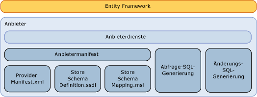

# Schreiben eines Entity Framework-Datenanbieters
In diesem Abschnitt wird erläutert, wie ein [!INCLUDE[adonet_ef](../../../../../includes/adonet-ef-md.md)]-Anbieter zur Unterstützung einer anderen Datenquelle als [!INCLUDE[ssNoVersion](../../../../../includes/ssnoversion-md.md)] geschrieben wird. [!INCLUDE[adonet_ef](../../../../../includes/adonet-ef-md.md)] enthält einen Anbieter, der [!INCLUDE[ssNoVersion](../../../../../includes/ssnoversion-md.md)] unterstützt.  
  
## Einführung in das Entity Framework-Anbietermodell  
 [!INCLUDE[adonet_ef](../../../../../includes/adonet-ef-md.md)] ist Datenbank-unabhängig. Sie können mit dem ADO.NET-Anbietermodell einen Anbieter schreiben, um eine Verbindung mit verschiedenen Datenquellen herzustellen.  
  
 Der mit dem ADO.NET-Datenanbietermodell erstellte Entity Framework-Datenanbieter führt die folgenden Funktionen aus:  
  
-   Zuordnen von primitiven Typen des Entity Data Model (EDM) zu Anbietertypen.  
  
-   Bereitstellen von anbieterspezifischen Funktionen.  
  
-   Generieren von anbieterspezifischen Befehlen für einen angegebenen DbQueryCommandTree zur Unterstützung von [!INCLUDE[adonet_ef](../../../../../includes/adonet-ef-md.md)]-Abfragen.  
  
-   Generieren von anbieterspezifischen Updatebefehlen für einen angegebenen DbModificationCommandTree zur Unterstützung von Updates durch den [!INCLUDE[adonet_ef](../../../../../includes/adonet-ef-md.md)].  
  
-   Bereitstellen von Zuordnungsdateien für die Speicherschemadefinition zur Unterstützung der Generierung eines Modells auf Grundlage einer Datenbank.  
  
-   Bereitstellen von Metadaten (z. B. Tabellen und Sichten) über ein konzeptionelles Modell.  
  
   
  
## Beispiel  
 Finden Sie unter der [Entity Framework-Beispielanbieter](http://go.microsoft.com/fwlink/?LinkId=180616) ein Beispiel für eine [!INCLUDE[adonet_ef](../../../../../includes/adonet-ef-md.md)] Anbieter, der eine Datenquelle außer unterstützt [!INCLUDE[ssNoVersion](../../../../../includes/ssnoversion-md.md)].  
  
## In diesem Abschnitt  
 [SQL-Generierung](../../../../../docs/framework/data/adonet/ef/sql-generation.md)  
  
 [Generierung von Änderungen in SQL](../../../../../docs/framework/data/adonet/ef/modification-sql-generation.md)  
  
 [Anbietermanifestspezifikation](../../../../../docs/framework/data/adonet/ef/provider-manifest-specification.md)  
  
## Siehe auch  
 [Arbeiten mit Datenanbietern](../../../../../docs/framework/data/adonet/ef/working-with-data-providers.md)
