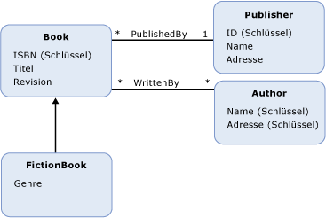

# Entity Data Model: Vererbung
Das Entity Data Model (EDM) unterstützt Vererbung für [Entitätstypen](../../../../docs/framework/data/adonet/entity-type.md). Vererbung im EDM ist ähnlich wie Vererbung für Klassen in objektorientierten Programmiersprachen. Wie bei Klassen in objektorientierten Sprachen in einem konzeptionellen Modell ein Entitätstyps festlegen können (ein *abgeleiteter Typ*), die von einem anderen Entitätstyp erbt (die *Basistyp*). Jedoch im Gegensatz zu Klassen in objektorientierten Programmierung, in einem konzeptionellen Modell der abgeleitete Typ erbt immer alle der [Eigenschaften](../../../../docs/framework/data/adonet/property.md) und [Navigationseigenschaften](../../../../docs/framework/data/adonet/navigation-property.md) des Basistyps. Geerbte Eigenschaften in einem abgeleiteten Typ können nicht überschrieben werden.  
  
 In einem konzeptionellen Modell können Sie Vererbungshierarchien erstellen, in denen ein abgeleiteter Typ von einem anderen abgeleiteten Typ erbt. Der Typ am Anfang der Hierarchie (einem Datentyp in der Hierarchie, die nicht auf ein abgeleiteter Typ ist) wird aufgerufen, die *Stammtyp*. In einer Vererbungshierarchie der [Entitätsschlüssel](../../../../docs/framework/data/adonet/entity-key.md) muss für den Stammtyp definiert sein.  
  
 Sie können keine Vererbungshierarchien erstellen, in denen ein abgeleiteter Typ von mehr als einem Typ erbt. In einem konzeptionellen Modell mit einem `Book`-Entitätstyp könnten Sie z. B. die abgeleiteten Typen `FictionBook` und `NonFictionBook` definieren, die jeweils von `Book` erben. Sie könnten dann jedoch keinen Typ definieren, der vom Typ `FictionBook` und vom Typ `NonFictionBook` erbt.  
  
## Beispiel  
 Die unten stehende Abbildung zeigt ein konzeptionelles Modell mit vier Entitätstypen: `Book`, `FictionBook`, `Publisher` und `Author`. Der `FictionBook`-Entitätstyp ist ein abgeleiteter Typ, der vom `Book`-Entitätstyp erbt. Der `FictionBook`-Typ erbt die Eigenschaften `ISBN (Key)`, `Title` und `Revision`, und definiert die zusätzliche Eigenschaft `Genre`.  
  
   
  
 Die [ADO.NET Entity Framework](../../../../docs/framework/data/adonet/ef/index.md) verwendet eine domänenspezifische Sprache (DSL) Bezeichnung konzeptionelle Schemadefinitionssprache ([CSDL](../../../../docs/framework/data/adonet/ef/language-reference/csdl-specification.md)) um konzeptionelle Modelle zu definieren. Die folgende CSDL definiert den Entitätstyp `FictionBook`, der vom `Book`-Typ (wie in der Abbildung oben) erbt:  
  
 [!code-xml[EDM_Example_Model#DerivedType](../../../../samples/snippets/xml/VS_Snippets_Data/edm_example_model/xml/books5.edmx#derivedtype)]  
  
## Siehe auch  
 [Schlüsselkonzepte im Entity Data Model](../../../../docs/framework/data/adonet/entity-data-model-key-concepts.md)  
 [Entity Data Model](../../../../docs/framework/data/adonet/entity-data-model.md)
