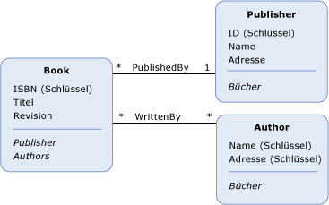

# Schlüsselkonzepte im Entity Data ModelEntity Data Model Key Concepts
Das Entity Data Model (EDM) verwendet drei wichtige Konzepte zum Beschreiben der Datenstruktur: *Entitätstyp*, *Zuordnungstyp*, und *Eigenschaft*.The Entity Data Model (EDM) uses three key concepts to describe the structure of data: *entity type*, *association type*, and *property*. Diese sind die wichtigsten Konzepte zum Beschreiben der Datenstruktur in einer beliebigen Implementierung des EDM.These are the most important concepts in describing the structure of data in any implementation of the EDM.  
  
## EntitätstypEntity Type  
 Die [Entitätstyp](../../../../docs/framework/data/adonet/entity-type.md) ist der wesentliche Baustein zum Beschreiben der Datenstruktur mit dem Entity Data Model.The [entity type](../../../../docs/framework/data/adonet/entity-type.md) is the fundamental building block for describing the structure of data with the Entity Data Model. In einem konzeptionellen Modell werden Entitätstypen aus erstellt [Eigenschaften](../../../../docs/framework/data/adonet/property.md) und eine Beschreibung für die Struktur der obersten Ebene Konzepte, z. B. Kunden und Bestellungen in einer Geschäftsanwendung.In a conceptual model, entity types are constructed from [properties](../../../../docs/framework/data/adonet/property.md) and describe the structure of top-level concepts, such as a customers and orders in a business application. So wie eine Klassendefinition in einem Computerprogramm eine Vorlage für Instanzen der Klasse ist, ist ein Entitätstyp eine Vorlage für Entitäten.In the same way that a class definition in a computer program is a template for instances of the class, an entity type is a template for entities. Eine Entität stellt ein bestimmtes Objekt dar (z. B. einen bestimmter Kunde oder eine Bestellung).An entity represents a specific object (such as a specific customer or order). Jede Entität muss eine eindeutige verfügen [Entitätsschlüssel](../../../../docs/framework/data/adonet/entity-key.md) innerhalb einer [Entitätenmenge](../../../../docs/framework/data/adonet/entity-set.md).Each entity must have a unique [entity key](../../../../docs/framework/data/adonet/entity-key.md) within an [entity set](../../../../docs/framework/data/adonet/entity-set.md).  Eine Entitätenmenge ist eine Auflistung der Instanzen eines bestimmten Entitätstyps.An entity set is a collection of instances of a specific entity type. Entitätenmengen (und [Zuordnungssätze](../../../../docs/framework/data/adonet/association-set.md)) in logisch gruppiert sind ein [Entitätscontainer](../../../../docs/framework/data/adonet/entity-container.md).Entity sets (and [association sets](../../../../docs/framework/data/adonet/association-set.md)) are logically grouped in an [entity container](../../../../docs/framework/data/adonet/entity-container.md).  
  
 Die Vererbung wird für Entitätstypen unterstützt; das heißt, ein Entitätstyp kann von einem anderen abgeleitet werden.Inheritance is supported with entity types: that is, one entity type can be derived from another. Weitere Informationen finden Sie unter [Entity Data Model: Vererbung](../../../../docs/framework/data/adonet/entity-data-model-inheritance.md).For more information, see [Entity Data Model: Inheritance](../../../../docs/framework/data/adonet/entity-data-model-inheritance.md).  
  
## ZuordnungstypAssociation Type  
 Ein [Zuordnungstyp](../../../../docs/framework/data/adonet/association-type.md) (auch als Zuordnung bezeichnet) ist der wesentliche Baustein zum Beschreiben von Beziehungen im Entity Data Model.An [association type](../../../../docs/framework/data/adonet/association-type.md) (also called an association) is the fundamental building block for describing relationships in the Entity Data Model. In einem konzeptionellen Modell stellt eine Zuordnung eine Beziehung zwischen zwei Entitätstypen dar (z. B. Customer und Order).In a conceptual model, an association represents a relationship between two entity types (such as Customer and Order). Jede Zuordnung verfügt über zwei [Zuordnungsenden](../../../../docs/framework/data/adonet/association-end.md) angeben, dass die Entitätstypen in der Zuordnung.Every association has two [association ends](../../../../docs/framework/data/adonet/association-end.md) that specify the entity types involved in the association. Jedes Zuordnungsende gibt auch an ein [zuordnungsendes](../../../../docs/framework/data/adonet/association-end-multiplicity.md) , der die Anzahl der Entitäten, die an diesem Ende der Zuordnung angibt.Each association end also specifies an [association end multiplicity](../../../../docs/framework/data/adonet/association-end-multiplicity.md) that indicates the number of entities that can be at that end of the association. Die Multiplizität eines Zuordnungsendes kann über einen Wert von eins (1), null oder eins (0..1) oder n (\*) verfügen.An association end multiplicity can have a value of one (1), zero or one (0..1), or many (\*). Entitäten an einem Ende einer Zuordnung durch zugegriffen werden können [Navigationseigenschaften](../../../../docs/framework/data/adonet/navigation-property.md), oder über Fremdschlüssel, wenn sie für einen Entitätstyp verfügbar gemacht werden.Entities at one end of an association can be accessed through [navigation properties](../../../../docs/framework/data/adonet/navigation-property.md), or through foreign keys if they are exposed on an entity type. Weitere Informationen finden Sie unter [Fremdschlüsseleigenschaft](../../../../docs/framework/data/adonet/foreign-key-property.md).For more information, see [foreign key property](../../../../docs/framework/data/adonet/foreign-key-property.md).  
  
 In einer Anwendung stellt eine Instanz einer Zuordnung eine bestimmte Zuordnung dar (z. B. eine Zuordnung zwischen einer Instanz von Customer und einer Instanz von Order).In an application, an instance of an association represents a specific association (such as an association between an instance of Customer and instances of Order). Zuordnungsinstanzen werden logisch gruppiert eine [Zuordnungssatz](../../../../docs/framework/data/adonet/association-set.md).Association instances are logically grouped in an [association set](../../../../docs/framework/data/adonet/association-set.md). Zuordnungssätze (und [Entitätenmengen](../../../../docs/framework/data/adonet/entity-set.md)) in logisch gruppiert sind ein [Entitätscontainer](../../../../docs/framework/data/adonet/entity-container.md).Association sets (and [entity sets](../../../../docs/framework/data/adonet/entity-set.md)) are logically grouped in an [entity container](../../../../docs/framework/data/adonet/entity-container.md).  
  
## EigenschaftProperty  
 [Entitätstypen](../../../../docs/framework/data/adonet/entity-type.md) enthalten [Eigenschaften](../../../../docs/framework/data/adonet/property.md) , die ihre Struktur und Eigenschaften definieren.[Entity types](../../../../docs/framework/data/adonet/entity-type.md) contain [properties](../../../../docs/framework/data/adonet/property.md) that define their structure and characteristics. Ein Customer-Entitätstyp kann z. B. über Eigenschaften wie CustomerId, Name und Adress verfügen.For example, a Customer entity type may have properties such as CustomerId, Name, and Address.  
  
 Eigenschaften in einem konzeptionellen Modell sind analog zu Eigenschaften, die für eine Klasse in einem Computerprogramm definiert wurden.Properties in a conceptual model are analogous to properties defined on a class in a computer program. So wie Eigenschaften die Form einer Klasse definieren und Informationen zu Objekten enthalten definieren Eigenschaften in einem konzeptionellen Modell die Form eines Entitätstyps und enthalten Informationen zu Entitätstypinstanzen.In the same way that properties on a class define the shape of the class and carry information about objects, properties in a conceptual model define the shape of an entity type and carry information about entity type instances.  
  
 Eine Eigenschaft kann primitive Daten (z. B. eine Zeichenfolge, eine ganze Zahl oder einen booleschen Wert) oder strukturierte Daten (z. B. einen komplexen Typ) enthalten.A property can contain primitive data (such as a string, an integer, or a Boolean value), or structured data (such as a complex type). Weitere Informationen finden Sie unter [Entity Data Model: Primitive Datentypen](../../../../docs/framework/data/adonet/entity-data-model-primitive-data-types.md).For more information, see [Entity Data Model: Primitive Data Types](../../../../docs/framework/data/adonet/entity-data-model-primitive-data-types.md).  
  
## Darstellungen eines konzeptionellen ModellsRepresentations of a Conceptual Model  
 Ein *Konzeptmodell* ist eine bestimmte Darstellung der Struktur einiger Daten als Entitäten und Beziehungen.A *conceptual model* is a specific representation of the structure of some data as entities and relationships. Eine Möglichkeit zur Darstellung eines konzeptionellen Modells ist ein Diagramm.One way to represent a conceptual model is with a diagram. Das folgende Diagramm stellt ein konzeptionelles Modell mit drei Entitätstypen (`Book`, `Publisher` und `Author`) sowie zwei Zuordnungen (`PublishedBy` und `WrittenBy`) dar:The following diagram represents a conceptual model with three entity types (`Book`, `Publisher`, and `Author`) and two associations (`PublishedBy` and `WrittenBy`):  
  
   
  
 Diese Darstellung hat jedoch einige Nachteile beim Bereitstellen einiger Details zum Modell.This representation, however, has some shortcomings when it comes to conveying some details about the model. Informationen zu Eigenschaftentyp und Entitätenmenge werden z. B. nicht im Diagramm bereitgestellt.For example, property type and entity set information are not conveyed in the diagram. Der Umfang eines konzeptionellen Modells kann mit einer domänenspezifischen Sprache (DSL) deutlicher vermittelt werden.The richness of a conceptual model can be conveyed more clearly with a domain-specific language (DSL). Die [ADO.NET Entity Framework](../../../../docs/framework/data/adonet/ef/index.md) verwendet eine XML-basierte DSL mit der Bezeichnung *konzeptionelle Schemadefinitionssprache* ([CSDL](../../../../docs/framework/data/adonet/ef/language-reference/csdl-specification.md)) um konzeptionelle Modelle zu definieren.The [ADO.NET Entity Framework](../../../../docs/framework/data/adonet/ef/index.md) uses an XML-based DSL called *conceptual schema definition language* ([CSDL](../../../../docs/framework/data/adonet/ef/language-reference/csdl-specification.md)) to define conceptual models. Das Folgende ist die CSDL-Definition des oben im Diagramm gezeigten konzeptionellen Modells:The following is the CSDL definition of the conceptual model in the diagram above:  
  
 [!code-xml[EDM_Example_Model#EDMExampleCSDL](../../../../samples/snippets/xml/VS_Snippets_Data/edm_example_model/xml/books.edmx#edmexamplecsdl)]  
  
## Siehe auchSee Also  
 [Entity Data ModelEntity Data Model](../../../../docs/framework/data/adonet/entity-data-model.md)
