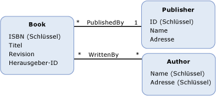

# Fremdschlüsseleigenschaftforeign key property
Ein *Fremdschlüsseleigenschaft* im Entity Data Model (EDM) ist ein primitiver Typ [Eigenschaft](../../../../docs/framework/data/adonet/property.md) (oder einen Satz von primitiven Typeigenschaften) auf eine [Entitätstyp](../../../../docs/framework/data/adonet/entity-type.md) , enthält die [Entitätsschlüssel](../../../../docs/framework/data/adonet/entity-key.md) eines anderen Entitätstyps.A *foreign key property* in the Entity Data Model (EDM) is a primitive type [property](../../../../docs/framework/data/adonet/property.md) (or a set of primitive type properties) on an [entity type](../../../../docs/framework/data/adonet/entity-type.md) that contains the [entity key](../../../../docs/framework/data/adonet/entity-key.md) of another entity type.  
  
 Eine Fremdschlüsseleigenschaft entspricht einer Fremdschlüsselspalte in einer relationalen Datenbank.A foreign key property is analogous to a foreign key column in a relational database. Auf die gleiche Weise, dass Fremdschlüsselspalten in einer relationalen Datenbank verwendet werden, um Beziehungen zwischen Zeilen in Tabellen zu erstellen, dienen Fremdschlüsseleigenschaften in einem konzeptionellen Modell herstellen [Zuordnungen](../../../../docs/framework/data/adonet/association-type.md) zwischen Entitätstypen.In the same way that foreign key columns are used in a relational database to create relationships between rows in tables, foreign key properties in a conceptual model are used to establish [associations](../../../../docs/framework/data/adonet/association-type.md) between entity types. Ein [Einschränkung der referenziellen Integrität](../../../../docs/framework/data/adonet/referential-integrity-constraint.md) dient zum Definieren einer Beziehung zwischen zwei Entitätstypen, wenn einer der Typen eine Fremdschlüsseleigenschaft verfügt.A [referential integrity constraint](../../../../docs/framework/data/adonet/referential-integrity-constraint.md) is used to define an association between two entity types when one of the types has a foreign key property.  
  
## BeispielExample  
 Die unten stehende Abbildung zeigt ein konzeptionelles Modell mit drei Entitätstypen: `Book`, `Publisher` und `Author`.The diagram below shows a conceptual model with three entity types: `Book`, `Publisher`, and `Author`. Der `Book`-Entitätstyp verfügt über die Eigenschaft `PublisherId`, die auf den Entitätsschlüssel des `Publisher`-Entitätstyps verweist, wenn Sie eine Einschränkung der referenziellen Integrität für die `PublishedBy`-Zuordnung definieren.The `Book` entity type has a property, `PublisherId`, that references the entity key of the `Publisher` entity type when you define a referential integrity constraint on the `PublishedBy` association.  
  
   
  
 Die [ADO.NET Entity Framework](../../../../docs/framework/data/adonet/ef/index.md) verwendet eine domänenspezifische Sprache (DSL) Bezeichnung konzeptionelle Schemadefinitionssprache ([CSDL](../../../../docs/framework/data/adonet/ef/language-reference/csdl-specification.md)) um konzeptionelle Modelle zu definieren.The [ADO.NET Entity Framework](../../../../docs/framework/data/adonet/ef/index.md) uses a domain-specific language (DSL) called conceptual schema definition language ([CSDL](../../../../docs/framework/data/adonet/ef/language-reference/csdl-specification.md)) to define conceptual models. Die folgende CSDL verwendet die Fremdschlüsseleigenschaft `PublisherId`, um eine Einschränkung der referenziellen Integrität für die `PublishedBy`-Zuordnung zu definieren, die im konzeptionellen Modell oben gezeigt wurde.The following CSDL uses the foreign key property `PublisherId` to define a referential integrity constraint on the `PublishedBy` association shown in the conceptual model shown above.  
  
 [!code-xml[EDM_Example_Model#RefConstraint](../../../../samples/snippets/xml/VS_Snippets_Data/edm_example_model/xml/books4.edmx#refconstraint)]  
  
## Siehe auchSee Also  
 [Schlüsselkonzepte im Entity Data ModelEntity Data Model Key Concepts](../../../../docs/framework/data/adonet/entity-data-model-key-concepts.md)  
 [Entity Data ModelEntity Data Model](../../../../docs/framework/data/adonet/entity-data-model.md)
