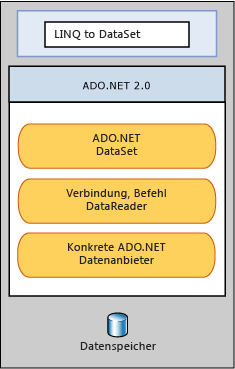

# LINQ to DataSetLINQ to DataSet
Mit [!INCLUDE[linq_dataset](../../../../includes/linq-dataset-md.md)] können Daten, die in einem <xref:System.Data.DataSet>-Objekt zwischengespeichert sind, leichter und schneller abgefragt werden.[!INCLUDE[linq_dataset](../../../../includes/linq-dataset-md.md)] makes it easier and faster to query over data cached in a <xref:System.Data.DataSet> object. Insbesondere [!INCLUDE[linq_dataset](../../../../includes/linq-dataset-md.md)] vereinfacht, da der Entwickler Schreiben von Abfragen in der Programmiersprache selbst, anstatt eine separate Abfragesprache mit Abfragen.Specifically, [!INCLUDE[linq_dataset](../../../../includes/linq-dataset-md.md)] simplifies querying by enabling developers to write queries from the programming language itself, instead of by using a separate query language. Dies ist besonders nützlich für [!INCLUDE[vsprvs](../../../../includes/vsprvs-md.md)] jetzt die syntaxüberprüfung der Zeitpunkt der Kompilierung, statische Typisierung und IntelliSense-Unterstützung durch nutzen können Entwickler die [!INCLUDE[vsprvs](../../../../includes/vsprvs-md.md)] in seinen Abfragen.This is especially useful for [!INCLUDE[vsprvs](../../../../includes/vsprvs-md.md)] developers, who can now take advantage of the compile-time syntax checking, static typing, and IntelliSense support provided by the [!INCLUDE[vsprvs](../../../../includes/vsprvs-md.md)] in their queries.  
  
 [!INCLUDE[linq_dataset](../../../../includes/linq-dataset-md.md)] kann auch für das Abfragen von Daten verwendet werden, die aus einer oder mehreren Datenquellen konsolidiert wurden. can also be used to query over data that has been consolidated from one or more data sources. Dies ermöglicht eine Vielzahl von Szenarios, bei denen Flexibilität bei der Darstellung und Behandlung von Daten erforderlich ist, wie das Abfragen lokal aggregierter Daten und die Zwischenspeicherung auf der mittleren Ebene bei Webanwendungen.This enables many scenarios that require flexibility in how data is represented and handled, such as querying locally aggregated data and middle-tier caching in Web applications. Diese Manipulationsmethode wird insbesondere bei der Erstellung von Berichterstellungs-, Analyse- und Business Intelligence-Anwendungen benötigt.In particular, generic reporting, analysis, and business intelligence applications require this method of manipulation.  
  
 Die [!INCLUDE[linq_dataset](../../../../includes/linq-dataset-md.md)] Funktionalität wird bereitgestellt, in erster Linie durch die Erweiterungsmethoden in den <xref:System.Data.DataRowExtensions> und <xref:System.Data.DataTableExtensions> Klassen.The [!INCLUDE[linq_dataset](../../../../includes/linq-dataset-md.md)] functionality is exposed primarily through the extension methods in the <xref:System.Data.DataRowExtensions> and <xref:System.Data.DataTableExtensions> classes. [!INCLUDE[linq_dataset](../../../../includes/linq-dataset-md.md)]baut auf und verwendet die vorhandene [!INCLUDE[ado_whidbey_long](../../../../includes/ado-whidbey-long-md.md)] -Architektur und ist nicht vorgesehen, ersetzen Sie [!INCLUDE[ado_whidbey_long](../../../../includes/ado-whidbey-long-md.md)] im Anwendungscode. builds on and uses the existing [!INCLUDE[ado_whidbey_long](../../../../includes/ado-whidbey-long-md.md)] architecture, and is not meant to replace [!INCLUDE[ado_whidbey_long](../../../../includes/ado-whidbey-long-md.md)] in application code. Der vorhandene ADO.NET 2.0-Code funktioniert auch in einer [!INCLUDE[linq_dataset](../../../../includes/linq-dataset-md.md)]-Anwendung.Existing ADO.NET 2.0 code will continue to function in a [!INCLUDE[linq_dataset](../../../../includes/linq-dataset-md.md)] application. Die Beziehung zwischen [!INCLUDE[linq_dataset](../../../../includes/linq-dataset-md.md)] und [!INCLUDE[ado_whidbey_long](../../../../includes/ado-whidbey-long-md.md)] und dem Datenspeicher wird im folgenden Diagramm illustriert.The relationship of [!INCLUDE[linq_dataset](../../../../includes/linq-dataset-md.md)] to [!INCLUDE[ado_whidbey_long](../../../../includes/ado-whidbey-long-md.md)] and the data store is illustrated in the following diagram.  
  
   
  
## In diesem AbschnittIn This Section  
 [Erste SchritteGetting Started](../../../../docs/framework/data/adonet/getting-started-linq-to-dataset.md)  
  
 [ProgrammierhandbuchProgramming Guide](../../../../docs/framework/data/adonet/programming-guide-linq-to-dataset.md)  
  
## VerweisReference  
 <xref:System.Data.DataTableExtensions>  
  
 <xref:System.Data.DataRowExtensions>  
  
 <xref:System.Data.DataRowComparer>  
  
## Siehe auchSee Also  
 [LINQ (Language Integrated Query)LINQ (Language-Integrated Query)](http://msdn.microsoft.com/library/a73c4aec-5d15-4e98-b962-1274021ea93d)  
 [LINQ und ADO.NETLINQ and ADO.NET](../../../../docs/framework/data/adonet/linq-and-ado-net.md)  
 [ADO.NETADO.NET](../../../../docs/framework/data/adonet/index.md)
