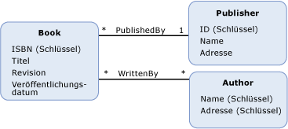

# Modelldefinierte Funktionmodel-defined function
Ein *modelldefinierte Funktion* ist eine Funktion, die in einem konzeptionellen Modell definiert ist.A *model-defined function* is a function that is defined in a conceptual model. Der Text einer modelldefinierten Funktion, ausgedrückt in [Entity SQL](../../../../docs/framework/data/adonet/ef/language-reference/entity-sql-language.md), wodurch für die Funktion unabhängig von ausgedrückt werden Regeln oder Sprachen, die in der Datenquelle unterstützt.The body of a model-defined function is expressed in [Entity SQL](../../../../docs/framework/data/adonet/ef/language-reference/entity-sql-language.md), which allows for the function to be expressed independently of rules or languages supported in the data source.  
  
 Eine Definition für eine modelldefinierte Funktion enthält die folgenden Informationen:A definition for a model-defined function contains the following information:  
  
-   Einen Funktionsnamen.A function name. (erforderlich)(Required)  
  
-   Den Typ des Rückgabewerts.The type of the return value. (Optional)(Optional)  
  
    > [!NOTE]
    >  Wenn kein Rückgabetyp angegeben wird, ist der Rückgabewert leer.If no return type is specified, the return value is void.  
  
-   Parameterinformationen.Parameter information. (Optional)(Optional)  
  
-   Ein [Entity SQL](../../../../docs/framework/data/adonet/ef/language-reference/entity-sql-language.md) Ausdruck, der den Textkörper der Funktion definiert.An [Entity SQL](../../../../docs/framework/data/adonet/ef/language-reference/entity-sql-language.md) expression that defines the body of the function.  
  
 Beachten Sie, dass modelldefinierte Funktionen keine Ausgabeparameter unterstützen.Note that model-defined functions do not support output parameters. Diese Einschränkung ist vorhanden, damit modelldefinierte Funktionen verfasst werden können.This restriction is in place so that model-defined functions can be composed.  
  
## BeispielExample  
 Die unten stehende Abbildung zeigt ein konzeptionelles Modell mit drei Entitätstypen: `Book`, `Publisher` und `Author`.The diagram below shows a conceptual model with three entity types: `Book`, `Publisher`, and `Author`.  
  
   
  
 Die [ADO.NET Entity Framework](../../../../docs/framework/data/adonet/ef/index.md) verwendet eine domänenspezifische Sprache (DSL) Bezeichnung konzeptionelle Schemadefinitionssprache ([CSDL](../../../../docs/framework/data/adonet/ef/language-reference/csdl-specification.md)), konzeptionelle Modelle zu definieren.The [ADO.NET Entity Framework](../../../../docs/framework/data/adonet/ef/index.md) uses a domain-specific language (DSL) called conceptual schema definition language ([CSDL](../../../../docs/framework/data/adonet/ef/language-reference/csdl-specification.md)) to define conceptual models. Die folgende CSDL definiert eine Funktion im konzeptionellen Modell, das die Anzahl der Jahre zurückgibt, seit eine Instanz eines `Book` (in der Abbildung oben) veröffentlicht wurde.The following CSDL defines a function in the conceptual model that returns the numbers of years since an instance of a `Book` (in the diagram above) was published.  
  
 [!code-xml[EDM_Example_Model#ModelDefinedFunction](../../../../samples/snippets/xml/VS_Snippets_Data/edm_example_model/xml/books4.edmx#modeldefinedfunction)]  
  
## Siehe auchSee also
- [Schlüsselkonzepte im Entity Data ModelEntity Data Model Key Concepts](../../../../docs/framework/data/adonet/entity-data-model-key-concepts.md)
- [Entity Data ModelEntity Data Model](../../../../docs/framework/data/adonet/entity-data-model.md)
- [Entity Data Model: Primitive DatentypenEntity Data Model: Primitive Data Types](../../../../docs/framework/data/adonet/entity-data-model-primitive-data-types.md)
