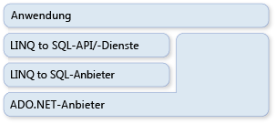

# ADO.NET und LINQ to SQL

[!INCLUDE[vbtecdlinq](../../../../../../includes/vbtecdlinq-md.md)] ist Teil der ADO.NET-Technologie Familie. Es basiert auf Diensten, die vom ADO.NET-Anbieter Modell bereitgestellt werden. Daher können Sie [!INCLUDE[vbtecdlinq](../../../../../../includes/vbtecdlinq-md.md)] Code mit vorhandenen ADO.NET-Anwendungen kombinieren und aktuelle ADO.net-Lösungen zu migrieren [!INCLUDE[vbtecdlinq](../../../../../../includes/vbtecdlinq-md.md)] . Die folgende Abbildung stellt eine allgemeine Ansicht der Beziehung dar.  
  
   
  
## Verbindungen  

 Sie können eine vorhandene ADO.NET-Verbindung bereitstellen, wenn Sie einen erstellen [!INCLUDE[vbtecdlinq](../../../../../../includes/vbtecdlinq-md.md)] <xref:System.Data.Linq.DataContext> . Alle Vorgänge <xref:System.Data.Linq.DataContext> für (einschließlich Abfragen) verwenden diese angegebene Verbindung. Wenn die Verbindung bereits geöffnet ist, [!INCLUDE[vbtecdlinq](../../../../../../includes/vbtecdlinq-md.md)] bleibt sie unverändert, wenn Sie Sie fertiggestellt haben.  
  
 [!code-csharp[DLinqCommunicatingWithDatabase#4](../../../../../../samples/snippets/csharp/VS_Snippets_Data/DLinqCommunicatingWithDatabase/cs/Program.cs#4)]
 [!code-vb[DLinqCommunicatingWithDatabase#4](../../../../../../samples/snippets/visualbasic/VS_Snippets_Data/DLinqCommunicatingWithDatabase/vb/Module1.vb#4)]  
  
 Sie können stets auf die Verbindung zugreifen und diese selbst beenden, indem Sie die <xref:System.Data.Linq.DataContext.Connection%2A>-Eigenschaft wie im folgenden Code verwenden:  
  
 [!code-csharp[DLinqAdoNet#1](../../../../../../samples/snippets/csharp/VS_Snippets_Data/DLinqAdoNet/cs/Program.cs#1)]
 [!code-vb[DLinqAdoNet#1](../../../../../../samples/snippets/visualbasic/VS_Snippets_Data/DLinqAdoNet/vb/Module1.vb#1)]  
  
## Transaktionen  

 Sie können Ihren <xref:System.Data.Linq.DataContext> mit Ihrer eigenen Datenbanktransaktion ergänzen, wenn Ihre Anwendung die Transaktion bereits initiiert hat und Sie möchten, dass der <xref:System.Data.Linq.DataContext> berücksichtigt wird.  
  
 Die bevorzugte Methode zum Durchführen von Transaktionen mit dem .NET Framework ist die Verwendung des- <xref:System.Transactions.TransactionScope> Objekts. Mithilfe dieses Ansatzes können Sie verteilte Transaktionen erstellen, die über Datenbanken hinweg und in Verbindung mit anderen speicherresidenten Ressourcen-Managern funktionieren. Transaktionsbereiche erfordern zunächst wenige Ressourcen. Sie stufen sich selbst nur dann zu verteilten Transaktionen hoch, wenn mehrere Verbindungen innerhalb des Transaktionsbereichs vorliegen.  
  
 [!code-csharp[DLinqAdoNet#2](../../../../../../samples/snippets/csharp/VS_Snippets_Data/DLinqAdoNet/cs/Program.cs#2)]
 [!code-vb[DLinqAdoNet#2](../../../../../../samples/snippets/visualbasic/VS_Snippets_Data/DLinqAdoNet/vb/Module1.vb#2)]  
  
 Sie können diesen Ansatz nicht für alle Datenbanken verwenden. Beispielsweise kann die SqlClient-Verbindung keine System Transaktionen herauf Stufen, wenn Sie mit einem SQL Server 2000-Server funktioniert. Stattdessen wird automatisch eine vollständige, verteilte Transaktion erzeugt, wenn erkannt wird, dass ein Transaktionsbereich genutzt wird.  
  
## Direkte SQL-Befehle  

 Es kann zu Situationen kommen, in denen die Möglichkeiten des <xref:System.Data.Linq.DataContext> zum Abfragen oder zum Übergeben von Änderungen für die spezifische Aufgabe nicht ausreichen. In diesen Fällen können Sie die <xref:System.Data.Linq.DataContext.ExecuteQuery%2A>-Methode verwenden, um SQL-Befehle an die Datenbank zu übergeben und die Abfrageergebnisse in Objekte zu konvertieren.  
  
 Nehmen Sie zum Beispiel an, dass die Daten der `Customer`-Klasse auf zwei Tabellen (customer1 und customer2) verteilt sind. Die folgende Abfrage gibt eine Sequenz von `Customer`-Objekten zurück:  
  
 [!code-csharp[DLinqAdoNet#3](../../../../../../samples/snippets/csharp/VS_Snippets_Data/DLinqAdoNet/cs/Program.cs#3)]
 [!code-vb[DLinqAdoNet#3](../../../../../../samples/snippets/visualbasic/VS_Snippets_Data/DLinqAdoNet/vb/Module1.vb#3)]  
  
 Solange die Spaltennamen im tabellarischen Ergebnis den Spalten Eigenschaften ihrer Entitäts Klasse entsprechen, [!INCLUDE[vbtecdlinq](../../../../../../includes/vbtecdlinq-md.md)] erstellt die Objekte aus einer beliebigen SQL-Abfrage.  
  
### Parameter  

 Die <xref:System.Data.Linq.DataContext.ExecuteQuery%2A>-Methode akzeptiert Parameter. Der folgende Code führt eine parametrisierte Abfrage aus:  
  
 [!code-csharp[DlinqAdoNet#4](../../../../../../samples/snippets/csharp/VS_Snippets_Data/DLinqAdoNet/cs/Program.cs#4)]
 [!code-vb[DlinqAdoNet#4](../../../../../../samples/snippets/visualbasic/VS_Snippets_Data/DLinqAdoNet/vb/Module1.vb#4)]  
  
> [!NOTE]
> Parameter werden im Abfragetext mithilfe der gleichen verschachtelten Schreibweise wie in `Console.WriteLine()` und `String.Format()` ausgedrückt. `String.Format()` ersetzt die verschachtelten Parameter der angegebenen Abfragezeichenfolge durch generierte Parameternamen, wie z. B. `@p0`, `@p1` …, `@p(n)`.  
  
## Weitere Informationen

- [Hintergrundinformationen](background-information.md)
- [Vorgehensweise: Wiederverwenden einer Verbindung zwischen einem ADO.NET-Befehl und einem DataContext](how-to-reuse-a-connection-between-an-ado-net-command-and-a-datacontext.md)
