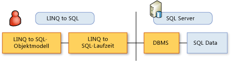

# Das LINQ to SQL-ObjektmodellThe LINQ to SQL Object Model
In [!INCLUDE[vbtecdlinq](../../../../../../includes/vbtecdlinq-md.md)], ein in der Programmiersprache des Entwicklers ausgedrücktes Objektmodell dem Datenmodell einer relationalen Datenbank zugeordnet ist.In [!INCLUDE[vbtecdlinq](../../../../../../includes/vbtecdlinq-md.md)], an object model expressed in the programming language of the developer is mapped to the data model of a relational database. Operationen mit den Daten werden dann nach dem Objektmodell durchgeführt.Operations on the data are then conducted according to the object model.  
  
 In diesem Szenario übergeben Sie keine Datenbankbefehle (z. B. `INSERT`) an die Datenbank.In this scenario, you do not issue database commands (for example, `INSERT`) to the database. Stattdessen ändern Sie Werte und führen Methoden innerhalb des Objektmodells aus.Instead, you change values and execute methods within your object model. Wenn Sie die Datenbank abfragen oder Änderungen übergeben möchten, übersetzt [!INCLUDE[vbtecdlinq](../../../../../../includes/vbtecdlinq-md.md)] Ihre Anforderungen in die richtigen SQL-Befehle und sendet diese an die Datenbank.When you want to query the database or send it changes, [!INCLUDE[vbtecdlinq](../../../../../../includes/vbtecdlinq-md.md)] translates your requests into the correct SQL commands and sends those commands to the database.  
  
   
  
 Die grundlegenden Elemente in der [!INCLUDE[vbtecdlinq](../../../../../../includes/vbtecdlinq-md.md)] Objektmodell und deren Beziehungen zu Elementen im relationalen Datenmodell werden in der folgenden Tabelle zusammengefasst:The most fundamental elements in the [!INCLUDE[vbtecdlinq](../../../../../../includes/vbtecdlinq-md.md)] object model and their relationship to elements in the relational data model are summarized in the following table:  
  
|LINQ to SQL-ObjektmodellLINQ to SQL Object Model|Relationales DatenmodellRelational Data Model|  
|------------------------------|---------------------------|  
|EntitätsklasseEntity class|TabelleTable|  
|KlassenmemberClass member|SpalteColumn|  
|ZuordnungAssociation|FremdschlüsselbeziehungForeign-key relationship|  
|MethodeMethod|Gespeicherte Prozedur oder FunktionStored Procedure or Function|  
  
> [!NOTE]
>  Die folgenden Beschreibungen gehen davon aus, dass Sie über Grundkenntnisse des relationalen Datenmodells und der Regeln verfügen.The following descriptions assume that you have a basic knowledge of the relational data model and rules.  
  
## LINQ to SQL-Entitätsklassen und DatenbanktabellenLINQ to SQL Entity Classes and Database Tables  
 In [!INCLUDE[vbtecdlinq](../../../../../../includes/vbtecdlinq-md.md)], eine Datenbanktabelle wird dargestellt, indem ein *Entitätsklasse*.In [!INCLUDE[vbtecdlinq](../../../../../../includes/vbtecdlinq-md.md)], a database table is represented by an *entity class*. Eine Entitätsklasse entspricht jeder anderen Klasse, die Sie erstellen können. Allerdings fügen Sie der Klasse Anmerkungen mit speziellen Informationen hinzu, die diese Klasse einer Datenbanktabelle zuweisen.An entity class is like any other class you might create except that you annotate the class by using special information that associates the class with a database table. Sie fügen diese Anmerkungen hinzu, indem Sie Ihrer Klassendeklaration ein benutzerdefiniertes Attribut (<xref:System.Data.Linq.Mapping.TableAttribute>) hinzufügen. Siehe hierzu das folgende Beispiel:You make this annotation by adding a custom attribute (<xref:System.Data.Linq.Mapping.TableAttribute>) to your class declaration, as in the following example:  
  
### BeispielExample  
 [!code-csharp[DLinqObjectModel#1](../../../../../../samples/snippets/csharp/VS_Snippets_Data/DLinqObjectModel/cs/Program.cs#1)]
 [!code-vb[DLinqObjectModel#1](../../../../../../samples/snippets/visualbasic/VS_Snippets_Data/DLinqObjectModel/vb/Module1.vb#1)]  
  
 Nur als Tabelle deklarierte Klasseninstanzen (Entitätsklassen) können in der Datenbank gespeichert werden.Only instances of classes declared as tables (that is, entity classes) can be saved to the database.  
  
 Weitere Informationen finden Sie im Abschnitt Tabellenattributen [attributbasierte Zuordnung](../../../../../../docs/framework/data/adonet/sql/linq/attribute-based-mapping.md).For more information, see the Table Attribute section of [Attribute-Based Mapping](../../../../../../docs/framework/data/adonet/sql/linq/attribute-based-mapping.md).  
  
## LINQ to SQL-Klassenmember und DatenbankspaltenLINQ to SQL Class Members and Database Columns  
 Neben der Zuordnung von Klassen zu Tabellen legen Sie Felder oder Eigenschaften fest, um Datenbankspalten darzustellen.In addition to associating classes with tables, you designate fields or properties to represent database columns. Zu diesem Zweck definiert [!INCLUDE[vbtecdlinq](../../../../../../includes/vbtecdlinq-md.md)] das <xref:System.Data.Linq.Mapping.ColumnAttribute>-Attribut wie im folgenden Beispiel:For this purpose, [!INCLUDE[vbtecdlinq](../../../../../../includes/vbtecdlinq-md.md)] defines the <xref:System.Data.Linq.Mapping.ColumnAttribute> attribute, as in the following example:  
  
### BeispielExample  
 [!code-csharp[DLinqObjectModel#2](../../../../../../samples/snippets/csharp/VS_Snippets_Data/DLinqObjectModel/cs/Program.cs#2)]
 [!code-vb[DLinqObjectModel#2](../../../../../../samples/snippets/visualbasic/VS_Snippets_Data/DLinqObjectModel/vb/Module1.vb#2)]  
  
 Nur Felder und Eigenschaften, die Spalten zugeordnet werden, bleiben in der Datenbank erhalten oder werden aus dieser abgerufen.Only fields and properties mapped to columns are persisted to or retrieved from the database. Alle übrigen Elemente gelten als Übergangsteile Ihrer Anwendungslogik.Those not declared as columns are considered as transient parts of your application logic.  
  
 Das <xref:System.Data.Linq.Mapping.ColumnAttribute>-Attribut weist eine Reihe von Eigenschaften auf, mit denen Sie die Member, die Spalten darstellen, anpassen können (sie können z. B. ein Member für die Darstellung einer Primärschlüsselspalte festlegen).The <xref:System.Data.Linq.Mapping.ColumnAttribute> attribute has a variety of properties that you can use to customize these members that represent columns (for example, designating a member as representing a primary key column). Weitere Informationen finden Sie im Abschnitt Spaltenattribut [attributbasierte Zuordnung](../../../../../../docs/framework/data/adonet/sql/linq/attribute-based-mapping.md).For more information, see the Column Attribute section of [Attribute-Based Mapping](../../../../../../docs/framework/data/adonet/sql/linq/attribute-based-mapping.md).  
  
## LINQ to SQL-Zuordnungen und Datenbank-FremdschlüsselbeziehungenLINQ to SQL Associations and Database Foreign-key Relationships  
 In [!INCLUDE[vbtecdlinq](../../../../../../includes/vbtecdlinq-md.md)], Sie darstellen datenbankzuordnungen (z. B. Fremdschlüssel zu primärschlüsselbeziehungen) durch Anwenden der <xref:System.Data.Linq.Mapping.AssociationAttribute> Attribut.In [!INCLUDE[vbtecdlinq](../../../../../../includes/vbtecdlinq-md.md)], you represent database associations (such as foreign-key to primary-key relationships) by applying the <xref:System.Data.Linq.Mapping.AssociationAttribute> attribute. Im folgenden Codesegment von Code der `Order` -Klasse enthält eine `Customer` Eigenschaft mit einer <xref:System.Data.Linq.Mapping.AssociationAttribute> Attribut.In the following segment of code, the `Order` class contains a `Customer` property that has an <xref:System.Data.Linq.Mapping.AssociationAttribute> attribute. Diese Eigenschaft und ihr Attribut stellen die `Order`-Klasse mit einer Beziehung zur `Customer`-Klasse bereit.This property and its attribute provide the `Order` class with a relationship to the `Customer` class.  
  
 Im folgenden Codebeispiel wird die `Customer`-Eigenschaft der `Order`-Klasse gezeigt.The following code example shows the `Customer` property from the `Order` class.  
  
### BeispielExample  
 [!code-csharp[DLinqObjectModel#3](../../../../../../samples/snippets/csharp/VS_Snippets_Data/DLinqObjectModel/cs/northwind.cs#3)]
 [!code-vb[DLinqObjectModel#3](../../../../../../samples/snippets/visualbasic/VS_Snippets_Data/DLinqObjectModel/vb/northwind.vb#3)]  
  
 Weitere Informationen finden Sie im Abschnitt Association-Attribut [attributbasierte Zuordnung](../../../../../../docs/framework/data/adonet/sql/linq/attribute-based-mapping.md).For more information, see the Association Attribute section of [Attribute-Based Mapping](../../../../../../docs/framework/data/adonet/sql/linq/attribute-based-mapping.md).  
  
## LINQ to SQL-Methoden und in der Datenbank gespeicherte ProzedurenLINQ to SQL Methods and Database Stored Procedures  
 [!INCLUDE[vbtecdlinq](../../../../../../includes/vbtecdlinq-md.md)] unterstützt gespeicherte Prozeduren und benutzerdefinierte Funktionen.supports stored procedures and user-defined functions. In [!INCLUDE[vbtecdlinq](../../../../../../includes/vbtecdlinq-md.md)], Sie diese Datenbank definierten Abstraktionen den Client-Objekten zuordnen, damit Sie in einem strikter Typzuordnung aus Clientcode darauf zugreifen können.In [!INCLUDE[vbtecdlinq](../../../../../../includes/vbtecdlinq-md.md)], you map these database-defined abstractions to client objects so that you can access them in a strongly typed manner from client code. Die Methodensignaturen entsprechen so weit wie möglich den Signaturen der Prozeduren und Funktionen in der Datenbank.The method signatures resemble as closely as possible the signatures of the procedures and functions defined in the database. Sie können IntelliSense verwenden, um diese Methoden zu ermitteln.You can use IntelliSense to discover these methods.  
  
 Ein von einem Aufruf einer zugeordneten Prozedur zurückgegebener Ergebnissatz ist eine Auflistung mit strikter Typzuordnung.A result set that is returned by a call to a mapped procedure is a strongly typed collection.  
  
 [!INCLUDE[vbtecdlinq](../../../../../../includes/vbtecdlinq-md.md)] ordnet gespeicherte Prozeduren und Funktionen den Methoden durch Verwendung des <xref:System.Data.Linq.Mapping.FunctionAttribute>-Attribut und des <xref:System.Data.Linq.Mapping.ParameterAttribute>-Attribut zu.maps stored procedures and functions to methods by using the <xref:System.Data.Linq.Mapping.FunctionAttribute> and <xref:System.Data.Linq.Mapping.ParameterAttribute> attributes. Methoden, die gespeicherte Prozeduren darstellen, werden von jenen unterschieden, die benutzerdefinierte Funktionen durch die <xref:System.Data.Linq.Mapping.FunctionAttribute.IsComposable%2A>-Eigenschaft darstellen.Methods representing stored procedures are distinguished from those representing user-defined functions by the <xref:System.Data.Linq.Mapping.FunctionAttribute.IsComposable%2A> property. Wenn diese Eigenschaft auf `false` (Standard) festgelegt wird, stellt die Methode eine gespeicherte Prozedur dar.If this property is set to `false` (the default), the method represents a stored procedure. Wenn sie auf `true` festgelegt wird, stellt die Methode eine Datenbankfunktion dar.If it is set to `true`, the method represents a database function.  
  
> [!NOTE]
>  Wenn Sie Visual Studio verwenden, können Sie die [!INCLUDE[vs_ordesigner_long](../../../../../../includes/vs-ordesigner-long-md.md)] zum Erstellen von Methoden, die die gespeicherten Prozeduren und benutzerdefinierten Funktionen zugeordnet.If you are using Visual Studio, you can use the [!INCLUDE[vs_ordesigner_long](../../../../../../includes/vs-ordesigner-long-md.md)] to create methods mapped to stored procedures and user-defined functions.  
  
### BeispielExample  
 [!code-csharp[DLinqObjectModel#4](../../../../../../samples/snippets/csharp/VS_Snippets_Data/DLinqObjectModel/cs/northwind.cs#4)]
 [!code-vb[DLinqObjectModel#4](../../../../../../samples/snippets/visualbasic/VS_Snippets_Data/DLinqObjectModel/vb/northwind.vb#4)]  
  
 Weitere Informationen finden Sie in den Abschnitten zu Funktionsattributen, gespeicherten Prozeduren und Parameter-Attribut [attributbasierte Zuordnung](../../../../../../docs/framework/data/adonet/sql/linq/attribute-based-mapping.md) und [gespeicherte Prozeduren](../../../../../../docs/framework/data/adonet/sql/linq/stored-procedures.md).For more information, see the Function Attribute, Stored Procedure Attribute, and Parameter Attribute sections of [Attribute-Based Mapping](../../../../../../docs/framework/data/adonet/sql/linq/attribute-based-mapping.md) and [Stored Procedures](../../../../../../docs/framework/data/adonet/sql/linq/stored-procedures.md).  
  
## Siehe auchSee also

- [Attributbasierte ZuordnungAttribute-Based Mapping](../../../../../../docs/framework/data/adonet/sql/linq/attribute-based-mapping.md)
- [HintergrundinformationenBackground Information](../../../../../../docs/framework/data/adonet/sql/linq/background-information.md)
