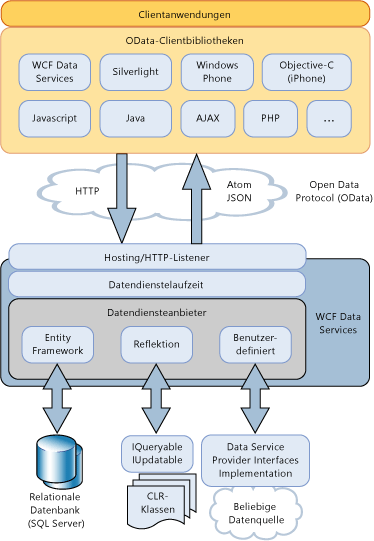

# Übersicht über WCF Data Services
[!INCLUDE[ssAstoria](../../../../includes/ssastoria-md.md)]ermöglicht das Erstellen und Verwenden von Datendiensten für das Internet oder Intranet mithilfe der [!INCLUDE[ssODataFull](../../../../includes/ssodatafull-md.md)]. [!INCLUDE[ssODataShort](../../../../includes/ssodatashort-md.md)]ermöglicht es Ihnen, Ihre Daten als Ressourcen verfügbar machen, die durch URIs adressierbar sind. Dies ermöglicht Ihnen das Zugreifen auf und Ändern von Daten mit der REST (Representational State Transfer)-Semantik, insbesondere mit den Standard-HTTP-Verben GET, PUT, POST und DELETE. Dieses Thema beinhaltet eine Übersicht sowohl über die Muster als auch die Methoden, die mit [!INCLUDE[ssODataShort](../../../../includes/ssodatashort-md.md)] definiert werden, sowie über die von [!INCLUDE[ssAstoria](../../../../includes/ssastoria-md.md)] bereitgestellten Funktionen, mit denen [!INCLUDE[ssODataShort](../../../../includes/ssodatashort-md.md)] in .NET Framework-basierten Anwendungen verwendet werden kann.  
  
## Adressieren von Daten als Ressourcen  
 [!INCLUDE[ssODataShort](../../../../includes/ssodatashort-md.md)] macht Daten als durch URIs adressierbare Ressourcen verfügbar. Die Ressourcenpfade werden anhand der Entitätsbeziehungskonventionen des Entity Data Model erstellt. In diesem Modell stellen Entitäten Funktionsbausteine von Daten in einer Anwendungsdomäne, z. B. Kunden, Bestellungen, Artikel und Produkte. Weitere Informationen finden Sie unter [Entity Data Model](../../../../docs/framework/data/adonet/entity-data-model.md).  
  
 In [!INCLUDE[ssODataShort](../../../../includes/ssodatashort-md.md)] werden Entitätsressourcen als Entitätenmenge adressiert, der Instanzen von Entitätstypen enthält. Z. B. der URI `http://services.odata.org/Northwind/Northwind.svc/Customers('ALFKI')/Orders` werden alle Bestellungen zurückgegeben der `Northwind` Datendienst, die an den Kunden mit beziehen einer `CustomerID` Wert`ALFKI.`  
  
 Mit Abfrageausdrücken können Sie herkömmliche Abfragevorgänge für Ressourcen ausführen, z. B. Filtern, Sortieren und Paging. Der URI `http://services.odata.org/Northwind/Northwind.svc/Customers('ALFKI')/Orders?$filter=Freight gt 50` filtert z. B. die Ressourcen, um nur die Bestellungen mit Frachtkosten von über 50 Dollar zurückzugeben. Weitere Informationen finden Sie unter [zugreifen auf Datendienstressourcen](../../../../docs/framework/data/wcf/accessing-data-service-resources-wcf-data-services.md).  
  
## Interoperabler Datenzugriff  
 [!INCLUDE[ssODataShort](../../../../includes/ssodatashort-md.md)]baut auf Standardinternetprotokollen Datendiensten mit Anwendungen interoperabel vornehmen, die .NET Framework nicht verwenden. Da Sie die standard-URIs Adressieren von Daten verwenden können, die Anwendung zugreifen kann und Änderungsdaten mithilfe der Semantik representational State Transfer (REST), insbesondere die standard-HTTP-Verben GET, PUT, POST und löschen. Dies ermöglicht Ihnen den Zugriff auf diese Dienste von einem Client, der über Standard-HTTP-Protokolle übertragene Daten analysieren und darauf zugreifen kann.  
  
 [!INCLUDE[ssODataShort](../../../../includes/ssodatashort-md.md)] definiert einen Satz von Erweiterungen für das Atom Publishing Protocol (AtomPub). HTTP-Anforderungen und -Antworten werden in mehreren Datenformaten unterstützt, um verschiedene Clientanwendungen und -plattformen zu unterstützen. Ein [!INCLUDE[ssODataShort](../../../../includes/ssodatashort-md.md)]-Feed kann Daten in Atom, JavaScript Object Notation (JSON) und als einfaches XML darstellen. Atom ist zwar das Standardformat, das Format des Feeds wird jedoch im Header der HTTP-Anforderung angegeben. Weitere Informationen finden Sie unter [OData: Atom-Format](http://go.microsoft.com/fwlink/?LinkID=185794) und [OData: JSON-Format](http://go.microsoft.com/fwlink/?LinkID=185795).  
  
 Beim Veröffentlichen von Daten als ein [!INCLUDE[ssODataShort](../../../../includes/ssodatashort-md.md)] feed [!INCLUDE[ssAstoria](../../../../includes/ssastoria-md.md)] weitere vorhandene Internetfunktionen für Vorgänge wie das Zwischenspeichern und die Authentifizierung benötigt. Um dies zu erreichen [!INCLUDE[ssAstoria](../../../../includes/ssastoria-md.md)] vorhandene Hostinganwendungen und Dienste, z. B. Internet Information Services (IIS), ASP.NET und Windows Communication Foundation (WCF) integriert werden.  
  
## Speicherunabhängigkeit  
 Obwohl Ressourcen auf der Grundlage eines Entitätsbeziehungsmodells adressiert werden, macht [!INCLUDE[ssAstoria](../../../../includes/ssastoria-md.md)] [!INCLUDE[ssODataShort](../../../../includes/ssodatashort-md.md)]-Feeds unabhängig von der zugrunde liegenden Datenquelle verfügbar. Nachdem [!INCLUDE[ssAstoria](../../../../includes/ssastoria-md.md)] eine HTTP-Anforderung an eine Ressource akzeptiert, die ein URI identifiziert, wird die Anforderung deserialisiert, und eine Darstellung dieser Anforderung wird an einen [!INCLUDE[ssAstoria](../../../../includes/ssastoria-md.md)]-Anbieter übergeben. Dieser Anbieter übersetzt die Anforderung in ein datenquellenspezifisches Format und führt die Anforderung für die zugrunde liegende Datenquelle aus. [!INCLUDE[ssAstoria](../../../../includes/ssastoria-md.md)] erreicht Speicherunabhängigkeit durch das Trennen des konzeptionellen Modells, das von [!INCLUDE[ssODataShort](../../../../includes/ssodatashort-md.md)] vorgeschriebene Ressourcen aus dem jeweiligen Schema der zugrunde liegenden Datenquelle adressiert.  
  
 [!INCLUDE[ssAstoria](../../../../includes/ssastoria-md.md)] ist in ADO.NET Entity Framework integriert, sodass Sie Datendienste erstellen können, die relationale Daten verfügbar machen. Sie können die Entity Data Model-Tools verwenden, um ein Datenmodell zu erstellen, das adressierbare Ressourcen als Entitäten enthält, und gleichzeitig die Zuordnung zwischen diesem Modell und den Tabellen in der zugrunde liegenden Datenbank definieren. Weitere Informationen finden Sie unter [Entity Framework-Anbieter](../../../../docs/framework/data/wcf/entity-framework-provider-wcf-data-services.md).  
  
 [!INCLUDE[ssAstoria](../../../../includes/ssastoria-md.md)]Außerdem ermöglicht es Ihnen, Datendienste zu erstellen, die alle Datenstrukturen verfügbar machen, die eine Implementierung der Zurückgeben der <xref:System.Linq.IQueryable%601> Schnittstelle. Dies ermöglicht das Erstellen von Datendiensten, die Daten aus .NET Framework-Typen verfügbar machen. Erstellungs-, Aktualisierungs- und Löschvorgänge werden unterstützt, wenn Sie außerdem die <xref:System.Data.Services.IUpdatable>-Schnittstelle implementieren. Weitere Informationen finden Sie unter [Reflektionsanbieter](../../../../docs/framework/data/wcf/reflection-provider-wcf-data-services.md).  
  
 Eine Abbildung wie [!INCLUDE[ssAstoria](../../../../includes/ssastoria-md.md)] integriert in diesen Datenanbietern finden Sie im Architekturdiagramm weiter unten in diesem Thema.  
  
## Benutzerdefinierte Geschäftslogik  
 [!INCLUDE[ssAstoria](../../../../includes/ssastoria-md.md)]vereinfacht die benutzerdefinierte Geschäftslogik an einen Datendienst über Dienstvorgängen und Interceptors hinzufügen. Dienstvorgänge sind auf dem Server definierte Methoden, die genau wie Datenressourcen über URIs adressierbar sind. Dienstvorgänge können auch Abfrageausdruckssyntax zum Filtern, Sortieren und Paging der von einem Vorgang zurückgegebenen Daten verwenden. Der URI `http://localhost:12345/Northwind.svc/GetOrdersByCity?city='London'&$orderby=OrderDate&$top=10&$skip=10` stellt z. B. einen Aufruf des Dienstvorgangs mit dem Namen `GetOrdersByCity` im Northwind-Datendienst dar, der Bestellungen für Kunden aus London mit nach `OrderDate` sortierten Seitenergebnissen zurückgibt. Weitere Informationen finden Sie unter [Dienstvorgänge](../../../../docs/framework/data/wcf/service-operations-wcf-data-services.md).  
  
 Mit Interceptoren können Sie eine benutzerdefinierte Anwendungslogik in die Verarbeitung von Anforderungs- oder Antwortnachrichten durch einen Datendienst integrieren. Interceptors werden aufgerufen, wenn für die angegebene Entitätenmenge ein Abfrage-, Einfüge-, Aktualisierungs- oder Löschvorgang durchgeführt wird. Dadurch kann ein Interceptor die Daten ändern, eine Autorisierungsrichtlinie erzwingen oder sogar den Vorgang beenden. Interceptormethoden müssen explizit für eine bestimmte Entitätenmenge, die von einem Datendienst zur Verfügung gestellt wird, registriert werden. Weitere Informationen finden Sie unter [Interceptors](../../../../docs/framework/data/wcf/interceptors-wcf-data-services.md).  
  
## Clientbibliotheken  
 [!INCLUDE[ssODataShort](../../../../includes/ssodatashort-md.md)]definiert eine Reihe einheitlicher Muster zum interagieren mit Datendiensten. Dies ermöglicht das Erstellen wiederverwendbare Komponenten, die auf diese Dienste, z. B. clientseitiger Bibliotheken basieren, die Datendienste erleichtern.  
  
 [!INCLUDE[ssAstoria](../../../../includes/ssastoria-md.md)] enthält Clientbibliotheken sowohl für .NET Framework-basierte als auch für Silverlight-basierte Clientanwendungen. Diese Clientbibliotheken ermöglichen die Interaktion mit Datendiensten mithilfe von .NET Framework-Objekten. Zudem werden objektbasierte Abfragen und LINQ-Abfragen, das Laden verknüpfter Objekte, eine Änderungsnachverfolgung und die Identitätsauflösung unterstützt. Weitere Informationen finden Sie unter [WCF Data Services-Clientbibliothek](../../../../docs/framework/data/wcf/wcf-data-services-client-library.md).  
  
 Zusätzlich zu den [!INCLUDE[ssODataShort](../../../../includes/ssodatashort-md.md)] Clientbibliotheken, die mit .NET Framework und Silverlight enthaltenen es sind weitere Clientbibliotheken verfügbar, mit denen Sie nutzen können eine [!INCLUDE[ssODataShort](../../../../includes/ssodatashort-md.md)] feed in Clientanwendungen, z. B. PHP-, AJAX- und Java-Anwendungen. Weitere Informationen finden Sie unter der [OData SDK](http://go.microsoft.com/fwlink/?LinkID=185796).  
  
## Architekturübersicht  
 Das folgende Diagramm veranschaulicht die [!INCLUDE[ssAstoria](../../../../includes/ssastoria-md.md)] -Architektur zum Verfügbarmachen von [!INCLUDE[ssODataShort](../../../../includes/ssodatashort-md.md)] Feeds und zur Verwendung dieser Feeds in [!INCLUDE[ssODataShort](../../../../includes/ssodatashort-md.md)]--fähigen Clientbibliotheken:  
  
   
  
## Siehe auch  
 [WCF Data Services 4.5](../../../../docs/framework/data/wcf/index.md)  
 [Erste Schritte](../../../../docs/framework/data/wcf/getting-started-with-wcf-data-services.md)  
 [Defining WCF Data Services](../../../../docs/framework/data/wcf/defining-wcf-data-services.md)  
 [Zugreifen auf einen Datendienst (WCF Data Services)](http://msdn.microsoft.com/en-us/1e54a2b9-2ec6-4002-b8f8-c1d8df37c350)  
 [WCF Data Services-Clientbibliothek](../../../../docs/framework/data/wcf/wcf-data-services-client-library.md)  
 [Representational State Transfer (REST)](http://go.microsoft.com/fwlink/?LinkId=113919)
