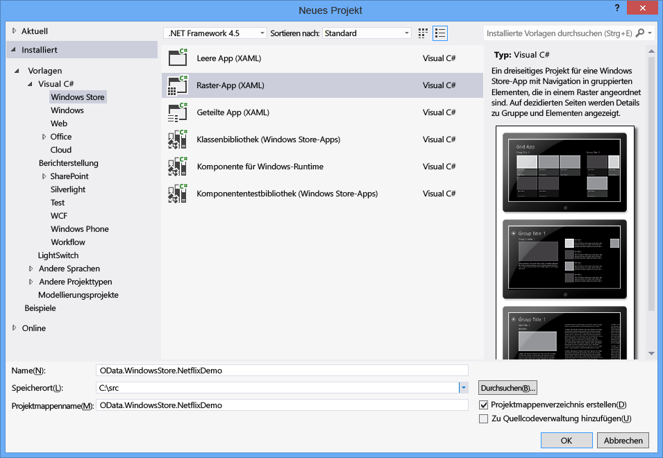
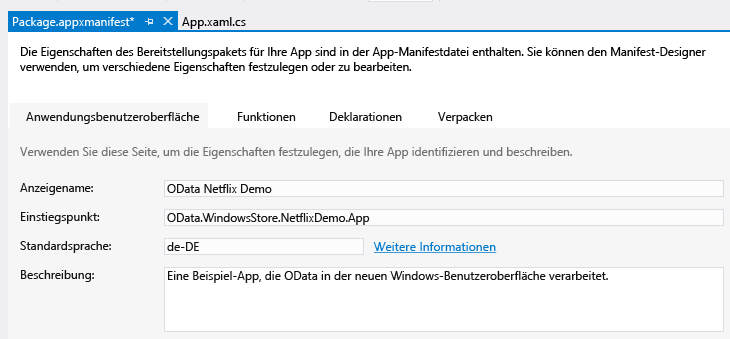
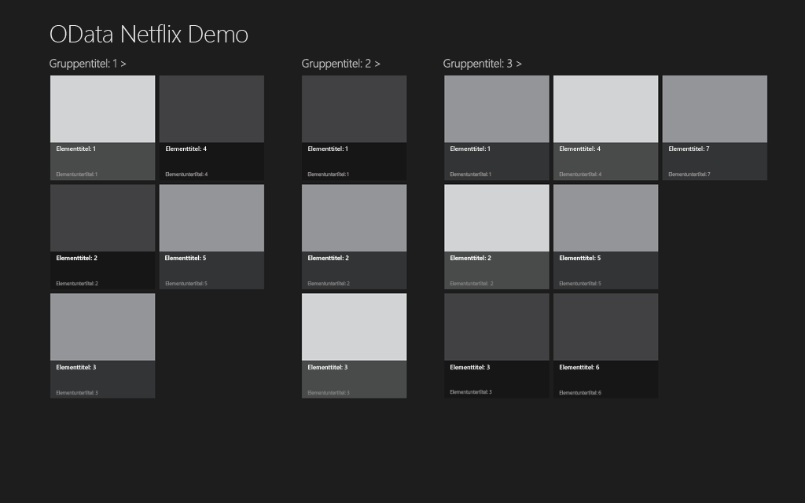
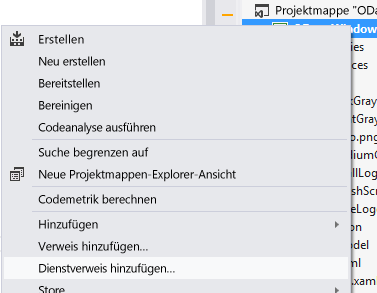
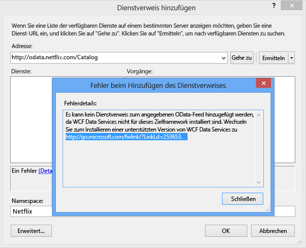
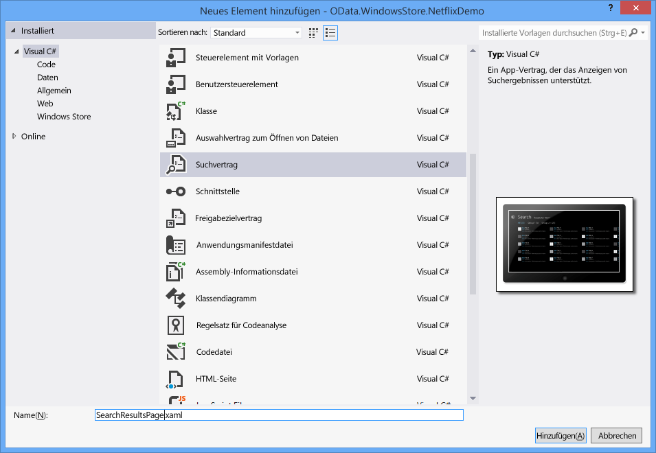

# Schreiben einer Windows Store-App, die einen OData-Dienst beansprucht
Mit Windows 8 wird ein neuer Anwendungstyp, die so genannten Windows Store\-Apps, eingeführt.  Windows Store\-Apps haben ein neues Erscheinungsbild, können auf einer Vielzahl von Geräten ausgeführt werden und werden im Windows Store bereitgestellt.  In diesem Thema wird beschrieben, wie Sie eine Windows Store\-App schreiben, die einen OData\-Dienst beansprucht, den NetFlix Catalog OData\-Dienst.  Weitere Informationen zu Windows Store\-Apps finden Sie unter [Erste Schritte mit Windows Store\-Apps](http://msdn.microsoft.com/library/windows/apps/br211386.aspx).  
  
## Voraussetzungen  
  
1.  [Microsoft Windows 8](http://go.microsoft.com/fwlink/p/?LinkId=266654)  
  
2.  [Microsoft Visual Studio 2012](http://go.microsoft.com/fwlink/p/?LinkId=266655)  
  
3.  [WCF Data Services](http://msdn.microsoft.com/data/bb931106)  
  
#### Erstellen der standardmäßigen Windows Store\-Rasteranwendung  
  
1.  Erstellen Sie eine neue Windows Store\-Rasteranwendung mithilfe von C\# und XAML.  Benennen Sie die Anwendung als OData.WindowsStore.NetflixDemo:  
  
       
  
2.  Öffnen Sie Package.appxmanifest, und geben sie im Textfeld Anzeigename einen Anzeigenamen ein.  Dies gibt den Anwendungsnamen an, der für die Windows 8\-Suchfunktion verwendet wird.  
  
       
  
3.  Geben Sie im \<AppName\>\-Element der "App.xaml"\-Datei einen Anzeigenamen ein.  Hiermit legen Sie den Anwendungsnamen fest, der beim Anwendungsstart angezeigt wird:  
  
       
  
4.  Erstellen Sie die Anwendung und führen Sie sie aus.  Zunächst wird der Begrüßungsbildschirm der Anwendung angezeigt.  Der folgende Screenshot zeigt den Standardbegrüßungsbildschirm.  Das verwendete Bild wird im Ressourcenordner des Projekts gespeichert.  
  
       
  
     Anschließend wird die Anwendung angezeigt.  
  
       
  
     Die Standardanwendung definiert eine Reihe von Klassen in SampleDataSource.cs: SampleDataGroup und SampleDataItem, die von SampleDataCommon abgeleitet werden, die wiederum von BindableBase abgeleitet wird.  SampleDataGroup und SampleDataItem sind an den Standardwert GridView gebunden.  SampleDataSource.cs befindet sich im DataModel\-Ordner innerhalb des NetflixDemo\-Projekts.  Die Anwendung zeigt eine gruppierte Auflistung an.  Jede Gruppe enthält eine Reihe von Elementen, die jeweils durch SampleDataGroup und SampleDataItem dargestellt werden.  Der vorherige Screenshot enthält die Gruppe Group Title 1. Alle Elemente in der Gruppe werden zusammen angezeigt.  
  
     Die Hauptseite der Anwendung ist GroupedItemsPage.xaml.  Sie enthält eine GridView, die die von der SampleDataSource.cs\-Klasse erstellten Beispieldaten anzeigt.  GroupedItemsPage wird von App.xaml.cs durch einen Aufruf von rootFrame.Navigate geladen:  
  
    ```csharp  
    if (!rootFrame.Navigate(typeof(GroupedItemsPage), "AllGroups"))  
    {  
        throw new Exception("Failed to create initial page");  
    }  
  
    ```  
  
     Hierdurch wird GroupedItemsPage instanziiert, und die zugehörige LoadState\-Methode wird aufgerufen.  LoadState bewirkt die Erstellung der statischen SampleDataSource\-Instanz, die eine Auflistung von SampleDataGroup\-Objekten erstellt.  Jedes SampleDataGroup\-Objekt enthält eine Auflistung von SampleDataItem\-Objekten.  LoadState speichert die Auflistung von SampleDataGroup\-Objekten in DefaultViewModel:  
  
    ```csharp  
    protected override void LoadState(Object navigationParameter, Dictionary<String, Object> pageState)  
    {  
        var sampleDataGroups = SampleDataSource.GetGroups((String)navigationParameter);  
        this.DefaultViewModel["Groups"] = sampleDataGroups;  
    }  
  
    ```  
  
     Das DefaultViewModel wird dann an die GridView gebunden.  Hierauf wird bei der Konfiguration der Datenbindung in der Datei GroupedItemsPage.xaml verwiesen.  
  
    ```cpp  
    <CollectionViewSource  
                x:Name="groupedItemsViewSource"  
                Source="{Binding Groups}"  
                IsSourceGrouped="true"  
                ItemsPath="TopItems"  
                d:Source="{Binding AllGroups, Source={d:DesignInstance Type=data:SampleDataSource, IsDesignTimeCreatable=True}}"/>  
  
    ```  
  
     CollectionViewSource wird als Proxy zum Behandeln von gruppierten Auflistungen verwendet.  Bei der Ausführung der Bindung durchläuft sie die Auflistung von SampleDataGroup\-Objekten, um die GridView aufzufüllen.  Das ItemsPath\-Attribut teilt CollectionViewSource mit, welche Eigenschaft für jedes SampleDataGroup\-Objekt verwendet werden soll, um die enthaltenen SampleDataItems.  In diesem Fall enthält jedes SampleDataGroup\-Objekt eine TopItems\-Auflistung von SampleDataItem\-Objekten.  
  
     Für die Netflix\-Anwendung werden Filme nach Genre gruppiert.  Daher zeigt die Anwendung mehrere Genres und eine Liste von Filmen innerhalb dieses Genres an.  
  
#### Hinzufügen eines Dienstverweises auf den Netflix\-OData\-Dienst  
  
1.  Bevor Aufrufe des Netflix\-OData\-Diensts möglich sind, muss ein Dienstverweis hinzugefügt werden.  Klicken Sie im Projektmappen\-Explorer mit der rechten Maustaste auf das Projekt, und wählen Sie Dienstverweis hinzufügen aus.  
  
       
  
2.  Geben Sie die URL für den Netflix\-OData\-Dienst in der Adressleiste ein, und klicken Sie auf Gehe zu.  Legen Sie den Namespace des Dienstverweises auf Netflix fest, und klicken Sie auf OK.  
  
       
  
    > [!NOTE]
    >  Wenn Sie [WCF Data Services\-Tools für Windows Store\-Apps](http://go.microsoft.com/fwlink/p/?LinkId=266652) noch nicht installiert haben, werden Sie in einer Nachricht wie der obigen hierzu aufgefordert.  Sie müssen die im Link aufgeführten Tools herunterladen und installieren, um den Vorgang fortzusetzen.  
  
 Durch das Hinzufügen eines Dienstverweises werden stark typisierte Klassen generiert, die WCF Data Services verwendet, um die vom Netflix\-OData\-Dienst zurückgegebenen OData zu analysieren.  Die in SampleDataSource.cs definierten Klassen können an die GridView gebunden werden. Daher müssen die Daten aus den generierten OData\-Clientklassen in die bindungsfähigen Klassen übertragen werden, die in SampleDataSource.cs definiert sind.  Um dies zu erreichen, müssen einige Änderungen an dem in SampleDataSource.cs definierten Datenmodell vorgenommen werden.  
  
#### Aktualisieren des Datenmodells für die Anwendung  
  
1.  Ersetzen Sie den vorhandenen Code in SampleDataSource.cs durch Code aus [diesem GIST\-Archiv](https://gist.github.com/3419288).  Der aktualisierte Code fügt \(der SampleDataSource\-Klasse\) eine LoadMovies\-Methode hinzu, die eine Abfrage für den Netflix\-OData\-Dienst ausführt und eine Liste von Genres \(allGroups\) und innerhalb jedes Genres eine Liste von Filmen auffüllt.  Die SampleDataGroup\-Klasse wird verwendet, um ein Genre darzustellen, und die SampleDataItem\-Klasse wird verwendet, um einen Film darzustellen.  
  
    ```csharp  
    public static async void LoadMovies()  
    {  
        IEnumerable<Title> titles = await ((DataServiceQuery<Title>)Context.Titles  
            .Expand("Genres,AudioFormats,AudioFormats/Language,Awards,Cast")  
            .Where(t => t.Rating == "PG")  
            .OrderByDescending(t => t.ReleaseYear)  
            .Take(300)).ExecuteAsync();  
  
        foreach (Title title in titles)  
        {  
            foreach (Genre netflixGenre in title.Genres)  
            {  
                SampleDataGroup genre = GetGroup(netflixGenre.Name);  
                if (genre == null)  
                {  
                    genre = new SampleDataGroup(netflixGenre.Name, netflixGenre.Name, String.Empty, title.BoxArt.LargeUrl, String.Empty);  
                    Instance.AllGroups.Add(genre);  
                }  
                var content = new StringBuilder();  
                // Write additional things to content here if you want them to display in the item detail.  
                genre.Items.Add(new SampleDataItem(title.Id, title.Name, String.Format("{0}rnrn{1} ({2})", title.Synopsis, title.Rating, title.ReleaseYear), title.BoxArt.HighDefinitionUrl ?? title.BoxArt.LargeUrl, "Description", content.ToString()));  
            }  
        }  
    }  
  
    ```  
  
     Das [taskbasierte asynchrone Muster](http://go.microsoft.com/fwlink/p/?LinkId=266651) \(TAP\) wird verwendet, um 300 \(Take\) neue \(OrderByDescending\) PG\-bewertete \(Where\) Filme asynchron von Netflix abzurufen.  Der restliche Code erstellt SimpleDataItems und SimpleDataGroups aus den Entitäten, die im OData\-Feed zurückgegeben wurden.  
  
     Die SampleDataSource\-Klasse implementiert auch eine einfache Suchmethode.  In diesem Fall wird eine einfache Suche im Arbeitsspeicher für die geladenen Filme ausgeführt.  
  
    ```csharp  
    public static IEnumerable<SampleDataItem> Search(string searchString)  
    {  
            var regex = new Regex(searchString, RegexOptions.CultureInvariant | RegexOptions.IgnoreCase | RegexOptions.IgnorePatternWhitespace);  
            return Instance.AllGroups  
                .SelectMany(g => g.Items)  
                .Where(m => regex.IsMatch(m.Title) || regex.IsMatch(m.Subtitle))  
                    .Distinct(new SampleDataItemComparer());  
    }  
  
    ```  
  
     Ebenfalls in SampleDataSource.cs wird die Klasse mit dem Namen ExtensionMethods definiert.  Jede dieser Erweiterungsmethoden verwendet das TAP\-Muster, um es SampleDataSource zu ermöglichen, eine OData\-Abfrage auszuführen, ohne die Benutzeroberfläche zu blockieren.  Beispielsweise verwenden die folgenden Codebeispiele die Task.Factory.FromAsync\-Methode, um TAP zu implementieren.  
  
    ```csharp  
    public static async Task<IEnumerable<T>> ExecuteAsync<T>(this DataServiceQuery<T> query)  
    {  
        return await Task.Factory.FromAsync<IEnumerable<T>>(query.BeginExecute(null, null), query.EndExecute);  
    }  
  
    ```  
  
     Wie in der Standardanwendung ist die Hauptseite der Anwendung GroupedItemsPage.  Hier werden jedoch die von Netflix abgerufenen Filme nach Genre gruppiert angezeigt.  Wenn GroupedItemsPage instanziiert ist, wird die zugehörige LoadState\-Methode aufgerufen.  LoadState bewirkt die Erstellung der statischen SampleDataSource\-Instanz und ruft den Netflix\-OData\-Dienst wie oben beschrieben auf.  LoadState speichert die Auflistung von Genres \(SampleDataGroup\-Objekte\) in DefaultViewModel:  
  
    ```csharp  
    protected override void LoadState(Object navigationParameter, Dictionary<String, Object> pageState)  
    {  
  
        var sampleDataGroups = SampleDataSource.GetGroups((String)navigationParameter);  
        this.DefaultViewModel["Groups"] = sampleDataGroups;  
    }  
    ```  
  
     Wie oben beschrieben, wird dann das DefaultViewModel verwendet, um die Daten an die GridView zu binden.  
  
#### Hinzufügen eines Suchvertrags, damit die Anwendung an der Windows\-Suche teilnehmen kann  
  
1.  Fügen Sie der Anwendung einen Suchvertrag hinzu.  Dies ermöglicht der Anwendung die Integration mit den Windows 8\-Suchfunktionen.  Geben Sie dem Suchvertrag den Namen SearchResultsPage.xaml.  
  
       
  
2.  Ändern Sie Zeile 58 in SearchResultsPage.xaml.cs, indem Sie die eingebetteten Anführungszeichen um queryText entfernen.  
  
    ```csharp  
    // Communicate results through the view model  
    this.DefaultViewModel["QueryText"] = queryText;  
    this.DefaultViewModel["Filters"] = filterList;  
    this.DefaultViewModel["ShowFilters"] = filterList.Count > 1;  
  
    ```  
  
3.  Fügen Sie die beiden folgenden Codezeilen in Zeile 81 in SearchResultsPage.xaml.cs ein, um die Suchergebnisse abzurufen.  
  
    ```csharp  
    // TODO: Respond to the change in active filter by setting this.DefaultViewModel["Results"]  
                    //       to a collection of items with bindable Image, Title, Subtitle, and Description properties  
                    var searchValue = (string)this.DefaultViewModel["QueryText"];  
                    this.DefaultViewModel["Results"] = new List<SampleDataItem>(SampleDataSource.Search(searchValue));  
  
    ```  
  
 Wenn ein Benutzer die Windows\-Suche aufruft, einen Suchbegriff eingibt und dann das Symbol der Netflix\-Demo\-App in der Suchleiste berührt, wird die LoadState\-Methode von SearchResultsPage ausgeführt.  Der an LoadState gesendete Navigationsparameter enthält den Abfragetext.  Als Nächstes wird die Filter\_SelectionChanged\-Methode aufgerufen, die dann die Suchmethode für die SampleDataSource\-Klasse aufruft.  Die Ergebnisse werden zurückgegeben und auf der SearchResultsPage.xaml\-Seite angezeigt.  
  
```csharp  
/// <summary>  
        /// Invoked when a filter is selected using the ComboBox in snapped view state.  
        /// </summary>  
        /// <param name="sender">The ComboBox instance.</param>  
        /// <param name="e">Event data describing how the selected filter was changed.</param>  
        void Filter_SelectionChanged(object sender, SelectionChangedEventArgs e)  
        {  
            // Determine what filter was selected  
            var selectedFilter = e.AddedItems.FirstOrDefault() as Filter;  
            if (selectedFilter != null)  
            {  
                // Mirror the results into the corresponding Filter object to allow the  
                // RadioButton representation used when not snapped to reflect the change  
                selectedFilter.Active = true;  
  
                // TODO: Respond to the change in active filter by setting this.DefaultViewModel["Results"]  
                //       to a collection of items with bindable Image, Title, Subtitle, and Description properties  
                var searchValue = (string)this.DefaultViewModel["QueryText"];  
                this.DefaultViewModel["Results"] = new List<SampleDataItem>(SampleDataSource.Search(searchValue));  
  
                // Ensure results are found  
                object results;  
                ICollection resultsCollection;  
                if (this.DefaultViewModel.TryGetValue("Results", out results) &&  
                    (resultsCollection = results as ICollection) != null &&  
                    resultsCollection.Count != 0)  
                {  
                    VisualStateManager.GoToState(this, "ResultsFound", true);  
                    return;  
                }  
            }  
  
            // Display informational text when there are no search results.  
            VisualStateManager.GoToState(this, "NoResultsFound", true);  
        }  
```  
  
 Weitere Informationen zur Integration der Suche in einer Anwendung finden Sie unter [Suche: Integration in die Windows 8\-Suchfunktionen](http://go.microsoft.com/fwlink/p/?LinkId=266650).  
  
## Ausführen der Anwendung  
 Drücken Sie F5, um die Anwendung zu starten.  Beachten Sie, dass es einige Sekunden dauert, bis die Bilder nach dem Anwendungsstart geladen sind.  Außerdem gibt der erste Suchversuch möglicherweise keine Ergebnisse zurück.  In einer realen Anwendung sollten beide Probleme behoben werden.  
  
 Die Anwendung ruft den Netflix\-OData\-Dienst auf, empfängt die Daten in den generierten OData\-Clientklassen und überträgt diese Daten dann an die bindungsfähigen Datenklassen \(SampleDataSource, SampleDataGroup und SampleDataItem\).  Diese bindungsfähigen Klassen werden verwendet, um die Daten an die GridView zu binden.  Wenn Sie nicht mit der Funktionsweise der XAML\-Datenbindung vertraut sind, finden Sie Informationen in [So wird's gemacht: Gruppieren von Elementen in einer Liste oder einem Raster \(Windows Store\-Apps mit C\#\/VB\/C\+\+ und XAML\)](http://msdn.microsoft.com/library/windows/apps/xaml/hh780627).