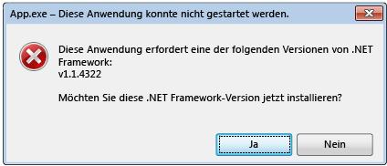

# .NET Framework-Initialisierungsfehler: Verwalten der Benutzerfreundlichkeit
Das Aktivierungssystem der CLR \(Common Language Runtime\) bestimmt die Version der CLR, die verwendet wird, um verwalteten Anwendungscode auszuführen.  In einigen Fällen ist das Aktivierungssystem eventuell nicht in der Lage, eine Version der CLR zu suchen und zu laden.  Diese Situation tritt in der Regel auf, wenn eine Anwendung eine CLR\-Version erfordert, die ungültig oder nicht auf einem Computer installiert ist.  Wenn die angeforderte Version nicht gefunden wird, gibt das CLR\-Aktivierungssystem einen HRESULT\-Fehlercode von der aufgerufenen Funktion oder Schnittstelle zurück und zeigt dem Benutzer, der die Anwendung ausführt, eventuell eine Fehlermeldung an.  Dieser Artikel enthält eine Liste von HRESULT\-Codes und beschreibt, wie Sie die Anzeige der Fehlermeldung verhindern können.  
  
 Die CLR stellt die Protokollierungsinfrastruktur bereit, die Ihnen helfen wird, CLR\-Aktivierungsprobleme zu debuggen. Diese Vorgehensweise wird im Artikel [Gewusst wie: Debuggen von CLR\-Aktivierungsproblemen](../../../docs/framework/deployment/how-to-debug-clr-activation-issues.md) beschrieben.  Die Infrastruktur darf nicht mit [Assemblybindungsprotokollen](../../../docs/framework/tools/fuslogvw-exe-assembly-binding-log-viewer.md) verwechselt werden. Bei diesen handelt es sich um einen vollständig anderen Protokolltyp.  
  
## CLR\-Aktivierungscodes HRESULT  
 Die CLR\-Aktivierung APIs geben HRESULT\-Code zurück, um das Ergebnis einer Aktivierung an einen Host zu melden.  CLR\-Hosts sollten diese Rückgabewerte immer nachschlagen, bevor sie zusätzliche Vorgängen fortsetzen.  
  
-   CLR\_E\_SHIM\_RUNTIMELOAD  
  
-   CLR\_E\_SHIM\_RUNTIMEEXPORT  
  
-   CLR\_E\_SHIM\_INSTALLROOT  
  
-   CLR\_E\_SHIM\_INSTALLCOMP  
  
-   CLR\_E\_SHIM\_LEGACYRUNTIMEALREADYBOUND  
  
-   CLR\_E\_SHIM\_SHUTDOWNINPROGRESS  
  
## Benutzeroberfläche für Initialisierungsfehler  
 Wenn das CLR\-Aktivierungssystem die richtige Version der Laufzeit, die von einer Anwendung benötigt wird, nicht laden kann, wird eine Fehlermeldung angezeigt. Diese informiert den Benutzer darüber, dass der Computer für das Ausführen der Anwendung nicht ordnungsgemäß konfiguriert ist, und bietet eine Möglichkeit, die Situation zu beheben.  In dieser Situation wird in der Regel die folgende Fehlermeldung erstellt.  Der Benutzer kann **Ja** wählen, um zu einer Microsoft\-Website zu wechseln, auf der die richtige .NET Framework\-Version für die Anwendung heruntergeladen werden kann.  
  
   
Typische Fehlermeldung bei Initialisierungsfehlern  
  
## Beheben des Initialisierungsfehlers  
 Als Entwickler haben Sie eine Vielzahl von Optionen, um die .NET Framework\-Initialisierungsfehlermeldung zu steuern.  Beispielsweise können Sie ein API\-Flag verwenden, um die Anzeige der Meldung zu verhindern. Dies wird im nächsten Abschnitt erläutert.  Sie müssen jedoch noch das Problem beheben, das die Anwendung am Laden der angeforderten Laufzeit hindert.  Andernfalls wird die Anwendung möglicherweise gar nicht ausgeführt, oder eine bestimmte Funktion ist eventuell nicht verfügbar.  
  
 Um das zugrunde liegende Problem zu beheben und die beste Benutzerfreundlichkeit \(weniger Fehlermeldungen\) bereitzustellen, empfehlen wir Folgendes:  
  
-   Für Anwendungen mit .NET Framework 3.5 \(und früher\): Konfigurieren Sie die Anwendung dahin gehend, dass sie .NET Framework 4 oder 4.5 unterstützt \(siehe [Anweisungen](../../../docs/framework/migration-guide/how-to-configure-an-app-to-support-net-framework-4-or-4-5.md)\).  
  
-   Bei .NET Framework 4\-Anwendungen: Installieren Sie das verteilbare. .NET Framework 4\-Paket als Teil des Anwendungssetups.  Siehe [Handbuch für die Bereitstellung für Entwickler](../../../docs/framework/deployment/deployment-guide-for-developers.md).  
  
## Steuerung der Fehlermeldung  
 Das Anzeigen einer Fehlermeldung, die kommuniziert, dass eine angeforderte .NET Framework\-Version nicht gefunden wurde, kann entweder als ein hilfreicher Dienst oder ein kleines Ärgernis für den Benutzer angesehen werden.  In beiden Fällen können Sie diese Benutzeroberfläche steuern, indem Sie Flags an die Aktivierung\-API übergeben.  
  
 Die [ICLRMetaHostPolicy::GetRequestedRuntime](../Topic/ICLRMetaHostPolicy::GetRequestedRuntime%20Method.md)\-Methode akzeptiert einen [METAHOST\_POLICY\_FLAGS](../../../ocs/framework/unmanaged-api/hosting/metahost-policy-flags-enumeration.md)\-Enumerationsmember als Eingabe.  Sie können das METAHOST\_POLICY\_SHOW\_ERROR\_DIALOG\-Flag einschließen, um eine Fehlermeldung anzufordern, wenn die angeforderte Version der CLR nicht gefunden wird.  Standardmäßig wird die Fehlermeldung nicht angezeigt. \(Die [ICLRMetaHost::GetRuntime](../Topic/ICLRMetaHost::GetRuntime%20Method.md)\-Methode akzeptiert dieses Flag nicht und stellt keine andere Möglichkeit bereit, um die Fehlermeldung anzuzeigen.\)  
  
 Windows bietet eine [SetErrorMode](http://go.microsoft.com/fwlink/p/?LinkID=255242)\-Funktion, die Sie verwenden können, um zu deklarieren, dass Sie Fehlermeldungen aufgrund des innerhalb des Prozesses ausgeführten Codes angezeigt werden soll.  Sie können das SEM\_FAILCRITICALERRORS\-Flag angeben, um das Anzeigen der Fehlermeldung zu verhindern.  
  
 In einigen Szenarios ist es wichtig, die SEM\_FAILCRITICALERRORS\-Einstellung zu überschreiben, die von einem Anwendungsprozess festgelegt wurde.  Wenn Sie beispielsweise über eine systemeigene COM\-Komponente verfügen, die die CLR hostet und in einem Prozess gehostet wird, in dem SEM\_FAILCRITICALERRORS festgelegt ist, können Sie das Flag in Abhängigkeit von den Auswirkungen der Anzeige von Fehlermeldungen in diesem bestimmten Prozess überschreiben.  In diesem Fall können Sie eines der folgenden Flags verwenden, um SEM\_FAILCRITICALERRORS zu überschreiben:  
  
-   Verwenden Sie METAHOST\_POLICY\_IGNORE\_ERROR\_MODE mit der [ICLRMetaHostPolicy::GetRequestedRuntime](../Topic/ICLRMetaHostPolicy::GetRequestedRuntime%20Method.md)\-Methode.  
  
-   Verwenden Sie RUNTIME\_INFO\_IGNORE\_ERROR\_MODE mit der [GetRequestedRuntimeInfo](../../../ocs/framework/unmanaged-api/hosting/getrequestedruntimeinfo-function.md)\-Funktion.  
  
## UI\-Richtlinie für von der CLR bereitgestellte Hosts  
 Die CLR bietet eine Reihe von Hosts für verschiedene Szenarien, und alle diese Hosts zeigen eine Fehlermeldung an, wenn Probleme beim Laden der erforderlichen Laufzeitversion auftreten.  Die folgende Tabelle enthält eine Liste von Hosts und deren Fehlermeldungsrichtlinien.  
  
|CLR\-Host|**Beschreibung**|Fehlermeldungsrichtlinie|Kann die Fehlermeldung deaktiviert werden?|  
|---------------|----------------------|------------------------------|------------------------------------------------|  
|Verwalteter EXE\-Host|Startet verwaltete EXE\-Dateien.|Wird im Fall von fehlender .NET Framework\-Version angezeigt|nein|  
|Verwalteter COM\-Host|Lädt verwalteten COM\-Komponenten in einen Prozess.|Wird im Fall von fehlender .NET Framework\-Version angezeigt|Ja, durch Festlegen des SEM\_FAILCRITICALERRORS\-Flags|  
|ClickOnce\-Host|Startet ClickOnce\-Anwendungen.|Wird im Fall einer fehlenden .NET Framework\-Version ab [!INCLUDE[net_v45](../../../includes/net-v45-md.md)] angezeigt|nein|  
|XBAP\-Host|Startet WPF\-XBAP\-Anwendungen.|Wird im Fall einer fehlenden .NET Framework\-Version ab [!INCLUDE[net_v45](../../../includes/net-v45-md.md)] angezeigt|nein|  
  
## [!INCLUDE[win8](../../../includes/win8-md.md)] Verhalten und Benutzeroberfläche  
 Das CLR\-Aktivierungssystem stellt das gleiche Verhalten und die gleiche Benutzeroberfläche auf [!INCLUDE[win8](../../../includes/win8-md.md)] bereit, wie auf anderen Versionen des Windows\-Betriebssystems, es sei denn, es treten Probleme beim Laden von CLR 2.0 auf.  [!INCLUDE[win8](../../../includes/win8-md.md)] enthält [!INCLUDE[net_v45](../../../includes/net-v45-md.md)], das CLR 4.5 verwendet. [!INCLUDE[win8](../../../includes/win8-md.md)] enthält jedoch nicht .NET Framework 2.0, 3.0 oder 3.5, die alle CLR 2.0 verwenden.  Daher werden Anwendungen, die auf CLR 2.0 angewiesen sind, unter [!INCLUDE[win8](../../../includes/win8-md.md)] nicht standardmäßig ausgeführt.  Stattdessen wird das folgende Dialogfeld angezeigt, um Benutzern die Installation von .NET Framework 3.5 zu ermöglichen.  Benutzer können .NET Framework 3.5 auch in der Systemsteuerung aktivieren.  Beide Optionen werden im Artikel [Installieren von .NET Framework 3.5 auf Windows 8 und höher](../../../docs/framework/install/net-framework-3-5-on-windows-8-plus.md) erläutert.  
  
   
Aufforderung zum Installieren von .NET Framework 3.5 bei Bedarf  
  
> [!NOTE]
>  [!INCLUDE[net_v45](../../../includes/net-v45-md.md)] ersetzt das .NET Framework 4 \(CLR 4\) auf dem Computer des Benutzers.  Daher werden .NET Framework 4\-Anwendungen nahtlos ausgeführt, ohne dieses Dialogfeld auf [!INCLUDE[win8](../../../includes/win8-md.md)] anzuzeigen.  
  
 Wenn .NET Framework 3.5 installiert ist, können Benutzer Anwendungen, die auf .NET Framework 2.0, 3.0 oder 3.5 angewiesen sind, auf ihren [!INCLUDE[win8](../../../includes/win8-md.md)]\-Computern ausführen.  Sie können .NET Framework 1.0 und 1.1\-Anwendungen ausführen, vorausgesetzt, dass diese Anwendungen nicht explizit so konfiguriert wurden, dass sie nur auf .NET Framework 1.0 oder 1.1 ausgeführt werden können.  Siehe [Migrieren von .NET Framework 1.1](../../../docs/framework/migration-guide/migrating-from-the-net-framework-1-1.md).  
  
 Ab [!INCLUDE[net_v45](../../../includes/net-v45-md.md)] wurde die CLR\-Aktivierungsprotokollierung verbessert. Sie enthält nun auch Protokolleinträge, die aufzeichnen, wann und warum eine Initialisierungsfehlermeldung angezeigt wird.  Weitere Informationen finden Sie unter [Gewusst wie: Debuggen von CLR\-Aktivierungsproblemen](../../../docs/framework/deployment/how-to-debug-clr-activation-issues.md).  
  
## Siehe auch  
 [Handbuch für die Bereitstellung für Entwickler](../../../docs/framework/deployment/deployment-guide-for-developers.md)   
 [Gewusst wie: Konfigurieren einer Anwendung für die Unterstützung von .NET Framework 4 oder 4.5](../../../docs/framework/migration-guide/how-to-configure-an-app-to-support-net-framework-4-or-4-5.md)   
 [Gewusst wie: Debuggen von CLR\-Aktivierungsproblemen](../../../docs/framework/deployment/how-to-debug-clr-activation-issues.md)   
 [Installieren von .NET Framework 3.5 auf Windows 8 und höher](../../../docs/framework/install/net-framework-3-5-on-windows-8-plus.md)