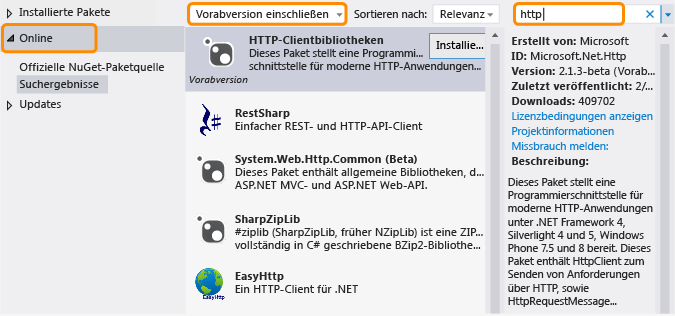

# .NET Framework und Out-of-Band-Releases
.NET Framework wird weiterentwickelt, um unterschiedliche Plattformen wie Windows Phone- und Windows Store-Apps sowie herkömmliche Desktop- und Web-Apps zu unterstützen und die Wiederverwendung von Code zu maximieren. Neben unseren regelmäßigen .NET Framework-Versionen werden neue Funktionen out-of-band (OOB) veröffentlicht, um die plattformübergreifende Entwicklung zu verbessern oder neue Funktionalität einzuführen. In diesem Thema wird die zukünftige Richtung von .NET Framework und zugehörigen OOB-Versionen erläutert.  
  
## Vorteile von OOB-Versionen  
 Durch die "out-of-band"-Herausgabe neuer Komponenten oder Updates für Komponenten kann Microsoft Aktualisierungen für .NET Framework häufiger bereitstellen. Außerdem kann somit Kundenfeedback schneller eingeholt und darauf reagiert werden.  
  
 Wenn Sie eine OOB-Funktion in Ihrer App verwenden, müssen Benutzer zum Ausführen der App nicht die neueste Version von .NET Framework installieren, da die OOB-Assemblys mit dem App-Paket bereitgestellt werden.  
  
## Wie OOB-Pakete verteilt werden  
OOB-Releases für Kernkomponenten der Common Language Runtime (CLR) werden über [NuGet](https://www.nuget.org/) verteilt. Dabei handelt es sich um einen Paket-Manager für .NET. Mit NuGet können Sie Bibliotheken auf einfache Weise über den Projektmappen-Explorer in Visual Studio durchsuchen und Ihren .NET Framework-Projekten hinzufügen. NuGet ist bei allen Editionen von Visual Studio ab Visual Studio 2012 enthalten. Um herauszufinden, ob NuGet installiert ist, suchen Sie im Visual Studio-Menü **Tools** nach **Bibliotheks-Paket-Manager**. Sollte NuGet nicht installiert sein:  
  
1.  Wählen Sie in der Visual Studio-Menüleiste **Tools** und dann **Erweiterungen und Updates** (in Visual Studio 2010 **Erweiterungs-Manager**) aus.  
  
     Das Dialogfeld **Erweiterungen und Updates** wird geöffnet.  
  
2.  Wählen Sie **Online**, **NuGet-Paket-Manager** und dann **Herunterladen** aus.  
  
3.  Starten Sie Visual Studio nach Abschluss des Downloads neu.  
  
 Ausführliche Installationsanweisungen finden Sie unter [Installing NuGet](http://docs.nuget.org/docs/start-here/installing-nuget) auf der NuGet Docs-Website. Weitere Informationen zu NuGet finden Sie in der [NuGet-Dokumentation](http://docs.nuget.org/).  
  
## Verwenden eines OOB-Pakets von NuGet  
 Nachdem Sie NuGet installiert haben, können Sie Verweise auf NuGet-Pakete durchsuchen und hinzufügen, indem Sie den Projektmappen-Explorer in Visual Studio verwenden:  
  
1.  Öffnen Sie das Kontextmenü für Ihr Projekt in Visual Studio, und wählen Sie dann **NuGet-Pakete verwalten** aus. (Diese Option ist auch im Menü **Projekt** verfügbar.)  
  
2.  Wählen Sie im linken Bereich **Online** aus.  
  
3.  Wenn Sie Vorabversionspakete verwenden möchten, wählen Sie im Dropdown-Listenfeld im mittleren Bereich **Vorabversion einschließen** anstelle von **Nur stabil** aus.  
  
4.  Verwenden Sie im rechten Bereich das Feld **Suchen**, um das gewünschte Paket zu suchen. Einige Microsoft-Pakete sind mit dem Microsoft .NET Framework-Logo gekennzeichnet, und für alle ist Microsoft als Herausgeber angegeben.  
  
   
  
 Wie bereits erwähnt, werden die OOB-Assemblys ins App-Paket eingeschlossen, wenn Sie eine App bereitstellen, die ein OOB-Paket verwendet.  
  
## Typen von OOB-Versionen  
 In der Regel umfasst ein OOB-Paket mindestens eine Vorabversion und eine stabile Version. Die Lizenz, die einer Vorabversion beiliegt, gestattet in der Regel keine Weiterverteilung. Sie können damit jedoch ein Paket testen und Feedback abgeben. Feedback ist in alle am Paket vorgenommenen Updates integriert. Eine endgültige Version wird als stabiles Paket mit NuGet verteilt und enthält eine Lizenz, mit der Sie das NuGet-Paket mit Ihrer App weiter verteilen können. Stabile Pakete werden von Microsoft unterstützt. Microsoft bietet IntelliSense-Unterstützung sowie andere Arten der Dokumentation, wie z. B. Blogbeiträge und Forumantworten, für alle Pakete. Darüber hinaus steht Quellcode bei einigen, jedoch nicht bei allen Paketen zur Verfügung. Sie können den [.NET Framework-Blog](http://blogs.msdn.com/b/dotnet/) abonnieren, um Ankündigungen zu neuen und aktualisierten Paketen zu erhalten.  
  
 Wählen Sie **Vorabversion einschließen** im NuGet-Paket-Manager aus, um nach Vorabversionen und stabilen Paketen zu suchen.  
  
 Sie können den [.NET Framework-Feed](https://nuget.org/api/v2/curated-feeds/dotnetframework/Packages/) abonnieren, um über neue stabile Paketversionen benachrichtigt zu werden.  
  
## Siehe auch  
 [Erste Schritte](../../../docs/framework/get-started/index.md)
