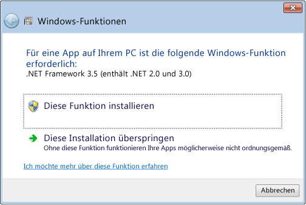

# Installieren von .NET Framework 3.5 auf Windows 8, Windows 8.1 und Windows 10Install the .NET Framework 3.5 on Windows 8, Windows 8.1, and Windows 10

.NET Framework ist integraler Bestandteil vieler Apps unter Windows und stellt allgemeine Funktionen für diese Apps bereit.The .NET Framework is an integral part of many apps running on Windows and provides common functionality for those apps to run. Für Entwickler bietet .NET Framework ein konsistentes Programmiermodell zum Erstellen von Apps.For developers, the .NET Framework provides a consistent programming model for building apps. Wenn Sie Windows als Betriebssystem verwenden, ist .NET Framework möglicherweise bereits auf dem Computer installiert.If you're using the Windows operating system, the .NET Framework may already be installed on your computer. So ist [!INCLUDE[net_v45](../../../includes/net-v45-md.md)] in [!INCLUDE[win8](../../../includes/win8-md.md)], [!INCLUDE[net_v451](../../../includes/net-v451-md.md)] in [!INCLUDE[win81](../../../includes/win81-md.md)] und [!INCLUDE[net_v46](../../../includes/net-v46-md.md)] in Windows 10 enthalten.Specifically, the [!INCLUDE[net_v45](../../../includes/net-v45-md.md)] is included with [!INCLUDE[win8](../../../includes/win8-md.md)], the [!INCLUDE[net_v451](../../../includes/net-v451-md.md)] is included with [!INCLUDE[win81](../../../includes/win81-md.md)], and the [!INCLUDE[net_v46](../../../includes/net-v46-md.md)] is included with Windows 10.  
  
.NET Framework 3.5 wird jedoch nicht automatisch mit [!INCLUDE[win8](../../../includes/win8-md.md)], [!INCLUDE[win81](../../../includes/win81-md.md)] oder Windows 10 installiert und muss separat aktiviert werden, um Apps auszuführen, die davon abhängen.The .NET Framework 3.5, however, is not automatically installed with [!INCLUDE[win8](../../../includes/win8-md.md)], [!INCLUDE[win81](../../../includes/win81-md.md)], or Windows 10, and must be separately enabled to run apps that depend on it. Dies muss über die Windows Update vorgenommen werden, diese Option kann mithilfe der folgenden drei Möglichkeiten aufgerufen werden.This must happen through Windows Update, which is invoked in one of three ways. Dazu ist eine Internetverbindung erforderlich:All of these require an Internet connection:  
  
- [Installieren von .NET Framework 3.5 bei BedarfInstall the .NET Framework 3.5 on Demand](#OnDemand)  
  
- [Aktivieren von .NET Framework 3.5 in der SystemsteuerungEnable the .NET Framework 3.5 in Control Panel](#ControlPanel)  
  
- [Herunterladen des Installationsprogramms von .NET Framework 3.5](http://www.microsoft.com/en-us/download/details.aspx?id=21) (Hinweis: Hiermit wird .NET Framework nicht direkt heruntergeladen, sondern es wird ein Installationsprogramm heruntergeladen, das Windows Update aufruft.)[Download the .NET Framework 3.5 installer](http://www.microsoft.com/en-us/download/details.aspx?id=21) (Note: This does not download the .NET Framework directly; it is an installer that invokes Windows Update.)  
  
Während der Installation tritt möglicherweise der Fehler 0x800f0906, 0x800f0907 oder 0x800f081f auf. In diesem Fall finden Sie weitere Informationen unter [.NET Framework 3.5-Installationsfehler: 0x800f0906, 0x800f0907 oder 0x800f081f](https://support.microsoft.com/help/2734782/net-framework-3-5-installation-error-0x800f0906--0x800f081f--0x800f09).During installation, you may encounter error 0x800f0906, 0x800f0907, or 0x800f081f, in which case refer to [.NET Framework 3.5 installation error: 0x800f0906, 0x800f0907, or 0x800f081f](https://support.microsoft.com/help/2734782/net-framework-3-5-installation-error-0x800f0906--0x800f081f--0x800f09). Beachten Sie, dass diese Fehler möglicherweise durch die Installation des [Sicherheitsupdates 3005628](https://support.microsoft.com/kb/3005628)behoben werden können.Note that these are possibly resolved by installing [security update 3005628](https://support.microsoft.com/kb/3005628).  
  
Wenn bei den oben genannten Methoden ein Fehler auftritt, oder Sie nicht über eine Internetverbindung verfügen, müssen Sie das Windows-Installationsmedium verwenden.If any of the above methods fail or if you do not have an Internet connection, it's necessary to use your Windows installation media. Weitere Informationen finden Sie unter Methode 3 für Fehler 0x800f0906 im Artikel [.NET Framework 3.5-Installationsfehler](https://support.microsoft.com/en-us/kb/2734782).For details, see Method 3 for error 0x800f0906 in the [.NET Framework 3.5 installation error article](https://support.microsoft.com/en-us/kb/2734782). Wenn keine Installationsmedien vorhanden sind, lesen Sie [Create Installation media for Windows 8.1 (Erstellen eines Installationsmediums für Windows 8.1)](http://windows.microsoft.com/en-US/windows-8/create-reset-refresh-media?woldogcb=0).If you don't have installation media, see [Create Installation media for Windows 8.1](http://windows.microsoft.com/en-US/windows-8/create-reset-refresh-media?woldogcb=0).  
  
**Wichtige Hinweise:****Important notes:**
  
- Deinstallieren Sie im Allgemeinen keine Version von .NET Framework von Ihrem Computer.In general, don't uninstall any versions of the .NET Framework from your computer. Verschiedene Apps benötigen unterschiedliche Versionen von Framework, und mehrere Versionen von .NET Framework können gleichzeitig auf einen einzelnen Computer bestehen.Different apps depend on different versions of the framework, and multiple versions of the .NET Framework can coexist on a single computer at the same time.  
  
- .NET Framework 3.5 wird auch von Apps verwendet, die für die Versionen 2.0 und 3.0 erstellt wurden.The .NET Framework 3.5 is also used by apps built for versions 2.0 and 3.0.  
  
- Wenn ein Language Pack von Windows vor der Installation von .NET Framework 3.5 installiert wird, kann bei der Installation von .NET Framework 3.5 ein Fehler auftreten.Installing a Windows language pack before installing the .NET Framework 3.5 may cause the .NET Framework 3.5 installation to fail. Installieren Sie .NET Framework 3.5 bevor Sie die Language Packs von Windows installieren.Install the .NET Framework 3.5 before installing any Windows language packs.  
  
- Windows CardSpace steht in .NET Framework 3.5 unter [!INCLUDE[win8](../../../includes/win8-md.md)]nicht zur Verfügung.Windows CardSpace is not available with the .NET Framework 3.5 on [!INCLUDE[win8](../../../includes/win8-md.md)].  
  
- Aufgrund der Schwierigkeiten bei der Art und Weise, wie .NET Framework 3.5 installiert werden muss, ist es leider nicht möglich, ein separates, eigenständiges Installationsprogramm bereitzustellen, das unabhängig von Windows Update ausgeführt werden kann.Because of complications around how the .NET Framework 3.5 must be installed, it's unfortunately not possible to provide a separate, standalone installer that can run independently of Windows Update. Wenn alle anderen Methoden zu Fehlern führen, müssen Sie wie zuvor beschrieben das Installationsmedium verwenden.If all other methods fail, you must resort to installation media as described earlier.  
  
   
## Installieren von .NET Framework 3.5 bei BedarfInstall the .NET Framework 3.5 on Demand

Wenn eine App .NET Framework 3.5 erfordert, diese Version jedoch auf dem Computer nicht aktiviert ist, wird entweder während der Installation oder beim ersten Ausführen der App das folgende Meldungsfeld angezeigt.If an app requires the .NET Framework 3.5 but doesn't find that version enabled on your computer, it displays the following message box, either during installation or when you run the app for the first time. Wählen Sie im Meldungsfeld **Feature installieren** aus, um .NET Framework 3.5 zu aktivieren.In the message box, choose **Install this feature** to enable the .NET Framework 3.5. Für diese Option ist eine Internetverbindung erforderlich.This option requires an Internet connection.  
  
  
  
   
## Aktivieren von .NET Framework 3.5 in der SystemsteuerungEnable the .NET Framework 3.5 in Control Panel

Sie können .NET Framework 3.5 auch über die Systemsteuerung aktivieren.You can enable the .NET Framework 3.5 through Control Panel. Für diese Option ist eine Internetverbindung erforderlich.This option requires an Internet connection.  
  
1. Drücken Sie die Windows-Taste  auf der Tastatur.Press the Windows key  on your keyboard. Geben Sie „Windows Features“ ein und drücken Sie die EINGABETASTE.Type "Windows Features" and press Enter. Daraufhin wird das Dialogfeld **Windows-Features aktivieren oder deaktivieren** angezeigt.This brings up the **Turn Windows features on or off** dialog box. Alternativ können Sie die Systemsteuerung öffnen, auf die **Programm**elemente klicken und anschließend unter **Programme und Funktionen** auf **Windows-Funktionen ein- oder ausschalten** klicken.Alternately, open Control Panel, click on the **Programs** items, and then select **Turn Windows features on or off** under **Programs and Features**.  
  
2. Aktivieren Sie das Kontrollkästchen **.NET Framework 3.5 (umfasst .NET 2.0 und 3.0)**, klicken Sie auf **OK**, und starten Sie den Computer neu, wenn Sie dazu aufgefordert werden.Select the **.NET Framework 3.5 (includes .NET 2.0 and 3.0)** check box, select **OK**, and reboot your computer if prompted.  
  
Sie müssen nicht die untergeordneten Elemente für die **HTTP-Aktivierung von Windows Communication Foundation (WCF)** auswählen, es sei denn, Sie sind ein Entwickler und benötigen die WCF-Funktion für Skript- und Handlerzuordnung.You don't need to select the child items for **Windows Communication Foundation (WCF) HTTP activation** unless you're a developer who requires WCF script and handler mapping functionality.
  
## Siehe auchSee also

[InstallationshandbuchInstallation Guide](../../../docs/framework/get-started/index.md)

