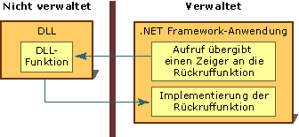

# Rückruffunktionen
Eine Rückruffunktion ist ein Code innerhalb einer verwalteten Anwendung, mit dem eine nicht verwaltete DLL-Funktion eine Aufgabe ausführen kann. Aufrufe einer Rückruffunktion werden indirekt von einer verwalteten Anwendung über eine DLL-Funktion und zurück an die verwaltete Implementierung übergeben. Einige der vielen DLL-Funktionen, die mit dem Plattformaufruf aufgerufen werden, erfordern eine Rückruffunktion in verwaltetem Code zur ordnungsgemäßen Ausführung.  
  
 Um die meisten DLL-Funktionen aus verwaltetem Code aufzurufen, erstellen Sie eine verwaltete Definition der Funktion, und rufen Sie sie dann auf. Der Vorgang ist einfach.  
  
 Die Verwendung einer DLL-Funktion, die eine Rückruffunktion benötigt, erfordert einige zusätzliche Schritte. Zunächst müssen Sie durch einen Blick auf die Dokumentation der Funktion ermitteln, ob die Funktion einen Rückruf erfordert. Als Nächstes müssen Sie die Rückruffunktion in einer verwalteten Anwendung erstellen. Zum Schluss rufen Sie die DLL-Funktion auf, indem Sie als Argument einen Zeiger an die Rückruffunktion übergeben. Diese Schritte werden in der folgenden Abbildung veranschaulicht.  
  
   
Rückruffunktion und Implementierung  
  
 Rückruffunktionen eignen sich ideal für die Verwendung in Situationen, in denen eine Aufgabe wiederholt ausgeführt wird. Eine andere allgemeine Verwendung ist die Nutzung von Enumerationsfunktionen, z.B. **EnumFontFamilies**, **EnumPrinters** und **EnumWindows** in der Win32-API. Die **EnumWindows**-Funktion durchläuft alle vorhandenen Fenster auf Ihrem Computer und ruft die Rückruffunktion auf, die einen Task für jedes Fenster durchführt. Anweisungen und ein Beispiel finden Sie unter [Vorgehensweise: Implementieren von Rückruffunktionen](../../../docs/framework/interop/how-to-implement-callback-functions.md).  
  
## Siehe auch  
 [Gewusst wie: Implementieren von Rückruffunktionen](../../../docs/framework/interop/how-to-implement-callback-functions.md)  
 [Calling a DLL Function (Aufrufen einer DLL-Funktion)](../../../docs/framework/interop/calling-a-dll-function.md)
