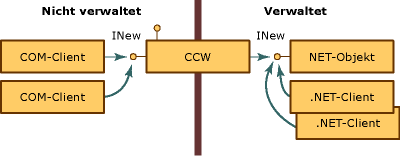
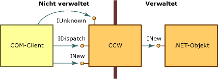

# <a name="com-callable-wrapper"></a>COM Callable Wrapper (CCW)
Wenn ein COM-Client ein .NET-Objekt aufruft, erstellt Common Language Runtime das verwaltete Objekt sowie einen CCW (COM Callable Wrapper) für dieses Objekt. COM-Clients verwenden den CCW als Proxy für das verwaltete Objekt, da sie nicht direkt auf ein .NET-Objekt verweisen können.  
  
 Common Language Runtime erstellt genau einen CCW für ein verwaltetes Objekt, unabhängig von der Anzahl der COM-Clients, die dort Dienste anfordern. Wie die folgende Abbildung zeigt, können mehrere COM-Clients über einen Verweis auf den CCW verfügen, der die Schnittstelle "INew" verfügbar macht. Der CCW verfügt seinerseits über einen einzelnen Verweis auf das verwaltete Objekt, das die Schnittstelle implementiert und für das eine Garbage Collection durchgeführt wird. Sowohl COM-Clients als auch .NET-Clients können gleichzeitig Anfragen an dasselbe verwaltete Objekt richten.  
  
   
Zugriff auf .NET-Objekte über den CCW  
  
 CCWs können von anderen Klassen, die innerhalb von .NET Framework ausgeführt werden, nicht erkannt werden. Ihr Hauptzweck besteht im Marshallen von Aufrufen zwischen verwaltetem und nicht verwaltetem Code. CCWs verwalten zusätzlich die Identität und Lebensdauer der von ihnen umschlossenen Objekte.  
  
## <a name="object-identity"></a>Objektidentität  
 Common Language Runtime belegt für das .NET-Objekt Speicher, der durch Garbage Collection gewonnen wird. Dadurch kann das Objekt bei Bedarf innerhalb des Speichers verschoben werden. Im Gegensatz dazu belegt die Common Language Runtime Speicherplatz für den CCW aus einem nicht gesammelten Heap. Dies hat zur Folge, dass COM-Clients direkt auf den Wrapper verweisen können.  
  
## <a name="object-lifetime"></a>Lebensdauer eines Objekts  
 Beim CCW erfolgt die Verweiszählung nach Art des herkömmlichen COM, anders als beim .NET-Client, der von ihm umschlossen wird. Wenn die Verweiszählung für den CCW 0 erreicht hat, gibt der Wrapper seinen Verweis auf das verwaltete Objekt frei. Beim nächsten Garbage Collection-Zyklus werden die verwalteten Objekte ohne verbleibende Verweise eingesammelt.  
  
## <a name="simulating-com-interfaces"></a>Simulieren von COM-Schnittstellen  
 Mit dem [COM Callable Wrapper](../../../docs/framework/interop/com-callable-wrapper.md) (CCW) werden alle öffentlichen, für COM sichtbaren Schnittstellen, Datentypen und Rückgabewerte für COM-Clients in einer Weise angezeigt, die mit der COM-Durchsetzung von schnittstellenbasierten Interaktionen konsistent ist. Für einen COM-Client ist das Aufrufen von Methoden für ein .NET Framework-Objekt identisch wie das Aufrufen von Methoden für ein COM-Objekt.  
  
 Zur Unterstützung dieses nahtlosen Ansatzes erstellt der CCW traditionelle COM-Schnittstellen wie **IUnknown** und **IDispatch**. Wie die folgende Abbildung zeigt, unterhält der CCW einen einzigen Verweis auf das .NET-Objekt, den er einschließt. Sowohl der COM-Client als auch das .NET-Objekt interagieren über den Proxy und die Stubkonstruktion des CCWs miteinander.  
  
   
COM-Schnittstellen und der COM Callable Wrapper  
  
 Neben der Offenlegung von Schnittstellen, die explizit mit einer Klasse in der verwalteten Umgebung implementiert wird, stellt .NET Framework für das Objekt Implementierungen der COM-Schnittstellen bereit, die in der folgenden Tabelle aufgeführt sind. Eine .NET-Klasse kann das Standardverhalten überschreiben, indem sie eigene Implementierungen dieser Schnittstellen bereitstellt. Zur Laufzeit stehen jedoch immer die Implementierungen der **IUnknown**- und **IDispatch**-Schnittstellen bereit.  
  
|Interface|Beschreibung|  
|---------------|-----------------|  
|**Idispatch**|Stellt einen Mechanismus für die späte Bindung an den Typ bereit.|  
|**IerrorInfo**|Stellt eine Textbeschreibung des Fehlers und der Fehlerquelle, eine Hilfedatei, den Hilfekontext und die GUID der Schnittstelle bereit, die den Fehler definiert hat (bei .NET-Klassen immer **GUID_NULL**).|  
|**IprovideClassInfo**|Ermöglicht es COM-Clients, auf die **ITypeInfo**-Schnittstelle zuzugreifen, die von einer verwalteten Klasse implementiert wurde.|  
|**IsupportErrorInfo**|Ermöglicht es einem COM-Client festzustellen, ob das verwaltete Objekt die **IErrorInfo**-Schnittstelle unterstützt. Falls ja, ist der Client in der Lage einen Zeiger auf das letzte Ausnahmeobjekt abzurufen. Alle verwalteten Typen unterstützen die **IErrorInfo**-Schnittstelle.|  
|**ItypeInfo**|Stellt Typinformationen für eine Klasse bereit, die exakt den von Tlbexp.exe erstellten Typinformationen entsprechen.|  
|**IUnknown**|Stellt die Standardimplementierung der **IUnknown**-Schnittstelle bereit, über die der COM-Client die Lebensdauer des CCWs verwalten und die Typkonvertierung erzwingt.|  
  
 Eine verwaltete Klasse kann zudem die COM-Schnittstellen bereitstellen, die in der folgenden Tabelle beschrieben werden.  
  
|Schnittstelle|Beschreibung|  
|---------------|-----------------|  
|Die Klassenschnittstelle (_*Klassenname*)|Schnittstelle, die von der Laufzeit offengelegt wird und nicht explizit definiert wird; legt alle öffentlichen Schnittstellen, Methoden, Eigenschaften und Felder offen, die für ein verwaltetes Objekt explizit offengelegt werden.|  
|**IConnectionPoint** und **IconnectionPointContainer**|Schnittstelle für Objekte, die delegatbasierende Ereignisse bedienen (eine Schnittstelle für die Registrierung von Ereignisabonnenten).|  
|**IdispatchEx**|Schnittstelle, die von der Laufzeit bereitgestellt wird, wenn die Klasse **IExpando** implementiert. Die **IDispatchEx**-Schnittstelle ist eine Erweiterung der **IDispatch**-Schnittstelle. Im Gegensatz zu **IDispatch** ermöglicht sie das Aufzählen, Hinzufügen, Löschen und Aufrufen von Membern unter Berücksichtigung von Groß-/Kleinschreibung.|  
|**IEnumVARIANT**|Schnittstelle für Klassen von Typ „Auflistung“, die die Objekte in der Auflistung enumeriert, wenn die Klasse **IEnumerable** implementiert.|  
  
## <a name="introducing-the-class-interface"></a>Einführung in die Klassenschnittstelle  
 Die Klassenschnittstelle, in in verwaltetem Code nicht explizit definiert ist, ist eine Schnittstelle, die alle öffentlichen Methoden, Eigenschaften, Felder und Ereignisse offenlegt, die explizit für das .NET-Objekt verfügbar gemacht werden. Bei dieser Schnittstelle kann es sich um eine duale oder um eine nur für Dispatch vorgesehene Schnittstelle handeln. Die Klassenschnittstelle erhält den Namen von der .NET-Klasse selbst, mit vorangestelltem Unterstrich. Für die Klasse "Mammal" heißt die Klassenschnittstelle beispielsweise "_Mammal".  
  
 Bei abgeleiteten Klassen legt die Klassenschnittstelle zudem alle öffentlichen Methoden, Eigenschaften und Felder der Basisklasse offen. Die abgeleitete Klasse macht zudem auch eine Klassenschnittstelle für jede Basisklasse verfügbar. Wenn die Klasse "Mammal" beispielsweise die Klasse "MammalSuperclass" erweitert, die ihrerseits System.Object erweitert, stellt das .NET-Objekt für COM-Clients drei Klassenschnittstellen mit Namen "_Mammal", "_MammalSuperclass" und "_Object" zur Verfügung.  
  
 Betrachten Sie beispielsweise die folgende .NET-Klasse:  
  
```vb  
' Applies the ClassInterfaceAttribute to set the interface to dual.  
<ClassInterface(ClassInterfaceType.AutoDual)> _  
' Implicitly extends System.Object.  
Public Class Mammal  
    Sub Eat()  
    Sub Breathe()  
    Sub Sleep()  
End Class  
```  
  
```csharp  
// Applies the ClassInterfaceAttribute to set the interface to dual.  
[ClassInterface(ClassInterfaceType.AutoDual)]  
// Implicitly extends System.Object.  
public class Mammal  
{  
    void  Eat();  
    void  Breathe():  
    void  Sleep();  
}  
```  
  
 Der COM-Client kann einen Zeiger auf die Klassenschnittstelle mit Namen `_Mammal` abrufen, Diese wird in der Typbibliothek beschrieben, die vom Tool [Type Library Exporter (Tlbexp.exe)](../../../docs/framework/tools/tlbexp-exe-type-library-exporter.md) generiert wird. Wenn die `Mammal`-Klasse eine oder mehrere Schnittstellen implementiert hat, werden die Schnittstellen unter der Coklasse angezeigt.  
  
```  
[odl, uuid(…), hidden, dual, nonextensible, oleautomation]  
interface _Mammal : IDispatch  
{  
    [id(0x00000000), propget] HRESULT ToString([out, retval] BSTR*  
        pRetVal);  
    [id(0x60020001)] HRESULT Equals([in] VARIANT obj, [out, retval]  
        VARIANT_BOOL* pRetVal);  
    [id(0x60020002)] HRESULT GetHashCode([out, retval] short* pRetVal);  
    [id(0x60020003)] HRESULT GetType([out, retval] _Type** pRetVal);  
    [id(0x6002000d)] HRESULT Eat();  
    [id(0x6002000e)] HRESULT Breathe();  
    [id(0x6002000f)] HRESULT Sleep();  
}  
[uuid(…)]  
coclass Mammal   
{  
    [default] interface _Mammal;  
}  
```  
  
 Das Generieren der Klassenschnittstelle ist optional. Standardmäßig generiert COM-Interop eine auf Dispatch beschränkte Schnittstelle für jede Klasse, die Sie in eine Typbibliothek exportieren. Sie können die automatische Erstellen dieser Schnittstelle verhindern oder ändern, indem Sie Ihrer Klasse das <xref:System.Runtime.InteropServices.ClassInterfaceAttribute> zuweisen. Obwohl die Klassenschnittstelle die Offenlegung verwalteter Klassen für COM vereinfachen kann, sind die Verwendungsmöglichkeiten begrenzt.  
  
> [!CAUTION]
>  Bei Verwendung der Klassenschnittstelle anstatt explizit eine eigene Schnittstelle zu definieren, kann die zukünftige Versionsverwaltung Ihrer verwalteten Klasse erschweren. Lesen Sie bitte die folgenden Richtlinien, bevor Sie die Klassenschnittstelle verwenden.  
  
### <a name="define-an-explicit-interface-for-com-clients-to-use-rather-than-generating-the-class-interface"></a>Definieren Sie eine explizite Schnittstelle für COM-Clients anstatt die Klassenschnittstelle zu generieren.  
 Da die COM-Interop automatisch eine Klassenschnittstelle generiert, können nachträgliche Änderungen an Ihrer Klasse das Layout der Klassenschnittstelle ändern, de von der Common Language Runtime verfügbar gemacht wird. Da COM-Clients in der Regel nicht für die Behandlung von Änderungen am Layout einer Schnittstelle ausgelegt sind, werden sie unterbrochen, wenn Sie das Memberlayout der Klasse ändern.  
  
 Diese Richtlinien unterstreichen den Eindruck, dass Schnittstellen, die für COM-Clients verfügbar gemacht werden, nicht verändert werden dürfen. Um das Risiko der Unterbrechung von COM-Clients zu verringern, das mit einer versehentlichen Neuordnung des Schnittstellenlayouts einhergeht, sollten Sie alle Änderungen an der Klasse vom Schnittstellenlayout trennen, indem Sie explizit Schnittstellen definieren.  
  
 Verwenden Sie das **ClassInterfaceAttribute**, um die automatische Erzeugung der Klassenschnittstelle zu deaktivieren, und implementieren Sie eine explizite Schnittstelle für die Klasse, wie im folgenden Codefragment dargestellt:  
  
```vb  
<ClassInterface(ClassInterfaceType.None)>Public Class LoanApp  
    Implements IExplicit  
    Sub M() Implements IExplicit.M  
…  
End Class  
```  
  
```csharp  
[ClassInterface(ClassInterfaceType.None)]  
public class LoanApp : IExplicit {  
    void M();  
}  
```  
  
 Der Wert **ClassInterfaceType.None** verhindert, dass die Klassenschnittstelle generiert wird, wenn die Metadaten der Klassen in eine Typbibliothek exportiert werden. Im vorstehenden Beispiel können COM-Clients nur über die `IExplicit`-Schnittstelle auf die `LoanApp`-Klasse zugreifen.  
  
### <a name="avoid-caching-dispatch-identifiers-dispids"></a>Vermeiden Sie das Zwischenspeichern von Dispatch-IDs (DispIds).  
 Die Verwendung der Klassenschnittstelle ist eine akzeptable Option für skriptgesteuerte Clients, Microsoft Visual Basic 6.0-Clients oder alle spät gebundenen Clients, die die DispIds von Schnittstellenmembern nicht zwischenspeichern. Mit DispIds werden Schnittstellenmember identifiziert, um ein spätes Binden zu ermöglichen.  
  
 Bei der Klassenschnittstelle basiert die Generierung von DispIDs auf der Position des Members in der Schnittstelle. Wenn Sie die Reihenfolge der Member ändern und die Klasse in eine Typbibliothek exportieren, ändern Sie die von der Klassenschnittstelle generierten DispIds.  
  
 Um eine Unterbrechung spät gebundener COM-Clients bei Verwendung der Klassenschnittstelle zu vermeiden, wenden Sie das **ClassInterfaceAttribute** mit dem Wert **ClassInterfaceType.AutoDispatch** an. Dieser Wert implementiert eine nur auf Dispatch ausgelegte Klassenschnittstelle, lässt aber die Schnittstellenbeschreibung aus der Typbibliothek wegfallen. Ohne eine Schnittstellenbeschreibung sind Clients nicht in der Lage, während der Kompilierung DispIds zwischenzuspeichern. Obwohl es sich hierbei um den Standardschnittstellentyp für die Klassenschnittstelle handelt, können Sie den Attributwert explizit anwenden.  
  
```vb  
<ClassInterface(ClassInterfaceType.AutoDispatch)> Public Class LoanApp  
    Implements IAnother  
    Sub M() Implements IAnother.M  
…  
End Class  
```  
  
```csharp  
[ClassInterface(ClassInterfaceType.AutoDispatch]  
public class LoanApp : IAnother {  
    void M();  
}  
```  
  
 Um die DispId eines Schnittstellenmembers zur Laufzeit abzurufen, können COM-Clients **IDispatch.GetIdsOfNames** aufrufen. Zum Aufrufen einer Methode auf der Schnittstelle, übergeben Sie die zurückgegebene DispId als Argument an **IDispatch.Invoke**.  
  
### <a name="restrict-using-the-dual-interface-option-for-the-class-interface"></a>Beschränken Sie die Nutzung der dualen Schnittstellenoption für die Klassenschnittstelle.  
 Duale Schnittstellen ermöglichen ein frühes und spätes Binden an Schnittstellenmember durch COM-Clients. Während der Entwurfszeit und beim Testen finden Sie es möglicherweise hilfreich, die Klassenschnittstelle auf dual festzulegen. Bei einer verwalteten Klasse (und deren Basisklassen), die nie geändert wird, ist diese Option ebenfalls akzeptabel. In allen anderen Fällen sollten Sie vermeiden, die Klassenschnittstelle auf dual festzulegen.  
  
 Eine automatisch generierte duale Schnittstelle kann in seltenen Fällen die geeignete Lösung sein, aber häufiger werden hiermit versionsbezogene Komplexitäten erzeugt. So können COM-Clients, die die Klassenschnittstelle einer abgeleiteten Klasse verwenden, beispielsweise schnell unterbrochen werden, wenn Änderungen an der Basisklasse vorgenommen werden. Wenn die Basisklasse von einem Drittanbieter bereitgestellt wird, liegt das Layout der Klassenschnittstelle außerhalb Ihrer Kontrolle. Darüber hinaus stellt eine duale Schnittstelle (**ClassInterface.AutoDual**) im Gegensatz zu einer auf Dispatch beschränkten Schnittstelle eine Beschreibung der Klassenschnittstelle in der exportierten Typbibliothek bereit. Eine solche Beschreibung kann dafür sorgen, dass spät gebundene Clients DispIds zur Laufzeit zwischenspeichern.  
  
## <a name="see-also"></a>Siehe auch  
 <xref:System.Runtime.InteropServices.ClassInterfaceAttribute>  
 [COM Callable Wrapper](../../../docs/framework/interop/com-callable-wrapper.md)  
 [COM-Wrapper](../../../docs/framework/interop/com-wrappers.md)  
 [Verfügbarmachen von .NET Framework-Komponenten in COM](../../../docs/framework/interop/exposing-dotnet-components-to-com.md)  
 [Nachbilden einer COM-Schnittstellen](http://msdn.microsoft.com/library/ad2ab959-e2be-411b-aaff-275c3fba606c)  
 [Qualifizieren von .NET-Typen für die Interoperation](../../../docs/framework/interop/qualifying-net-types-for-interoperation.md)  
 [Runtime Callable Wrapper (RCW)](../../../docs/framework/interop/runtime-callable-wrapper.md)
