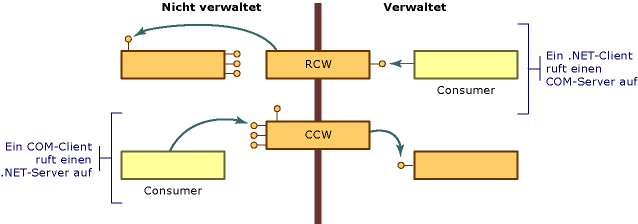

# COM-WrapperCOM Wrappers
COM unterscheidet sich vom .NET Framework-Objektmodell in mehreren wichtigen Punkten:COM differs from the .NET Framework object model in several important ways:  
  
-   Clients von COM-Objekten müssen die Lebensdauer dieser Objekte verwalten. Die Common Language Runtime verwaltet die Lebensdauer der Objekte in ihrer Umgebung.Clients of COM objects must manage the lifetime of those objects; the common language runtime manages the lifetime of objects in its environment.  
  
-   Clients von COM-Objekten ermitteln, ob ein Dienst verfügbar ist, indem sie eine Schnittstelle anfordern, die diesen Dienst bereitstellt und einen Schnittstellenzeiger erhalten oder nicht.Clients of COM objects discover whether a service is available by requesting an interface that provides that service and getting back an interface pointer, or not. Clients von .NET-Objekten erhalten durch Reflektion eine Beschreibung der Objektfunktionen.Clients of .NET objects can obtain a description of an object's functionality using reflection.  
  
-   NET-Objekte befinden sich im Arbeitsspeicher, der von der .NET Framework-Ausführungsumgebung verwaltet wird.NET objects reside in memory managed by the .NET Framework execution environment. Die Ausführungsumgebung kann Objekte im Arbeitsspeicher aus Leistungsgründen verschieben und alle Verweise auf die verschobenen Objekte aktualisieren.The execution environment can move objects around in memory for performance reasons and update all references to the objects it moves. Nicht verwaltete Clients, die einen Zeiger auf ein Objekt erhalten haben, verlassen sich darauf, dass das Objekt am selben Speicherort verbleibt.Unmanaged clients, having obtained a pointer to an object, rely on the object to remain at the same location. Diese Clients haben keinen Mechanismen für den Umgang mit einem Objekt, dessen Position nicht fest ist.These clients have no mechanism for dealing with an object whose location is not fixed.  
  
 Um diese Unterschiede zu überwinden, stellt die Common Language Runtime Wrapperklassen bereit, um sowohl verwalteten als auch nicht verwalteten Clients den Eindruck zu geben, dass sie Objekte in ihrer jeweiligen Umgebung aufrufen.To overcome these differences, the runtime provides wrapper classes to make both managed and unmanaged clients think they are calling objects within their respective environment. Wenn Ihr verwalteter Client eine Methode für ein COM-Objekt aufruft, erstellt die Laufzeit einen [Runtime Callable Wrapper](runtime-callable-wrapper.md) (RCW).Whenever your managed client calls a method on a COM object, the runtime creates a [runtime callable wrapper](runtime-callable-wrapper.md) (RCW). RCWs abstrahieren unter anderem die Unterschiede zwischen verwalteten und nicht verwalteten Verweismechanismen.RCWs abstract the differences between managed and unmanaged reference mechanisms, among other things. Die Common Language Runtime erstellt außerdem einen [COM Callable Wrapper](com-callable-wrapper.md) (CCW) zur Umkehrung dieses Prozesses. Der COM-Client kann eine Methode für ein .NET-Objekt nahtlos aufrufen.The runtime also creates a [COM callable wrapper](com-callable-wrapper.md) (CCW) to reverse the process, enabling a COM client to seamlessly call a method on a .NET object. Wie in der folgenden Abbildung gezeigt, bestimmt die Perspektive des aufrufenden Codes die Wrapperklasse, die die Common Language Runtime erstellt.As the following illustration shows, the perspective of the calling code determines which wrapper class the runtime creates.  
  
   
Übersicht über COM-WrapperCOM wrapper overview  
  
 In den meisten Fällen stellen die von der Common Language Runtime standardmäßig generierten RCW oder CCW ausreichend Marshalling für Aufrufe bereit, die die Anwendungsgrenze zwischen COM und dem .NET Framework überschreiten.In most cases, the standard RCW or CCW generated by the runtime provides adequate marshaling for calls that cross the boundary between COM and the .NET Framework. Mithilfe von benutzerdefinierten Attributen können Sie optional anpassen, wie die Common Language Runtime verwalteten und nicht verwalteten Code darstellt.Using custom attributes, you can optionally adjust the way the runtime represents managed and unmanaged code.  
  
## Siehe auchSee Also  
 [Erweiterte COM-Interoperabilität](https://docs.microsoft.com/previous-versions/dotnet/netframework-4.0/bd9cdfyx(v=vs.100))[Advanced COM Interoperability](https://docs.microsoft.com/previous-versions/dotnet/netframework-4.0/bd9cdfyx(v=vs.100))  
 [Runtime Callable Wrapper (RCW)Runtime Callable Wrapper](runtime-callable-wrapper.md)  
 [COM Callable WrapperCOM Callable Wrapper](com-callable-wrapper.md)  
 [Anpassen von Standardwrappern](https://msdn.microsoft.com/library/c40d089b-6a3c-41b5-a20d-d760c215e49d(v=vs.100))[Customizing Standard Wrappers](https://msdn.microsoft.com/library/c40d089b-6a3c-41b5-a20d-d760c215e49d(v=vs.100))  
 [Vorgehensweise: Anpassen von durch die Laufzeit aufrufbaren Wrappern](https://msdn.microsoft.com/library/4a4bb3da-4d60-4517-99f2-78d46a681732(v=vs.100))[How to: Customize Runtime Callable Wrappers](https://msdn.microsoft.com/library/4a4bb3da-4d60-4517-99f2-78d46a681732(v=vs.100))
