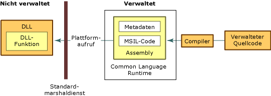

# Verwenden nicht verwalteter DLL-FunktionenConsuming Unmanaged DLL Functions
Der Plattformaufruf ist ein Dienst, der es verwaltetem Code ermöglicht, nicht verwaltete Funktionen aufzurufen, die in DLLs (Dynamic Link Library) implementiert sind, z. B. die in der Win32-API enthaltenen Funktionen.Platform invoke is a service that enables managed code to call unmanaged functions implemented in dynamic link libraries (DLLs), such as those in the Win32 API. Es sucht eine exportierte Funktion, ruft diese auf und marshallt ihre Argumente (ganze Zahlen, Zeichenfolgen, Arrays, Strukturen usw.) bei Bedarf über die Grenzen des dialogfähigen Betriebs hinaus.It locates and invokes an exported function and marshals its arguments (integers, strings, arrays, structures, and so on) across the interoperation boundary as needed.  
  
 In diesem Abschnitt werden Aufgaben beschrieben, die nicht verwalteten DLL-Funktionen zugeordnet sind. Zudem erhalten Sie Informationen zum Thema Plattformaufruf.This section introduces tasks associated with consuming unmanaged DLL functions and provides more information about platform invoke. Zusätzlich zu den folgenden Aufgaben sind allgemeine Überlegungen und ein Link enthalten, die weitere Informationen und Beispiele bieten.In addition to the following tasks, there are general considerations and a link providing additional information and examples.  
  
#### So verarbeiten Sie exportierte DLL-FunktionenTo consume exported DLL functions  
  
1.  [Identifizieren von Funktionen in DLLs](../../../docs/framework/interop/identifying-functions-in-dlls.md).[Identify functions in DLLs](../../../docs/framework/interop/identifying-functions-in-dlls.md).  
  
     Sie müssen mindestens den Namen der Funktion und den Namen der DLL angeben, in der sie enthalten ist.Minimally, you must specify the name of the function and name of the DLL that contains it.  
  
2.  [Erstellen einer Klasse zum Halten von DLL-Funktionen](../../../docs/framework/interop/creating-a-class-to-hold-dll-functions.md).[Create a class to hold DLL functions](../../../docs/framework/interop/creating-a-class-to-hold-dll-functions.md).  
  
     Sie können eine bestehende Klasse verwenden, eine einzelne Klasse für jede nicht verwaltete Funktion erstellen oder eine Klasse erstellen, die einen Satz zusammengehöriger, nicht verwalteter Funktionen enthält.You can use an existing class, create an individual class for each unmanaged function, or create one class that contains a set of related unmanaged functions.  
  
3.  [Erstellen von Prototypen in verwaltetem Code](../../../docs/framework/interop/creating-prototypes-in-managed-code.md).[Create prototypes in managed code](../../../docs/framework/interop/creating-prototypes-in-managed-code.md).  
  
     [Visual Basic] Verwenden Sie die **Declare**-Anweisung mit den Schlüsselwörtern **Function** und **Lib**.[Visual Basic] Use the **Declare** statement with the **Function** and **Lib** keywords. In seltenen Fällen können Sie **DllImportAttribute** mit den Schlüsselwörtern **Shared Function** verwenden.In some rare cases, you can use the **DllImportAttribute** with the **Shared Function** keywords. Diese Fälle werden weiter unten in diesem Abschnitt erläutert.These cases are explained later in this section.  
  
     [C#] Verwenden Sie **DllImportAttribute**, um die DLL und die Funktion zu identifizieren.[C#] Use the **DllImportAttribute** to identify the DLL and function. Kennzeichnen Sie die Methode mit den Modifizierern **static** und **extern**.Mark the method with the **static** and **extern** modifiers.  
  
     [C++] Verwenden Sie **DllImportAttribute**, um die DLL und die Funktion zu identifizieren.[C++] Use the **DllImportAttribute** to identify the DLL and function. Kennzeichnen Sie die Wrappermethode oder Funktion mit **extern "C"**.Mark the wrapper method or function with **extern "C"**.  
  
4.  [Aufrufen einer DLL-Funktion](../../../docs/framework/interop/calling-a-dll-function.md).[Call a DLL function](../../../docs/framework/interop/calling-a-dll-function.md).  
  
     Rufen Sie die Methode für Ihre verwaltete Klasse wie für jede andere verwaltete Methode auf.Call the method on your managed class as you would any other managed method. [Übergeben von Strukturen](../../../docs/framework/interop/passing-structures.md) und [Implementieren von Rückruffunktionen](../../../docs/framework/interop/callback-functions.md) sind spezielle Fälle.[Passing structures](../../../docs/framework/interop/passing-structures.md) and [implementing callback functions](../../../docs/framework/interop/callback-functions.md) are special cases.  
  
 Beispiele für die Vorgehensweise beim Erstellen von .NET-basierten Deklarationen, die mit dem Plattformaufruf verwendet werden können, finden Sie unter [Marshaling Data with Platform Invoke (Marshallen von Daten mit Plattformaufruf)](../../../docs/framework/interop/marshaling-data-with-platform-invoke.md).For examples that demonstrate how to construct .NET-based declarations to be used with platform invoke, see [Marshaling Data with Platform Invoke](../../../docs/framework/interop/marshaling-data-with-platform-invoke.md).  
  
## Genauere Betrachtung von PlattformaufrufenA closer look at platform invoke  
 Plattformaufrufe beruhen auf Metadaten, um exportierte Funktionen zu suchen und ihre Argumente zur Laufzeit zu marshallen.Platform invoke relies on metadata to locate exported functions and marshal their arguments at run time. Die folgende Abbildung veranschaulicht diesen Prozess.The following illustration shows this process.  
  
   
Plattformaufruf für eine nicht verwaltete DLL-FunktionA platform invoke call to an unmanaged DLL function  
  
 Wenn der Plattformaufruf eine nicht verwaltete Funktion aufruft, werden die folgenden Aktionen nacheinander ausgeführt:When platform invoke calls an unmanaged function, it performs the following sequence of actions:  
  
1.  Suchen der DLL, die die Funktion enthält.Locates the DLL containing the function.  
  
2.  Laden der DLL in den Arbeitsspeicher.Loads the DLL into memory.  
  
3.  Suchen der Adresse der Funktion im Arbeitsspeicher und Übertragen ihrer Argumente auf den Stapel, wobei die Daten bei Bedarf gemarshallt werden.Locates the address of the function in memory and pushes its arguments onto the stack, marshaling data as required.  
  
    > [!NOTE]
    >  Das Suchen und Laden der DLL sowie das Suchen der Adresse der Funktion im Arbeitsspeicher erfolgen nur beim ersten Aufruf der Funktion.Locating and loading the DLL, and locating the address of the function in memory occur only on the first call to the function.  
  
4.  Übertragen der Kontrolle an die nicht verwaltete Funktion.Transfers control to the unmanaged function.  
  
 Der Plattformaufruf löst Ausnahmen aus, die von der nicht verwalteten Funktion für den verwalteten Aufrufer generiert wurden.Platform invoke throws exceptions generated by the unmanaged function to the managed caller.

## Siehe auchSee Also  
 [Interoperabilität mit nicht verwaltetem CodeInteroperating with Unmanaged Code](../../../docs/framework/interop/index.md)  
 [Beispiele für PlattformaufrufePlatform Invoke Examples](../../../docs/framework/interop/platform-invoke-examples.md)  
 [Interop Marshaling (Interop-Marshalling)Interop Marshaling](../../../docs/framework/interop/interop-marshaling.md)  
