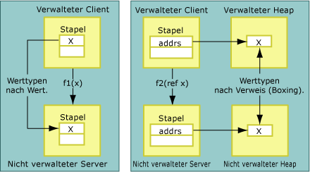
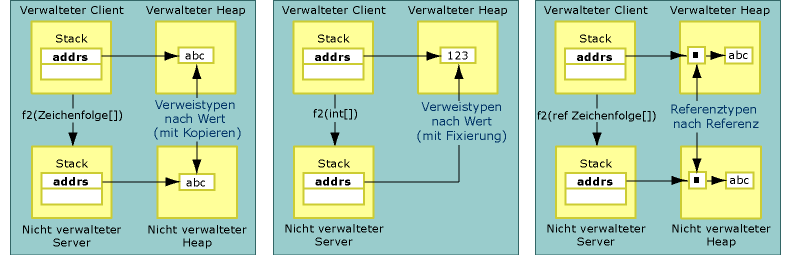

# Copying and Pinning
Beim Marshalling von Daten kann der Interop\-Marshaller die gemarshallten Daten kopieren oder fixieren.  Beim Kopieren der Daten wird ein zusätzliches Exemplar der Daten aus einem Speicherplatz an einem anderen Speicherplatz abgelegt.  Die folgende Abbildung zeigt die Unterschiede zwischen dem Kopieren eines Werttyps und dem Kopieren eines Typs, der durch einen Verweis aus verwaltetem an nicht verwalteten Speicher übergeben wird.  
  
   
Durch einen Wert und durch einen Verweis übergebene Werttypen  
  
 Durch einen Wert übergebene Methodenargumente werden auf dem Stapel an nicht verwalteten Code gemarshallt.  Der Kopierprozess wird direkt ausgeführt.  Durch einen Verweis übergebene Argumente werden als Zeiger auf dem Stapel übergeben.  Referenztypen werden ebenfalls durch einen Wert und durch einen Verweis übergeben.  Wie die folgende Abbildung zeigt, werden durch einen Wert übergebene Referenztypen entweder kopiert oder fixiert.  
  
   
Durch einen Wert und durch einen Verweis übergebene Referenztypen  
  
 Beim Fixieren werden die Daten vorübergehend an ihrem aktuellen Speicherplatz gesperrt. Dadurch wird verhindert, dass sie vom Garbage Collector der Common Language Runtime verschoben werden.  Der Marshaller fixiert Daten, um den Kopieraufwand zu reduzieren und die Gesamtleistung zu verbessern.  Ob Daten während des Marshallingprozesses kopiert oder fixiert werden, wird durch den Typ der Daten festgelegt.  Während des Marshallens für Objekte, z. B. <xref:System.String>, werden die Daten automatisch fixiert. Jedoch können Sie mit der <xref:System.Runtime.InteropServices.GCHandle>\-Klasse Daten manuell im Speicher fixieren.  
  
## Formatierte blitfähige Klassen  
 Formatierte [blitfähige](../../../docs/framework/interop/blittable-and-non-blittable-types.md) Klassen verfügen über ein festes \(formatiertes\) Layout sowie über eine gemeinsame Datendarstellung im verwalteten und im nicht verwalteten Speicher.  Wenn diese Typen gemarshallt werden müssen, wird ein Zeiger auf das Objekt im Heap direkt an den Aufgerufenen übergeben.  Der Aufgerufene kann den Inhalt des Speicherplatzes ändern, auf den der Zeiger verweist.  
  
> [!NOTE]
>  Der Speicherinhalt kann durch den Aufgerufenen geändert werden, wenn der Parameter als Out\-Parameter oder In\/Out\-Parameter gekennzeichnet ist.  Dagegen sollte der Aufgerufene Änderungen am Inhalt vermeiden, wenn der Parameter zum Marshallen als In\-Parameter markiert ist. Diese Einstellung wird standardmäßig für formatierte blitfähige Typen verwendet.  Die Änderung eines **In**\-Objekts kann zu Problemen führen, wenn dieselbe Klasse in eine Typbibliothek exportiert und zur Ausführung apartmentübergreifender Aufrufe verwendet wird.  
  
## Formatierte nicht blitfähige Klassen  
 Formatierte [nicht blitfähige](../../../docs/framework/interop/blittable-and-non-blittable-types.md) Klassen verfügen über ein festes \(fortmatiert\) Layout, die Darstellung im verwalteten und nicht verwalteten Speicher ist jedoch unterschiedlich.  Unter den folgenden Bedingungen ist gegebenenfalls eine Datenumwandlung erforderlich:  
  
-   Wenn eine nicht blitfähige Klasse durch einen Wert gemarshallt wird, erhält der Aufgerufene einen Zeiger auf eine Kopie der Datenstruktur.  
  
-   Wenn eine nicht blitfähige Klasse durch einen Verweis gemarshallt wird, erhält der Aufgerufene einen Zeiger auf einen Zeiger auf eine Kopie der Datenstruktur.  
  
-   Wenn das <xref:System.Runtime.InteropServices.InAttribute>\-Attribut festgelegt ist, wird diese Kopie immer mit dem Status der Instanz initialisiert, und das Marshallen erfolgt nach Bedarf.  
  
-   Wenn das <xref:System.Runtime.InteropServices.OutAttribute>\-Attribut festgelegt ist, wird der Status immer bei der Rückgabe zurück in die Instanz kopiert, und das Marshallen erfolgt nach Bedarf.  
  
-   Wenn sowohl **InAttribute** als auch **OutAttribute** festgelegt sind, werden beide Kopien benötigt.  Wenn beide Attribute ausgelassen werden, kann der Marshaller durch Entfernen jeder der beiden Kopien eine Optimierung vornehmen.  
  
## Verweistypen  
 Referenztypen können durch einen Wert oder durch einen Verweis übergeben werden.  Wenn sie durch einen Wert übergeben werden, wird ein Zeiger auf den Typ auf dem Stapel übergeben.  Wenn sie durch einen Verweis übergeben werden, wird ein Zeiger auf einen Zeiger auf den Typ auf dem Stapel übergeben.  
  
 Referenztypen weisen folgendes bedingtes Verhalten auf:  
  
-   Wenn ein Referenztyp durch einen Wert übergeben wird und über Member nicht blitfähiger Typen verfügt, werden die Typen zweimal konvertiert:  
  
    -   Bei der Übergabe eines Arguments an die nicht verwaltete Seite.  
  
    -   Bei der Rückgabe aus dem Aufruf.  
  
     Um unnötiges Kopieren und Konvertieren zu vermeiden, werden diese Typen als In\-Parameter gemarshallt.  Das **InAttribute**\-Attribut  und das **OutAttribute**\-Attribut  müssen explizit auf ein Argument angewendet werden, damit der Aufrufer die durch den Aufgerufenen vorgenommenen Änderungen sehen kann.  
  
-   Wenn ein Referenztyp durch einen Wert übergeben wird und nur über Member blitfähiger Typen verfügt, kann er während des Marshallens fixiert werden. In diesem Fall können sämtliche durch den Aufgerufenen an den Membern des Typs vorgenommenen Änderungen vom Aufrufer gesehen werden.  Um dieses Verhalten zu erreichen, wenden Sie **InAttribute** und **OutAttribute** explizit an.  Ohne diese direktionalen Attribute exportiert der Interop\-Marshaller keine direktionalen Informationen in die Typbibliothek \(Export erfolgt mit der Standardeinstellung **In**\). Dies kann beim apartmentübergreifenden Marshalling zu Problemen mit COM führen.  
  
-   Wenn ein Referenztyp durch einen Verweis übergeben wird, wird er standardmäßig als In\/Out\-Parameter gemarshallt.  
  
## System.String und System.Text.StringBuilder  
 Wenn Daten durch einen Wert oder einen Verweis an nicht verwalteten Code gemarshallt werden, kopiert der Marshaller die Daten in der Regel in einen sekundären Puffer \(wobei Zeichensätze beim Kopieren gegebenenfalls umgewandelt werden\) und übergibt einen Verweis auf den Puffer an den Aufgerufenen.  Wenn es sich bei dem Verweis nicht um ein mit **SysAllocString** zugeordnetes **BSTR** handelt, wird er immer mit **CoTaskMemAlloc** zugeordnet.  
  
 Wenn beide Zeichenfolgentypen durch einen Wert gemarshallt werden \(z. B. Unicode\-Zeichenfolgen\), übergibt der Marshaller dem Aufgerufenen einen direkten Zeiger auf verwaltete Zeichenfolgen im internen Unicode\-Puffer anstatt diesen in einen neuen Puffer zu kopieren.  
  
> [!CAUTION]
>  Wenn eine Zeichenfolge durch einen Wert übergeben wird, darf der Aufgerufene den durch den Marshaller übergebenen Verweis niemals ändern.  Durch eine solche Änderung kann der verwaltete Heap beschädigt werden.  
  
 Wenn ein <xref:System.String?displayProperty=fullName> durch einen Verweis übergeben wird, kopiert der Marshaller den Inhalt der Zeichenfolge in einen sekundären Puffer, bevor der Aufruf ausgeführt wird.  Anschließend kopiert er den Inhalt des Puffers bei Rückgabe aus dem Aufruf in eine neue Zeichenfolge.  Durch diese Vorgehensweise wird sichergestellt, dass die unveränderbare verwaltete Zeichenfolge unverändert bleibt.  
  
 Wenn ein <xref:System.Text.StringBuilder?displayProperty=fullName> durch einen Wert übergeben wird, übergibt der Marshaller einen Verweis auf den internen Puffer von **StringBuilder** direkt an den Aufrufer.  Aufrufer und Aufgerufener müssen sich über die Größe des Puffers einig sein.  Der Aufrufer ist für die Erstellung von **StringBuilder** mit der angemessenen Länge verantwortlich.  Der Aufgerufene muss die erforderlichen Sicherheitsvorkehrungen treffen, um Pufferüberläufe zu verhindern.  **StringBuilder** bildet bezüglich der Regel, dass durch einen Wert übergebene Referenztypen standardmäßig als In\-Parameter übergeben werden, eine Ausnahme.  Die Übergabe erfolgt immer als In\/Out\-Parameter.  
  
## Siehe auch  
 [Default Marshaling Behavior](../../../docs/framework/interop/default-marshaling-behavior.md)   
 [Memory Management with the Interop Marshaler](http://msdn.microsoft.com/de-de/417206ce-ee3e-4619-9529-0c0b686c7bee)   
 [Directional Attributes](http://msdn.microsoft.com/de-de/241ac5b5-928e-4969-8f58-1dbc048f9ea2)   
 [Interop Marshaling](../../../docs/framework/interop/interop-marshaling.md)