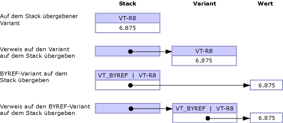

# Default Marshaling for Objects
Parameter und als <xref:System.Object?displayProperty=fullName> typisierte Felder können als einer der folgenden Typen für nicht verwalteten Code verfügbar gemacht werden:  
  
-   Wenn das Objekt ein Parameter ist, als Variante.  
  
-   Wenn das Objekt ein Strukturfeld ist, als Schnittstelle.  
  
 Das Marshallen von Objekttypen wird nur von COM\-Interop unterstützt.  Standardmäßig werden Objekte an COM\-Varianten gemarshallt.  Diese Regeln gelten nur für den Typ **Object**. Sie gelten nicht für Objekte mit starkem Typ, die von der **Object**\-Klasse abgeleitet werden.  
  
 In diesem Thema erhalten Sie folgende zusätzliche Informationen zum Marshallen von Objekttypen:  
  
-   [Marshallingoptionen](#cpcondefaultmarshalingforobjectsanchor7)  
  
-   [Marshalling eines Objekts an eine Schnittstelle](#cpcondefaultmarshalingforobjectsanchor2)  
  
-   [Marshalling eines Objekts an eine Variante](#cpcondefaultmarshalingforobjectsanchor3)  
  
-   [Marshalling einer Variante an ein Objekt](#cpcondefaultmarshalingforobjectsanchor4)  
  
-   [Marshalling von ByRef\-Varianten](#cpcondefaultmarshalingforobjectsanchor6)  
  
<a name="cpcondefaultmarshalingforobjectsanchor7"></a>   
## Marshallingoptionen  
 In der folgenden Tabelle finden Sie die Optionen für das Marshalling des Datentyps **Object**.  Das <xref:System.Runtime.InteropServices.MarshalAsAttribute>\-Attribut stellt mehrere <xref:System.Runtime.InteropServices.UnmanagedType>\-Enumerationswerte zum Marshallen von Objekten zur Verfügung.  
  
|Enumerationstyp|Beschreibung des nicht verwalteten Formats|  
|---------------------|------------------------------------------------|  
|**UnmanagedType.Struct**<br /><br /> \(Standard für Parameter\)|Variante im COM\-Format.|  
|**UnmanagedType.Interface**|Wenn möglich, eine **IDispatch**\-Schnittstelle; anderenfalls eine **IUnknown**\-Schnittstelle.|  
|**UnmanagedType.IUnknown**<br /><br /> \(Standard für Felder\)|Eine **IUnknown**\-Schnittstelle.|  
|**UnmanagedType.IDispatch**|Eine **IDispatch**\-Schnittstelle.|  
  
 Das folgende Beispiel demonstriert die verwaltete Schnittstellendefinition für `MarshalObject`:  
  
```vb  
Interface MarshalObject  
   Sub SetVariant(o As Object)  
   Sub SetVariantRef(ByRef o As Object)  
   Function GetVariant() As Object  
  
   Sub SetIDispatch( <MarshalAs(UnmanagedType.IDispatch)> o As Object)  
   Sub SetIDispatchRef(ByRef <MarshalAs(UnmanagedType.IDispatch)> o _  
      As Object)  
   Function GetIDispatch() As <MarshalAs(UnmanagedType.IDispatch)> Object  
   Sub SetIUnknown( <MarshalAs(UnmanagedType.IUnknown)> o As Object)  
   Sub SetIUnknownRef(ByRef <MarshalAs(UnmanagedType.IUnknown)> o _  
      As Object)  
   Function GetIUnknown() As <MarshalAs(UnmanagedType.IUnknown)> Object  
End Interface  
  
```  
  
```csharp  
interface MarshalObject {  
   void SetVariant(Object o);  
   void SetVariantRef(ref Object o);  
   Object GetVariant();  
  
   void SetIDispatch ([MarshalAs(UnmanagedType.IDispatch)]Object o);  
   void SetIDispatchRef([MarshalAs(UnmanagedType.IDispatch)]ref Object o);  
   [MarshalAs(UnmanagedType.IDispatch)] Object GetIDispatch();  
   void SetIUnknown ([MarshalAs(UnmanagedType.IUnknown)]Object o);  
   void SetIUnknownRef([MarshalAs(UnmanagedType.IUnknown)]ref Object o);  
   [MarshalAs(UnmanagedType.IUnknown)] Object GetIUnknown();  
}  
```  
  
 Der folgende Code exportiert die `MarshalObject`\-Schnittstelle in eine Typbibliothek.  
  
```  
interface MarshalObject {  
   HRESULT SetVariant([in] VARIANT o);  
   HRESULT SetVariantRef([in,out] VARIANT *o);  
   HRESULT GetVariant([out,retval] VARIANT *o)   
   HRESULT SetIDispatch([in] IDispatch *o);  
   HRESULT SetIDispatchRef([in,out] IDispatch **o);  
   HRESULT GetIDispatch([out,retval] IDispatch **o)   
   HRESULT SetIUnknown([in] IUnknown *o);  
   HRESULT SetIUnknownRef([in,out] IUnknown **o);  
   HRESULT GetIUnknown([out,retval] IUnknown **o)   
}  
```  
  
> [!NOTE]
>  Der Interop\-Marshaller gibt nach dem Aufruf innerhalb der Variante reservierte Objekte automatisch frei.  
  
 Im folgenden Beispiel ist ein formatierter Werttyp dargestellt.  
  
```vb  
Public Structure ObjectHolder  
   Dim o1 As Object  
   <MarshalAs(UnmanagedType.IDispatch)> Public o2 As Object  
End Structure  
  
```  
  
```csharp  
public struct ObjectHolder {  
   Object o1;  
   [MarshalAs(UnmanagedType.IDispatch)]public Object o2;  
}  
```  
  
 Der folgende Code exportiert den formatierten Typ in eine Typbibliothek.  
  
```  
struct ObjectHolder {  
   VARIANT o1;  
   IDispatch *o2;  
}  
```  
  
<a name="cpcondefaultmarshalingforobjectsanchor2"></a>   
## Marshalling eines Objekts an eine Schnittstelle  
 Wenn ein Objekt für COM als Schnittstelle verfügbar gemacht wird, so ist diese Schnittstelle die Klassenschnittstelle für den verwalteten Typ <xref:System.Object> \(die **\_Object**\-Schnittstelle\).  Die Schnittstelle wird in der resultierenden Typbibliothek als **IDispatch**\-Schnittstelle \([UnmanagedType.IDispatch](frlrfSystemRuntimeInteropServicesUnmanagedTypeClassTopic)\) oder als **IUnknown**\-Schnittstelle \(**UnmanagedType.IUnknown**\) typisiert.  COM\-Clients können über die **\_Object**\-Schnittstelle die Member der verwalteten Klasse oder beliebige der durch seine abgeleitete Klasse implementierten Member dynamisch aufrufen.  Der Client kann **QueryInterface** auch aufrufen, um eine beliebige andere Schnittstelle zu erhalten, die durch den verwalteten Typ explizit implementiert wurde.  
  
<a name="cpcondefaultmarshalingforobjectsanchor3"></a>   
## Marshalling eines Objekts an eine Variante  
 Wenn ein Objekt an eine Variante gemarshallt wird, so wird der interne Varianttyp zur Laufzeit anhand der folgenden Regeln bestimmt:  
  
-   Wenn der Objektverweis NULL \(**Nothing** in Visual Basic\) ist, wird das Objekt an eine Variante des Typs **VT\_EMPTY** gemarshallt.  
  
-   Wenn es sich bei dem Objekt um eine Instanz eines in der folgenden Tabelle aufgelisteten Typs handelt, wird der resultierende Varianttyp durch die im Marshaller integrierten und in der Tabelle dargestellten Regeln bestimmt.  
  
-   Andere Objekte, die das Verhalten beim Marshalling explizit steuern müssen, können die <xref:System.IConvertible>\-Schnittstelle implementieren.  In diesem Fall wird der Varianttyp durch den Typcode bestimmt, der von der <xref:System.IConvertible.GetTypeCode%2A?displayProperty=fullName>\-Methode zurückgegeben wird.  Anderenfalls wird das Objekt als Variante des Typs **VT\_UNKNOWN** gemarshallt.  
  
### Marshalling von Systemtypen an Varianten  
 In der folgenden Tabelle sind verwaltete Objekttypen und die entsprechenden COM\-Varianttypen dargestellt.  Diese Typen werden nur umgewandelt, wenn die Signatur der aufgerufenen Methode vom Typ <xref:System.Object?displayProperty=fullName> ist.  
  
|Objekttyp|COM\-Varianttyp|  
|---------------|---------------------|  
|NULL\-Objektverweis \(**Nothing** in Visual Basic\).|**VT\_EMPTY**|  
|<xref:System.DBNull?displayProperty=fullName>|**VT\_NULL**|  
|<xref:System.Runtime.InteropServices.ErrorWrapper?displayProperty=fullName>|**VT\_ERROR**|  
|<xref:System.Reflection.Missing?displayProperty=fullName>|**VT\_ERROR** mit **E\_PARAMNOTFOUND**|  
|<xref:System.Runtime.InteropServices.DispatchWrapper?displayProperty=fullName>|**VT\_DISPATCH**|  
|<xref:System.Runtime.InteropServices.UnknownWrapper?displayProperty=fullName>|**VT\_UNKNOWN**|  
|<xref:System.Runtime.InteropServices.CurrencyWrapper?displayProperty=fullName>|**VT\_CY**|  
|<xref:System.Boolean?displayProperty=fullName>|**VT\_BOOL**|  
|<xref:System.SByte?displayProperty=fullName>|**VT\_I1**|  
|<xref:System.Byte?displayProperty=fullName>|**VT\_UI1**|  
|<xref:System.Int16?displayProperty=fullName>|**VT\_I2**|  
|<xref:System.UInt16?displayProperty=fullName>|**VT\_UI2**|  
|<xref:System.Int32?displayProperty=fullName>|**VT\_I4**|  
|<xref:System.UInt32?displayProperty=fullName>|**VT\_UI4**|  
|<xref:System.Int64?displayProperty=fullName>|**VT\_I8**|  
|<xref:System.UInt64?displayProperty=fullName>|**VT\_UI8**|  
|<xref:System.Single?displayProperty=fullName>|**VT\_R4**|  
|<xref:System.Double?displayProperty=fullName>|**VT\_R8**|  
|<xref:System.Decimal?displayProperty=fullName>|**VT\_DECIMAL**|  
|<xref:System.DateTime?displayProperty=fullName>|**VT\_DATE**|  
|<xref:System.String?displayProperty=fullName>|**VT\_BSTR**|  
|<xref:System.IntPtr?displayProperty=fullName>|**VT\_INT**|  
|<xref:System.UIntPtr?displayProperty=fullName>|**VT\_UINT**|  
|<xref:System.Array?displayProperty=fullName>|**VT\_ARRAY**|  
  
 Unter Verwendung der im vorherigen Beispiel definierten `MarshalObject`\-Schnittstelle demonstriert das folgende Codebeispiel, wie unterschiedliche Varianttypen an einen COM\-Server übergeben werden.  
  
```vb  
Dim mo As New MarshalObject()  
mo.SetVariant(Nothing)         ' Marshal as variant of type VT_EMPTY.  
mo.SetVariant(System.DBNull.Value) ' Marshal as variant of type VT_NULL.  
mo.SetVariant(CInt(27))        ' Marshal as variant of type VT_I2.  
mo.SetVariant(CLng(27))        ' Marshal as variant of type VT_I4.  
mo.SetVariant(CSng(27.0))      ' Marshal as variant of type VT_R4.  
mo.SetVariant(CDbl(27.0))      ' Marshal as variant of type VT_R8.  
  
```  
  
```csharp  
MarshalObject mo = new MarshalObject();  
mo.SetVariant(null);            // Marshal as variant of type VT_EMPTY.  
mo.SetVariant(System.DBNull.Value); // Marshal as variant of type VT_NULL.  
mo.SetVariant((int)27);          // Marshal as variant of type VT_I2.  
mo.SetVariant((long)27);          // Marshal as variant of type VT_I4.  
mo.SetVariant((single)27.0);   // Marshal as variant of type VT_R4.  
mo.SetVariant((double)27.0);   // Marshal as variant of type VT_R8.  
```  
  
 COM\-Typen, die keine ihnen entsprechenden verwalteten Typen haben, können mit Wrapperklassen wie <xref:System.Runtime.InteropServices.ErrorWrapper>, <xref:System.Runtime.InteropServices.DispatchWrapper>, <xref:System.Runtime.InteropServices.UnknownWrapper> und <xref:System.Runtime.InteropServices.CurrencyWrapper> gemarshallt werden  Im folgenden Codebeispiel wird demonstriert, wie diese Wrapper verwendet werden, um unterschiedliche Varianttypen an einen COM\-Server zu übergeben.  
  
```vb  
Imports System.Runtime.InteropServices  
' Pass inew as a variant of type VT_UNKNOWN interface.  
mo.SetVariant(New UnknownWrapper(inew))  
' Pass inew as a variant of type VT_DISPATCH interface.  
mo.SetVariant(New DispatchWrapper(inew))  
' Pass a value as a variant of type VT_ERROR interface.  
mo.SetVariant(New ErrorWrapper(&H80054002))  
' Pass a value as a variant of type VT_CURRENCY interface.  
mo.SetVariant(New CurrencyWrapper(New Decimal(5.25)))  
  
```  
  
```csharp  
using System.Runtime.InteropServices;  
// Pass inew as a variant of type VT_UNKNOWN interface.  
mo.SetVariant(new UnknownWrapper(inew));  
// Pass inew as a variant of type VT_DISPATCH interface.  
mo.SetVariant(new DispatchWrapper(inew));  
// Pass a value as a variant of type VT_ERROR interface.  
mo.SetVariant(new ErrorWrapper(0x80054002));  
// Pass a value as a variant of type VT_CURRENCY interface.  
mo.SetVariant(new CurrencyWrapper(new Decimal(5.25)));  
```  
  
 Die Wrapperklassen werden im <xref:System.Runtime.InteropServices>\-Namespace definiert.  
  
### Marshalling der IConvertible\-Schnittstelle an eine Variante  
 Mit Ausnahme der im vorherigen Abschnitt aufgelisteten Typen können alle Typen durch Implementierung der <xref:System.IConvertible>\-Schnittstelle steuern, wie sie gemarshallt werden.  Wenn das Objekt die **IConvertible**\-Schnittstelle implementiert, wird der COM\-Varianttyp zur Laufzeit anhand des Werts der durch die <xref:System.IConvertible.GetTypeCode%2A?displayProperty=fullName>\-Methode zurückgegebenen <xref:System.TypeCode>\-Enumeration bestimmt.  
  
 In der folgenden Tabelle sind mögliche Werte der **TypeCode**\-Enumeration und die den einzelnen Werten entsprechenden COM\-Varianttypen aufgelistet.  
  
|TypeCode|COM\-Varianttyp|  
|--------------|---------------------|  
|**TypeCode.Empty**|**VT\_EMPTY**|  
|**TypeCode.Object**|**VT\_UNKNOWN**|  
|**TypeCode.DBNull**|**VT\_NULL**|  
|**TypeCode.Boolean**|**VT\_BOOL**|  
|**TypeCode.Char**|**VT\_UI2**|  
|**TypeCode.Sbyte**|**VT\_I1**|  
|**TypeCode.Byte**|**VT\_UI1**|  
|**TypeCode.Int16**|**VT\_I2**|  
|**TypeCode.UInt16**|**VT\_UI2**|  
|**TypeCode.Int32**|**VT\_I4**|  
|**TypeCode.UInt32**|**VT\_UI4**|  
|**TypeCode.Int64**|**VT\_I8**|  
|**TypeCode.UInt64**|**VT\_UI8**|  
|**TypeCode.Single**|**VT\_R4**|  
|**TypeCode.Double**|**VT\_R8**|  
|**TypeCode.Decimal**|**VT\_DECIMAL**|  
|**TypeCode.DateTime**|**VT\_DATE**|  
|**TypeCode.String**|**VT\_BSTR**|  
|Wird nicht unterstützt.|**VT\_INT**|  
|Wird nicht unterstützt.|**VT\_UINT**|  
|Wird nicht unterstützt.|**VT\_ARRAY**|  
|Wird nicht unterstützt.|**VT\_RECORD**|  
|Wird nicht unterstützt.|**VT\_CY**|  
|Wird nicht unterstützt.|**VT\_VARIANT**|  
  
 Der Wert der COM\-Variante wird durch Aufrufen der **IConvertible.To** *Type*\-Schnittstelle bestimmt; **To** *Type* ist hier die Umwandlungsroutine, die dem Typ entspricht, der von **IConvertible.GetTypeCode** zurückgegeben wurde.  Ein Objekt, das **TypeCode.Double** aus **IConvertible.GetTypeCode** zurückgibt, wird beispielsweise als COM\-Variante des Typs **VT\_R8** gemarshallt.  Den \(im **dblVal**\-Feld der COM\-Variante gespeicherten\) Wert der Variante können Sie erhalten, indem Sie eine Umwandlung in die **IConvertible**\-Schnittstelle durchführen und die <xref:System.IConvertible.ToDouble%2A>\-Methode aufrufen.  
  
<a name="cpcondefaultmarshalingforobjectsanchor4"></a>   
## Marshalling einer Variante an ein Objekt  
 Wenn Varianten an Objekte gemarshallt werden, wird der Typ des erstellten Objekts durch den Typ und in einigen Fällen auch durch den Wert der gemarshallten Variante bestimmt.  In der folgenden Tabelle sind die einzelnen Varianttypen und die entsprechenden Objekttypen aufgelistet, die der Marshaller erstellt, wenn eine Variante aus COM an .NET Framework übergeben wird.  
  
|COM\-Varianttyp|Objekttyp|  
|---------------------|---------------|  
|**VT\_EMPTY**|NULL\-Objektverweis \(**Nothing** in Visual Basic\).|  
|**VT\_NULL**|<xref:System.DBNull?displayProperty=fullName>|  
|**VT\_DISPATCH**|**System.\_\_ComObject**, oder NULL, wenn \(pdispVal \=\= null\)|  
|**VT\_UNKNOWN**|**System.\_\_ComObject**, oder NULL, wenn \(punkVal \=\= Null\)|  
|**VT\_ERROR**|<xref:System.UInt32?displayProperty=fullName>|  
|**VT\_BOOL**|<xref:System.Boolean?displayProperty=fullName>|  
|**VT\_I1**|<xref:System.SByte?displayProperty=fullName>|  
|**VT\_UI1**|<xref:System.Byte?displayProperty=fullName>|  
|**VT\_I2**|<xref:System.Int16?displayProperty=fullName>|  
|**VT\_UI2**|<xref:System.UInt16?displayProperty=fullName>|  
|**VT\_I4**|<xref:System.Int32?displayProperty=fullName>|  
|**VT\_UI4**|<xref:System.UInt32?displayProperty=fullName>|  
|**VT\_I8**|<xref:System.Int64?displayProperty=fullName>|  
|**VT\_UI8**|<xref:System.UInt64?displayProperty=fullName>|  
|**VT\_R4**|<xref:System.Single?displayProperty=fullName>|  
|**VT\_R8**|<xref:System.Double?displayProperty=fullName>|  
|**VT\_DECIMAL**|<xref:System.Decimal?displayProperty=fullName>|  
|**VT\_DATE**|<xref:System.DateTime?displayProperty=fullName>|  
|**VT\_BSTR**|<xref:System.String?displayProperty=fullName>|  
|**VT\_INT**|<xref:System.Int32?displayProperty=fullName>|  
|**VT\_UINT**|<xref:System.UInt32?displayProperty=fullName>|  
|**VT\_ARRAY** &#124; **VT\_\***|<xref:System.Array?displayProperty=fullName>|  
|**VT\_CY**|<xref:System.Decimal?displayProperty=fullName>|  
|**VT\_RECORD**|Entsprechender geschachtelter Werttyp.|  
|**VT\_VARIANT**|Wird nicht unterstützt.|  
  
 Aus COM an verwalteten Code übergebene und dann an COM zurückgegebene Varianttypen behalten für die Dauer des Anrufs möglicherweise nicht denselben Varianttyp bei.  Dies ist beispielsweise der Fall, wenn eine Variante des Typs **VT\_DISPATCH** aus COM an .NET Framework übergeben wird.  Während des Marshallens wird die Variante in ein <xref:System.Object?displayProperty=fullName> umgewandelt.  Wenn das **Object** dann an COM zurückgegeben wird, wird es an eine Variante des Typs **VT\_UNKNOWN** zurückgemarshallt.  Es gibt keine Garantie dafür, dass die Variante, die beim Marshallen eines Objekts aus verwaltetem Code an COM erstellt wird, demselben Typ angehört wie die ursprünglich zur Erstellung des Objekts verwendete Variante.  
  
<a name="cpcondefaultmarshalingforobjectsanchor6"></a>   
## Marshalling von ByRef\-Varianten  
 Obwohl Varianten durch einen Wert oder durch einen Verweis übergeben werden können, kann das **VT\_BYREF**\-Flag auch mit einem beliebigen Varianttyp verwendet werden, um darauf hinzuweisen, dass der Inhalt der Variante nicht durch einen Wert, sondern durch einen Verweis übergeben wird.  Der Unterschied zwischen dem Marshalling von Varianten durch einen Verweis und dem Marshalling von Varianten mit eingerichtetem **VT\_BYREF**\-Flag kann verwirrend sein.  Die folgende Abbildung stellt den Unterschied deutlich dar.  
  
   
Durch einen Wert und durch einen Verweis übergebene Varianten  
  
 **Standardmäßiges Verhalten beim Marshalling von Objekten und Varianten durch einen Wert**  
  
-   Wenn Objekte aus verwaltetem Code an COM übergeben werden, wird der Inhalt des Objekts in eine neue Variante kopiert, die unter Verwendung der unter [Marshalling eines Objekts an eine Variante](#cpcondefaultmarshalingforobjectsanchor3) definierten Regeln durch den Marshaller erstellt wurde.  Die auf der nicht verwalteten Seite an der Variante vorgenommenen Änderungen werden bei Rückgabe aus dem Aufruf nicht wieder an das ursprüngliche Objekt zurückübertragen.  
  
-   Wenn Varianten aus COM an verwalteten Code übergeben werden, wird der Inhalt der Variante unter Verwendung der unter [Marshalling einer Variante an ein Objekt](#cpcondefaultmarshalingforobjectsanchor4) definierten Regeln in ein neu erstelltes Objekt kopiert.  Die auf der verwalteten Seite am Objekt vorgenommenen Änderungen werden bei Rückgabe aus dem Aufruf nicht wieder an die ursprüngliche Variante zurückübertragen.  
  
 **Standardverhalten für das Marshalling von Objekten und Varianten durch einen Verweis**  
  
 Um Änderungen wieder an den Aufrufer zurückübertragen zu können, müssen die Parameter durch einen Verweis übergeben werden.  Das **ref**\-Schlüsselwort kann beispielsweise in C\# \(bzw. **ByRef** im verwalteten Code von Visual Basic\) zum Übergeben von Parametern durch einen Verweis verwendet werden.  In COM werden Verweisparameter mithilfe eines Zeigers \(z. B. **variant \***\) übergeben.  
  
-   Wenn ein Objekt durch einen Verweis an COM übergeben wird, erstellt der Marshaller eine neue Variante und kopiert den Inhalt des Objektverweises in die Variante, bevor der Aufruf ausgeführt wird.  Die Variante wird an die nicht verwaltete Funktion übergeben; dort kann der Benutzer entscheiden, ob der Inhalt der Variante geändert werden soll.  Bei Rückgabe aus dem Aufruf werden die auf der nicht verwalteten Seite an der Variante vorgenommenen Änderungen wieder an das ursprüngliche Objekt zurückübertragen.  Wenn sich der Typ der Variante vom Typ der an den Aufruf übergebenen Variante unterscheidet, werden die Änderungen wieder an ein Objekt eines anderen Typs zurückübertragen.  Dies bedeutet, dass sich der Typ des an den Aufruf übergebenen Objekts vom Typ des durch den Aufruf zurückgegebenen Objekts unterscheiden kann.  
  
-   Wenn eine Variante durch einen Verweis an verwalteten Code übergeben wird, erstellt der Marshaller ein neues Objekt und kopiert den Inhalt der Variante in das Objekt, bevor der Aufruf ausgeführt wird.  Dann wird ein Verweis auf das Objekt an die verwaltete Funktion übergeben. Dort kann der Benutzer entscheiden, ob das Objekt geändert werden soll.  Bei Rückgabe aus dem Aufruf werden die am referenzierten Objekt vorgenommenen Änderungen wieder an das ursprüngliche Objekt zurückübertragen.  Wenn sich der Typ des Objekts vom Typ des an den Aufruf übergebenen Objekts unterscheidet, wird der Typ der ursprünglichen Variante geändert, und der Wert wird wieder an die Variante zurückübertragen.  Auch hier kann sich der Typ der an den Aufruf übergebenen Variante vom Typ der durch den Aufruf zurückgegebenen Variante unterscheiden.  
  
 **Standardverhalten für das Marshalling von Varianten mit eingerichtetem VT\_BYREF\-Flag**  
  
-   Für eine durch einen Wert an verwalteten Code übergebene Variante kann das **VT\_BYREF**\-Flag eingerichtet sein, das darauf hinweist, dass die Variante anstelle eines Werts einen Verweis enthält.  In diesem Fall wird die Variante trotzdem an ein Objekt gemarshallt, da sie durch einen Wert übergeben wird.  Der Marshaller dereferenziert den Inhalt der Variante automatisch und kopiert sie vor der Ausführung des Aufrufs in ein neu erstelltes Objekt.  Dieses Objekt wird dann an die verwaltete Funktion übergeben; bei Rückgabe aus dem Aufruf wird das Objekt jedoch nicht wieder an die ursprüngliche Variante zurückübertragen.  Die am verwalteten Objekt vorgenommenen Änderungen gehen dabei verloren.  
  
    > [!CAUTION]
    >  Der Wert einer durch einen Wert übergebenen Variante kann nicht geändert werden, auch wenn für die Variante das **VT\_BYREF**\-Flag eingerichtet wurde.  
  
-   Für eine durch einen Verweis an verwalteten Code übergebene Variante kann das **VT\_BYREF**\-Flag ebenfalls eingerichtet sein, um anzugeben, dass die Variante einen weiteren Verweis enthält.  Wenn das der Fall ist, wird die Variante an ein **ref**\-Objekt gemarshallt, da die Variante durch einen Verweis übergeben wird.  Der Marshaller dereferenziert den Inhalt der Variante automatisch und kopiert sie vor der Ausführung des Aufrufs in ein neu erstelltes Objekt.  Bei Rückgabe aus dem Aufruf wird der Wert des Objekts nur dann an den Verweis in der ursprünglichen Variante zurückverteilt, wenn das Objekt demselben Typ angehört wie das übergebene Objekt.  Durch die Verteilung wird also der Typ einer Variante mit eingerichtetem **VT\_BYREF**\-Flag nicht geändert.  Wenn der Objekttyp während des Aufrufs geändert wird, wird bei Rückgabe aus dem Aufruf eine <xref:System.InvalidCastException> ausgelöst.  
  
 In der folgenden Tabelle sind die Regeln für die Weitergabe von Varianten und Objekten zusammengefasst.  
  
|Von|To|Zurückübertragene Änderungen|  
|---------|--------|----------------------------------|  
|**Variante**  *v*|**Objekt**  *o*|Nie|  
|**Objekt**  *o*|**Variante**  *v*|Nie|  
|**Variante**   ***\****  *pv*|**Ref Object**  *o*|Immer|  
|**Ref Object**  *o*|**Variante**   ***\****  *pv*|Immer|  
|**Variante**  *v* **\(VT\_BYREF** *&#124;*  **VT\_\*\)**|**Objekt**  *o*|Nie|  
|**Variante**  *v* **\(VT\_BYREF** *&#124;*  **VT\_\)**|**Ref Object**  *o*|Nur, wenn der Typ sich nicht geändert hat.|  
  
## Siehe auch  
 [Default Marshaling Behavior](../../../docs/framework/interop/default-marshaling-behavior.md)   
 [Blittable and Non\-Blittable Types](../../../docs/framework/interop/blittable-and-non-blittable-types.md)   
 [Directional Attributes](http://msdn.microsoft.com/de-de/241ac5b5-928e-4969-8f58-1dbc048f9ea2)   
 [Copying and Pinning](../../../docs/framework/interop/copying-and-pinning.md)