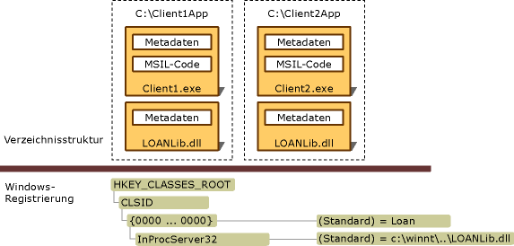

# Deploying an Interop Application
Eine Interop\-Anwendung umfasst in der Regel eine .NET\-Clientassembly, eine oder mehrere Interop\-Assemblys, die verschiedene COM\-Typbibliotheken darstellen, sowie eine oder mehrere registrierte COM\-Komponenten.  Visual Studio und [!INCLUDE[winsdklong](../../../includes/winsdklong-md.md)] enthalten Tools zum Importieren einer Typbibliothek und anschließenden Konvertieren der Typbibliothek in eine Interopassembly. Informationen hierzu erhalten Sie unter [Importing a Type Library as an Assembly](../../../docs/framework/interop/importing-a-type-library-as-an-assembly.md).  Interopanwendungen können auf zwei Arten bereitgestellt werden:  
  
-   Durch das Verwenden von eingebetteten Interop\-Typen: Indem Sie mit der [!INCLUDE[net_v40_long](../../../includes/net-v40-long-md.md)]\-Anweisung beginnen, wird der Compiler angewiesen, Typinformationen von einer Interopassembly in die EXE\-Datei einzubetten.  Der Compiler bettet nur die Typinformationen ein, die von der Anwendung verwendet werden.  Die Interopassembly muss nicht mit der Anwendung bereitgestellt werden.  Dies ist das empfohlene Verfahren.  
  
-   Durch das Bereitstellen von Interopassemblys: Sie können einen Standardverweis auf eine Interopassembly erstellen.  In diesem Fall muss die Interopassembly mit der Anwendung bereitgestellt werden.  Wenn Sie dieses Verfahren und keine private COM\-Komponente verwenden, verweisen Sie immer auf die primäre Interopassembly \(Primary Interop Assembly, PIA\), die vom Verfasser der COM\-Komponente, die Sie in den verwalteten Code aufnehmen möchten, veröffentlicht wurde.  Weitere Informationen zum Erstellen und Verwenden von primären Interopassemblys finden Sie unter [Primäre Interopassemblys](http://msdn.microsoft.com/de-de/b977a8be-59a0-40a0-a806-b11ffba5c080).  
  
 Bei der Verwendung von eingebetteten Interoptypen ist die Bereitstellung einfach und unkompliziert.  Hierzu ist keine besondere Vorgehensweise erforderlich.  Der Artikel beschreibt im Folgenden das Bereitstellen von Interopassemblys mit der Anwendung.  
  
## Bereitstellen von Interopassemblys  
 Assemblys können starke Namen haben.  Eine Assembly mit starkem Namen enthält den öffentlichen Schlüssel des Herausgebers und verfügt damit über eine eindeutige Identität.  Mit dem [Typbibliothekimporter \(Tlbimp.exe\)](../../../docs/framework/tools/tlbimp-exe-type-library-importer.md) erstellte Assemblys, können vom Verleger mithilfe der **\/keyfile**\-Option signiert werden.  Signierte Assemblys können im globalen Assemblycache installiert werden.  Unsignierte Assemblys müssen auf dem Computer des Benutzers als private Assemblys installiert werden.  
  
### Private Assemblys  
 Zur Installation einer Assembly zur privaten Nutzung muss die EXE\-Datei der Anwendung zusammen mit der Interop\-Assembly, die die importierten COM\-Typen enthält, in derselben Verzeichnisstruktur installiert werden.  Die folgende Abbildung zeigt eine unsignierte Interop\-Assembly zur privaten Nutzung durch Client1.exe und Client2.exe, die sich in separaten Anwendungsverzeichnissen befinden.  Die Interop\-Assembly in diesem Beispiel heißt LOANLib.dll und wird zweimal installiert.  
  
   
Verzeichnisstruktur und Registrierungseinträge für eine private Bereitstellung  
  
 Alle mit der Anwendung verknüpften COM\-Komponenten müssen in der Windows\-Registrierung installiert werden.  Wenn Client1.exe und Client2.exe \(siehe Abbildung\) auf verschiedenen Computern installiert werden, müssen die COM\-Komponenten auf beiden Computern registriert werden.  
  
### Freigegebene Assemblys  
 Freigegebene, von mehreren Anwendungen gemeinsam verwendete Assemblys müssen in einem zentralen Repository installiert werden, dem so genannten globalen Assemblycache.  Mehrere .NET\-Clients können zeitgleich auf eine im globalen Assemblycache signierte und installierte Kopie der Interop\-Assembly zugreifen.  Weitere Informationen zum Erstellen und Verwenden von primären Interopassemblys finden Sie unter [Primäre Interopassemblys](http://msdn.microsoft.com/de-de/b977a8be-59a0-40a0-a806-b11ffba5c080).  
  
## Siehe auch  
 [Exposing COM Components to the .NET Framework](../../../docs/framework/interop/exposing-com-components.md)   
 [Importing a Type Library as an Assembly](../../../docs/framework/interop/importing-a-type-library-as-an-assembly.md)   
 [Using COM Types in Managed Code](http://msdn.microsoft.com/de-de/1a95a8ca-c8b8-4464-90b0-5ee1a1135b66)   
 [Compiling an Interop Project](../../../docs/framework/interop/compiling-an-interop-project.md)