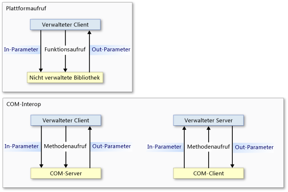
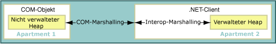
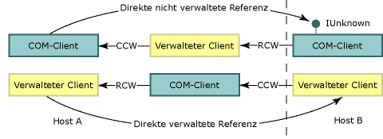

# Interop-Marshalling
 Interop-Marshalling steuert, wie Daten in Methodenargumenten und Rückgabewerten zwischen verwaltetem und nicht verwaltetem Speicher während Aufrufen übergeben werden. Interop-Marshalling ist eine Laufzeitaktivität, die vom Marshallingdienst der Common Language Runtime ausgeführt wird.  
  
 Die meisten Datentypen verfügen über gemeinsame Darstellungen im verwalteten und nicht verwalteten Speicher. Der Interop-Marshaller behandelt diese Typen für Sie. Andere Typen können im verwalteten Speicher nicht eindeutig oder gar nicht dargestellt sein.  
  
 Ein nicht eindeutiger Typ kann entweder mehrere nicht verwaltete Darstellungen besitzen, die einem einzelnen verwalteten Typ zugeordnet werden, oder ihm können Typinformationen fehlen, wie z. B. die Größe eines Arrays. Für nicht eindeutige Typen stellt der Marshaller eine Standarddarstellung und alternative Darstellungen, wenn mehrere Darstellungen vorhanden sind, bereit. Sie können explizite Anweisungen für den Marshaller angeben, wie ein nicht eindeutiger Typ zu marshallen ist.  
  
 Diese Übersicht enthält folgende Abschnitte:  
  
-   [Plattformaufruf und COM-Interop-Modelle](#platform_invoke_and_com_interop_models)  
  
-   [Marshalling und COM-Apartments](#marshaling_and_com_apartments)  
  
-   [Marshalling von Remoteaufrufen](#marshaling_remote_calls)  
  
-   [Verwandte Themen](#related_topics)  
  
-   [Referenz](#reference)  
  
   
## Plattformaufruf und COM-Interop-Modelle  
 Die Common Language Runtime stellt zwei Mechanismen für die Interoperation mit nicht verwaltetem Code bereit:  
  
-   Plattformaufruf, wodurch verwalteter Code Funktionen aufrufen kann, die aus einer nicht verwalteten Bibliothek exportiert wurden.  
  
-   COM-Interop, wodurch verwalteter Code über Schnittstellen mit COM-Objekten (Component Object Model) interagieren kann.  
  
 Sowohl Plattformaufruf als auch COM-Interop verwenden Interop-Marshalling, um, falls erforderlich, Methodenargumente präzise zwischen Aufrufer und Aufgerufenem und umgekehrt zu verschieben. Wie die folgende Abbildung zeigt, fließt ein Methodenaufruf eines Plattformaufrufs vom verwalteten zum nicht verwalteten Code und niemals umgekehrt, es sei denn, dass [Rückruffunktionen](../../../docs/framework/interop/callback-functions.md) beteiligt sind. Obwohl Plattformaufrufe nur vom verwalteten zum nicht verwalteten Code fließen können, können Daten als Ein-oder Ausgabeparameter in beide Richtungen fließen. COM-Interop-Methodenaufrufe können in beide Richtungen fließen.  
  
   
Plattformaufruf- und COM-Interop-Aufruffluss  
  
 Auf der niedrigsten Ebene verwenden beide Mechanismen denselben Interop-Marshallingdienst. Bestimmte Datentypen werden aber ausschließlich nur von COM-Interop oder von Plattformaufrufen unterstützt. Details hierzu finden Sie unter [Default Marshaling Behavior (Standardmäßiges Marshallingverhalten)](../../../docs/framework/interop/default-marshaling-behavior.md).  
  
 [Zurück nach oben](#top)  
  
   
## Marshalling und COM-Apartments  
 Der Interop-Marshaller marshallt Daten zwischen dem Common Language Runtime-Heap und dem nicht verwalteten Heap. Marshalling tritt auf, wenn der Aufrufer und der Aufgerufene nicht an derselben Instanz von Daten arbeiten können. Der Interop-Marshaller ermöglicht es dem Aufrufer und dem Aufgerufenen, scheinbar an denselben Daten zu arbeiten, auch wenn sie jeweils eine eigenen Kopie der Daten besitzen.  
  
 COM verfügt ebenfalls über einen Marshaller, der Daten zwischen COM-Apartments oder verschiedenen COM-Prozessen marshallt. Beim Aufrufen zwischen verwaltetem und nicht verwaltetem Code innerhalb desselben COM-Apartments ist der Interop-Marshaller als einziger Marschaller beteiligt. Beim Aufrufen zwischen verwaltetem und nicht verwaltetem Code in einem anderen COM-Apartment oder einem anderen Prozess sind sowohl der Interop-Marshaller als auch der COM-Marschaller beteiligt.  
  
### COM-Clients und verwaltete Server  
 Ein exportierter verwalteter Server mit einer vom [Assembly Registration-Tool (Regasm.exe)](../../../docs/framework/tools/regasm-exe-assembly-registration-tool.md) registrierten Typbibliothek besitzt einen auf `Both` festgelegten `ThreadingModel`-Registrierungseintrag. Dieser Wert gibt an, dass der Server in einem Singlethread-Apartment (STA) oder einem Multithread-Apartment (MTA) aktiviert werden kann. Das Serverobjekt wird im selben Apartment wie sein Aufrufer erstellt, wie in der folgenden Tabelle dargestellt.  
  
|COM-Client|.NET-Server|Marshallinganforderungen|  
|----------------|-----------------|-----------------------------|  
|STA|`Both` wird STA.|Marshalling im selben Apartment.|  
|MTA|`Both` wird MTA.|Marshalling im selben Apartment.|  
  
 Da Client und Server im selben Apartment sind, verarbeitet der Interop-Marshallingdienst automatisch das gesamte Daten-Marshalling. Die folgende Abbildung zeigt, wie der Interop-Marshallingdienst zwischen verwalteten und nicht verwalteten Heaps innerhalb desselben COM-artigen Apartments agiert.  
  
   
Marshallingprozess im selben Apartment.  
  
 Wenn Sie planen, einen verwalteten Server zu exportieren, sollten Sie daran denken, dass der COM-Client das Apartment des Servers bestimmt. Ein von einem COM-Client aufgerufener und in einem MTA initialisierter verwalteter Server muss Threadsicherheit sicherstellen.  
  
### Verwaltete Clients und COM-Server  
 Die Standardeinstellung für verwaltete Clientapartments ist MTA. Der Anwendungstyp des .NET-Clients kann jedoch die Standardeinstellung ändern. Angenommen, eine [!INCLUDE[vbprvblong](../../../includes/vbprvblong-md.md)]-Clientapartmenteinstellung ist STA. Sie können eine der Eigenschaften <xref:System.STAThreadAttribute?displayProperty=fullName>, <xref:System.MTAThreadAttribute?displayProperty=fullName>, <xref:System.Threading.Thread.ApartmentState%2A?displayProperty=fullName> oder die Eigenschaft <xref:System.Web.UI.Page.AspCompatMode%2A?displayProperty=fullName> verwenden, um die Apartmenteinstellung eines verwalteten Clients zu untersuchen und zu ändern.  
  
 Der Autor der Komponente legt die Threadaffinität eines COM-Servers fest. Die folgende Tabelle zeigt die Kombinationen von Apartmenteinstellungen für .NET-Clients und COM-Server. Sie zeigt außerdem die resultierenden Marshallinganforderungen für die Kombinationen.  
  
|.NET-Client|COM-Server|Marshallinganforderungen|  
|-----------------|----------------|-----------------------------|  
|MTA (Standard)|MTA   STA|Interop-Marshalling   Interop- und COM-Marshalling|  
|STA|MTA   STA|Interop- und COM-Marshalling   Interop-Marshalling|  
  
 Wenn ein verwalteter Client und ein nicht verwalteter Server im selben Apartment sind, verarbeitet der Interop-Marshallingdienst das gesamte Daten-Marshalling. Wenn Client und Server in unterschiedlichen Apartments initialisiert werden, ist jedoch auch COM-Marshalling erforderlich. Die folgende Abbildung zeigt die Elemente eines apartmentübergreifenden Aufrufs.  
  
   
Apartmentübergreifender Aufruf zwischen einem .NET-Client und einem COM-Objekt  
  
 Für apartmentübergreifendes Marshalling können Sie Folgendes tun:  
  
-   Akzeptieren Sie den Mehraufwand für das apartmentübergreifende Marshalling, der sich nur bemerkbar macht, wenn viele Aufrufe vorhanden sind, die die Apartmentgrenze überschreiten. Sie müssen die Typbibliothek der COM-Komponente registrieren, damit Aufrufe erfolgreich die Apartmentgrenze überschreiten können.  
  
-   Ändern Sie den Hauptthread, indem den Clientthread auf STA oder MTA festlegen. Wenn z. B. Ihr C#-Client viele STA-COM-Komponenten aufruft, können Sie apartmentübergreifendes Marshalling vermeiden, indem Sie den Hauptthread auf STA festlegen.  
  
    > [!NOTE]
    >  Sobald der Thread eines C#-Clients auf STA festgelegt ist, erfordern Aufrufe von MTA-COM-Komponenten apartmentübergreifendes Marshalling.  
  
 Anleitungen zum expliziten Auswählen eines Apartmentmodells finden Sie unter [Managed and Unmanaged Threading (Verwaltetes und nicht verwaltetes Threading)](http://msdn.microsoft.com/en-us/db425c20-4b2f-4433-bf96-76071c7881e5).  
  
 [Zurück nach oben](#top)  
  
   
## Marshalling von Remoteaufrufen  
 Wie bei apartmentübergreifendem Marshalling ist bei jedem Aufruf zwischen verwaltetem und nicht verwaltetem Code COM-Marshalling beteiligt, wenn sich die Objekte in verschiedenen Prozessen befinden. Beispiel:  
  
-   Ein COM-Client, der einen verwalteten Server auf einem Remotehost aufruft, verwendet verteiltes COM (DCOM).  
  
-   Ein verwalteter Client, der einen COM-Server auf einem Remotehost aufruft, verwendet DCOM.  
  
 Die folgende Abbildung zeigt, wie Interop-Marshalling und COM-Marshalling Kommunikationskanäle über Prozess- und Hostgrenzen hinweg bereitstellen.  
  
   
Prozessübergreifendes Marshalling  
  
### Beibehalten der Identität  
 Die Common Language Runtime behält die Identität verwalteter und nicht verwalteter Verweise bei. Die folgende Abbildung zeigt den Fluss direkter, nicht verwalteter Verweise (obere Zeile) und direkter, verwalteter Verweise (untere Zeile) über Prozess- und Hostgrenzen hinweg.  
  
   
Verweisübergabe über Prozess- und Hostgrenzen hinweg  
  
 In dieser Abbildung:  
  
-   Ein nicht verwalteter Client ruft einen Verweis auf ein COM-Objekt von einem verwalteten Objekt ab, das diesen Verweis von einem Remotehost abruft. Der Remotingmechanismus ist DCOM.  
  
-   Ein verwalteter Client ruft einen Verweis auf ein verwaltetes Objekt von einem COM-Objekt ab, das diesen Verweis von einem Remotehost abruft. Der Remotingmechanismus ist DCOM.  
  
    > [!NOTE]
    >  Die exportierte Typbibliothek des verwalteten Servers muss registriert sein.  
  
 Die Anzahl der Prozessgrenzen zwischen Aufrufer und Aufgerufenem ist irrelevant. Dieselbe direkte Referenzierung tritt bei prozessinternen und -externen Aufrufen auf.  
  
### Verwaltetes Remoting  
 Die Laufzeit bietet auch verwaltetes Remoting, das Sie zum Einrichten eines Kommunikationskanals zwischen verwalteten Objekten über Prozess- und Hostgrenzen hinweg verwenden können. Verwaltetes Remoting kann eine Firewall zwischen den kommunizierenden Komponenten unterstützen, wie die folgende Abbildung zeigt.  
  
   
Firewallübergreifende Remoteaufrufe mit SOAP oder der TcpChannel-Klasse  
  
 Einige nicht verwaltete Aufrufe können durch SOAP geleitet werden, z.B. die Aufrufe zwischen [Serviced Components](http://msdn.microsoft.com/en-us/f109ee24-81ad-4d99-9892-51ac6f34978c) und COM.  
  
 [Zurück nach oben](#top)  
  
   
## Verwandte Themen  
  
|Titel|Beschreibung|  
|-----------|-----------------|  
|[Default Marshaling Behavior (Standardmäßiges Marshallingverhalten)](../../../docs/framework/interop/default-marshaling-behavior.md)|Beschreibt die Regeln, die der Interop-Marshallingdienst für das Marshalling von Daten verwendet.|  
|[Marshallen von Daten mit Plattformaufruf](../../../docs/framework/interop/marshaling-data-with-platform-invoke.md)|Beschreibt, wie Sie Methodenparameter deklarieren und Argumente an Funktionen übergeben, die aus nicht verwalteten Bibliotheken exportiert wurden.|  
|[Marshaling Data with COM Interop (Marshallen von Daten mit COM-Interop)](../../../docs/framework/interop/marshaling-data-with-com-interop.md)|Beschreibt, wie Sie COM-Wrapper anpassen, um das Marshallingverhalten zu ändern.|  
|[How to: Migrate Managed-Code DCOM to WCF (Vorgehensweise: Migrieren von verwaltetem Code DCOM zu WCF)](../../../docs/framework/interop/how-to-migrate-managed-code-dcom-to-wcf.md)|Beschreibt, wie Sie von DCOM zu WCF migrieren.|  
|[Gewusst wie: Zuordnen von HRESULTs und Ausnahmen](../../../docs/framework/interop/how-to-map-hresults-and-exceptions.md)|Beschreibt, wie Sie benutzerdefinierte Ausnahmen zu HRESULTs zuordnen, und stellt die vollständige Zuordnung von jedem HRESULT zu seiner vergleichbaren Ausnahmeklasse in .NET Framework bereit.|  
|[Interoperation mit generischen Typen](http://msdn.microsoft.com/en-us/26b88e03-085b-4b53-94ba-a5a9c709ce58)|Beschreibt, welche Aktionen bei Verwendung von generischen Typen für COM-Interoperabilität unterstützt werden.|  
|[Interoperabilität mit nicht verwaltetem Code](../../../docs/framework/interop/index.md)|Beschreibt Interoperabilitätsdienste, die von der Common Language Runtime bereitgestellt werden.|  
|[Erweiterte COM-Interoperabilität](http://msdn.microsoft.com/en-us/3ada36e5-2390-4d70-b490-6ad8de92f2fb)|Stellt Links zu weiteren Informationen über das Einbinden von COM-Komponenten in Ihre .NET Framework-Anwendung bereit.|  
|[Entwurfsüberlegungen für die Interoperation](http://msdn.microsoft.com/en-us/b59637f6-fe35-40d6-ae72-901e7a707689)|Bietet Tipps zum Schreiben integrierter COM-Komponenten.|  
  
 [Zurück nach oben](#top)  
  
   
## Verweis  
 <xref:System.Runtime.InteropServices?displayProperty=fullName>  
  
 [Zurück nach oben](#top)

