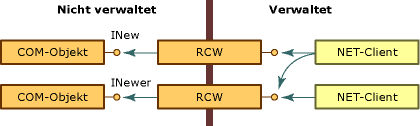
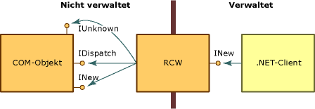

# Runtime Callable Wrapper (RCW)Runtime Callable Wrapper
Die Common Language Runtime macht COM-Objekte über einen Proxy verfügbar, der RCW (Runtime Callable Wrapper, Aufrufwrapper der Common Language Runtime) genannt wird.The common language runtime exposes COM objects through a proxy called the runtime callable wrapper (RCW). Obwohl .NET-Clients einen RCW als normales Objekt betrachten, besteht seine primäre Funktion im Marshallen von Aufrufen zwischen einem .NET-Client und einem COM-Objekt.Although the RCW appears to be an ordinary object to .NET clients, its primary function is to marshal calls between a .NET client and a COM object.  
  
 Die Common Language Runtime erstellt genau einen RCW für jedes COM-Objekt, unabhängig von der Anzahl der vorhandenen Verweise auf das Objekt.The runtime creates exactly one RCW for each COM object, regardless of the number of references that exist on that object. Die Common Language Runtime verwaltet für jedes Objekt einen einzelnen RCW pro Prozess.The runtime maintains a single RCW per process for each object.  Wenn Sie einen RCW in einer Anwendungsdomäne oder einem Apartment erstellen und anschließend einen Verweis an eine andere Anwendungsdomäne oder ein anderes Apartment übergeben, wird ein Proxy für das erste Objekt verwendet.If you create an RCW in one application domain or apartment, and then pass a reference to another application domain or apartment, a proxy to the first object will be used.  Wie die folgende Abbildung zeigt, kann eine beliebige Anzahl verwalteter Clients auf die COM-Objekte verweisen, welche die Schnittstellen "INew" und "INewer" verfügbar machen.As the following illustration shows, any number of managed clients can hold a reference to the COM objects that expose INew and INewer interfaces.  
  
   
Zugriff auf COM-Objekte über den RCWAccessing COM objects through the runtime callable wrapper  
  
 Mithilfe von Metadaten, die aus einer Typbibliothek abgeleitet werden, erstellt die Common Language Runtime sowohl das aufzurufende COM-Objekt als auch einen Wrapper für dieses Objekt.Using metadata derived from a type library, the runtime creates both the COM object being called and a wrapper for that object. Jeder RCW verwaltet einen Cache von Schnittstellenzeigern auf das umschlossene COM-Objekt. Ist der RCW nicht länger erforderlich, wird der jeweilige Verweis auf das COM-Objekt freigegeben.Each RCW maintains a cache of interface pointers on the COM object it wraps and releases its reference on the COM object when the RCW is no longer needed. Die Common Language Runtime führt eine Garbage Collection für den RCW durch.The runtime performs garbage collection on the RCW.  
  
 Unter anderem marshallt der RCW für das umschlossene Objekt Daten zwischen verwaltetem und nicht verwaltetem Code.Among other activities, the RCW marshals data between managed and unmanaged code, on behalf of the wrapped object. Insbesondere marshallt der RCW Methodenargumente und von Methoden zurückgegebene Werte, wenn der Client und der Server die untereinander ausgetauschten Daten unterschiedlich darstellen.Specifically, the RCW provides marshaling for method arguments and method return values whenever the client and server have different representations of the data passed between them.  
  
 Der Standardwrapper erzwingt integrierte Marshallregeln.The standard wrapper enforces built-in marshaling rules. Wenn beispielsweise ein .NET-Client einen Zeichenfolgetyp als Teil eines Arguments an ein nicht verwaltetes Objekt übergibt, konvertiert der Wrapper die Zeichenfolge in einen BSTR-Typ.For example, when a .NET client passes a String type as part of an argument to an unmanaged object, the wrapper converts the string to a BSTR type. Gibt das COM-Objekt seinem verwalteten Aufrufer einen BSTR zurück, erhält der Aufrufer eine Zeichenfolge.Should the COM object return a BSTR to its managed caller, the caller receives a String. Sowohl der Client als auch der Server senden und empfangen auf diese Weise Daten, die ihnen jeweils vertraut sind.Both the client and the server send and receive data that is familiar to them. Andere Typen erfordern keine Konvertierung.Other types require no conversion. Ein Standardwrapper überträgt z. B. eine ganze Zahl von 4 Byte zwischen verwaltetem und nicht verwaltetem Code immer ohne Typkonvertierung.For instance, a standard wrapper will always pass a 4-byte integer between managed and unmanaged code without converting the type.  
  
## Marshallen von ausgewählten SchnittstellenMarshaling selected interfaces  
 Die Hauptaufgabe des RCW ([Runtime Callable Wrapper](runtime-callable-wrapper.md)) besteht darin, die Unterschiede zwischen den verwalteten und nicht verwalteten Programmiermodellen unsichtbar zu machen.The primary goal of the [runtime callable wrapper](runtime-callable-wrapper.md) (RCW) is to hide the differences between the managed and unmanaged programming models. Um einen nahtlosen Übergang zu gewährleisten, beansprucht der RCW ausgewählte COM-Schnittstellen, ohne diese für den .NET-Client verfügbar zu machen. Dies ist in der folgenden Abbildung dargestellt.To create a seamless transition, the RCW consumes selected COM interfaces without exposing them to the .NET client, as shown in the following illustration.  
  
   
COM-Schnittstellen und der RCWCOM interfaces and the runtime callable wrapper  
  
 Ein RCW, der als früh gebundenes Objekt erstellt wurde, stellt einen bestimmten Typ dar.When created as an early-bound object, the RCW is a specific type. Dieser implementiert die Schnittstellen für das COM-Objekt und macht die Methoden, Eigenschaften und Ereignisse der Schnittstellen des Objekts verfügbar.It implements the interfaces that the COM object implements and exposes the methods, properties, and events from the object's interfaces. In der Abbildung macht der RCW die Schnittstelle „INew“ verfügbar, beansprucht jedoch die Schnittstellen **IUnknown** und **IDispatch**.In the illustration, the RCW exposes the INew interface but consumes the **IUnknown** and **IDispatch** interfaces. Darüber hinaus macht der RCW dem .NET-Client alle Member der Schnittstelle "INew" verfügbar. Further, the RCW exposes all members of the INew interface to the .NET client.  
  
 Der RCW beansprucht die in der folgenden Tabelle aufgelisteten Schnittstellen, die durch das umschlossene Objekt verfügbar gemacht werden.The RCW consumes the interfaces listed in the following table, which are exposed by the object it wraps.  
  
|InterfaceInterface|descriptionDescription|  
|---------------|-----------------|  
|**IDispatch****IDispatch**|Regelt späte Bindung an COM-Objekte durch Reflektion.For late binding to COM objects through reflection.|  
|**IErrorInfo****IErrorInfo**|Stellt eine Textbeschreibung des Fehlers und der Fehlerquelle, eine Hilfedatei, den Hilfekontext und die GUID der Schnittstelle bereit, die den Fehler definiert hat (bei .NET-Klassen immer **GUID_NULL**).Provides a textual description of the error, its source, a Help file, Help context, and the GUID of the interface that defined the error (always **GUID_NULL** for .NET classes).|  
|**IProvideClassInfo****IProvideClassInfo**|Wenn das COM-Objekt, das umschlossen wird, **IProvideClassInfo** implementiert, extrahiert der RCW die Typinformationen über diese Schnittstelle, um eine bessere Typidentität bereitzustellen.If the COM object being wrapped implements **IProvideClassInfo**, the RCW extracts the type information from this interface to provide better type identity.|  
|**IUnknown****IUnknown**|Wird für Objektidentität, Typkoersion und Verwaltung der Lebensdauer verwendet:For object identity, type coercion, and lifetime management:   – Objektidentität-   Object identity      Die Common Language Runtime unterscheidet zwischen COM-Objekten, indem der Wert der Schnittstelle **IUnknown** für jedes Objekt verglichen wird.The runtime distinguishes between COM objects by comparing the value of the **IUnknown** interface for each object. – Typkoersion-   Type coercion      Der RCW erkennt die dynamische Typermittlung durch die Methode **QueryInterface**.The RCW recognizes the dynamic type discovery performed by the **QueryInterface** method. – Verwaltung der Lebensdauer-   Lifetime management      Mithilfe der Methode **QueryInterface** erhält der RCW einen Verweis auf ein nicht verwaltetes Objekt und hält diesen aufrecht, bis die Common Language Runtime eine Garbage Collection auf den Wrapper durchführt. Dadurch wird das nicht verwaltete Objekt freigegeben.Using the **QueryInterface** method, the RCW gets and holds a reference to an unmanaged object until the runtime performs garbage collection on the wrapper, which releases the unmanaged object.|  
  
 Der RCW beansprucht optional die in der folgenden Tabelle aufgelisteten Schnittstellen, die durch das umschlossene Objekt verfügbar gemacht werden. The RCW optionally consumes the interfaces listed in the following table, which are exposed by the object it wraps.  
  
|InterfaceInterface|descriptionDescription|  
|---------------|-----------------|  
|**IConnectionPoint** und **IConnectionPointContainer****IConnectionPoint** and **IConnectionPointContainer**|Der RCW konvertiert Objekte, die Ereignisformate für Verbindungspunkte gegenüber delegatbasierten Ereignissen verfügbar machen.The RCW converts objects that expose the connection-point event style to delegate-based events.|  
|**IDispatchEx****IDispatchEx**|Wenn die Klasse **IDispatchEx** implementiert, implementiert der RCW **IExpando**.If the class implements **IDispatchEx**, the RCW implements **IExpando**. Die **IDispatchEx**-Schnittstelle ist eine Erweiterung der **IDispatch**-Schnittstelle. Im Gegensatz zu **IDispatch** ermöglicht sie das Aufzählen, Hinzufügen, Löschen und Aufrufen von Membern unter Berücksichtigung von Groß-/Kleinschreibung.The **IDispatchEx** interface is an extension of the **IDispatch** interface that, unlike **IDispatch**, enables enumeration, addition, deletion, and case-sensitive calling of members.|  
|**IEnumVARIANT****IEnumVARIANT**|Aktiviert COM-Typen, die die Behandlung von Enumerationen als Auflistungen unterstützen.Enables COM types that support enumerations to be treated as collections.|  
  
## Siehe auchSee Also  
 [COM-WrapperCOM Wrappers](com-wrappers.md)  
 [Marshallen von ausgewählten Schnittstellen](https://msdn.microsoft.com/library/fdb97fd0-f694-4832-bf15-a4e7cf413840(v=vs.100))[Marshaling Selected Interfaces](https://msdn.microsoft.com/library/fdb97fd0-f694-4832-bf15-a4e7cf413840(v=vs.100))  
 [COM Callable WrapperCOM Callable Wrapper](com-callable-wrapper.md)  
 [Zusammenfassung: Konvertieren einer Typbibliothek in eine Assembly](https://msdn.microsoft.com/library/bf3f90c5-4770-4ab8-895c-3ba1055cc958(v=vs.100))[Type Library to Assembly Conversion Summary](https://msdn.microsoft.com/library/bf3f90c5-4770-4ab8-895c-3ba1055cc958(v=vs.100))  
 [Importing a Type Library as an Assembly (Importieren einer Typbibliothek als Assembly)Importing a Type Library as an Assembly](importing-a-type-library-as-an-assembly.md)
