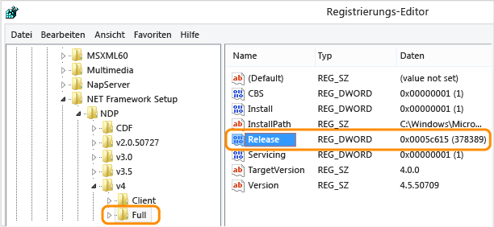

# <a name="how-to-determine-which-net-framework-versions-are-installed"></a><span data-ttu-id="89dd2-103">Vorgehensweise: Bestimmen der installierten .NET Framework-Versionen</span><span class="sxs-lookup"><span data-stu-id="89dd2-103">How to: Determine which .NET Framework versions are installed</span></span>

<span data-ttu-id="89dd2-104">Benutzer können mehrere Versionen von .NET Framework auf einem Computer [installieren](../install/index.md) und ausführen.</span><span class="sxs-lookup"><span data-stu-id="89dd2-104">Users can [install](../install/index.md) and run multiple versions of the .NET Framework on their computers.</span></span> <span data-ttu-id="89dd2-105">Wenn Sie eine App entwickeln oder bereitstellen, müssen Sie möglicherweise herausfinden, welche Versionen von .NET Framework auf dem Computer des Benutzers installiert sind.</span><span class="sxs-lookup"><span data-stu-id="89dd2-105">When you develop or deploy your app, you might need to know which .NET Framework versions are installed on the user’s computer.</span></span> <span data-ttu-id="89dd2-106">Die Registrierung enthält eine Liste der auf einem Computer installierten .NET Framework-Versionen.</span><span class="sxs-lookup"><span data-stu-id="89dd2-106">The registry contains a list of the .NET Framework versions installed on a computer.</span></span>

<span data-ttu-id="89dd2-107">.NET Framework besteht aus zwei Hauptkomponenten mit separaten Versionen:</span><span class="sxs-lookup"><span data-stu-id="89dd2-107">The .NET Framework consists of two main components, which are versioned separately:</span></span>

- <span data-ttu-id="89dd2-108">Ein Satz von Assemblys, bei denen es sich um Sammlungen von Typen und Ressourcen handelt, die die Funktionalität Ihre Apps bereitstellen.</span><span class="sxs-lookup"><span data-stu-id="89dd2-108">A set of assemblies, which are collections of types and resources that provide the functionality for your apps.</span></span> <span data-ttu-id="89dd2-109">.NET Framework und Assemblys verwenden die gleiche Versionsnummer.</span><span class="sxs-lookup"><span data-stu-id="89dd2-109">The .NET Framework and assemblies share the same version number.</span></span> <span data-ttu-id="89dd2-110">Beispielsweise zählen zu den .NET Framework-Versionen 4.5, 4.6.1 und 4.7.2.</span><span class="sxs-lookup"><span data-stu-id="89dd2-110">For example, .NET Framework versions include 4.5, 4.6.1, and 4.7.2.</span></span>

- <span data-ttu-id="89dd2-111">Die CLR (Common Language Runtime, CLR), die den Code Ihrer App verwaltet und ausführt.</span><span class="sxs-lookup"><span data-stu-id="89dd2-111">The common language runtime (CLR), which manages and executes your app's code.</span></span> <span data-ttu-id="89dd2-112">Eine einzelne CLR-Version unterstützt in der Regel mehrere .NET Framework-Versionen.</span><span class="sxs-lookup"><span data-stu-id="89dd2-112">A single CLR version typically supports multiple .NET Framework versions.</span></span> <span data-ttu-id="89dd2-113">Beispiel: Die Version 4.0.30319.*xxxxx* der CLR (wobei *xxxxx* kleiner als 42000 ist) unterstützt die Versionen 4 bis 4.5.2 des .NET Frameworks.</span><span class="sxs-lookup"><span data-stu-id="89dd2-113">For example, CLR version 4.0.30319.*xxxxx* where *xxxxx* is less than 42000, supports .NET Framework versions 4 through 4.5.2.</span></span> <span data-ttu-id="89dd2-114">Ab Version 4.0.30319.42000 unterstützt die CLR Version 4.6 und höher des .NET Frameworks.</span><span class="sxs-lookup"><span data-stu-id="89dd2-114">CLR version greater than or equal to 4.0.30319.42000 supports .NET Framework versions starting with .NET Framework 4.6.</span></span>

<span data-ttu-id="89dd2-115">Mithilfe von Tools, die von der Community verwaltet werden, können Sie ermittelt, welche .NET Framework-Versionen installiert sind:</span><span class="sxs-lookup"><span data-stu-id="89dd2-115">Community-maintained tools are available to help detect which .NET Framework versions are installed:</span></span>

- [https://github.com/jmalarcon/DotNetVersions](https://github.com/jmalarcon/DotNetVersions)

  <span data-ttu-id="89dd2-116">Ein Befehlszeilentool für .NET 2.0</span><span class="sxs-lookup"><span data-stu-id="89dd2-116">A .NET 2.0 command-line tool.</span></span>

- [https://github.com/EliteLoser/DotNetVersionLister](https://github.com/EliteLoser/DotNetVersionLister)

  <span data-ttu-id="89dd2-117">Ein Modul für PowerShell 2.0</span><span class="sxs-lookup"><span data-stu-id="89dd2-117">A PowerShell 2.0 module.</span></span>

<span data-ttu-id="89dd2-118">Informationen zum Ermitteln der installierten Updates für jede Version von .NET Framework finden Sie unter [ Gewusst wie: Ermitteln der installierten .NET Framework-Sicherheitsupdates und -Hotfixes](how-to-determine-which-net-framework-updates-are-installed.md).</span><span class="sxs-lookup"><span data-stu-id="89dd2-118">For information about detecting the installed updates for each version of the .NET Framework, see [How to: Determine which .NET Framework updates are installed](how-to-determine-which-net-framework-updates-are-installed.md).</span></span>

## <a name="detect-net-framework-45-and-later-versions"></a><span data-ttu-id="89dd2-119">Erkennen von .NET Framework 4.5 und höheren Versionen</span><span class="sxs-lookup"><span data-stu-id="89dd2-119">Detect .NET Framework 4.5 and later versions</span></span>

<span data-ttu-id="89dd2-120">Die Version des .NET Frameworks (4.5 und höher), die auf einem Computer installiert ist, wird in der Registrierung unter **HKEY_LOCAL_MACHINE\\Software\\Microsoft\\NET Framework Setup\\NDP\\V4\\Full** aufgeführt.</span><span class="sxs-lookup"><span data-stu-id="89dd2-120">The version of .NET Framework (4.5 and later) installed on a machine is listed in the registry at **HKEY_LOCAL_MACHINE\\SOFTWARE\\Microsoft\\NET Framework Setup\\NDP\\v4\\Full**.</span></span> <span data-ttu-id="89dd2-121">Wenn der Unterschlüssel **Full** fehlt, ist weder .NET Framework 4.5 noch eine höhere Version installiert.</span><span class="sxs-lookup"><span data-stu-id="89dd2-121">If the **Full** subkey is missing, then .NET Framework 4.5 or above isn't installed.</span></span>

> [!NOTE]
> <span data-ttu-id="89dd2-122">Der Unterschlüssel **NET Framework Setup** im Registrierungspfad beginnt *nicht* mit einem Punkt.</span><span class="sxs-lookup"><span data-stu-id="89dd2-122">The **NET Framework Setup** subkey in the registry path does *not* begin with a period.</span></span>

<span data-ttu-id="89dd2-123">Der **Release**-Wert REG_DWORD in der Registrierung steht für die installierte .NET Framework-Version.</span><span class="sxs-lookup"><span data-stu-id="89dd2-123">The **Release** REG_DWORD value in the registry represents the version of .NET Framework installed.</span></span>

<a name="version_table"></a>

| <span data-ttu-id="89dd2-124">.NET Framework-Version</span><span class="sxs-lookup"><span data-stu-id="89dd2-124">.NET Framework version</span></span> | <span data-ttu-id="89dd2-125">**Release**-Wert</span><span class="sxs-lookup"><span data-stu-id="89dd2-125">Value of **Release**</span></span> |
| ---------------------- | -------------------------- |
| <span data-ttu-id="89dd2-126">.NET Framework 4.5</span><span class="sxs-lookup"><span data-stu-id="89dd2-126">.NET Framework 4.5</span></span>     | <span data-ttu-id="89dd2-127">Alle Windows-Betriebssysteme: 378389</span><span class="sxs-lookup"><span data-stu-id="89dd2-127">All Windows operating systems: 378389</span></span> |
| <span data-ttu-id="89dd2-128">.NET Framework 4.5.1</span><span class="sxs-lookup"><span data-stu-id="89dd2-128">.NET Framework 4.5.1</span></span>   | <span data-ttu-id="89dd2-129">Für Windows 8.1 und Windows Server 2012 R2: 378675</span><span class="sxs-lookup"><span data-stu-id="89dd2-129">On Windows 8.1 and Windows Server 2012 R2: 378675</span></span><br /><span data-ttu-id="89dd2-130">Für alle anderen Windows-Betriebssysteme: 378758</span><span class="sxs-lookup"><span data-stu-id="89dd2-130">On all other Windows operating systems: 378758</span></span> |
| <span data-ttu-id="89dd2-131">.NET Framework 4.5.2</span><span class="sxs-lookup"><span data-stu-id="89dd2-131">.NET Framework 4.5.2</span></span>   | <span data-ttu-id="89dd2-132">Alle Windows-Betriebssysteme: 379893</span><span class="sxs-lookup"><span data-stu-id="89dd2-132">All Windows operating systems: 379893</span></span> |
| <span data-ttu-id="89dd2-133">.NET Framework 4.6</span><span class="sxs-lookup"><span data-stu-id="89dd2-133">.NET Framework 4.6</span></span>     | <span data-ttu-id="89dd2-134">Für Windows 10: 393295</span><span class="sxs-lookup"><span data-stu-id="89dd2-134">On Windows 10: 393295</span></span><br /><span data-ttu-id="89dd2-135">Für alle anderen Windows-Betriebssysteme: 393297</span><span class="sxs-lookup"><span data-stu-id="89dd2-135">On all other Windows operating systems: 393297</span></span> |
| <span data-ttu-id="89dd2-136">.NET Framework 4.6.1</span><span class="sxs-lookup"><span data-stu-id="89dd2-136">.NET Framework 4.6.1</span></span>   | <span data-ttu-id="89dd2-137">Für Windows 10 November Update-Systeme: 394254</span><span class="sxs-lookup"><span data-stu-id="89dd2-137">On Windows 10 November Update systems: 394254</span></span><br /><span data-ttu-id="89dd2-138">Für alle anderen Windows-Betriebssysteme (einschließlich Windows 10): 394271</span><span class="sxs-lookup"><span data-stu-id="89dd2-138">On all other Windows operating systems (including Windows 10): 394271</span></span> |
| <span data-ttu-id="89dd2-139">.NET Framework 4.6.2</span><span class="sxs-lookup"><span data-stu-id="89dd2-139">.NET Framework 4.6.2</span></span>   | <span data-ttu-id="89dd2-140">Auf Systemen unter Windows 10 Anniversary Update und Windows Server 2016: 394802</span><span class="sxs-lookup"><span data-stu-id="89dd2-140">On Windows 10 Anniversary Update and Windows Server 2016: 394802</span></span><br /><span data-ttu-id="89dd2-141">Für alle anderen Windows-Betriebssysteme (einschließlich Windows 10-Betriebssysteme): 394806</span><span class="sxs-lookup"><span data-stu-id="89dd2-141">On all other Windows operating systems (including other Windows 10 operating systems): 394806</span></span> |
| <span data-ttu-id="89dd2-142">.NET Framework 4.7</span><span class="sxs-lookup"><span data-stu-id="89dd2-142">.NET Framework 4.7</span></span>     | <span data-ttu-id="89dd2-143">Für Windows 10 Creators Update: 460798</span><span class="sxs-lookup"><span data-stu-id="89dd2-143">On Windows 10 Creators Update: 460798</span></span><br /><span data-ttu-id="89dd2-144">Für alle anderen Windows-Betriebssysteme (einschließlich Windows 10-Betriebssysteme): 460805</span><span class="sxs-lookup"><span data-stu-id="89dd2-144">On all other Windows operating systems (including other Windows 10 operating systems): 460805</span></span> |
| <span data-ttu-id="89dd2-145">.NET Framework 4.7.1</span><span class="sxs-lookup"><span data-stu-id="89dd2-145">.NET Framework 4.7.1</span></span>   | <span data-ttu-id="89dd2-146">Für Windows 10 Fall Creators Update und Windows Server Version 1709: 461308</span><span class="sxs-lookup"><span data-stu-id="89dd2-146">On Windows 10 Fall Creators Update and Windows Server, version 1709: 461308</span></span><br/><span data-ttu-id="89dd2-147">Für alle anderen Windows-Betriebssysteme (einschließlich Windows 10-Betriebssysteme): 461310</span><span class="sxs-lookup"><span data-stu-id="89dd2-147">On all other Windows operating systems (including other Windows 10 operating systems): 461310</span></span> |
| <span data-ttu-id="89dd2-148">.NET Framework 4.7.2</span><span class="sxs-lookup"><span data-stu-id="89dd2-148">.NET Framework 4.7.2</span></span>   | <span data-ttu-id="89dd2-149">Für Windows 10 April 2018 Update und Windows Server Version 1803: 461808</span><span class="sxs-lookup"><span data-stu-id="89dd2-149">On Windows 10 April 2018 Update and Windows Server, version 1803: 461808</span></span><br/><span data-ttu-id="89dd2-150">Für alle anderen Betriebssysteme als Windows 10 April 2018 Update und Windows Server Version 1803: 461814</span><span class="sxs-lookup"><span data-stu-id="89dd2-150">On all Windows operating systems other than Windows 10 April 2018 Update and Windows Server, version 1803: 461814</span></span> |
| <span data-ttu-id="89dd2-151">.NET Framework 4.8</span><span class="sxs-lookup"><span data-stu-id="89dd2-151">.NET Framework 4.8</span></span>     | <span data-ttu-id="89dd2-152">Unter Windows 10 Update aus Mai 2019 und Windows 10 Update aus November 2019: 528040</span><span class="sxs-lookup"><span data-stu-id="89dd2-152">On Windows 10 May 2019 Update and Windows 10 November 2019 Update: 528040</span></span><br/><span data-ttu-id="89dd2-153">Für Windows 10-Update von Mai 2020: 528209</span><span class="sxs-lookup"><span data-stu-id="89dd2-153">On Windows 10 May 2020 Update: 528209</span></span><br/><span data-ttu-id="89dd2-154">Für alle anderen Windows-Betriebssysteme (einschließlich Windows 10-Betriebssysteme): 528049</span><span class="sxs-lookup"><span data-stu-id="89dd2-154">On all other Windows operating systems (including other Windows 10 operating systems): 528049</span></span> |

### <a name="minimum-version"></a><span data-ttu-id="89dd2-155">Mindestversion</span><span class="sxs-lookup"><span data-stu-id="89dd2-155">Minimum version</span></span>

<span data-ttu-id="89dd2-156">Sie können ermitteln, ob eine *Mindestversion* des .NET Frameworks vorhanden ist, indem Sie den kleinsten **Release**-Wert für REG_DWORD für diese Version aus der obigen Tabelle entnehmen.</span><span class="sxs-lookup"><span data-stu-id="89dd2-156">To determine whether a *minimum* version of the .NET Framework is present, use the smallest **Release** REG_DWORD value for that version from the previous table.</span></span>

<span data-ttu-id="89dd2-157">Wenn Ihre Anwendung beispielsweise unter .NET Framework 4.8 oder einer höheren Version ausgeführt wird, testen Sie, ob der **Release**-Wert für REG_DWORD *größer oder gleich* 528040 ist.</span><span class="sxs-lookup"><span data-stu-id="89dd2-157">For example, if your application runs under .NET Framework 4.8 or a later version, test for a **Release** REG_DWORD value that is *greater than or equal to* 528040.</span></span>

| <span data-ttu-id="89dd2-158">.NET Framework-Version</span><span class="sxs-lookup"><span data-stu-id="89dd2-158">.NET Framework version</span></span> | <span data-ttu-id="89dd2-159">Minimalwert</span><span class="sxs-lookup"><span data-stu-id="89dd2-159">Minimum value</span></span> |
| ---------------------- | ------------- |
| <span data-ttu-id="89dd2-160">.NET Framework 4.5</span><span class="sxs-lookup"><span data-stu-id="89dd2-160">.NET Framework 4.5</span></span>     | <span data-ttu-id="89dd2-161">378389</span><span class="sxs-lookup"><span data-stu-id="89dd2-161">378389</span></span> |
| <span data-ttu-id="89dd2-162">.NET Framework 4.5.1</span><span class="sxs-lookup"><span data-stu-id="89dd2-162">.NET Framework 4.5.1</span></span>   | <span data-ttu-id="89dd2-163">378675</span><span class="sxs-lookup"><span data-stu-id="89dd2-163">378675</span></span> |
| <span data-ttu-id="89dd2-164">.NET Framework 4.5.2</span><span class="sxs-lookup"><span data-stu-id="89dd2-164">.NET Framework 4.5.2</span></span>   | <span data-ttu-id="89dd2-165">379893</span><span class="sxs-lookup"><span data-stu-id="89dd2-165">379893</span></span> |
| <span data-ttu-id="89dd2-166">.NET Framework 4.6</span><span class="sxs-lookup"><span data-stu-id="89dd2-166">.NET Framework 4.6</span></span>     | <span data-ttu-id="89dd2-167">393295</span><span class="sxs-lookup"><span data-stu-id="89dd2-167">393295</span></span> |
| <span data-ttu-id="89dd2-168">.NET Framework 4.6.1</span><span class="sxs-lookup"><span data-stu-id="89dd2-168">.NET Framework 4.6.1</span></span>   | <span data-ttu-id="89dd2-169">394254</span><span class="sxs-lookup"><span data-stu-id="89dd2-169">394254</span></span> |
| <span data-ttu-id="89dd2-170">.NET Framework 4.6.2</span><span class="sxs-lookup"><span data-stu-id="89dd2-170">.NET Framework 4.6.2</span></span>   | <span data-ttu-id="89dd2-171">394802</span><span class="sxs-lookup"><span data-stu-id="89dd2-171">394802</span></span> |
| <span data-ttu-id="89dd2-172">.NET Framework 4.7</span><span class="sxs-lookup"><span data-stu-id="89dd2-172">.NET Framework 4.7</span></span>     | <span data-ttu-id="89dd2-173">460798</span><span class="sxs-lookup"><span data-stu-id="89dd2-173">460798</span></span> |
| <span data-ttu-id="89dd2-174">.NET Framework 4.7.1</span><span class="sxs-lookup"><span data-stu-id="89dd2-174">.NET Framework 4.7.1</span></span>   | <span data-ttu-id="89dd2-175">461308</span><span class="sxs-lookup"><span data-stu-id="89dd2-175">461308</span></span> |
| <span data-ttu-id="89dd2-176">.NET Framework 4.7.2</span><span class="sxs-lookup"><span data-stu-id="89dd2-176">.NET Framework 4.7.2</span></span>   | <span data-ttu-id="89dd2-177">461808</span><span class="sxs-lookup"><span data-stu-id="89dd2-177">461808</span></span> |
| <span data-ttu-id="89dd2-178">.NET Framework 4.8</span><span class="sxs-lookup"><span data-stu-id="89dd2-178">.NET Framework 4.8</span></span>     | <span data-ttu-id="89dd2-179">528040</span><span class="sxs-lookup"><span data-stu-id="89dd2-179">528040</span></span> |

### <a name="use-registry-editor"></a><span data-ttu-id="89dd2-180">Verwenden des Registrierungs-Editors</span><span class="sxs-lookup"><span data-stu-id="89dd2-180">Use Registry Editor</span></span>

01. <span data-ttu-id="89dd2-181">Wählen Sie im Menü **Start** die Option **Ausführen** aus, geben Sie *regedit* ein, und klicken Sie dann auf **OK**.</span><span class="sxs-lookup"><span data-stu-id="89dd2-181">From the **Start** menu, choose **Run**, enter *regedit*, and then select **OK**.</span></span>

    <span data-ttu-id="89dd2-182">Sie müssen über Administratorrechte verfügen, um regedit ausführen zu können.</span><span class="sxs-lookup"><span data-stu-id="89dd2-182">You must have administrative credentials to run regedit.</span></span>

01. <span data-ttu-id="89dd2-183">Öffnen Sie im Registrierungs-Editor den folgenden Unterschlüssel: **HKEY_LOCAL_MACHINE\\SOFTWARE\\Microsoft\\NET Framework Setup\\NDP\\v4\\Full**.</span><span class="sxs-lookup"><span data-stu-id="89dd2-183">In the Registry Editor, open the following subkey: **HKEY_LOCAL_MACHINE\\SOFTWARE\\Microsoft\\NET Framework Setup\\NDP\\v4\\Full**.</span></span> <span data-ttu-id="89dd2-184">Wenn der Unterschlüssel **Full** nicht vorhanden ist, wurde .NET Framework 4.5 oder höher nicht installiert.</span><span class="sxs-lookup"><span data-stu-id="89dd2-184">If the **Full** subkey isn't present, then you don't have the .NET Framework 4.5 or later installed.</span></span>

01. <span data-ttu-id="89dd2-185">Suchen Sie nach einem REG_DWORD-Eintrag mit dem Namen **Release**.</span><span class="sxs-lookup"><span data-stu-id="89dd2-185">Check for a REG_DWORD entry named **Release**.</span></span> <span data-ttu-id="89dd2-186">Wenn dieser vorhanden ist, haben Sie .NET Framework 4.5 oder höher installiert.</span><span class="sxs-lookup"><span data-stu-id="89dd2-186">If it exists, then you have .NET Framework 4.5 or later installed.</span></span> <span data-ttu-id="89dd2-187">Der zugehörige Wert entspricht einer bestimmten Version des .NET Frameworks.</span><span class="sxs-lookup"><span data-stu-id="89dd2-187">Its value corresponds to a particular version of the .NET Framework.</span></span> <span data-ttu-id="89dd2-188">In der folgenden Abbildung weist der Eintrag **Release** beispielsweise den Wert 528040 auf, was dem Releaseschlüssel für .NET Framework 4.8 entspricht.</span><span class="sxs-lookup"><span data-stu-id="89dd2-188">In the following figure, for example, the value of the **Release** entry is 528040, which is the release key for .NET Framework 4.8.</span></span>

    <span data-ttu-id="89dd2-189"></span><span class="sxs-lookup"><span data-stu-id="89dd2-189"></span></span>

### <a name="use-powershell-to-check-for-a-minimum-version"></a><span data-ttu-id="89dd2-190">Verwenden von PowerShell zum Prüfen auf eine Mindestversion</span><span class="sxs-lookup"><span data-stu-id="89dd2-190">Use PowerShell to check for a minimum version</span></span>

<span data-ttu-id="89dd2-191">Verwenden Sie PowerShell-Befehle, um den Wert des Eintrags **Release** des Unterschlüssels **HKEY_LOCAL_MACHINE\\SOFTWARE\\Microsoft\\NET Framework Setup\\NDP\\v4\\Full** zu überprüfen.</span><span class="sxs-lookup"><span data-stu-id="89dd2-191">Use PowerShell commands to check the value of the **Release** entry of the **HKEY_LOCAL_MACHINE\\SOFTWARE\\Microsoft\\NET Framework Setup\\NDP\\v4\\Full** subkey.</span></span>

<span data-ttu-id="89dd2-192">In den folgenden Beispielen wird der Wert des Eintrags **Release** überprüft, um zu bestimmen, ob .NET Framework 4.6.2 oder höher installiert ist.</span><span class="sxs-lookup"><span data-stu-id="89dd2-192">The following examples check the value of the **Release** entry to determine whether the .NET Framework 4.6.2 or later is installed.</span></span> <span data-ttu-id="89dd2-193">Dieser Code gibt `True` zurück, wenn es installiert ist, und andernfalls `False`.</span><span class="sxs-lookup"><span data-stu-id="89dd2-193">This code returns `True` if it's installed and `False` otherwise.</span></span>

```PowerShell
(Get-ItemProperty "HKLM:SOFTWARE\Microsoft\NET Framework Setup\NDP\v4\Full").Release -ge 394802
```

### <a name="query-the-registry-using-code"></a><span data-ttu-id="89dd2-194">Abfragen der Registrierung mithilfe von Code</span><span class="sxs-lookup"><span data-stu-id="89dd2-194">Query the registry using code</span></span>

01. <span data-ttu-id="89dd2-195">Verwenden Sie die Methoden <xref:Microsoft.Win32.RegistryKey.OpenBaseKey%2A?displayProperty=nameWithType> und <xref:Microsoft.Win32.RegistryKey.OpenSubKey%2A?displayProperty=nameWithType>, um auf den Unterschlüssel **HKEY_LOCAL_MACHINE\\SOFTWARE\\Microsoft\\NET Framework Setup\\NDP\\v4\\Full** in der Windows-Registrierung zuzugreifen.</span><span class="sxs-lookup"><span data-stu-id="89dd2-195">Use the <xref:Microsoft.Win32.RegistryKey.OpenBaseKey%2A?displayProperty=nameWithType> and <xref:Microsoft.Win32.RegistryKey.OpenSubKey%2A?displayProperty=nameWithType> methods to access the **HKEY_LOCAL_MACHINE\\SOFTWARE\\Microsoft\\NET Framework Setup\\NDP\\v4\\Full** subkey in the Windows registry.</span></span>

    > [!IMPORTANT]
    > <span data-ttu-id="89dd2-196">Wenn die App, die Sie ausführen, für 32 Bit optimiert ist und unter einer 64-Bit-Version von Windows ausgeführt wird, unterscheiden sich die Registrierungspfade von den zuvor aufgeführten.</span><span class="sxs-lookup"><span data-stu-id="89dd2-196">If the app you're running is 32-bit and running in 64-bit Windows, the registry paths will be different than previously listed.</span></span> <span data-ttu-id="89dd2-197">Die 64-Bit-Registrierung ist im Unterschlüssel **HKEY_LOCAL_MACHINE\\SOFTWARE\\Wow6432Node\\** verfügbar.</span><span class="sxs-lookup"><span data-stu-id="89dd2-197">The 64-bit registry is available in the **HKEY_LOCAL_MACHINE\\SOFTWARE\\Wow6432Node\\** subkey.</span></span> <span data-ttu-id="89dd2-198">Der Registrierungsunterschlüssel für .NET Framework 4.5 ist beispielsweise **HKEY_LOCAL_MACHINE\\SOFTWARE\\Wow6432Node\\Microsoft\\NET Framework Setup\\NDP\\v4\\Full**.</span><span class="sxs-lookup"><span data-stu-id="89dd2-198">For example, the registry subkey for .NET Framework 4.5 is **HKEY_LOCAL_MACHINE\\SOFTWARE\\Wow6432Node\\Microsoft\\NET Framework Setup\\NDP\\v4\\Full**.</span></span>

01. <span data-ttu-id="89dd2-199">Überprüfen Sie den **Release**-Wert für REG_DWORD, um die installierte Version zu bestimmen.</span><span class="sxs-lookup"><span data-stu-id="89dd2-199">Check the **Release** REG_DWORD value to determine the installed version.</span></span> <span data-ttu-id="89dd2-200">Suchen Sie einen Wert größer als oder gleich dem Wert, der in der [.NET Framework-Versionstabelle](#version_table) aufgeführt ist, um die Aufwärtskompatibilität zu überprüfen.</span><span class="sxs-lookup"><span data-stu-id="89dd2-200">To be forward-compatible, check for a value greater than or equal to the value listed in the [.NET Framework version table](#version_table).</span></span>

<span data-ttu-id="89dd2-201">Im folgenden Beispiel wird der Wert des Eintrags **Release** in der Registrierung überprüft, um die installierten Versionen von .NET Framework 4.5 und höher zu suchen:</span><span class="sxs-lookup"><span data-stu-id="89dd2-201">The following example checks the value of the **Release** entry in the registry to find the .NET Framework 4.5 and later versions that are installed:</span></span>

[!code-csharp[ListVersions#5](../../../samples/snippets/csharp/framework/migration-guide/versions-installed3.cs)]
[!code-vb[ListVersions#5](../../../samples/snippets/visualbasic/framework/migration-guide/versions-installed3.vb)]

<span data-ttu-id="89dd2-202">In diesem Beispiel wird der empfohlenen Vorgehensweise zur Versionsprüfung gefolgt:</span><span class="sxs-lookup"><span data-stu-id="89dd2-202">This example follows the recommended practice for version checking:</span></span>

- <span data-ttu-id="89dd2-203">Es wird überprüft, ob der Wert des Eintrags \**Release\*\*\*größer als der oder gleich dem* Wert der bekannten Releaseschlüssel ist.</span><span class="sxs-lookup"><span data-stu-id="89dd2-203">It checks whether the value of the **Release** entry is *greater than or equal to* the value of the known release keys.</span></span>
- <span data-ttu-id="89dd2-204">Es wird beginnend mit der neuesten Version bis hin zur ältesten Version geprüft.</span><span class="sxs-lookup"><span data-stu-id="89dd2-204">It checks in order from most recent version to earliest version.</span></span>

## <a name="detect-net-framework-10-through-40"></a><span data-ttu-id="89dd2-205">Erkennen der Versionen 1.0 bis 4.0 des .NET Frameworks</span><span class="sxs-lookup"><span data-stu-id="89dd2-205">Detect .NET Framework 1.0 through 4.0</span></span>

<span data-ttu-id="89dd2-206">Jede Version von .NET Framework zwischen den Versionen 1.1 und 4.0 wird unter **HKEY_LOCAL_MACHINE\\SOFTWARE\\Microsoft\\NET Framework Setup\\NDP** als Unterschlüssel aufgeführt.</span><span class="sxs-lookup"><span data-stu-id="89dd2-206">Each version of .NET Framework from 1.1 to 4.0 is listed as a subkey at **HKEY_LOCAL_MACHINE\\SOFTWARE\\Microsoft\\NET Framework Setup\\NDP**.</span></span> <span data-ttu-id="89dd2-207">In der folgenden Tabelle wird der Pfad zu den einzelnen .NET Framework-Versionen aufgelistet.</span><span class="sxs-lookup"><span data-stu-id="89dd2-207">The following table lists the path to each .NET Framework version.</span></span> <span data-ttu-id="89dd2-208">Für die meisten Versionen gibt es einen **Install**-Wert für REG_DWORD in Höhe von `1`, der angibt, dass die jeweilige Version installiert ist.</span><span class="sxs-lookup"><span data-stu-id="89dd2-208">For most versions, there's a **Install** REG_DWORD value of `1` to indicate this version is installed.</span></span> <span data-ttu-id="89dd2-209">In diesen Unterschlüsseln gibt es auch einen **Version**-Wert für REG_SZ, der eine Versionszeichenfolge enthält.</span><span class="sxs-lookup"><span data-stu-id="89dd2-209">In these subkeys, there's also a **Version** REG_SZ value that contains a version string.</span></span>

> [!NOTE]
> <span data-ttu-id="89dd2-210">Der Unterschlüssel **NET Framework Setup** im Registrierungspfad beginnt *nicht* mit einem Punkt.</span><span class="sxs-lookup"><span data-stu-id="89dd2-210">The **NET Framework Setup** subkey in the registry path does *not* begin with a period.</span></span>

| <span data-ttu-id="89dd2-211">Framework-Version</span><span class="sxs-lookup"><span data-stu-id="89dd2-211">Framework Version</span></span>  | <span data-ttu-id="89dd2-212">Registrierungsunterschlüssel</span><span class="sxs-lookup"><span data-stu-id="89dd2-212">Registry Subkey</span></span> | <span data-ttu-id="89dd2-213">Wert</span><span class="sxs-lookup"><span data-stu-id="89dd2-213">Value</span></span> |
| ------------------ | --------------- | ----- |
| <span data-ttu-id="89dd2-214">1.0</span><span class="sxs-lookup"><span data-stu-id="89dd2-214">1.0</span></span>                | <span data-ttu-id="89dd2-215">**HKLM\\Software\\Microsoft\\.NETFramework\\Policy\\v1.0\\3705**</span><span class="sxs-lookup"><span data-stu-id="89dd2-215">**HKLM\\Software\\Microsoft\\.NETFramework\\Policy\\v1.0\\3705**</span></span>     | <span data-ttu-id="89dd2-216">**Install**-Wert für REG_SZ entspricht `1`</span><span class="sxs-lookup"><span data-stu-id="89dd2-216">**Install** REG_SZ equals `1`</span></span> |
| <span data-ttu-id="89dd2-217">1.1</span><span class="sxs-lookup"><span data-stu-id="89dd2-217">1.1</span></span>                | <span data-ttu-id="89dd2-218">**HKLM\\Software\\Microsoft\\NET Framework Setup\\NDP\\v1.1.4322**</span><span class="sxs-lookup"><span data-stu-id="89dd2-218">**HKLM\\Software\\Microsoft\\NET Framework Setup\\NDP\\v1.1.4322**</span></span>   | <span data-ttu-id="89dd2-219">**Install**-Wert für REG_DWORD entspricht `1`</span><span class="sxs-lookup"><span data-stu-id="89dd2-219">**Install** REG_DWORD equals `1`</span></span> |
| <span data-ttu-id="89dd2-220">2.0</span><span class="sxs-lookup"><span data-stu-id="89dd2-220">2.0</span></span>                | <span data-ttu-id="89dd2-221">**HKLM\\Software\\Microsoft\\NET Framework Setup\\NDP\\v2.0.50727**</span><span class="sxs-lookup"><span data-stu-id="89dd2-221">**HKLM\\Software\\Microsoft\\NET Framework Setup\\NDP\\v2.0.50727**</span></span>  | <span data-ttu-id="89dd2-222">**Install**-Wert für REG_DWORD entspricht `1`</span><span class="sxs-lookup"><span data-stu-id="89dd2-222">**Install** REG_DWORD equals `1`</span></span> |
| <span data-ttu-id="89dd2-223">3.0</span><span class="sxs-lookup"><span data-stu-id="89dd2-223">3.0</span></span>                | <span data-ttu-id="89dd2-224">**HKLM\\Software\\Microsoft\\NET Framework Setup\\NDP\\v3.0\\Setup**</span><span class="sxs-lookup"><span data-stu-id="89dd2-224">**HKLM\\Software\\Microsoft\\NET Framework Setup\\NDP\\v3.0\\Setup**</span></span> | <span data-ttu-id="89dd2-225">**InstallSuccess**-Wert für REG_DWORD entspricht `1`</span><span class="sxs-lookup"><span data-stu-id="89dd2-225">**InstallSuccess** REG_DWORD equals `1`</span></span> |
| <span data-ttu-id="89dd2-226">3.5</span><span class="sxs-lookup"><span data-stu-id="89dd2-226">3.5</span></span>                | <span data-ttu-id="89dd2-227">**HKLM\\Software\\Microsoft\\NET Framework Setup\\NDP\\v3.5**</span><span class="sxs-lookup"><span data-stu-id="89dd2-227">**HKLM\\Software\\Microsoft\\NET Framework Setup\\NDP\\v3.5**</span></span>        | <span data-ttu-id="89dd2-228">**Install**-Wert für REG_DWORD entspricht `1`</span><span class="sxs-lookup"><span data-stu-id="89dd2-228">**Install** REG_DWORD equals `1`</span></span> |
| <span data-ttu-id="89dd2-229">4.0, Clientprofil</span><span class="sxs-lookup"><span data-stu-id="89dd2-229">4.0 Client Profile</span></span> | <span data-ttu-id="89dd2-230">**HKLM\\Software\\Microsoft\\NET Framework Setup\\NDP\\v4\\Client**</span><span class="sxs-lookup"><span data-stu-id="89dd2-230">**HKLM\\Software\\Microsoft\\NET Framework Setup\\NDP\\v4\\Client**</span></span>  | <span data-ttu-id="89dd2-231">**Install**-Wert für REG_DWORD entspricht `1`</span><span class="sxs-lookup"><span data-stu-id="89dd2-231">**Install** REG_DWORD equals `1`</span></span> |
| <span data-ttu-id="89dd2-232">4.0, vollständiges Profil</span><span class="sxs-lookup"><span data-stu-id="89dd2-232">4.0 Full Profile</span></span>   | <span data-ttu-id="89dd2-233">**HKLM\\Software\\Microsoft\\NET Framework Setup\\NDP\\v4\\Full**</span><span class="sxs-lookup"><span data-stu-id="89dd2-233">**HKLM\\Software\\Microsoft\\NET Framework Setup\\NDP\\v4\\Full**</span></span>    | <span data-ttu-id="89dd2-234">**Install**-Wert für REG_DWORD entspricht `1`</span><span class="sxs-lookup"><span data-stu-id="89dd2-234">**Install** REG_DWORD equals `1`</span></span> |

> [!IMPORTANT]
> <span data-ttu-id="89dd2-235">Wenn die App, die Sie ausführen, für 32 Bit optimiert ist und unter einer 64-Bit-Version von Windows ausgeführt wird, unterscheiden sich die Registrierungspfade von den zuvor aufgeführten.</span><span class="sxs-lookup"><span data-stu-id="89dd2-235">If the app you're running is 32-bit and running in 64-bit Windows, the registry paths will be different than previously listed.</span></span> <span data-ttu-id="89dd2-236">Die 64-Bit-Registrierung ist im Unterschlüssel **HKEY_LOCAL_MACHINE\\SOFTWARE\\Wow6432Node\\** verfügbar.</span><span class="sxs-lookup"><span data-stu-id="89dd2-236">The 64-bit registry is available in the **HKEY_LOCAL_MACHINE\\SOFTWARE\\Wow6432Node\\** subkey.</span></span> <span data-ttu-id="89dd2-237">Beispielsweise lautet der Registrierungsunterschlüssel für .NET Framework 3.5 **HKEY_LOCAL_MACHINE\\SOFTWARE\\Wow6432Node\\Microsoft\\NET Framework Setup\\NDP\\v3.5**.</span><span class="sxs-lookup"><span data-stu-id="89dd2-237">For example, the registry subkey for .NET Framework 3.5 is **HKEY_LOCAL_MACHINE\\SOFTWARE\\Wow6432Node\\Microsoft\\NET Framework Setup\\NDP\\v3.5**.</span></span>

<span data-ttu-id="89dd2-238">Hinweis: Der Registrierungspfad für den Unterschlüssel für .NET Framework 1.0 unterscheidet sich von dem anderer Registrierungsschlüssel.</span><span class="sxs-lookup"><span data-stu-id="89dd2-238">Notice that the registry path to the .NET Framework 1.0 subkey is different from the others.</span></span>

### <a name="use-registry-editor-older-framework-versions"></a><span data-ttu-id="89dd2-239">Verwenden des Registrierungs-Editors (ältere Frameworkversionen)</span><span class="sxs-lookup"><span data-stu-id="89dd2-239">Use Registry Editor (older framework versions)</span></span>

01. <span data-ttu-id="89dd2-240">Wählen Sie im Menü **Start** die Option **Ausführen** aus, geben Sie *regedit* ein, und klicken Sie dann auf **OK**.</span><span class="sxs-lookup"><span data-stu-id="89dd2-240">From the **Start** menu, choose **Run**, enter *regedit*, and then select **OK**.</span></span>

    <span data-ttu-id="89dd2-241">Sie müssen über Administratorrechte verfügen, um regedit ausführen zu können.</span><span class="sxs-lookup"><span data-stu-id="89dd2-241">You must have administrative credentials to run regedit.</span></span>

01. <span data-ttu-id="89dd2-242">Öffnen Sie den Unterschlüssel, der der Version entspricht, die Sie überprüfen möchten.</span><span class="sxs-lookup"><span data-stu-id="89dd2-242">Open the subkey that matches the version you want to check.</span></span> <span data-ttu-id="89dd2-243">Verwenden Sie die Tabelle im Abschnitt [Erkennen der Versionen 1.0 bis 4.0 des .NET Frameworks](#detect-net-framework-10-through-40).</span><span class="sxs-lookup"><span data-stu-id="89dd2-243">Use the table in the [Detect .NET Framework 1.0 through 4.0](#detect-net-framework-10-through-40) section.</span></span>

    <span data-ttu-id="89dd2-244">Die folgende Abbildung zeigt den Unterschlüssel und dessen **Version**-Wert für .NET Framework 3.5.</span><span class="sxs-lookup"><span data-stu-id="89dd2-244">The following figure shows the subkey and its **Version** value for .NET Framework 3.5.</span></span>

    <span data-ttu-id="89dd2-245"></span><span class="sxs-lookup"><span data-stu-id="89dd2-245"></span></span>

### <a name="query-the-registry-using-code-older-framework-versions"></a><span data-ttu-id="89dd2-246">Abfragen der Registrierung mithilfe von Code (ältere Frameworkversionen)</span><span class="sxs-lookup"><span data-stu-id="89dd2-246">Query the registry using code (older framework versions)</span></span>

<span data-ttu-id="89dd2-247">Verwenden Sie die Klasse <xref:Microsoft.Win32.RegistryKey?displayProperty=nameWithType>, um in der Windows-Registrierung auf den Unterschlüssel **HKEY_LOCAL_MACHINE\\SOFTWARE\\Microsoft\\NET Framework Setup\\NDP** zuzugreifen.</span><span class="sxs-lookup"><span data-stu-id="89dd2-247">Use the <xref:Microsoft.Win32.RegistryKey?displayProperty=nameWithType> class to access the **HKEY_LOCAL_MACHINE\\SOFTWARE\\Microsoft\\NET Framework Setup\\NDP** subkey in the Windows registry.</span></span>

> [!IMPORTANT]
> <span data-ttu-id="89dd2-248">Wenn die App, die Sie ausführen, für 32 Bit optimiert ist und unter einer 64-Bit-Version von Windows ausgeführt wird, unterscheiden sich die Registrierungspfade von den zuvor aufgeführten.</span><span class="sxs-lookup"><span data-stu-id="89dd2-248">If the app you're running is 32-bit and running in 64-bit Windows, the registry paths will be different than previously listed.</span></span> <span data-ttu-id="89dd2-249">Die 64-Bit-Registrierung ist im Unterschlüssel **HKEY_LOCAL_MACHINE\\SOFTWARE\\Wow6432Node\\** verfügbar.</span><span class="sxs-lookup"><span data-stu-id="89dd2-249">The 64-bit registry is available in the **HKEY_LOCAL_MACHINE\\SOFTWARE\\Wow6432Node\\** subkey.</span></span> <span data-ttu-id="89dd2-250">Beispielsweise lautet der Registrierungsunterschlüssel für .NET Framework 3.5 **HKEY_LOCAL_MACHINE\\SOFTWARE\\Wow6432Node\\Microsoft\\NET Framework Setup\\NDP\\v3.5**.</span><span class="sxs-lookup"><span data-stu-id="89dd2-250">For example, the registry subkey for .NET Framework 3.5 is **HKEY_LOCAL_MACHINE\\SOFTWARE\\Wow6432Node\\Microsoft\\NET Framework Setup\\NDP\\v3.5**.</span></span>

<span data-ttu-id="89dd2-251">Im folgenden Beispiel werden die installierten .NET Framework-Versionen 1 bis 4 ermittelt:</span><span class="sxs-lookup"><span data-stu-id="89dd2-251">The following example finds the .NET Framework 1 through 4 versions that are installed:</span></span>

[!code-csharp[ListVersions](../../../samples/snippets/csharp/framework/migration-guide/versions-installed1.cs)]
[!code-vb[ListVersions](../../../samples/snippets/visualbasic/framework/migration-guide/versions-installed1.vb)]

## <a name="find-clr-versions"></a><span data-ttu-id="89dd2-252">Suchen von CLR-Versionen</span><span class="sxs-lookup"><span data-stu-id="89dd2-252">Find CLR versions</span></span>

<span data-ttu-id="89dd2-253">Die mit dem für .NET Framework installierte CLR-Version wird separat bestimmt.</span><span class="sxs-lookup"><span data-stu-id="89dd2-253">The .NET Framework CLR installed with .NET Framework is versioned separately.</span></span> <span data-ttu-id="89dd2-254">Es gibt zwei Möglichkeiten, die Version der .NET Framework-CLR zu ermitteln:</span><span class="sxs-lookup"><span data-stu-id="89dd2-254">There are two ways to detect the version of the .NET Framework CLR:</span></span>

- <span data-ttu-id="89dd2-255">**Das Tool Clrver.exe**</span><span class="sxs-lookup"><span data-stu-id="89dd2-255">**The Clrver.exe tool**</span></span>

  <span data-ttu-id="89dd2-256">Verwenden Sie das [CLR-Versionstool (Clrver.exe)](../tools/clrver-exe-clr-version-tool.md), um zu ermitteln, welche Versionen der CLR auf einem Computer installiert sind.</span><span class="sxs-lookup"><span data-stu-id="89dd2-256">Use the [CLR Version tool (Clrver.exe)](../tools/clrver-exe-clr-version-tool.md) to determine which versions of the CLR are installed on a computer.</span></span> <span data-ttu-id="89dd2-257">Öffnen Sie die [Developer-Eingabeaufforderung für Visual Studio](../tools/developer-command-prompt-for-vs.md), und geben Sie `clrver` ein.</span><span class="sxs-lookup"><span data-stu-id="89dd2-257">Open the [Developer Command Prompt for Visual Studio](../tools/developer-command-prompt-for-vs.md) and enter `clrver`.</span></span>

  <span data-ttu-id="89dd2-258">Beispielausgabe:</span><span class="sxs-lookup"><span data-stu-id="89dd2-258">Sample output:</span></span>

  ```console
  Versions installed on the machine:
  v2.0.50727
  v4.0.30319
  ```

- <span data-ttu-id="89dd2-259">**Die Klasse `Environment`**</span><span class="sxs-lookup"><span data-stu-id="89dd2-259">**The `Environment` class**</span></span>

  > [!IMPORTANT]
  > <span data-ttu-id="89dd2-260">Für .NET Framework 4.5 und höhere Versionen sollten Sie zum Ermitteln der CLR-Version nicht die Eigenschaft <xref:System.Environment.Version%2A?displayProperty=nameWithType> verwenden.</span><span class="sxs-lookup"><span data-stu-id="89dd2-260">For .NET Framework 4.5 and later versions, don't use the <xref:System.Environment.Version%2A?displayProperty=nameWithType> property to detect the version of the CLR.</span></span> <span data-ttu-id="89dd2-261">Fragen Sie stattdessen wie im Abschnitt [Erkennen von .NET Framework 4.5 und höheren Versionen](#detect-net-framework-45-and-later-versions) beschrieben die Registrierung ab.</span><span class="sxs-lookup"><span data-stu-id="89dd2-261">Instead, query the registry as described in [Detect .NET Framework 4.5 and later versions](#detect-net-framework-45-and-later-versions).</span></span>
  
  01. <span data-ttu-id="89dd2-262">Fragen Sie die Eigenschaft <xref:System.Environment.Version?displayProperty=nameWithType> ab, um ein <xref:System.Version>-Objekt abzurufen.</span><span class="sxs-lookup"><span data-stu-id="89dd2-262">Query the <xref:System.Environment.Version?displayProperty=nameWithType> property to retrieve a <xref:System.Version> object.</span></span>
  
      <span data-ttu-id="89dd2-263">Das zurückgegebene `System.Version`-Objekt identifiziert die Version der Runtime, die gerade den Code ausführt.</span><span class="sxs-lookup"><span data-stu-id="89dd2-263">The returned `System.Version` object identifies the version of the runtime that's currently executing the code.</span></span> <span data-ttu-id="89dd2-264">Es gibt keine Assemblyversionen oder andere Versionen der Runtime zurück, die möglicherweise auf dem Computer installiert wurden.</span><span class="sxs-lookup"><span data-stu-id="89dd2-264">It doesn't return assembly versions or other versions of the runtime that may have been installed on the computer.</span></span>
  
      <span data-ttu-id="89dd2-265">Bei den .NET Framework-Versionen 4, 4.5, 4.5.1 und 4.5.2 hat die Zeichenfolgendarstellung des zurückgegebenen <xref:System.Version>-Objekts das Format 4.0.30319.*xxxxx*, wobei *xxxxx* kleiner als 42000 ist.</span><span class="sxs-lookup"><span data-stu-id="89dd2-265">For .NET Framework versions 4, 4.5, 4.5.1, and 4.5.2, the string representation of the returned <xref:System.Version> object has the form 4.0.30319.*xxxxx*, where *xxxxx* is less than 42000.</span></span> <span data-ttu-id="89dd2-266">Bei .NET Framework 4.6 und höheren Versionen weist es das Format 4.0.30319.42000 auf.</span><span class="sxs-lookup"><span data-stu-id="89dd2-266">For .NET Framework 4.6 and later versions, it has the form 4.0.30319.42000.</span></span>
  
  01. <span data-ttu-id="89dd2-267">Fragen Sie das erhaltene **Version**-Objekt wie folgt ab:</span><span class="sxs-lookup"><span data-stu-id="89dd2-267">After you have the **Version** object, query it as follows:</span></span>
  
      - <span data-ttu-id="89dd2-268">Verwenden Sie für den Hauptversionsbezeichner (zum Beispiel *4* für Version 4.0) die Eigenschaft <xref:System.Version.Major%2A?displayProperty=nameWithType>.</span><span class="sxs-lookup"><span data-stu-id="89dd2-268">For the major release identifier (for example, *4* for version 4.0), use the <xref:System.Version.Major%2A?displayProperty=nameWithType> property.</span></span>
  
      - <span data-ttu-id="89dd2-269">Verwenden Sie für den Nebenversionsbezeichner (zum Beispiel *0* für Version 4.0) die Eigenschaft <xref:System.Version.Minor%2A?displayProperty=nameWithType>.</span><span class="sxs-lookup"><span data-stu-id="89dd2-269">For the minor release identifier (for example, *0* for version 4.0), use the <xref:System.Version.Minor%2A?displayProperty=nameWithType> property.</span></span>
  
      - <span data-ttu-id="89dd2-270">Verwenden Sie für die gesamte Versionszeichenfolge (zum Beispiel *4.0.30319.18010*) die Methode <xref:System.Version.ToString%2A?displayProperty=nameWithType>.</span><span class="sxs-lookup"><span data-stu-id="89dd2-270">For the entire version string (for example, *4.0.30319.18010*), use the <xref:System.Version.ToString%2A?displayProperty=nameWithType> method.</span></span> <span data-ttu-id="89dd2-271">Diese Methode gibt einen einzelnen Wert zurück, der die Version der Runtime widerspiegelt, die den Code ausführt.</span><span class="sxs-lookup"><span data-stu-id="89dd2-271">This method returns a single value that reflects the version of the runtime that's executing the code.</span></span> <span data-ttu-id="89dd2-272">Sie gibt keine Assemblyversionen oder andere Runtimeversionen zurück, die möglicherweise auf dem Computer installiert sind.</span><span class="sxs-lookup"><span data-stu-id="89dd2-272">It doesn't return assembly versions or other runtime versions that may be installed on the computer.</span></span>

  <span data-ttu-id="89dd2-273">Im folgenden Beispiel wird die Eigenschaft <xref:System.Environment.Version%2A?displayProperty=nameWithType> verwendet, um CLR-Versionsinformationen abzurufen:</span><span class="sxs-lookup"><span data-stu-id="89dd2-273">The following example uses the <xref:System.Environment.Version%2A?displayProperty=nameWithType> property to retrieve CLR version information:</span></span>
  
  [!code-csharp[ListVersions](../../../samples/snippets/csharp/framework/migration-guide/versions-installed2.cs)]
  [!code-vb[ListVersions](../../../samples/snippets/visualbasic/framework/migration-guide/versions-installed2.vb)]

## <a name="see-also"></a><span data-ttu-id="89dd2-274">Siehe auch</span><span class="sxs-lookup"><span data-stu-id="89dd2-274">See also</span></span>

- [<span data-ttu-id="89dd2-275">How to: Ermitteln der installierten .NET Framework-Sicherheitsupdates und -Hotfixes</span><span class="sxs-lookup"><span data-stu-id="89dd2-275">How to: Determine which .NET Framework updates are installed</span></span>](how-to-determine-which-net-framework-updates-are-installed.md)
- [<span data-ttu-id="89dd2-276">Installieren von .NET Framework für Entwickler</span><span class="sxs-lookup"><span data-stu-id="89dd2-276">Install the .NET Framework for developers</span></span>](../install/guide-for-developers.md)
- [<span data-ttu-id="89dd2-277">.NET Framework-Versionen und -Abhängigkeiten</span><span class="sxs-lookup"><span data-stu-id="89dd2-277">.NET Framework versions and dependencies</span></span>](versions-and-dependencies.md)
