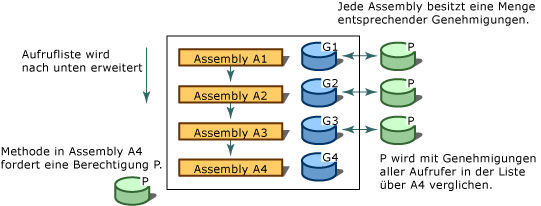

# Codezugriffssicherheit
[!INCLUDE[net_security_note](../../../includes/net-security-note-md.md)]  
  
 Die heutigen hochgradig vernetzten Computersysteme sind häufig Code ausgesetzt, der aus unterschiedlichen, teilweise auch unbekannten Quellen stammt. Code kann an e-Mails angefügt oder über das Internet heruntergeladen werden. Viele Computerbenutzer haben leider die Auswirkungen von bösartigem mobilem Code hautnah zu spüren bekommen, beispielsweise von Viren und Würmern, die Daten beschädigen oder zerstören können und deren Beseitigung zeit- und kostenintensiv ist.  
  
 Bei den gängigen Sicherheitsverfahren werden Benutzern Rechte auf Grundlage ihrer Anmeldeinformationen (üblicherweise des Kennworts) erteilt, und der Zugriff auf Ressourcen, bei denen es sich häufig um Verzeichnisse und Dateien handelt, wird eingeschränkt. Bei diesem Ansatz bleiben jedoch einige Aspekte unberücksichtigt: Benutzer erhalten Code aus zahlreichen Quellen, von denen einige möglicherweise unzuverlässig oder nicht vertrauenswürdig sind. Code kann Fehler oder Sicherheitsrisiken enthalten, die von bösartigem Code ausgenutzt werden können. Und in manchen Fällen kann Code zu unerwartetem Verhalten führen. Daher können Computersysteme beschädigt werden und private Daten in die falschen Hände gelangen, wenn umsichtige und vertrauenswürdige Benutzer schädliche oder fehlerhafte Software ausführen. Bei den meisten Sicherheitsmechanismen von Betriebssystemen muss sämtlicher Code vollständig vertrauenswürdig sein, um ausgeführt werden zu können. Skripts auf einer Webseite können davon ausgenommen sein. Daher ist nach wie vor ein umfassend anwendbarer Sicherheitsmechanismus erforderlich, der die geschützte Ausführung von Code eines Computersystems auf einem anderen System ermöglicht, selbst wenn keine gegenseitige Vertrauensstellung der Systeme besteht.  
  
 .NET Framework bietet einen Sicherheitsmechanismus namens Codezugriffssicherheit, der Computersysteme vor bösartigem, mobilem Code schützt, die geschützte Ausführung von Code unbekannter Herkunft ermöglicht und die absichtliche oder unabsichtliche Verletzung der Sicherheit durch vertrauenswürdigen Code verhindert. Mithilfe der Codezugriffssicherheit können für Code aufgrund des Ursprungs und weiterer Identitätsaspekte verschiedene Vertrauensebenen festgelegt werden. Die Codezugriffssicherheit erzwingt auch die verschiedenen Vertrauensebenen für Code, wodurch die Menge an Code, für dessen Ausführung vollständige Vertrauenswürdigkeit erforderlich ist, minimiert wird. Durch die Codezugriffssicherheit kann die Wahrscheinlichkeit verringert werden, dass Ihr Code durch bösartigen oder fehlerhaften Code missbraucht wird. Außerdem kann dadurch Ihre Haftung verringert werden, weil Sie die Vorgänge angeben können, die vom Code ausgeführt werden dürfen. Die Codezugriffssicherheit kann auch den Schaden begrenzen, der durch Sicherheitsschwachstellen im Code entstehen kann.  
  
> [!NOTE]
> Wichtige Änderungen an der Code Zugriffssicherheit in der .NET Framework 4 wurden vorgenommen. Die wichtigste Änderung ist die [Sicherheits Transparenz](security-transparent-code.md), aber es gibt auch andere bedeutende Änderungen, die die Code Zugriffssicherheit beeinträchtigen. Weitere Informationen zu diesen Änderungen finden Sie unter [Sicherheitsänderungen](https://docs.microsoft.com/previous-versions/dotnet/framework/security/security-changes).  
  
 Die Codezugriffssicherheit wirkt sich in erster Linie auf Bibliothekscode und teilweise vertrauenswürdige Anwendungen aus. Entwickler von Bibliotheken müssen ihren Code vor nicht autorisiertem Zugriff von teilweise vertrauenswürdigen Anwendungen schützen. Teilweise vertrauenswürdige Anwendungen sind Anwendungen, die aus externen Quellen (wie z. B. dem Internet) geladen werden. Auf dem Desktop oder im lokalen Intranet installierte Anwendungen werden mit vollständiger Vertrauenswürdigkeit ausgeführt. Anwendungen mit vollständiger Vertrauenswürdigkeit sind nicht von der Code Zugriffssicherheit betroffen, es sei denn, Sie sind als [Sicherheits transparent](security-transparent-code.md)gekennzeichnet, weil Sie voll vertrauenswürdig sind. Die einzige Einschränkung für Anwendungen mit vollständiger Vertrauenswürdigkeit ist, dass mit dem <xref:System.Security.SecurityTransparentAttribute>-Attribut markierte Anwendungen keinen Code aufrufen können, der mit dem <xref:System.Security.SecurityCriticalAttribute>-Attribut markiert ist. Teilweise vertrauenswürdige Anwendungen müssen in einem Sandkasten (z. B. in Internet Explorer) ausgeführt werden, damit die Codezugriffssicherheit angewendet werden kann. Wenn Sie eine Anwendung aus dem Internet herunterladen und auf dem Desktop ausführen möchten, wird eine <xref:System.NotSupportedException> mit der folgenden Meldung angezeigt: "Es wurde versucht, eine Assembly von einer Netzwerkadresse zu laden, was in früheren Versionen von .NET Framework zum Ausführen der Assembly als Sandkastenassembly geführt hätte. In dieser Version von .NET Framework wird die CAS-Richtlinie standardmäßig nicht aktiviert, dieser Ladevorgang kann daher gefährlich sein." Wenn Sie sicher sind, dass die Anwendung vertrauenswürdig ist, können Sie Sie mithilfe des- [ \<loadFromRemoteSources> Elements](../configure-apps/file-schema/runtime/loadfromremotesources-element.md)als voll vertrauenswürdig ausführen. Informationen zum Ausführen einer Anwendung in einem Sandkasten finden Sie unter Gewusst [wie: Ausführen von teilweise vertrauenswürdigem Code in einem Sandkasten](how-to-run-partially-trusted-code-in-a-sandbox.md).  
  
 Die Vorteile der Codezugriffssicherheit gelten für den gesamten verwalteten Code, der für die Common Language Runtime geschrieben wird, auch wenn dieser Code die Codezugriffssicherheit nicht aufruft. Weitere Informationen finden Sie unter [Code Access Security Basics](code-access-security-basics.md).  
  

## Hauptfunktionen der Codezugriffssicherheit  
 Mithilfe der Codezugriffssicherheit wird der Zugriff von Code auf geschützte Ressourcen und Vorgänge eingeschränkt. In .NET Framework erfüllt die Codezugriffssicherheit die folgenden Funktionen:  
  
- Definieren von Berechtigungen und Berechtigungssätzen, die den Zugriff auf die verschiedenen Systemressourcen regeln  
  
- Bereitstellen der Möglichkeit für Code festzulegen, dass seine Aufrufer bestimmte Berechtigungen haben müssen  
  
- Bereitstellen der Möglichkeit für Code festzulegen, dass seine Aufrufer eine digitale Signatur besitzen müssen, sodass der geschützte Code nur von Aufrufern eines bestimmten Unternehmens oder eines bestimmten Standorts aufgerufen werden kann  
  
- Durchsetzen von Einschränkungen für Code zur Laufzeit, indem die erteilten Berechtigungen der einzelnen Aufrufer in der Aufrufliste mit den Berechtigungen verglichen werden, die sie besitzen müssen  
  

## Durchlaufen der Aufrufliste  
 Zur Bestimmung, ob Code auf eine Ressource zugreifen oder einen Vorgang ausführen darf, durchläuft das Laufzeit-Sicherheitssystem die Aufrufliste und vergleicht dabei die erteilten Berechtigungen der einzelnen Aufrufer mit den angeforderten Berechtigungen. Wenn einer der Aufrufer in der Aufrufliste nicht über die angeforderte Berechtigung verfügt, wird eine Sicherheitsausnahme ausgelöst, und der Zugriff wird verweigert. Mit dem Stackwalk sollen Lockangriffe verhindert werden, bei denen weniger vertrauenswürdiger Code äußerst vertrauenswürdigen Code aufruft und verwendet, um nicht autorisierte Aktionen auszuführen. Das Anfordern von Berechtigungen für alle Aufrufer zur Laufzeit beeinträchtigt die Leistung, aber es ist wichtig, den Code vor Lockangriffen durch weniger vertrauenswürdigen Code zu schützen. Zum Optimieren der Leistung können Sie dafür sorgen, dass der Code weniger Stackwalks durchläuft. Sie müssen dabei jedoch unbedingt darauf achten, dass kein Sicherheitsrisiko entsteht.  
  
 In der folgenden Abbildung ist der Stackwalk dargestellt, der entsteht, wenn eine Methode in Assembly A4 fordert, dass ihre Aufrufer über Berechtigung P verfügen.  
  
   
Sicherheits-Stackwalk  
  

## Verwandte Themen  
  
|Titel|BESCHREIBUNG|  
|-----------|-----------------|  
|[Grundlagen der Codezugriffssicherheit](code-access-security-basics.md)|Beschreibt die Codezugriffssicherheit und die häufigsten Anwendungsbereiche.|  
|[Sicherheitstransparenter Code, Ebene 2](security-transparent-code-level-2.md)|Beschreibt das Sicherheits Transparenz Modell in der .NET Framework 4.|  
|[Verwenden von Bibliotheken aus teilweise vertrauenswürdigem Code](using-libraries-from-partially-trusted-code.md)|Beschreibt das Aktivieren von Bibliotheken zur Verwendung mit nicht verwaltetem Code und das Verwenden von Bibliotheken aus nicht verwaltetem Code.|  
|[Schlüsselbegriffe der Sicherheit](../../standard/security/key-security-concepts.md)|Bietet eine Übersicht über viele Schlüsselbegriffe und -konzepte, die im Sicherheitssystem von .NET Framework verwendet werden.|  
|[Rollenbasierte Sicherheit](../../standard/security/role-based-security.md)|Beschreibt die Integration von Sicherheit basierend auf Rollen.|  
|[Kryptografische Dienste](../../standard/security/cryptographic-services.md)|Beschreibt die Integration von Kryptografie in Anwendungen.|
