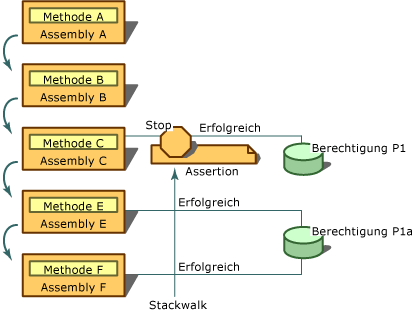

# <a name="using-the-assert-method"></a>Verwenden der Assert-Methode
[!INCLUDE[net_security_note](../../../includes/net-security-note-md.md)]  
  
 <xref:System.Security.CodeAccessPermission.Assert%2A> ist eine Methode, die für Klassen von Codezugriffsberechtigungen und für die <xref:System.Security.PermissionSet>-Klasse aufgerufen werden kann. Sie können **Assert** zum Aktivieren der Code (und nachgeschalteten Aufrufern) zum Ausführen von Aktionen, die Ihr Code berechtigt ist, aber seine Aufrufer möglicherweise keine Berechtigung zum Ausführen. Das normale Verfahren, das von der Runtime während einer Sicherheitsüberprüfung ausgeführt wird, wird durch eine Sicherheitserklärung (Sicherheitsassertion) geändert. Wenn Sie eine Berechtigung mit "Assert" erteilen, wird das Sicherheitssystem angewiesen, die Aufrufer Ihres Codes nicht hinsichtlich der erklärten Berechtigung zu überprüfen.  
  
> [!CAUTION]
>  Verwenden Sie Assertionen mit Bedacht, da sie zu Sicherheitslücken führen und das Verfahren beeinträchtigen können, mit dem die Common Language Runtime Sicherheitsbeschränkungen erzwingt.  
  
 Assertionen empfehlen sich in Situationen, in denen eine Bibliothek nicht verwalteten Code aufruft oder einen Aufruf vornimmt, für den eine Berechtigung erforderlich ist, die offensichtlich nicht dem eigentlichen Zweck der Bibliothek entspricht. Beispielsweise der gesamte verwaltete Code, die Aufrufe in nicht verwaltetem Code benötigen **SecurityPermission** mit der **UnmanagedCode** Flag angegeben. Code, der nicht vom lokalen Computer stammt, etwa Code, der aus dem lokalen Intranet heruntergeladen wurde, wird diese Berechtigung nicht standardmäßig erteilt. Daher muss Code, der aus dem lokalen Intranet heruntergeladen wurde und in der Lage sein soll, eine Bibliothek aufzurufen, die unverwalteten Code verwendet, die durch die Bibliothek mit "Assert" erklärte Berechtigung haben. Darüber hinaus nehmen einige Bibliotheken möglicherweise Aufrufe vor, die für Aufrufer nicht sichtbar und für die besondere Berechtigungen erforderlich sind.  
  
 Sie können Assertionen auch in Situationen verwenden, in denen Ihr Code in einer Weise auf eine Ressource zugreift, die für Aufrufer vollständig verborgen ist. Nehmen Sie beispielsweise an, Ihre Bibliothek ruft Informationen aus einer Datenbank ab, bei diesem Vorgang werden aber auch Informationen aus der Registrierung des Computers gelesen. Da Entwickler, die Ihre Bibliothek verwenden, im Quellcode keinen Zugriff haben, haben sie keine Möglichkeit, zu wissen, dass ihr Code erfordert **RegistryPermission** um den Code verwenden. Wenn Sie in diesem Fall entscheiden, dass es nicht sinnvoll oder erforderlich ist, dass die Aufrufer Ihres Codes über die Berechtigung für den Zugriff auf die Registrierung verfügen, können Sie die Berechtigung zum Lesen der Registrierung über "Assert" bereitstellen. In dieser Situation ist es für die Bibliothek, die Berechtigung zuweisen, sodass Aufrufer ohne entsprechenden **RegistryPermission** können die Bibliothek verwenden.  
  
 Die Assertion wirkt sich nur dann auf den Stackwalk aus, wenn die über "Assert" bereitgestellte Berechtigung und eine von einem nachgeschalteten Aufrufer geforderte Berechtigung denselben Typ haben und die geforderte Berechtigung eine Teilmenge der über "Assert" bereitgestellten Berechtigung ist. Angenommen, Sie assert **FileIOPermission** zum Lesen aller Dateien auf Laufwerk C, und eine nachfolgende Anforderung erfolgt für **FileIOPermission** zum Lesen von Dateien in C:\Temp beeinträchtigen die Assertion den Stackwalk; jedoch, wenn die Anforderung war **FileIOPermission** um Laufwerk C zu schreiben, müsste die Assertion keine Auswirkung.  
  
 Zum Ausführen von Assertionen müssen Ihrem Code sowohl die Berechtigung, die Sie über "Assert" bereitstellen, als auch die <xref:System.Security.Permissions.SecurityPermission> erteilt sein, die das Recht zum Ausführen von Assertionen darstellt. Obwohl Sie eine Berechtigung mit "Assert" bereitstellen könnten, die Ihrem Code nicht erteilt wurde, wäre die Assertion sinnlos, da die Sicherheitsüberprüfung fehlschlägt, bevor die Assertion deren erfolgreiche Ausführung bewirken kann.  
  
 Die folgende Abbildung zeigt, was geschieht, wenn Sie **Assert**. Angenommen, die folgenden Aussagen gelten für die Assemblys A, B, C, E und F sowie für die beiden Berechtigungen P1 und P1A:  
  
-   P1A entspricht dem Recht zum Lesen von TXT-Dateien auf Laufwerk C.  
  
-   P1 entspricht dem Recht zum Lesen aller Dateien auf Laufwerk C.  
  
-   Sowohl P1A auch P1 sind **FileIOPermission** Typen und P1A ist eine Teilmenge von P1.  
  
-   Den Assemblys E und F wurde die Berechtigung P1A erteilt.  
  
-   Der Assembly C wurde die Berechtigung P1 erteilt.  
  
-   Den Assemblys A und B wurde weder die Berechtigung P1 noch die Berechtigung P1A erteilt.  
  
-   Die Methode A ist in Assembly A enthalten, die Methode B ist in Assembly B enthalten usw.  
  
   
Verwenden von "Assert"  
  
 In diesem Szenario ruft Methode A B, B ruft C, C ruft E und E ruft bestätigt F. Methode C, über die Berechtigung zum Lesen von Dateien auf Laufwerk C (Berechtigung P1) und Methode E fordert die Berechtigung zum Lesen von TXT-Dateien auf Laufwerk C (Berechtigung P1A). Wenn die Forderung in F zur Laufzeit erkannt wird, wurde ein Stackwalk ausgeführt wird, um die Berechtigungen aller Aufrufer von F, überprüfen beginnend mit E. E Berechtigung P1A erteilt der Stackwalk folglich wechselt, um die Berechtigungen von C zu untersuchen, in dem die Assertion für C erkannt wird. Da die geforderte Berechtigung (P1A) eine Teilmenge der über "Assert" bereitgestellten Berechtigung (P1) darstellt, wird der Stackwalk beendet, und die Sicherheitsüberprüfung wird automatisch erfolgreich abgeschlossen. Es spielt keine Rolle, dass den Assemblys A und B die Berechtigung P1A nicht erteilt wurde. Durch die Assertion von P1 gewährleistet Methode C, dass ihre Aufrufer auf die von P1 geschützte Ressource zugreifen können, selbst wenn den Aufrufern nicht die Berechtigung für den Zugriff auf diese Ressource erteilt wurde.  
  
 Wenn Sie eine Klassenbibliothek entwerfen und eine Klasse auf eine geschützte Ressource zugreift, müssen Sie in den meisten Fällen eine Sicherheitsforderung vornehmen, die erfordert, dass die Aufrufer der Klasse über die entsprechende Berechtigung verfügen. Wenn die Klasse anschließend einen Vorgang ausführt, wenn Sie bereits wissen die meisten Aufrufer nicht über die Berechtigung, und wenn Sie für den Zugriff dieser Aufrufer auf Ihren Code die Verantwortung übernehmen riskieren möchten, können Sie die Berechtigung anfordern, durch Aufrufen der **Assert** Methode für ein Berechtigungsobjekt, das den Vorgang darstellt, die der Code ausgeführt wird. Mit **Assert** auf diese Weise können Aufrufer, die dazu normalerweise nicht berechtigt sind, die Ihren Code aufrufen. Daher sollten Sie, wenn Sie eine Berechtigung über "Assert" bereitstellen, die notwendigen Sicherheitsüberprüfungen unbedingt vorab vornehmen, um einen Missbrauch Ihrer Komponente auszuschließen.  
  
 Angenommen, Ihre hoch vertrauenswürdige Bibliotheksklasse hat eine Methode, die Dateien löscht. Sie greift auf die jeweilige Datei durch Aufrufen einer nicht verwalteten Win32-Funktion zu. Ein Aufrufer ruft Ihres Codes **löschen** -Methode auf und übergibt den Namen der Datei, die gelöscht, C:\Test.txt. Innerhalb der **löschen** -Methode erstellt Ihr Code eine <xref:System.Security.Permissions.FileIOPermission> Objekt, das den Schreibzugriff auf C:\Test.txt darstellt. (Zum Löschen einer Datei ist Schreibzugriff erforderlich.) Der Code ruft dann eine imperative sicherheitsüberprüfung durch Aufrufen der **FileIOPermission** des Objekts **Bedarf** Methode. Wenn einer der Aufrufer in der Aufrufliste nicht über diese Berechtigung verfügt, wird eine <xref:System.Security.SecurityException> ausgelöst. Wenn keine Ausnahme ausgelöst wird, wissen Sie, dass alle Aufrufer zum Zugriff auf "C:\Test.txt" berechtigt sind. Da Sie davon ausgehen, dass die meisten Aufrufer keine Berechtigung zum Zugriff auf nicht verwalteten Code, der Code erstellt dann ein <xref:System.Security.Permissions.SecurityPermission> -Objekt, das Recht zum Aufrufen von nicht verwalteten Codes darstellt, und ruft das Objekt **Assert** Methode. Schließlich ruft Ihr Code die nicht verwaltete Win32-Funktion auf, um "C:\Test.txt" zu löschen, und gibt die Kontrolle an den Aufrufer zurück.  
  
> [!CAUTION]
>  Achten Sie unbedingt darauf, dass Iher Code keine Assertionen in Situationen verwendet, in denen anderer Code Ihren Code für den Zugriff auf eine Ressource verwenden kann, die durch die von Ihnen mit "Assert" bereitgestellte Berechtigung geschützt ist. Angenommen, im Code, der in eine Datei schreibt, deren Name vom Aufrufer als Parameter angegeben wird, würde nicht die assert der **FileIOPermission** zum Schreiben in Dateien, da Code öffnen, um Missbrauch durch Dritte missbraucht werden würde.  
  
 Wenn Sie die imperative Sicherheitssyntax verwenden, Aufrufen der **Assert** Methode für mehrere Berechtigungen in derselben Methode bewirkt, dass eine Sicherheitsausnahme ausgelöst wird. Erstellen Sie stattdessen eine **PermissionSet** Objekt, und übergeben sie die einzelnen Berechtigungen, die Sie aufrufen, und rufen dann möchten die **Assert** Methode für die **PermissionSet** -Objekt. Sie erreichen die **Assert** Methode mehr als einmal, wenn Sie die deklarative Sicherheitssyntax verwenden.  
  
 Das folgende Beispiel veranschaulicht die deklarative Syntax für das Überschreiben von sicherheitsüberprüfungen mithilfe der **Assert** Methode. Beachten Sie, dass die **FileIOPermissionAttribute** Syntax lässt zwei Werte: einen <xref:System.Security.Permissions.SecurityAction> -Enumeration und den Speicherort der Datei oder des Verzeichnisses für die Berechtigung gewährt wird. Der Aufruf von **Assert** bewirkt, dass die Anforderungen für den Zugriff auf `C:\Log.txt` erfolgreich abgeschlossen, obwohl Aufrufer keine Berechtigung zum Zugriff auf die Datei überprüft werden.  
  
```vb  
Option Explicit  
Option Strict  
  
Imports System  
Imports System.IO  
Imports System.Security.Permissions  
  
Namespace LogUtil  
   Public Class Log  
      Public Sub New()  
  
      End Sub  
  
     <FileIOPermission(SecurityAction.Assert, All := "C:\Log.txt")> Public Sub   
      MakeLog()  
         Dim TextStream As New StreamWriter("C:\Log.txt")  
         TextStream.WriteLine("This  Log was created on {0}", DateTime.Now) '  
         TextStream.Close()  
      End Sub  
   End Class  
End Namespace  
```  
  
```csharp  
namespace LogUtil  
{  
   using System;  
   using System.IO;  
   using System.Security.Permissions;  
  
   public class Log  
   {  
      public Log()  
      {      
      }     
      [FileIOPermission(SecurityAction.Assert, All = @"C:\Log.txt")]  
      public void MakeLog()  
      {     
         StreamWriter TextStream = new StreamWriter(@"C:\Log.txt");  
         TextStream.WriteLine("This  Log was created on {0}", DateTime.Now);  
         TextStream.Close();  
      }  
   }  
}   
```  
  
 Das folgende Codefragment veranschaulicht die imperative Syntax für das Überschreiben von sicherheitsüberprüfungen mithilfe der **Assert** Methode. In diesem Beispiel eine Instanz von der **FileIOPermission** Objekt deklariert wird. Der Konstruktor übergeben wird **FileIOPermissionAccess.AllAccess** um den Typ des zulässigen Zugriffs zu definieren gefolgt durch eine Zeichenfolge, die den Speicherort der Datei beschreibt. Einmal die **FileIOPermission** Objekt definiert ist, müssen Sie nur Aufrufen seiner **Assert** Methode, um die sicherheitsüberprüfung zu überschreiben.  
  
```vb  
Option Explicit  
Option Strict  
Imports System  
Imports System.IO  
Imports System.Security.Permissions  
Namespace LogUtil  
   Public Class Log  
      Public Sub New()  
      End Sub 'New  
  
      Public Sub MakeLog()  
         Dim FilePermission As New FileIOPermission(FileIOPermissionAccess.AllAccess, "C:\Log.txt")  
         FilePermission.Assert()  
         Dim TextStream As New StreamWriter("C:\Log.txt")  
         TextStream.WriteLine("This  Log was created on {0}", DateTime.Now)  
         TextStream.Close()  
      End Sub  
   End Class  
End Namespace  
```  
  
```csharp  
namespace LogUtil  
{  
   using System;  
   using System.IO;  
   using System.Security.Permissions;  
  
   public class Log  
   {  
      public Log()  
      {      
      }     
      public void MakeLog()  
      {  
         FileIOPermission FilePermission = new FileIOPermission(FileIOPermissionAccess.AllAccess,@"C:\Log.txt");   
         FilePermission.Assert();  
         StreamWriter TextStream = new StreamWriter(@"C:\Log.txt");  
         TextStream.WriteLine("This  Log was created on {0}", DateTime.Now);  
         TextStream.Close();  
      }  
   }  
}  
```  
  
## <a name="see-also"></a>Siehe auch  
 <xref:System.Security.PermissionSet>  
 <xref:System.Security.Permissions.SecurityPermission>  
 <xref:System.Security.Permissions.FileIOPermission>  
 <xref:System.Security.Permissions.SecurityAction>  
 [Attribute](../../../docs/standard/attributes/index.md)  
 [Codezugriffssicherheit](../../../docs/framework/misc/code-access-security.md)
