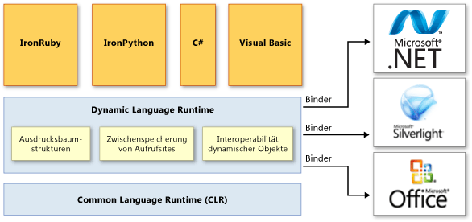

# Übersicht über die Dynamic Language Runtime

Die *Dynamic Language Runtime* (DLR) ist eine Runtimeumgebung, die der Common Language Runtime (CLR) eine Reihe von Diensten für dynamische Sprachen hinzufügt. Die DLR vereinfacht es, dynamische Sprachen für die Ausführung auf dem .NET Framework zu entwickeln und statisch typisierten Sprachen dynamische Funktionen hinzuzufügen.

Dynamische Sprachen können den Typ eines Objekts zur Runtime identifizieren, wobei Sie in statistisch typisierten Sprachen wie C# und Visual Basic (wenn Sie `Option Explicit On` verwenden) die Objekttypen zur Entwurfszeit angeben müssen. Beispiele für dynamische Sprachen sind Lisp, Smalltalk, JavaScript, PHP, Ruby, Python, ColdFusion, Lua, Cobra und Groovy.

Die dynamischsten Sprachen bieten die folgenden Vorteile für Entwickler:

- Die Möglichkeit, schnelle Feedbackschleifen (REPL oder „Lesen-Auswerten-Ausgeben-Schleife“) zu verwenden. Dadurch können Sie mehrere Anweisungen eingeben und sie sofort ausführen, um die Ergebnisse anzuzeigen.

- Unterstützung für Entwicklung „von oben“ und die traditionellere Entwicklung „von unten“. Wenn Sie z.B. einen „von oben“-Ansatz nutzen, können Sie Funktionen aufrufen, die noch nicht implementiert wurden und dann zugrunde liegende Implementierungen hinzufügen, wenn Sie diese benötigen.

- Einfachere Umgestaltung und Codeänderung, da Sie die statischen Typdeklarationen im gesamten Code nicht verändern müssen.

Dynamische Sprachen können hervorragende Skriptsprachen sein. Kunden können Anwendungen leicht erweitern, die mithilfe dynamischer Sprachen mit neuen Befehlen und Funktionen erstellt wurden. Dynamische Sprachen werden auch häufig zum Erstellen von Websites und Testumgebungen verwendet, zudem zum Verwalten von Serverfarmen, zum Entwickeln verschiedenster Hilfsprogramme und zum Ausführen von Datentransformationen.

Der Zweck der DLR ist, einem System von dynamischen Sprachen zu erlauben, unter .NET Framework ausgeführt zu werden und diesen Sprachen .NET-Interoperabilität zu geben. Die DLR fügt C# und Visual Basic dynamische Objekte hinzu, um dynamisches Verhalten in diesen Sprachen zu unterstützen und ihre Interoperation mit dynamischen Sprachen zu ermöglichen.

Die DLR hilft Ihnen auch beim Erstellen von Bibliotheken, die dynamische Operationen unterstützen. Wenn Sie beispielsweise über eine Bibliothek verfügen, die XML- oder JavaScript Object Notation-Objekte (JSON-Objekte) verwenden, können Ihre Objekte als dynamische Objekte für Sprachen, die DLR verwenden, erscheinen. Dadurch können Benutzer von Bibliotheken syntaktisch einfacheren und natürlicheren Code für das Arbeiten mit Objekten und den Zugriff auf Objektmember schreiben.

Sie verwenden z.B. möglicherweise den folgenden Code, um einen Zähler in XML in C# zu inkrementieren.

`Scriptobj.SetProperty("Count", ((int)GetProperty("Count")) + 1);`

Mit DLR können Sie den folgenden Code statt des gleichen Vorgangs verwenden.

`scriptobj.Count += 1;`

Wie die CLR ist die DLR auch ein Teil von .NET Framework und wird mit dem .NET Framework und Installationspaketen von Visual Studio bereitgestellt. Die Open-Source-Version der DLR ist ebenso zum Download im Repository [IronLanguages/dlr](https://github.com/IronLanguages/dlr) auf GitHub verfügbar.

> [!NOTE]
> Die Open-Source-Version der DLR verfügt über alle Funktionen der DLR, die in Visual Studio und dem .NET Framework integriert ist. Es wird auch zusätzliche Unterstützung für Sprachimplementierungen geboten. Weitere Informationen finden Sie in der Dokumentation im Repository [IronLanguages/dlr](https://github.com/IronLanguages/dlr) auf GitHub.

Beispiele von Sprachen, die mithilfe der DLR entwickelt wurden, enthalten Folgendes:

- IronPython. Als Open-Source-Software auf der [GitHub](https://github.com/IronLanguages/ironpython2)-Website verfügbar.

- IronRuby Als Open-Source-Software auf der [IronRuby](http://ironruby.net/) -Website verfügbar.

## Wesentliche Vorteile der DLR
 Die Verwendung der DLR bietet die folgenden Vorteile:

### Vereinfacht das Übertragen von dynamischen Sprachen zu .NET Framework
 Die DLR ermöglicht Verantwortlichen für die Sprachimplementierung die Erstellung lexikaler Analyzer, Parser, semantischer Analyzer, Codegeneratoren und anderen Tools, die sie normalerweise selbst hätten erstellen müssen. Damit die DLR verwendet werden kann, muss eine Sprache *Ausdrucksbaumstrukturen* erstellen, die den Code auf Sprachebene in einer verzweigten Struktur, in Runtimehilfsfunktionen und optionalen dynamischen Objekten darstellen, die die <xref:System.Dynamic.IDynamicMetaObjectProvider>-Schnittstelle implementieren. Die DLR und .NET Framework automatisieren eine Menge Codeanalysen und Codegenerierungsaufgaben Dadurch können sich Verantwortliche für die Sprachimplementierung auf eindeutige Sprachfunktionen konzentrieren.

### Aktiviert dynamische Funktionen in statisch typisierten Sprachen
 Vorhandene .NET Framework-Sprachen wie C# und Visual Basic können dynamische Objekte erstellen und diese zusammen mit statisch typisierten Sprachen verwenden. C# und Visual Basic können z.B: dynamische Objekte für HTML, Dokumentobjektmodell (DOM) und .NET-Reflektion verwenden.

### Bietet in der Zukunft Vorteile der DLR und .NET Framework
 Sprachen, die mithilfe der DLR erstellt wurden, können von zukünftigen DLR- und .NET Framework-Verbesserungen profitieren. Wenn .NET Framework beispielsweise eine neue Version veröffentlicht, die über einen verbesserten Garbage Collector oder eine schnellere Ladezeit für Assemblys verfügt, erhalten durch die DLR implementierten Sprachen sofort denselben Vorteil. Wenn die DLR Optimierungen hinzufügt, z.B. eine verbesserte Kompilierung, verbessert sich auch die Leistung für alle Sprachen, die mithilfe der DLR implementiert wurden.

### Ermöglicht die Freigabe von Bibliotheken und Objekten
 Die in einer Sprache implementierten Objekte und Bibliotheken können von anderen Sprachen genutzt werden. Die DLR lässt auch die Interoperation zwischen statistisch typisierten und dynamischen Sprachen zu. Zum Beispiel kann C# ein dynamisches Objekt deklarieren, das eine Bibliothek verwendet, die in einer dynamischen Sprache geschrieben ist. Gleichzeitig können dynamische Sprachen Bibliotheken aus .NET Framework verwenden.

### Bietet schnellen dynamischen Versand und Aufruf
 Die DLR bietet eine schnelle Ausführung dynamischer Vorgänge durch Unterstützung des erweiterten polymorphen Zwischenspeicherns. Die DLR erstellt Regeln für das Binden von Vorgängen, die Objekte für die nötigen Runtime-Implementierungen verwenden, und speichert diese Regeln zwischen, um ressourcenermüdende Bindungsberechnungen während der aufeinander folgenden Ausführungen desselben Codes auf den gleichen Objekttypen zu vermeiden.

## DLR-Architektur
 Die folgende Abbildung zeigt die Architektur der Dynamic Language Runtime.

  DLR-Architektur

 Die DLR fügt der CLR eine Reihe von Diensten hinzu, um dynamische Sprachen besser zu unterstützen. Einige dieser Dienste sind:

- Ausdrucksbaumstrukturen. Die DLR verwendet Ausdrucksbaumstrukturen, um Sprachsemantik darzustellen. Zu diesem Zweck hat die DLR LINQ-Ausdrucksbaumstrukturen erweitert, um die Ablaufsteuerung, Zuweisung und andere Knoten für die Sprachmodellierung. Weitere Informationen finden Sie unter [Ausdrucksbaumstrukturen (C#)](../../csharp/programming-guide/concepts/expression-trees/index.md) oder [Ausdrucksbaumstrukturen (Visual Basic)](../../visual-basic/programming-guide/concepts/expression-trees/index.md).

- Zwischenspeichern der Aufrufwebsite. Eine *dynamische Aufrufwebsite* ist ein Ort im Code, an dem Sie einen Vorgang wie `a + b` oder `a.b()` auf dynamischen Objekten ausführen können. Die DLR speichert die Eigenschaften von `a` und `b` (normalerweise die Typen dieser Objekte) sowie Informationen über den Vorgang. Wenn solch ein Vorgang zuvor ausgeführt wurde, ruft die DLR alle nötigen Informationen aus dem Cache für den schnellen Versand ab.

- Dynamische Objektinteroperabilität Die DLR stellt einen Satz von Klassen und Schnittstellen bereit, die dynamische Objekte und Vorgänge darstellen und von Verantwortlichen für die Sprachimplementierung und Autoren dynamischer Bibliotheken genutzt werden können. Diese Klassen und Schnittstellen enthalten <xref:System.Dynamic.IDynamicMetaObjectProvider>, <xref:System.Dynamic.DynamicMetaObject>, <xref:System.Dynamic.DynamicObject> und <xref:System.Dynamic.ExpandoObject>.

Die DLR verwendet Binder in Aufrufwebsites, um nicht nur mit .NET Framework zu kommunizieren, sondern auch mit anderen Infrastrukturen und Diensten, einschließlich Silverlight und COM. Binder kapseln die Semantik einer Sprache ein und geben an, wie Vorgänge in einer Aufrufwebsite durchgeführt werden, indem Ausdrucksbaumstrukturen verwendet werden. Dadurch werden dynamische und statisch typisierte Sprachen aktiviert, die die DLR zum Freigeben von Bibliotheken und Erhalten von Zugriff auf alle Technologien verwenden, die die DLR unterstützt.

## DLR-Dokumentation
 Weitere Informationen zur Verwendung der Open-Source-Version der DLR zum Hinzufügen dynamischen Verhaltens zu einer Sprache oder Informationen darüber, wie Sie die Verwendung einer dynamischer Sprache mit .NET Framework aktivieren, finden Sie in der Dokumentation im Repository [IronLanguages/dlr](https://github.com/IronLanguages/dlr/tree/master/Docs) auf GitHub.

## Siehe auch

- <xref:System.Dynamic.ExpandoObject>
- <xref:System.Dynamic.DynamicObject>
- [Common Language Runtime](../../standard/clr.md)
- [Ausdrucksbaumstrukturen (C#)](../../csharp/programming-guide/concepts/expression-trees/index.md)
- [Ausdrucksbaumstrukturen (Visual Basic)](../../visual-basic/programming-guide/concepts/expression-trees/index.md)
- [Exemplarische Vorgehensweise: Erstellen und Verwenden von dynamischen Objekten](../../csharp/programming-guide/types/walkthrough-creating-and-using-dynamic-objects.md)
