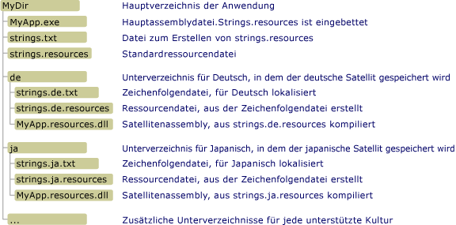

# <a name="creating-satellite-assemblies-for-desktop-apps"></a><span data-ttu-id="0a5bd-102">Erstellen von Satellitenassemblys für Desktop-Apps</span><span class="sxs-lookup"><span data-stu-id="0a5bd-102">Creating Satellite Assemblies for Desktop Apps</span></span>
<span data-ttu-id="0a5bd-103">Ressourcendatei spielen eine tragende Rolle in lokalisierten Anwendungen.</span><span class="sxs-lookup"><span data-stu-id="0a5bd-103">Resource files play a central role in localized applications.</span></span> <span data-ttu-id="0a5bd-104">Durch sie kann eine Anwendung Zeichenfolgen, Images und andere Daten in der Sprache und Kultur des Benutzers anzeigen und alternative Daten bereitstellen, wenn keine Ressourcen für die Sprache oder Kultur des Benutzers verfügbar sind.</span><span class="sxs-lookup"><span data-stu-id="0a5bd-104">They enable an application to display strings, images, and other data in the user's own language and culture, and to provide alternate data if resources for the user's own language or culture are unavailable.</span></span> <span data-ttu-id="0a5bd-105">.NET Framework verwendet ein Speichenarchitekturmodell (Hub and Spoke), um lokalisierte Ressourcen zu finden und aufzurufen.</span><span class="sxs-lookup"><span data-stu-id="0a5bd-105">The .NET Framework uses a hub-and-spoke model to locate and retrieve localized resources.</span></span> <span data-ttu-id="0a5bd-106">Der Hub ist die Hauptassembly, die den nicht lokalisierbaren, ausführbaren Code und die Ressourcen für eine einzelne Kultur enthält, die als neutrale oder Standardkultur bezeichnet wird.</span><span class="sxs-lookup"><span data-stu-id="0a5bd-106">The hub is the main assembly that contains the non-localizable executable code and the resources for a single culture, which is called the neutral or default culture.</span></span> <span data-ttu-id="0a5bd-107">Die Standardkultur ist die Ausweichkultur der Anwendung. Dabei handelt es sich um die Kultur, die verwendet wird, wenn keine lokalisierten Ressourcen verfügbar sind.</span><span class="sxs-lookup"><span data-stu-id="0a5bd-107">The default culture is the fallback culture for the application; it is used when no localized resources are available.</span></span> <span data-ttu-id="0a5bd-108">Sie verwenden das <xref:System.Resources.NeutralResourcesLanguageAttribute>-Attribut, um die Standardkultur der Anwendung festzulegen.</span><span class="sxs-lookup"><span data-stu-id="0a5bd-108">You use the <xref:System.Resources.NeutralResourcesLanguageAttribute> attribute to designate the culture of the application's default culture.</span></span> <span data-ttu-id="0a5bd-109">Jede Speiche ist mit einer Satellitenassembly verbunden, die die Ressourcen für eine einzelne lokalisierte Kultur aber keinen Code enthält.</span><span class="sxs-lookup"><span data-stu-id="0a5bd-109">Each spoke connects to a satellite assembly that contains the resources for a single localized culture but does not contain any code.</span></span> <span data-ttu-id="0a5bd-110">Da die Satellitenassemblys kein Teil der Hauptassembly sind, können Sie die Ressourcen problemlos entsprechend einer bestimmten Kultur ersetzen oder aktualisieren, ohne die Hauptassembly der App ersetzen zu müssen.</span><span class="sxs-lookup"><span data-stu-id="0a5bd-110">Because the satellite assemblies are not part of the main assembly, you can easily update or replace resources that correspond to a specific culture without replacing the main assembly for the application.</span></span>  
  
> [!NOTE]
>  <span data-ttu-id="0a5bd-111">Die Ressourcen der Standardkultur einer Anwendung können auch in einer Satellitenassembly gespeichert werden.</span><span class="sxs-lookup"><span data-stu-id="0a5bd-111">The resources of an application's default culture can also be stored in a satellite assembly.</span></span> <span data-ttu-id="0a5bd-112">Dazu weisen Sie dem <xref:System.Resources.NeutralResourcesLanguageAttribute>-Attribut eine Wert von <xref:System.Resources.UltimateResourceFallbackLocation.Satellite?displayProperty=nameWithType> zu.</span><span class="sxs-lookup"><span data-stu-id="0a5bd-112">To do this, you assign the <xref:System.Resources.NeutralResourcesLanguageAttribute> attribute a value of <xref:System.Resources.UltimateResourceFallbackLocation.Satellite?displayProperty=nameWithType>.</span></span>  
  
## <a name="satellite-assembly-name-and-location"></a><span data-ttu-id="0a5bd-113">Name und Speicherort einer Satellitenassembly</span><span class="sxs-lookup"><span data-stu-id="0a5bd-113">Satellite Assembly Name and Location</span></span>  
 <span data-ttu-id="0a5bd-114">Das Speichenarchitekturmodell erfordert, dass Sie Ressourcen an bestimmten Speicherorten speichern, damit Sie leicht gefunden und verwendet werden können.</span><span class="sxs-lookup"><span data-stu-id="0a5bd-114">The hub-and-spoke model requires that you place resources in specific locations so that they can be easily located and used.</span></span> <span data-ttu-id="0a5bd-115">Wenn Sie Ressourcen nicht wie erwartet kompilieren und benennen, oder wenn Sie sie nicht am richtigen Speicherort speichern, kann die Common Language Runtime diese nicht finden und verwendet stattdessen die Ressourcen der Standardkultur.</span><span class="sxs-lookup"><span data-stu-id="0a5bd-115">If you do not compile and name resources as expected, or if you do not place them in the correct locations, the common language runtime will not be able to locate them and will use the resources of the default culture instead.</span></span> <span data-ttu-id="0a5bd-116">Der Ressourcen-Manager von .NET Framework, der vom <xref:System.Resources.ResourceManager>-Objekt dargestellt wird, wird verwendet, um automatisch auf lokalisierte Ressourcen zuzugreifen.</span><span class="sxs-lookup"><span data-stu-id="0a5bd-116">The .NET Framework Resource Manager, represented by a <xref:System.Resources.ResourceManager> object, is used to automatically access localized resources.</span></span> <span data-ttu-id="0a5bd-117">Der Ressourcen-Manager hat folgende Anforderungen:</span><span class="sxs-lookup"><span data-stu-id="0a5bd-117">The Resource Manager requires the following:</span></span>  
  
-   <span data-ttu-id="0a5bd-118">Eine einzelne Satellitenassembly muss alle Ressourcen für eine bestimmte Kultur enthalten.</span><span class="sxs-lookup"><span data-stu-id="0a5bd-118">A single satellite assembly must include all the resources for a particular culture.</span></span> <span data-ttu-id="0a5bd-119">Dies bedeutet, dass Sie mehrere TXT- oder RESX-Dateien in eine einzelne RESOURCES-Binärdatei kompilieren sollten.</span><span class="sxs-lookup"><span data-stu-id="0a5bd-119">In other words, you should compile multiple .txt or .resx files into a single binary .resources file.</span></span>  
  
-   <span data-ttu-id="0a5bd-120">Das Anwendungsverzeichnis muss ein separates Unterverzeichnis für jede lokalisierte Kultur haben, in dem die Kulturressourcen gespeichert sind.</span><span class="sxs-lookup"><span data-stu-id="0a5bd-120">There must be a separate subdirectory in the application directory for each localized culture that stores that culture's resources.</span></span> <span data-ttu-id="0a5bd-121">Der Name des Unterverzeichnisses muss dem Namen der Kultur entsprechen.</span><span class="sxs-lookup"><span data-stu-id="0a5bd-121">The subdirectory name must be the same as the culture name.</span></span> <span data-ttu-id="0a5bd-122">Alternativ können Sie Ihre Satellitenassemblys im globalen Assemblycache (GAC) speichern.</span><span class="sxs-lookup"><span data-stu-id="0a5bd-122">Alternately, you can store your satellite assemblies in the global assembly cache.</span></span> <span data-ttu-id="0a5bd-123">In diesem Fall muss die Kulturinformationskomponente des starken Namens der Assembly deren Kultur angeben.</span><span class="sxs-lookup"><span data-stu-id="0a5bd-123">In this case, the culture information component of the assembly's strong name must indicate its culture.</span></span> <span data-ttu-id="0a5bd-124">(Weitere Informationen finden Sie im Abschnitt [Installieren von Satellitenassemblys im globalen Assemblycache](#SN) weiter unten in diesem Thema.)</span><span class="sxs-lookup"><span data-stu-id="0a5bd-124">(See the [Installing Satellite Assemblies in the Global Assembly Cache](#SN) section later in this topic.)</span></span>  
  
    > [!NOTE]
    >  <span data-ttu-id="0a5bd-125">Wenn Ihre Anwendung Ressourcen für Subkulturen enthält, platzieren Sie jede Subkultur in separaten Unterverzeichnisse im Anwendungsverzeichnis.</span><span class="sxs-lookup"><span data-stu-id="0a5bd-125">If your application includes resources for subcultures, place each subculture in a separate subdirectory under the application directory.</span></span> <span data-ttu-id="0a5bd-126">Platzieren Sie Subkulturen nicht in Unterverzeichnis im Hauptkulturverzeichnis.</span><span class="sxs-lookup"><span data-stu-id="0a5bd-126">Do not place subcultures in subdirectories under their main culture's directory.</span></span>  
  
-   <span data-ttu-id="0a5bd-127">Die Satellitenassembly muss den gleichen Namen wie die Anwendung haben und muss das Suffix „.resources.dll“ verwenden.</span><span class="sxs-lookup"><span data-stu-id="0a5bd-127">The satellite assembly must have the same name as the application, and must use the file name extension ".resources.dll".</span></span> <span data-ttu-id="0a5bd-128">Wenn eine Anwendung z.B. „beispiel.exe“ heißt, sollte der Name jeder Satellitenassembly „beispiel.resources.dll“ sein.</span><span class="sxs-lookup"><span data-stu-id="0a5bd-128">For example, if an application is named Example.exe, the name of each satellite assembly should be Example.resources.dll.</span></span> <span data-ttu-id="0a5bd-129">Beachten Sie, dass der Name der Satellitenassembly nicht die Kultur seiner Ressourcendatei angibt.</span><span class="sxs-lookup"><span data-stu-id="0a5bd-129">Note that the satellite assembly name does not indicate the culture of its resource files.</span></span> <span data-ttu-id="0a5bd-130">Die Satellitenassembly wird aber in einem Verzeichnis angezeigt, das die Kultur angibt.</span><span class="sxs-lookup"><span data-stu-id="0a5bd-130">However, the satellite assembly appears in a directory that does specify the culture.</span></span>  
  
-   <span data-ttu-id="0a5bd-131">Informationen zur Kultur der Satellitenassembly müssen in den Metadaten der Assembly enthalten sein.</span><span class="sxs-lookup"><span data-stu-id="0a5bd-131">Information about the culture of the satellite assembly must be included in the assembly's metadata.</span></span> <span data-ttu-id="0a5bd-132">Um den Namen der Kultur in den Assemblymetadaten zu speichern, geben Sie die `/culture`-Option an, wenn Sie den [Assembly Linker](../../../docs/framework/tools/al-exe-assembly-linker.md) verwenden, um Ressourcen in die Satellitenassembly einzubetten.</span><span class="sxs-lookup"><span data-stu-id="0a5bd-132">To store the culture name in the satellite assembly's metadata, you specify the `/culture` option when you use [Assembly Linker](../../../docs/framework/tools/al-exe-assembly-linker.md) to embed resources in the satellite assembly.</span></span>  
  
 <span data-ttu-id="0a5bd-133">Die folgende Abbildung zeigt eine beispielhafte Verzeichnisstruktur und Speicherortanforderungen für Anwendungen, die nicht im [globalen Assemblycache](../../../docs/framework/app-domains/gac.md) installiert sind.</span><span class="sxs-lookup"><span data-stu-id="0a5bd-133">The following illustration shows a sample directory structure and location requirements for applications that you are not installing in the [global assembly cache](../../../docs/framework/app-domains/gac.md).</span></span> <span data-ttu-id="0a5bd-134">Die Elemente mit TXT- und RESOURCES-Suffixen werden nicht mit der fertigen Anwendung geliefert.</span><span class="sxs-lookup"><span data-stu-id="0a5bd-134">The items with .txt and .resources extensions will not ship with the final application.</span></span> <span data-ttu-id="0a5bd-135">Dabei handelt es sich nur um die vorläufigen Ressourcendateien, die dazu verwendet werden, die endgültigen Ressourcensatellitenassemblys zu erstellen.</span><span class="sxs-lookup"><span data-stu-id="0a5bd-135">These are the intermediate resource files used to create the final satellite resource assemblies.</span></span> <span data-ttu-id="0a5bd-136">In diesem Beispiel sollten Sie TXT-Dateien durch RESX-Dateien ersetzen.</span><span class="sxs-lookup"><span data-stu-id="0a5bd-136">In this example, you could substitute .resx files for the .txt files.</span></span> <span data-ttu-id="0a5bd-137">Weitere Informationen finden Sie unter [Verpacken und Bereitstellen von Ressourcen](../../../docs/framework/resources/packaging-and-deploying-resources-in-desktop-apps.md).</span><span class="sxs-lookup"><span data-stu-id="0a5bd-137">For more information, see [Packaging and Deploying Resources](../../../docs/framework/resources/packaging-and-deploying-resources-in-desktop-apps.md).</span></span>  
  
 <span data-ttu-id="0a5bd-138"></span><span class="sxs-lookup"><span data-stu-id="0a5bd-138"></span></span>  
<span data-ttu-id="0a5bd-139">Satellitenassemblyverzeichnis</span><span class="sxs-lookup"><span data-stu-id="0a5bd-139">Satellite assembly directory</span></span>  
  
## <a name="compiling-satellite-assemblies"></a><span data-ttu-id="0a5bd-140">Kompilieren von Satellitenassemblys</span><span class="sxs-lookup"><span data-stu-id="0a5bd-140">Compiling Satellite Assemblies</span></span>  
 <span data-ttu-id="0a5bd-141">Sie verwenden das [Resources File Generator-Tool („resgen.exe“)](../../../docs/framework/tools/resgen-exe-resource-file-generator.md), um Text- oder XML-Dateien, die Ressourcen enthalten, in RESOURCES-Binärdateien zu kompilieren.</span><span class="sxs-lookup"><span data-stu-id="0a5bd-141">You use [Resource File Generator (Resgen.exe)](../../../docs/framework/tools/resgen-exe-resource-file-generator.md) to compile text files or XML (.resx) files that contain resources to binary .resources files.</span></span> <span data-ttu-id="0a5bd-142">Anschließend verwenden Sie das [Assembly Linker-Tool („al.exe“)](../../../docs/framework/tools/al-exe-assembly-linker.md), um RESOURCES-Dateien in Satellitenassemblys zu kompilieren.</span><span class="sxs-lookup"><span data-stu-id="0a5bd-142">You then use [Assembly Linker (Al.exe)](../../../docs/framework/tools/al-exe-assembly-linker.md) to compile .resources files into satellite assemblies.</span></span> <span data-ttu-id="0a5bd-143">„Al.exe“ erstellt eine Assembly aus denen von Ihnen angegebenen RESOURCES-Dateien.</span><span class="sxs-lookup"><span data-stu-id="0a5bd-143">Al.exe creates an assembly from the .resources files that you specify.</span></span> <span data-ttu-id="0a5bd-144">Satellitenassemblys können nur Ressourcen enthalten. Sie können keinen ausführbaren Code enthalten.</span><span class="sxs-lookup"><span data-stu-id="0a5bd-144">Satellite assemblies can contain only resources; they cannot contain any executable code.</span></span>  
  
 <span data-ttu-id="0a5bd-145">Durch den folgenden Befehl von „al.exe“ wird eine Satellitenassembly für die Anwendung `Example` aus der deutschen Ressourcendatei „strings.de.resources“ erstellt.</span><span class="sxs-lookup"><span data-stu-id="0a5bd-145">The following Al.exe command creates a satellite assembly for the application `Example` from the German resources file strings.de.resources.</span></span>  
  
```console
al -target:lib -embed:strings.de.resources -culture:de -out:Example.resources.dll  
```  
  
 <span data-ttu-id="0a5bd-146">Durch den folgenden Befehl von „al.exe“ wird ebenfalls eine Satellitenassembly für die Anwendung `Example` aus der Datei „strings.de.resources“ erstellt.</span><span class="sxs-lookup"><span data-stu-id="0a5bd-146">The following Al.exe command also creates a satellite assembly for the application `Example` from the file strings.de.resources.</span></span> <span data-ttu-id="0a5bd-147">Die Option **/template** führt dazu, dass die Satellitenassembly alle Assemblymetadaten erbt. Davon ausgenommen ist die Kulturinformation der übergeordneten Assembly („beispiel.dll“).</span><span class="sxs-lookup"><span data-stu-id="0a5bd-147">The **/template** option causes the satellite assembly to inherit all assembly metadata except for its culture information from the parent assembly (Example.dll).</span></span>  
  
```console
al -target:lib -embed:strings.de.resources -culture:de -out:Example.resources.dll -template:Example.dll  
```  
  
 <span data-ttu-id="0a5bd-148">In der folgenden Tabelle werden die Optionen von „al.exe“ ausführlicher beschrieben, die in diesen Befehlen verwendet werden.</span><span class="sxs-lookup"><span data-stu-id="0a5bd-148">The following table describes the Al.exe options used in these commands in more detail.</span></span>  
  
|<span data-ttu-id="0a5bd-149">Option</span><span class="sxs-lookup"><span data-stu-id="0a5bd-149">Option</span></span>|<span data-ttu-id="0a5bd-150">description</span><span class="sxs-lookup"><span data-stu-id="0a5bd-150">Description</span></span>|  
|------------|-----------------|  
|<span data-ttu-id="0a5bd-151">**-target:** lib</span><span class="sxs-lookup"><span data-stu-id="0a5bd-151">**-target:** lib</span></span>|<span data-ttu-id="0a5bd-152">Gibt an, dass Ihre Satellitenassembly in einer Bibliotheksdatei (.dll) kompiliert ist.</span><span class="sxs-lookup"><span data-stu-id="0a5bd-152">Specifies that your satellite assembly is compiled to a library (.dll) file.</span></span> <span data-ttu-id="0a5bd-153">Da eine Satellitenassembly keinen ausführbaren Code enthält und nicht die Hauptassembly einer Anwendung ist, müssen Sie Satellitenassemblys als DLLs speichern.</span><span class="sxs-lookup"><span data-stu-id="0a5bd-153">Because a satellite assembly does not contain executable code and is not an application's main assembly, you must save satellite assemblies as DLLs.</span></span>|  
|<span data-ttu-id="0a5bd-154">**-embed:** strings.de.resources</span><span class="sxs-lookup"><span data-stu-id="0a5bd-154">**-embed:** strings.de.resources</span></span>|<span data-ttu-id="0a5bd-155">Gibt den Namen der einzubettenden Ressourcendatei an, wenn „al.exe“ die Assembly kompiliert.</span><span class="sxs-lookup"><span data-stu-id="0a5bd-155">Specifies the name of the resource file to embed when Al.exe compiles the assembly.</span></span> <span data-ttu-id="0a5bd-156">Sie können mehrere RESOURCEN-Dateien in einer Satellitenassembly einbetten. Wenn Sie allerdings das Speichenarchitekturmodell einsetzen, müssen Sie eine Satellitenassembly für jede Kultur kompilieren.</span><span class="sxs-lookup"><span data-stu-id="0a5bd-156">You can embed multiple .resources files in a satellite assembly, but if you are following the hub-and-spoke model, you must compile one satellite assembly for each culture.</span></span> <span data-ttu-id="0a5bd-157">Sie können allerdings separate RESOURCES-Dateien für Zeichenfolgen und Objekte erstellen.</span><span class="sxs-lookup"><span data-stu-id="0a5bd-157">However, you can create separate .resources files for strings and objects.</span></span>|  
|<span data-ttu-id="0a5bd-158">**-culture:** de</span><span class="sxs-lookup"><span data-stu-id="0a5bd-158">**-culture:** de</span></span>|<span data-ttu-id="0a5bd-159">Gibt die Kultur der zu kompilierenden Datei an.</span><span class="sxs-lookup"><span data-stu-id="0a5bd-159">Specifies the culture of the resource to compile.</span></span> <span data-ttu-id="0a5bd-160">Die Common Language Runtime verwendet diese Information beim Suchen nach Ressourcen für eine angegebene Kultur.</span><span class="sxs-lookup"><span data-stu-id="0a5bd-160">The common language runtime uses this information when it searches for the resources for a specified culture.</span></span> <span data-ttu-id="0a5bd-161">Wenn Sie diese Option weglassen, kompiliert „al.exe“ die Ressource trotzdem, aber die Runtime kann diese nicht finden, wenn Sie von einem Benutzer angefordert wird.</span><span class="sxs-lookup"><span data-stu-id="0a5bd-161">If you omit this option, Al.exe will still compile the resource, but the runtime will not be able to find it when a user requests it.</span></span>|  
|<span data-ttu-id="0a5bd-162">**-out:** Example.resources.dll</span><span class="sxs-lookup"><span data-stu-id="0a5bd-162">**-out:** Example.resources.dll</span></span>|<span data-ttu-id="0a5bd-163">Gibt den Namen der Ausgabedatei an.</span><span class="sxs-lookup"><span data-stu-id="0a5bd-163">Specifies the name of the output file.</span></span> <span data-ttu-id="0a5bd-164">Der Name muss dem Benennungsstandard *basisname*.resources.*dateiendung* entsprechen, wobei *basisname* der Name der Hauptassembly ist und *dateiendung* ein gültiges Suffix (wie z.B. „.dll“).</span><span class="sxs-lookup"><span data-stu-id="0a5bd-164">The name must follow the naming standard *baseName*.resources.*extension*, where *baseName* is the name of the main assembly and *extension* is a valid file name extension (such as .dll).</span></span> <span data-ttu-id="0a5bd-165">Beachten Sie, dass die Runtime die Kultur einer Satellitenassembly nicht anhand des Namens der Ausgabedatei der Assembly bestimmen kann. Dazu müssen Sie die Option **/culture** verwenden.</span><span class="sxs-lookup"><span data-stu-id="0a5bd-165">Note that the runtime is not able to determine the culture of a satellite assembly based on its output file name; you must use the **/culture** option to specify it.</span></span>|  
|<span data-ttu-id="0a5bd-166">**-template:** Example.dll</span><span class="sxs-lookup"><span data-stu-id="0a5bd-166">**-template:** Example.dll</span></span>|<span data-ttu-id="0a5bd-167">Legt eine Assembly fest, von der die Satellitenassembly alle Assemblymetadaten erbt, mit Ausnahme des Felds für die Kultur.</span><span class="sxs-lookup"><span data-stu-id="0a5bd-167">Specifies an assembly from which the satellite assembly will inherit all assembly metadata except the culture field.</span></span> <span data-ttu-id="0a5bd-168">Diese Option wirkt sich nur auf Satellitenassemblys aus, wenn Sie eine Assembly mit einem [starken Namen](../../../docs/framework/app-domains/strong-named-assemblies.md) angeben.</span><span class="sxs-lookup"><span data-stu-id="0a5bd-168">This option affects satellite assemblies only if you specify an assembly that has a [strong name](../../../docs/framework/app-domains/strong-named-assemblies.md).</span></span>|  
  
 <span data-ttu-id="0a5bd-169">Eine vollständige Liste der Optionen von „al.exe“ finden Sie unter [Assembly Linker (Al.exe)](../../../docs/framework/tools/al-exe-assembly-linker.md).</span><span class="sxs-lookup"><span data-stu-id="0a5bd-169">For a complete list of options available with Al.exe, see [Assembly Linker (Al.exe)](../../../docs/framework/tools/al-exe-assembly-linker.md).</span></span>  
  
## <a name="satellite-assemblies-an-example"></a><span data-ttu-id="0a5bd-170">Satellitenassemblys: Ein Beispiel</span><span class="sxs-lookup"><span data-stu-id="0a5bd-170">Satellite Assemblies: An Example</span></span>  
 <span data-ttu-id="0a5bd-171">Das folgende ist ein einfaches „Hello world“-Beispiel, in dem ein Meldungsfeld mit einer lokalisierten Begrüßung angezeigt wird.</span><span class="sxs-lookup"><span data-stu-id="0a5bd-171">The following is a simple "Hello world" example that displays a message box containing a localized greeting.</span></span> <span data-ttu-id="0a5bd-172">Das Beispiel enthält Ressourcen für die Kulturen Englisch (USA), Französisch (Frankreich) und Russisch (Russische Föderation). Die Fallback-Kultur ist Englisch.</span><span class="sxs-lookup"><span data-stu-id="0a5bd-172">The example includes resources for the English (United States), French (France), and Russian (Russia) cultures, and its fallback culture is English.</span></span> <span data-ttu-id="0a5bd-173">Gehen Sie folgendermaßen vor, um dieses Beispiel zu erstellen:</span><span class="sxs-lookup"><span data-stu-id="0a5bd-173">To create the example, do the following:</span></span>  
  
1.  <span data-ttu-id="0a5bd-174">Erstellen Sie eine Ressourcendatei mit dem Namen „greeting.resx“ oder „greeting.txt“, die die Ressource für die Standardkultur enthalten soll.</span><span class="sxs-lookup"><span data-stu-id="0a5bd-174">Create a resource file named Greeting.resx or Greeting.txt to contain the resource for the default culture.</span></span> <span data-ttu-id="0a5bd-175">Speichern Sie in dieser Datei eine einzelne Zeichenfolge mit dem Namen `HelloString`, die den Wert „Hello world!“</span><span class="sxs-lookup"><span data-stu-id="0a5bd-175">Store a single string named `HelloString` whose value is "Hello world!"</span></span> <span data-ttu-id="0a5bd-176">hat.</span><span class="sxs-lookup"><span data-stu-id="0a5bd-176">in this file.</span></span>  
  
2.  <span data-ttu-id="0a5bd-177">Um anzugeben, dass Englisch (en) die Standardkultur der Anwendung ist, fügen Sie folgendes <xref:System.Resources.NeutralResourcesLanguageAttribute?displayProperty=nameWithType>-Attribut in die AssemblyInfo-Datei der Anwendung oder in die Hauptquellcodedatei hinzu, die in die Hauptassembly der Anwendung kompiliert werden.</span><span class="sxs-lookup"><span data-stu-id="0a5bd-177">To indicate that English (en) is the application's default culture, add the following <xref:System.Resources.NeutralResourcesLanguageAttribute?displayProperty=nameWithType> attribute to the application's AssemblyInfo file or to the main source code file that will be compiled into the application's main assembly.</span></span>  
  
     [!code-csharp[Conceptual.Resources.Locating#2](../../../samples/snippets/csharp/VS_Snippets_CLR/conceptual.resources.locating/cs/assemblyinfo.cs#2)]
     [!code-vb[Conceptual.Resources.Locating#2](../../../samples/snippets/visualbasic/VS_Snippets_CLR/conceptual.resources.locating/vb/assemblyinfo.vb#2)]  
  
3.  <span data-ttu-id="0a5bd-178">Fügen Sie Unterstützung für weitere Kulturen (en-US, fr-FR und ru-RU) wie folgt in der Anwendung hinzu:</span><span class="sxs-lookup"><span data-stu-id="0a5bd-178">Add support for additional cultures (en-US, fr-FR, and ru-RU) to the application as follows:</span></span>  
  
    -   <span data-ttu-id="0a5bd-179">Um die Kultur „en-US“ bzw. Englisch (USA) zu unterstützen, erstellen Sie eine Ressourcendatei mit dem Namen „greeting.en-US.resx“ oder „greeting.en-US.txt“, und speichern Sie eine einzelne Zeichenfolge mit dem Namen `HelloString` in dieser, deren Wert „Hi world!“ ist</span><span class="sxs-lookup"><span data-stu-id="0a5bd-179">To support the en-US or English (United States) culture, create a resource file named Greeting.en-US.resx or Greeting.en-US.txt, and store in it a single string named `HelloString` whose value is "Hi world!"</span></span>  
  
    -   <span data-ttu-id="0a5bd-180">Um die Kultur „fr-FR“ bzw. Französisch (Frankreich) zu unterstützen, erstellen Sie eine Ressourcendatei mit dem Namen „greeting.fr-FR.resx“ oder „greeting.fr-FR.txt“, und speichern Sie eine einzelne Zeichenfolge mit dem Namen `HelloString` in dieser, deren Wert „Salut tout le monde!“ ist.</span><span class="sxs-lookup"><span data-stu-id="0a5bd-180">To support the fr-FR or French (France) culture, create a resource file named Greeting.fr-FR.resx or Greeting.fr-FR.txt, and store in it a single string named `HelloString` whose value is "Salut tout le monde!"</span></span>  
  
    -   <span data-ttu-id="0a5bd-181">Um die Kultur „ru-RU“ bzw. Russisch (Russland) zu unterstützen, erstellen Sie eine Ressourcendatei mit dem Namen „greeting.ru-RU.resx“ oder „greeting.ru-RU.txt“, und speichern Sie eine einzelne Zeichenfolge mit dem Namen `HelloString` in dieser, deren Wert „Всем привет!“ ist.</span><span class="sxs-lookup"><span data-stu-id="0a5bd-181">To support the ru-RU or Russian (Russia) culture, create a resource file named Greeting.ru-RU.resx or Greeting.ru-RU.txt, and store in it a single string named `HelloString` whose value is "Всем привет!"</span></span>  
  
4.  <span data-ttu-id="0a5bd-182">Kompilieren Sie mit [resgen.exe](../../../docs/framework/tools/resgen-exe-resource-file-generator.md) jede Text- oder XML-Ressourcendatei in eine RESOURCES-Binärdatei.</span><span class="sxs-lookup"><span data-stu-id="0a5bd-182">Use [Resgen.exe](../../../docs/framework/tools/resgen-exe-resource-file-generator.md) to compile each text or XML resource file to a binary .resources file.</span></span> <span data-ttu-id="0a5bd-183">Die Ausgabe ist ein Satz von Dateien, die den gleichen Stammdateinamen wie die RESX- oder TXT-Dateien haben, aber mit der Dateiendung „.resources“.</span><span class="sxs-lookup"><span data-stu-id="0a5bd-183">The output is a set of files that have the same root file name as the .resx or .txt files, but a .resources extension.</span></span> <span data-ttu-id="0a5bd-184">Wenn Sie ein Beispiel mit Visual Studio erstellen, wird das Kompilieren automatisch behandelt.</span><span class="sxs-lookup"><span data-stu-id="0a5bd-184">If you create the example with Visual Studio, the compilation process is handled automatically.</span></span> <span data-ttu-id="0a5bd-185">Wenn Sie Visual Studio verwenden, führen Sie die folgenden Befehle aus, um die RESX-Dateien in RESOURCES-Dateien zu kompilieren:</span><span class="sxs-lookup"><span data-stu-id="0a5bd-185">If you aren't using Visual Studio, run the following commands to compile the .resx files into .resources files:</span></span>  
  
    ```console
    resgen Greeting.resx  
    resgen Greeting.en-us.resx  
    resgen Greeting.fr-FR.resx  
    resgen Greeting.ru-RU.resx  
    ```  
  
     <span data-ttu-id="0a5bd-186">Wenn sich Ihre Ressourcen in Textdateien und nicht in XML-Dateien befinden, ersetzen Sie die Dateiendung „.resx“ durch „.txt“.</span><span class="sxs-lookup"><span data-stu-id="0a5bd-186">If your resources are in text files instead of XML files, replace the .resx extension with .txt.</span></span>  
  
5.  <span data-ttu-id="0a5bd-187">Kompilieren Sie folgenden Quellcode zusammen mit den Ressourcen für die Standardkultur in die Hauptassembly der Anwendung:</span><span class="sxs-lookup"><span data-stu-id="0a5bd-187">Compile the following source code along with the resources for the default culture into the application's main assembly:</span></span>  
  
    > [!IMPORTANT]
    >  <span data-ttu-id="0a5bd-188">Wenn Sie die Befehlszeile und nicht Visual Studio zum Erstellen des Beispiels verwenden, sollten Sie den Aufruf des <xref:System.Resources.ResourceManager>-Klassenkonstruktors in das Folgende ändern: `ResourceManager rm = new ResourceManager("Greetings", typeof(Example).Assembly);`.</span><span class="sxs-lookup"><span data-stu-id="0a5bd-188">If you are using the command line rather than Visual Studio to create the example, you should modify the call to the <xref:System.Resources.ResourceManager> class constructor to the following: `ResourceManager rm = new ResourceManager("Greetings", typeof(Example).Assembly);`</span></span>  
  
     [!code-csharp[Conceptual.Resources.Locating#1](../../../samples/snippets/csharp/VS_Snippets_CLR/conceptual.resources.locating/cs/program.cs#1)]
     [!code-vb[Conceptual.Resources.Locating#1](../../../samples/snippets/visualbasic/VS_Snippets_CLR/conceptual.resources.locating/vb/module1.vb#1)]  
  
     <span data-ttu-id="0a5bd-189">Wenn die Anwendung „Beispiel“ heißt, und Sie aus der Befehlszeile kompilieren, lautet der Befehl für den C#-Compiler wie folgt:</span><span class="sxs-lookup"><span data-stu-id="0a5bd-189">If the application is named Example and you are compiling from the command line, the command for the C# compiler is:</span></span>  
  
    ```console  
    csc Example.cs -res:Greeting.resources  
    ```  
  
     <span data-ttu-id="0a5bd-190">Der entsprechende Befehl für den Visual Basic-Compiler lautet:</span><span class="sxs-lookup"><span data-stu-id="0a5bd-190">The corresponding Visual Basic compiler command is:</span></span>  
  
    ```console  
    vbc Example.vb -res:Greeting.resources  
    ```  
  
6.  <span data-ttu-id="0a5bd-191">Erstellen Sie für jede lokalisierte, von der Anwendung unterstützte Kultur ein Unterverzeichnis im Hauptverzeichnis der Anwendung.</span><span class="sxs-lookup"><span data-stu-id="0a5bd-191">Create a subdirectory in the main application directory for each localized culture supported by the application.</span></span> <span data-ttu-id="0a5bd-192">Sie sollten die Unterverzeichnisse en-US, fr-FR und ru-RU erstellen.</span><span class="sxs-lookup"><span data-stu-id="0a5bd-192">You should create an en-US, an fr-FR, and an ru-RU subdirectory.</span></span> <span data-ttu-id="0a5bd-193">Visual Studio erstellt diese Unterverzeichnisse automatisch während des Kompiliervorgangs.</span><span class="sxs-lookup"><span data-stu-id="0a5bd-193">Visual Studio creates these subdirectories automatically as part of the compilation process.</span></span>  
  
7.  <span data-ttu-id="0a5bd-194">Betten Sie die einzelnen kulturspezifischen RESOURCES-Dateien in Satellitenassemblys ein, und speichern Sie diese in die entsprechenden Verzeichnisse.</span><span class="sxs-lookup"><span data-stu-id="0a5bd-194">Embed the individual culture-specific .resources files into satellite assemblies and save them to the appropriate directory.</span></span> <span data-ttu-id="0a5bd-195">Dafür lautet der Befehl für jede RESOURCES-Datei:</span><span class="sxs-lookup"><span data-stu-id="0a5bd-195">The command to do this for each .resources file is:</span></span>  
  
    ```console
    al -target:lib -embed:Greeting.culture.resources -culture:culture -out:culture\Example.resources.dll  
    ```  
  
     <span data-ttu-id="0a5bd-196">Wobei *culture* der Name der Kultur ist, deren Ressourcen die Satellitenassembly enthält.</span><span class="sxs-lookup"><span data-stu-id="0a5bd-196">where *culture* is the name of the culture whose resources the satellite assembly contains.</span></span> <span data-ttu-id="0a5bd-197">Dieser Vorgang wird von Visual Studio automatisch behandelt.</span><span class="sxs-lookup"><span data-stu-id="0a5bd-197">Visual Studio handles this process automatically.</span></span>  
  
 <span data-ttu-id="0a5bd-198">Anschließend können Sie das Beispiel ausführen.</span><span class="sxs-lookup"><span data-stu-id="0a5bd-198">You can then run the example.</span></span> <span data-ttu-id="0a5bd-199">Eine der unterstützten Kulturen wird willkürlich als aktuelle Kultur festgelegt. Dann wird eine lokalisierte Begrüßung angezeigt.</span><span class="sxs-lookup"><span data-stu-id="0a5bd-199">It will randomly make one of the supported cultures the current culture and display a localized greeting.</span></span>  
  
<a name="SN"></a>   
## <a name="installing-satellite-assemblies-in-the-global-assembly-cache"></a><span data-ttu-id="0a5bd-200">Installieren von Satellitenassemblys im globalen Assemblycache</span><span class="sxs-lookup"><span data-stu-id="0a5bd-200">Installing Satellite Assemblies in the Global Assembly Cache</span></span>  
 <span data-ttu-id="0a5bd-201">Statt Assemblys in einem lokalen Unterverzeichnis der Anwendung zu installieren, können Sie diese auch im globalen Assemblycache (GAC) installieren.</span><span class="sxs-lookup"><span data-stu-id="0a5bd-201">Instead of installing assemblies in a local application subdirectory, you can install them in the global assembly cache.</span></span> <span data-ttu-id="0a5bd-202">Dies ist besonders dann praktisch, wenn Sie Klassenbibliotheken und Ressourcenassemblys von Klassenbibliotheken haben, die von mehreren Anwendungen verwendet werden.</span><span class="sxs-lookup"><span data-stu-id="0a5bd-202">This is particularly useful if you have class libraries and class library resource assemblies that are used by multiple applications.</span></span>  
  
 <span data-ttu-id="0a5bd-203">Wenn Sie Assemblys im GAC installieren möchten, müssen diese einen starken Namen aufweisen.</span><span class="sxs-lookup"><span data-stu-id="0a5bd-203">Installing assemblies in the global assembly cache requires that they have strong names.</span></span> <span data-ttu-id="0a5bd-204">Assemblys mit starkem Namen werden mit einem gültigen Paar aus privatem und öffentlichem Schlüssel signiert.</span><span class="sxs-lookup"><span data-stu-id="0a5bd-204">Strong-named assemblies are signed with a valid public/private key pair.</span></span> <span data-ttu-id="0a5bd-205">Sie enthalten Versionsinformationen, die die Runtime verwendet, um zu bestimmen, welche Assembly sie verwenden kann, um eine Bindungsanforderung zu erfüllen.</span><span class="sxs-lookup"><span data-stu-id="0a5bd-205">They contain version information that the runtime uses to determine which assembly to use to satisfy a binding request.</span></span> <span data-ttu-id="0a5bd-206">Weitere Informationen zu starken Namen und zur Versionskontrolle finden Sie unter [Assembly Versioning (Assemblyversionskontrolle)](../../../docs/framework/app-domains/assembly-versioning.md).</span><span class="sxs-lookup"><span data-stu-id="0a5bd-206">For more information about strong names and versioning, see [Assembly Versioning](../../../docs/framework/app-domains/assembly-versioning.md).</span></span> <span data-ttu-id="0a5bd-207">Weitere Informationen zu starken Namen finden Sie unter [Strong-Named Assemblies (Assemblys mit starkem Namen)](../../../docs/framework/app-domains/strong-named-assemblies.md).</span><span class="sxs-lookup"><span data-stu-id="0a5bd-207">For more information about strong names, see [Strong-Named Assemblies](../../../docs/framework/app-domains/strong-named-assemblies.md).</span></span>  
  
 <span data-ttu-id="0a5bd-208">Es ist unwahrscheinlich, dass Sie beim Entwickeln einer Anwendung Zugriff auf das endgültige Paar aus privatem und öffentlichem Schlüssel haben.</span><span class="sxs-lookup"><span data-stu-id="0a5bd-208">When you are developing an application, it is unlikely that you will have access to the final public/private key pair.</span></span> <span data-ttu-id="0a5bd-209">Um eine Assembly im GAC zu installieren und sicherzustellen, dass sie wie erwartet funktioniert, können Sie das sogenannte verzögerte Signieren verwenden.</span><span class="sxs-lookup"><span data-stu-id="0a5bd-209">In order to install a satellite assembly in the global assembly cache and ensure that it works as expected, you can use a technique called delayed signing.</span></span> <span data-ttu-id="0a5bd-210">Wenn Sie eine Assembly zum Zeitpunkt der Erstellung verzögert signieren, reservieren Sie Speicherplatz in der Datei für die starke Namenssignatur.</span><span class="sxs-lookup"><span data-stu-id="0a5bd-210">When you delay sign an assembly, at build time you reserve space in the file for the strong name signature.</span></span> <span data-ttu-id="0a5bd-211">Die tatsächliche Signatur wird auf einen späteren Zeitpunkt verschoben, wenn das Paar aus privatem und öffentlichem Schlüssel zur Verfügung steht.</span><span class="sxs-lookup"><span data-stu-id="0a5bd-211">The actual signing is delayed until later, when the final public/private key pair is available.</span></span> <span data-ttu-id="0a5bd-212">Weitere Informationen zum verzögerten Signieren finden Sie unter [Delay Signing an Assembly (Verzögertes Signieren einer Assembly)](../../../docs/framework/app-domains/delay-sign-assembly.md).</span><span class="sxs-lookup"><span data-stu-id="0a5bd-212">For more information about delayed signing, see [Delay Signing an Assembly](../../../docs/framework/app-domains/delay-sign-assembly.md).</span></span>  
  
### <a name="obtaining-the-public-key"></a><span data-ttu-id="0a5bd-213">Abrufen des öffentlichen Schlüssels</span><span class="sxs-lookup"><span data-stu-id="0a5bd-213">Obtaining the Public Key</span></span>  
 <span data-ttu-id="0a5bd-214">Um eine Assembly verzögert zu signieren, müssen Sie auf den öffentlichen Schlüssel zugreifen können.</span><span class="sxs-lookup"><span data-stu-id="0a5bd-214">To delay sign an assembly, you must have access to the public key.</span></span> <span data-ttu-id="0a5bd-215">Sie können entweder den tatsächlichen öffentlichen Schlüssel von der Organisation in Ihrem Unternehmen abrufen, der das Signieren später durchführen wird, oder einen öffentlichen Schlüssel mit dem [Strong Name-Tool (Sn.exe)](../../../docs/framework/tools/sn-exe-strong-name-tool.md) erstellen.</span><span class="sxs-lookup"><span data-stu-id="0a5bd-215">You can either obtain the real public key from the organization in your company that will do the eventual signing, or create a public key by using the [Strong Name Tool (Sn.exe)](../../../docs/framework/tools/sn-exe-strong-name-tool.md).</span></span>  
  
 <span data-ttu-id="0a5bd-216">Der folgende Befehl von „sn.exe“ erstellt einen Testpaar aus privatem und öffentlichem Schlüssel.</span><span class="sxs-lookup"><span data-stu-id="0a5bd-216">The following Sn.exe command creates a test public/private key pair.</span></span> <span data-ttu-id="0a5bd-217">Die Option **–k** gibt an, dass „sn.exe“ ein neues Schlüsselpaar erstellen und dieses in einer Datei mit dem Namen „TestKeyPair.snk“ speichern sollte.</span><span class="sxs-lookup"><span data-stu-id="0a5bd-217">The **–k** option specifies that Sn.exe should create a new key pair and save it in a file named TestKeyPair.snk.</span></span>  
  
```console
sn –k TestKeyPair.snk   
```  
  
 <span data-ttu-id="0a5bd-218">Sie können den öffentlichen Schlüssel aus der Datei extrahieren, die das Testschlüsselpaar enthält.</span><span class="sxs-lookup"><span data-stu-id="0a5bd-218">You can extract the public key from the file that contains the test key pair.</span></span> <span data-ttu-id="0a5bd-219">Der folgende Befehl extrahiert den öffentlichen Schlüssel aus „TestKeyPair.snk“ und speichert ihn in „PublicKey.snk“:</span><span class="sxs-lookup"><span data-stu-id="0a5bd-219">The following command extracts the public key from TestKeyPair.snk and saves it in PublicKey.snk:</span></span>  
  
```console
sn –p TestKeyPair.snk PublicKey.snk  
```  
  
### <a name="delay-signing-an-assembly"></a><span data-ttu-id="0a5bd-220">Verzögertes Signieren einer Assembly</span><span class="sxs-lookup"><span data-stu-id="0a5bd-220">Delay Signing an Assembly</span></span>  
 <span data-ttu-id="0a5bd-221">Nachdem Sie einen öffentlichen Schlüssel abgerufen oder erstellt haben, verwenden Sie den [Assembly Linker (Al.exe)](../../../docs/framework/tools/al-exe-assembly-linker.md), um die Assembly zu kompilieren und das verzögerte Signieren anzugeben.</span><span class="sxs-lookup"><span data-stu-id="0a5bd-221">After you obtain or create the public key, you use the [Assembly Linker (Al.exe)](../../../docs/framework/tools/al-exe-assembly-linker.md) to compile the assembly and specify delayed signing.</span></span>  
  
 <span data-ttu-id="0a5bd-222">Durch den folgenden Befehl von „al.exe“ wird eine Satellitenassembly mit starkem Namen für die Anwendung „StringLibrary“ aus der Ressourcendatei „strings.ja.resources“ erstellt:</span><span class="sxs-lookup"><span data-stu-id="0a5bd-222">The following Al.exe command creates a strong-named satellite assembly for the application StringLibrary from the strings.ja.resources file:</span></span>  
  
```console 
al -target:lib -embed:strings.ja.resources -culture:ja -out:StringLibrary.resources.dll -delay+ -keyfile:PublicKey.snk  
```  
  
 <span data-ttu-id="0a5bd-223">Die Option **-delay+** gibt an, dass der Assembly Linker die Assembly verzögert signieren sollte.</span><span class="sxs-lookup"><span data-stu-id="0a5bd-223">The **-delay+** option specifies that the Assembly Linker should delay sign the assembly.</span></span> <span data-ttu-id="0a5bd-224">Die Option **-keyfile** gibt den Namen der zu verwendenden Schlüsseldatei an, die den öffentlichen Schlüssel enthält, um die Assembly verzögert zu signieren.</span><span class="sxs-lookup"><span data-stu-id="0a5bd-224">The **-keyfile** option specifies the name of the key file that contains the public key to use to delay sign the assembly.</span></span>  
  
### <a name="re-signing-an-assembly"></a><span data-ttu-id="0a5bd-225">Erneutes Signieren einer Assembly</span><span class="sxs-lookup"><span data-stu-id="0a5bd-225">Re-signing an Assembly</span></span>  
 <span data-ttu-id="0a5bd-226">Bevor Sie Ihre Anwendung bereitstellen, müssen Sie die verzögert signierte Satellitenassembly erneut mit dem tatsächlichen Schlüsselpaar signieren.</span><span class="sxs-lookup"><span data-stu-id="0a5bd-226">Before you deploy your application, you must re-sign the delay signed satellite assembly with the real key pair.</span></span> <span data-ttu-id="0a5bd-227">Hierzu können Sie „sn.exe“ verwenden.</span><span class="sxs-lookup"><span data-stu-id="0a5bd-227">You can do this by using Sn.exe.</span></span>  
  
 <span data-ttu-id="0a5bd-228">Der folgende Befehl von „sn.exe“ signiert „StringLibrary.resources.dll“ mit dem Schlüsselpaar, das in der Datei „RealKeyPair.snk“ gespeichert ist.</span><span class="sxs-lookup"><span data-stu-id="0a5bd-228">The following Sn.exe command signs StringLibrary.resources.dll with the key pair stored in the file RealKeyPair.snk.</span></span> <span data-ttu-id="0a5bd-229">Die Option **–R** gibt an, dass eine bereits signierte oder verzögert signierte Assembly erneut signiert werden soll.</span><span class="sxs-lookup"><span data-stu-id="0a5bd-229">The **–R** option specifies that a previously signed or delay signed assembly is to be re-signed.</span></span>  
  
```console
sn –R StringLibrary.resources.dll RealKeyPair.snk   
```  
  
### <a name="installing-a-satellite-assembly-in-the-global-assembly-cache"></a><span data-ttu-id="0a5bd-230">Installieren einer Satellitenassembly im globalen Assemblycache</span><span class="sxs-lookup"><span data-stu-id="0a5bd-230">Installing a Satellite Assembly in the Global Assembly Cache</span></span>  
 <span data-ttu-id="0a5bd-231">Wenn die Runtime nach einer Ressource im Ressourcenfallback-Prozess sucht, durchsucht sie den [GAC](../../../docs/framework/app-domains/gac.md) als Erstes.</span><span class="sxs-lookup"><span data-stu-id="0a5bd-231">When the runtime searches for resources in the resource fallback process, it looks in the [global assembly cache](../../../docs/framework/app-domains/gac.md) first.</span></span> <span data-ttu-id="0a5bd-232">(Weitere Informationen finden Sie im Abschnitt „Ressourcenfallback-Prozess“ in [Packaging and Deploying Resources (Verpacken und Bereitstellen von Ressourcen)](../../../docs/framework/resources/packaging-and-deploying-resources-in-desktop-apps.md)) Sobald die Satellitenassembly mit einem starken Namen signiert wurde, kann Sie im GAC mit dem [Global Assembly Cache-Tool (Gacutil.exe)](../../../docs/framework/tools/gacutil-exe-gac-tool.md) installiert werden.</span><span class="sxs-lookup"><span data-stu-id="0a5bd-232">(For more information, see the "Resource Fallback Process" section of the [Packaging and Deploying Resources](../../../docs/framework/resources/packaging-and-deploying-resources-in-desktop-apps.md) topic.) As soon as a satellite assembly is signed with a strong name, it can be installed in the global assembly cache by using the [Global Assembly Cache Tool (Gacutil.exe)](../../../docs/framework/tools/gacutil-exe-gac-tool.md).</span></span>  
  
 <span data-ttu-id="0a5bd-233">Der folgende Befehl von „gacutil.exe“ installiert „StringLibrary.resources.dll“ im GAC:</span><span class="sxs-lookup"><span data-stu-id="0a5bd-233">The following Gacutil.exe command installs StringLibrary.resources.dll in the global assembly cache:</span></span>  
  
```console
gacutil -i:StringLibrary.resources.dll  
```  
  
 <span data-ttu-id="0a5bd-234">Die Option **/i** gibt an, dass „gacutil.exe“ die angegeben Assembly im GAC installieren soll.</span><span class="sxs-lookup"><span data-stu-id="0a5bd-234">The **/i** option specifies that Gacutil.exe should install the specified assembly into the global assembly cache.</span></span> <span data-ttu-id="0a5bd-235">Nachdem die Satellitenassembly im Cache installiert wurde, werden die Ressourcen, die sie enthält, für alle Anwendungen verfügbar gemacht, die dafür entwickelt wurden, die Satellitenassembly zu verwenden.</span><span class="sxs-lookup"><span data-stu-id="0a5bd-235">After the satellite assembly is installed in the cache, the resources it contains become available to all applications that are designed to use the satellite assembly.</span></span>  
  
### <a name="resources-in-the-global-assembly-cache-an-example"></a><span data-ttu-id="0a5bd-236">Ressourcen im globalen Assemblycache: Ein Beispiel</span><span class="sxs-lookup"><span data-stu-id="0a5bd-236">Resources in the Global Assembly Cache: An Example</span></span>  
 <span data-ttu-id="0a5bd-237">In folgendem Beispiel wird eine Methode in der .NET Framework-Klassenbibliothek verwendet, um eine lokalisierte Begrüßung aus einer Ressourcendatei zu extrahieren und zurückzugeben.</span><span class="sxs-lookup"><span data-stu-id="0a5bd-237">The following example uses a method in a .NET Framework class library to extract and return a localized greeting from a resource file.</span></span> <span data-ttu-id="0a5bd-238">Die Bibliothek und ihre Ressourcen werden im GAC registriert.</span><span class="sxs-lookup"><span data-stu-id="0a5bd-238">The library and its resources are registered in the global assembly cache.</span></span> <span data-ttu-id="0a5bd-239">Das Beispiel enthält Ressourcen für die Kulturen Englisch (USA), Französisch (Frankreich), Russisch (Russland) und englische Kulturen.</span><span class="sxs-lookup"><span data-stu-id="0a5bd-239">The example includes resources for the English (United States), French (France), Russian (Russia), and English cultures.</span></span> <span data-ttu-id="0a5bd-240">Englisch ist die Standardkultur. Ihre Ressourcen sind in der Hauptassembly gespeichert.</span><span class="sxs-lookup"><span data-stu-id="0a5bd-240">English is the default culture; its resources are stored in the main assembly.</span></span> <span data-ttu-id="0a5bd-241">Im Beispiel werden die Bibliothek und ihre Satellitenassemblys zunächst mit einem öffentlichen Schlüssel verzögert signiert. Anschließend werden Sie mit einem Paar aus privatem und öffentlichem Schlüssel erneut signiert.</span><span class="sxs-lookup"><span data-stu-id="0a5bd-241">The example initially delay signs the library and its satellite assemblies with a public key, then re-signs them with a public/private key pair.</span></span> <span data-ttu-id="0a5bd-242">Gehen Sie folgendermaßen vor, um dieses Beispiel zu erstellen:</span><span class="sxs-lookup"><span data-stu-id="0a5bd-242">To create the example, do the following:</span></span>  
  
1.  <span data-ttu-id="0a5bd-243">Wenn Sie nicht Visual Studio verwenden, verwenden Sie den folgenden Befehl vom [Strong Name-Tool (Sn.exe)](../../../docs/framework/tools/sn-exe-strong-name-tool.md), um ein Paar aus privatem und öffentlichem Schlüssel mit dem Namen „ResKey.snk“ zu erstellen:</span><span class="sxs-lookup"><span data-stu-id="0a5bd-243">If you are not using Visual Studio, use the following [Strong Name Tool (Sn.exe)](../../../docs/framework/tools/sn-exe-strong-name-tool.md) command to create a public/private key pair named ResKey.snk:</span></span>  
  
    ```console
    sn –k ResKey.snk  
    ```  
  
     <span data-ttu-id="0a5bd-244">Wenn Sie Visual Studio verwenden, verwenden Sie die Registerkarte **Signierung** des Projektdialogfelds **Eigenschaften**, um die Schlüsseldatei zu generieren.</span><span class="sxs-lookup"><span data-stu-id="0a5bd-244">If you are using Visual Studio, use the **Signing** tab of the project **Properties** dialog box to generate the key file.</span></span>  
  
2.  <span data-ttu-id="0a5bd-245">Verwenden Sie den folgenden Befehl vom [Strong Name-Tool (Sn.exe)](../../../docs/framework/tools/sn-exe-strong-name-tool.md), um eine öffentliche Schlüsseldatei mit dem Namen „PublicKey.snk“ zu erstellen:</span><span class="sxs-lookup"><span data-stu-id="0a5bd-245">Use the following [Strong Name Tool (Sn.exe)](../../../docs/framework/tools/sn-exe-strong-name-tool.md) command to create a public key file named PublicKey.snk:</span></span>  
  
    ```console
    sn –p ResKey.snk PublicKey.snk  
    ```  
  
3.  <span data-ttu-id="0a5bd-246">Erstellen Sie eine Ressourcendatei mit dem Namen „strings.resx“, die die Ressource für die Standardkultur enthalten soll.</span><span class="sxs-lookup"><span data-stu-id="0a5bd-246">Create a resource file named Strings.resx to contain the resource for the default culture.</span></span> <span data-ttu-id="0a5bd-247">Speichern Sie in dieser Datei eine einzelne Zeichenfolge mit dem Namen `Greeting`, die den Wert „How do you do?“</span><span class="sxs-lookup"><span data-stu-id="0a5bd-247">Store a single string named `Greeting` whose value is "How do you do?"</span></span> <span data-ttu-id="0a5bd-248">hat.</span><span class="sxs-lookup"><span data-stu-id="0a5bd-248">in that file.</span></span>  
  
4.  <span data-ttu-id="0a5bd-249">Um anzugeben, dass „en“ die Standardkultur der Anwendung ist, fügen Sie folgendes <xref:System.Resources.NeutralResourcesLanguageAttribute?displayProperty=nameWithType>-Attribut in die AssemblyInfo-Datei der Anwendung oder in die Hauptquellcodedatei hinzu, die in die Hauptassembly der Anwendung kompiliert werden:</span><span class="sxs-lookup"><span data-stu-id="0a5bd-249">To indicate that "en" is the application's default culture, add the following <xref:System.Resources.NeutralResourcesLanguageAttribute?displayProperty=nameWithType> attribute to the application's AssemblyInfo file or to the main source code file that will be compiled into the application's main assembly:</span></span>  
  
     [!code-csharp[Conceptual.Resources.Satellites#2](../../../samples/snippets/csharp/VS_Snippets_CLR/conceptual.resources.satellites/cs/stringlibrary.cs#2)]
     [!code-vb[Conceptual.Resources.Satellites#2](../../../samples/snippets/visualbasic/VS_Snippets_CLR/conceptual.resources.satellites/vb/stringlibrary.vb#2)]  
  
5.  <span data-ttu-id="0a5bd-250">Fügen Sie Unterstützung für weitere Kulturen (en-US, fr-FR und ru-RU) wie folgt in der Anwendung hinzu:</span><span class="sxs-lookup"><span data-stu-id="0a5bd-250">Add support for additional cultures (the en-US, fr-FR, and ru-RU cultures) to the application as follows:</span></span>  
  
    -   <span data-ttu-id="0a5bd-251">Um die Kultur „en-US“ bzw. Englisch (USA) zu unterstützen, erstellen Sie eine Ressourcendatei mit dem Namen „strings.en-US.resx“ oder „strings.en-US.txt“, und speichern Sie eine einzelne Zeichenfolge mit dem Namen `Greeting` in dieser, deren Wert „Hello!“ ist.</span><span class="sxs-lookup"><span data-stu-id="0a5bd-251">To support the "en-US" or English (United States) culture, create a resource file named Strings.en-US.resx or Strings.en-US.txt, and store in it a single string named `Greeting` whose value is "Hello!".</span></span>  
  
    -   <span data-ttu-id="0a5bd-252">Um die Kultur „fr-FR“ bzw. Französisch (Frankreich) zu unterstützen, erstellen Sie eine Ressourcendatei mit dem Namen „strings.fr-FR.resx“ oder „strings.fr-FR.txt“, und speichern Sie eine einzelne Zeichenfolge mit dem Namen `Greeting` in dieser, deren Wert „Bon jour!“ ist.</span><span class="sxs-lookup"><span data-stu-id="0a5bd-252">To support the "fr-FR" or French (France) culture, create a resource file named Strings.fr-FR.resx or Strings.fr-FR.txt and store in it a single string named `Greeting` whose value is "Bon jour!"</span></span>  
  
    -   <span data-ttu-id="0a5bd-253">Um die Kultur „ru-RU“ bzw. Russisch (Russland) zu unterstützen, erstellen Sie eine Ressourcendatei mit dem Namen „strings.ru-RU.resx“ oder „strings.ru-RU.txt“, und speichern Sie eine einzelne Zeichenfolge mit dem Namen `Greeting` in dieser, deren Wert „Привет!“ ist.</span><span class="sxs-lookup"><span data-stu-id="0a5bd-253">To support the "ru-RU" or Russian (Russia) culture, create a resource file named Strings.ru-RU.resx or Strings.ru-RU.txt and store in it a single string named `Greeting` whose value is "Привет!"</span></span>  
  
6.  <span data-ttu-id="0a5bd-254">Kompilieren Sie mit [resgen.exe](../../../docs/framework/tools/resgen-exe-resource-file-generator.md) jede Text- oder XML-Ressourcendatei in eine RESOURCES-Binärdatei.</span><span class="sxs-lookup"><span data-stu-id="0a5bd-254">Use [Resgen.exe](../../../docs/framework/tools/resgen-exe-resource-file-generator.md) to compile each text or XML resource file to a binary .resources file.</span></span> <span data-ttu-id="0a5bd-255">Die Ausgabe ist ein Satz von Dateien, die den gleichen Stammdateinamen wie die RESX- oder TXT-Dateien haben, aber mit der Dateiendung „.resources“.</span><span class="sxs-lookup"><span data-stu-id="0a5bd-255">The output is a set of files that have the same root file name as the .resx or .txt files, but a .resources extension.</span></span> <span data-ttu-id="0a5bd-256">Wenn Sie ein Beispiel mit Visual Studio erstellen, wird das Kompilieren automatisch behandelt.</span><span class="sxs-lookup"><span data-stu-id="0a5bd-256">If you create the example with Visual Studio, the compilation process is handled automatically.</span></span> <span data-ttu-id="0a5bd-257">Wenn Sie Visual Studio nicht verwenden, führen Sie den folgenden Befehl aus, um die RESX-Dateien in RESOURCES-Dateien zu kompilieren:</span><span class="sxs-lookup"><span data-stu-id="0a5bd-257">If you aren't using Visual Studio, run the following command to compile the .resx files into .resources files:</span></span>  
  
    ```console
    resgen filename  
    ```  
  
     <span data-ttu-id="0a5bd-258">Wobei es sich bei *filename* um den optionalen Pfad, den optionalen Dateinamen und die optionale Dateiendung der RESX- oder TXT-Datei handelt.</span><span class="sxs-lookup"><span data-stu-id="0a5bd-258">where *filename* is the optional path, file name, and extension of the .resx or text file.</span></span>  
  
7.  <span data-ttu-id="0a5bd-259">Kompilieren Sie den folgenden Quellcode für „StringLibrary.cs“ zusammen mit den Ressourcen der Standardkultur in eine verzögert signierte Bibliotheksassembly mit dem Namen „StringLibrary.dll“:</span><span class="sxs-lookup"><span data-stu-id="0a5bd-259">Compile the following source code for StringLibrary.vb or StringLibrary.cs along with the resources for the default culture into a delay signed library assembly named StringLibrary.dll:</span></span>  
  
    > [!IMPORTANT]
    >  <span data-ttu-id="0a5bd-260">Wenn Sie die Befehlszeile statt Visual Studio zum Erstellen des Beispiels verwenden, sollten Sie den Aufruf des <xref:System.Resources.ResourceManager>-Klassenkonstruktors in `ResourceManager rm = new ResourceManager("Strings",` `typeof(Example).Assembly);` ändern.</span><span class="sxs-lookup"><span data-stu-id="0a5bd-260">If you are using the command line rather than Visual Studio to create the example, you should modify the call to the <xref:System.Resources.ResourceManager> class constructor to `ResourceManager rm = new ResourceManager("Strings",` `typeof(Example).Assembly);`.</span></span>  
  
     [!code-csharp[Conceptual.Resources.Satellites#1](../../../samples/snippets/csharp/VS_Snippets_CLR/conceptual.resources.satellites/cs/stringlibrary.cs#1)]
     [!code-vb[Conceptual.Resources.Satellites#1](../../../samples/snippets/visualbasic/VS_Snippets_CLR/conceptual.resources.satellites/vb/stringlibrary.vb#1)]  
  
     <span data-ttu-id="0a5bd-261">Der Befehl für den C#-Compiler lautet:</span><span class="sxs-lookup"><span data-stu-id="0a5bd-261">The command for the C# compiler is:</span></span>  
  
    ```console
    csc -t:library -resource:Strings.resources -delaysign+ -keyfile:publickey.snk StringLibrary.cs  
    ```  
  
     <span data-ttu-id="0a5bd-262">Der entsprechende Befehl für den Visual Basic-Compiler lautet:</span><span class="sxs-lookup"><span data-stu-id="0a5bd-262">The corresponding Visual Basic compiler command is:</span></span>  
  
    ```console  
    vbc -t:library -resource:Strings.resources -delaysign+ -keyfile:publickey.snk StringLibrary.vb  
    ```  
  
8.  <span data-ttu-id="0a5bd-263">Erstellen Sie für jede lokalisierte, von der Anwendung unterstützte Kultur ein Unterverzeichnis im Hauptverzeichnis der Anwendung.</span><span class="sxs-lookup"><span data-stu-id="0a5bd-263">Create a subdirectory in the main application directory for each localized culture supported by the application.</span></span> <span data-ttu-id="0a5bd-264">Sie sollten die Unterverzeichnisse en-US, fr-FR und ru-RU erstellen.</span><span class="sxs-lookup"><span data-stu-id="0a5bd-264">You should create an en-US, an fr-FR, and an ru-RU subdirectory.</span></span> <span data-ttu-id="0a5bd-265">Visual Studio erstellt diese Unterverzeichnisse automatisch während des Kompiliervorgangs.</span><span class="sxs-lookup"><span data-stu-id="0a5bd-265">Visual Studio creates these subdirectories automatically as part of the compilation process.</span></span> <span data-ttu-id="0a5bd-266">Da alle Satellitenassemblys den gleichen Dateinamen haben, werden die Unterverzeichnisse verwendet, um einzelne kulturspezifische Satellitenassemblys zu speichern, bis sie mit einem Paar aus privatem und öffentlichem Schlüssel signiert werden.</span><span class="sxs-lookup"><span data-stu-id="0a5bd-266">Because all satellite assemblies have the same file name, the subdirectories are used to store individual culture-specific satellite assemblies until they are signed with a public/private key pair.</span></span>  
  
9. <span data-ttu-id="0a5bd-267">Betten Sie die einzelnen kulturspezifischen RESOURCES-Dateien in die verzögert signierten Satellitenassemblys ein, und speichern Sie diese in die entsprechenden Verzeichnisse.</span><span class="sxs-lookup"><span data-stu-id="0a5bd-267">Embed the individual culture-specific .resources files into delay signed satellite assemblies and save them to the appropriate directory.</span></span> <span data-ttu-id="0a5bd-268">Dafür lautet der Befehl für jede RESOURCES-Datei:</span><span class="sxs-lookup"><span data-stu-id="0a5bd-268">The command to do this for each .resources file is:</span></span>  
  
    ```console
    al -target:lib -embed:Strings.culture.resources -culture:culture -out:culture\StringLibrary.resources.dll -delay+ -keyfile:publickey.snk  
    ```  
  
     <span data-ttu-id="0a5bd-269">Wobei *culture* der Name der Kultur ist.</span><span class="sxs-lookup"><span data-stu-id="0a5bd-269">where *culture* is the name of a culture.</span></span> <span data-ttu-id="0a5bd-270">In diesem Beispiel sind die Kulturnamen „en-US“, „fr-FR“ und „ru-RU“.</span><span class="sxs-lookup"><span data-stu-id="0a5bd-270">In this example, the culture names are en-US, fr-FR, and ru-RU.</span></span>  
  
10. <span data-ttu-id="0a5bd-271">Signieren Sie „StringLibrary.dll“ erneut, indem Sie das [Strong Name-Tool (Sn.exe)](../../../docs/framework/tools/sn-exe-strong-name-tool.md) wie folgt verwenden:</span><span class="sxs-lookup"><span data-stu-id="0a5bd-271">Re-sign StringLibrary.dll by using the [Strong Name Tool (Sn.exe)](../../../docs/framework/tools/sn-exe-strong-name-tool.md) as follows:</span></span>  
  
    ```console
    sn –R StringLibrary.dll RealKeyPair.snk  
    ```  
  
11. <span data-ttu-id="0a5bd-272">Signieren Sie die einzelnen Satellitenassemblys erneut.</span><span class="sxs-lookup"><span data-stu-id="0a5bd-272">Re-sign the individual satellite assemblies.</span></span> <span data-ttu-id="0a5bd-273">Verwenden Sie dafür das [Strong Name-Tool (Sn.exe)](../../../docs/framework/tools/sn-exe-strong-name-tool.md) für jede Satellitenassembly wie folgt:</span><span class="sxs-lookup"><span data-stu-id="0a5bd-273">To do this, use the [Strong Name Tool (Sn.exe)](../../../docs/framework/tools/sn-exe-strong-name-tool.md) as follows for each satellite assembly:</span></span>  
  
    ```console
    sn –R StringLibrary.resources.dll RealKeyPair.snk  
    ```  
  
12. <span data-ttu-id="0a5bd-274">Registrieren Sie „StringLibrary.dll“ und die dazugehörigen Satellitenassemblys im GAC mit dem folgenden Befehl:</span><span class="sxs-lookup"><span data-stu-id="0a5bd-274">Register StringLibrary.dll and each of its satellite assemblies in the global assembly cache by using the following command:</span></span>  
  
    ```console
    gacutil -i filename  
    ```  
  
     <span data-ttu-id="0a5bd-275">Wobei *filename* der Name der zu registrierenden Datei ist.</span><span class="sxs-lookup"><span data-stu-id="0a5bd-275">where *filename* is the name of the file to register.</span></span>  
  
13. <span data-ttu-id="0a5bd-276">Wenn Sie Visual Studio verwenden, erstellen Sie ein neues **Konsolenanwendungsprojekt** mit dem Namen `Example`, fügen Sie einen Verweis auf „StringLibrary.dll“ und folgenden Quellcode hinzu, und kompilieren Sie.</span><span class="sxs-lookup"><span data-stu-id="0a5bd-276">If you are using Visual Studio, create a new **Console Application** project named `Example`, add a reference to StringLibrary.dll and the following source code to it, and compile.</span></span>  
  
     [!code-csharp[Conceptual.Resources.Satellites#3](../../../samples/snippets/csharp/VS_Snippets_CLR/conceptual.resources.satellites/cs/example.cs#3)]
     [!code-vb[Conceptual.Resources.Satellites#3](../../../samples/snippets/visualbasic/VS_Snippets_CLR/conceptual.resources.satellites/vb/example.vb#3)]  
  
     <span data-ttu-id="0a5bd-277">Um aus der Befehlszeile zu kompilieren, verwenden Sie folgenden Befehl für den C#-Compiler:</span><span class="sxs-lookup"><span data-stu-id="0a5bd-277">To compile from the command line, use the following command for the C# compiler:</span></span>  
  
    ```console
    csc Example.cs -r:StringLibrary.dll   
    ```  
  
     <span data-ttu-id="0a5bd-278">Die Befehlszeile für den Visual Basic-Compiler lautet:</span><span class="sxs-lookup"><span data-stu-id="0a5bd-278">The command line for the Visual Basic compiler is:</span></span>  
  
    ```console
    vbc Example.vb -r:StringLibrary.dll   
    ```  
  
14. <span data-ttu-id="0a5bd-279">Führen Sie „Beispiel.exe“ aus.</span><span class="sxs-lookup"><span data-stu-id="0a5bd-279">Run Example.exe.</span></span>  
  
## <a name="see-also"></a><span data-ttu-id="0a5bd-280">Siehe auch</span><span class="sxs-lookup"><span data-stu-id="0a5bd-280">See Also</span></span>  
 [<span data-ttu-id="0a5bd-281">Verpacken und Bereitstellen von Ressourcen</span><span class="sxs-lookup"><span data-stu-id="0a5bd-281">Packaging and Deploying Resources</span></span>](../../../docs/framework/resources/packaging-and-deploying-resources-in-desktop-apps.md)  
 [<span data-ttu-id="0a5bd-282">Verzögertes Signieren einer Assembly</span><span class="sxs-lookup"><span data-stu-id="0a5bd-282">Delay Signing an Assembly</span></span>](../../../docs/framework/app-domains/delay-sign-assembly.md)  
 [<span data-ttu-id="0a5bd-283">Al.exe (Assembly Linker-Tool)</span><span class="sxs-lookup"><span data-stu-id="0a5bd-283">Al.exe (Assembly Linker)</span></span>](../../../docs/framework/tools/al-exe-assembly-linker.md)  
 [<span data-ttu-id="0a5bd-284">Sn.exe (Strong Name-Tool)</span><span class="sxs-lookup"><span data-stu-id="0a5bd-284">Sn.exe (Strong Name Tool)</span></span>](../../../docs/framework/tools/sn-exe-strong-name-tool.md)  
 [<span data-ttu-id="0a5bd-285">Gacutil.exe (Global Assembly Cache-Tool)</span><span class="sxs-lookup"><span data-stu-id="0a5bd-285">Gacutil.exe (Global Assembly Cache Tool)</span></span>](../../../docs/framework/tools/gacutil-exe-gac-tool.md)  
 [<span data-ttu-id="0a5bd-286">Ressourcen in Desktop-Apps</span><span class="sxs-lookup"><span data-stu-id="0a5bd-286">Resources in Desktop Apps</span></span>](../../../docs/framework/resources/index.md)
