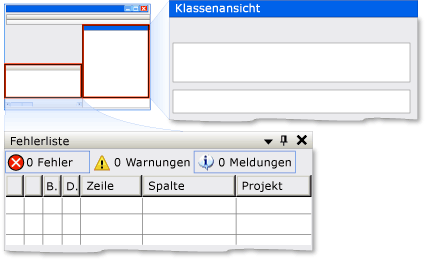

# Implementieren des Dock-Steuerelementmusters der Benutzeroberflächenautomatisierung

> [!NOTE]
> Diese Dokumentation ist für .NET Framework-Entwickler vorgesehen, die die verwalteten [!INCLUDE[TLA2#tla_uiautomation](../../../includes/tla2sharptla-uiautomation-md.md)]-Klassen verwenden möchten, die im <xref:System.Windows.Automation>-Namespace definiert sind. Aktuelle Informationen zur [!INCLUDE[TLA2#tla_uiautomation](../../../includes/tla2sharptla-uiautomation-md.md)]finden Sie auf der Seite zur [Windows-Automatisierungs-API: UI-Automatisierung](/windows/win32/winauto/entry-uiauto-win32).  
  
 Dieses Thema enthält Richtlinien und Konventionen für das Implementieren von <xref:System.Windows.Automation.Provider.IDockProvider>, einschließlich Informationen über Eigenschaften. Links zu zusätzlichen Referenzen sind am Ende dieses Themas aufgelistet.  
  
 Das <xref:System.Windows.Automation.DockPattern> -Steuerelementmuster wird verwendet, um Andockeigenschaften eines Steuerelements in einem Dockingcontainer verfügbar zu machen. Ein Dockingcontainer ist ein Steuerelement, mit dem untergeordnete Elemente horizontal oder vertikal zueinander ausgerichtet werden können. Beispiele für Steuerelemente, die dieses Steuerelementmuster implementieren, finden Sie unter [Control Pattern Mapping for UI Automation Clients](control-pattern-mapping-for-ui-automation-clients.md).  
  
   
Andockbeispiel aus Visual Studio, in dem das Fenster „Klassenansicht“ die DockPosition.Right und das Fenster „Fehlerliste“ die DockPosition.Bottom hat  
  

## Implementierungsrichtlinien und -konventionen  

 Beachten Sie beim Implementieren des Dock-Steuerelementmusters die folgenden Richtlinien und Konventionen:  
  
- <xref:System.Windows.Automation.Provider.IDockProvider> macht keine Eigenschaften des Dockingcontainers bzw. der Steuerelemente verfügbar, die neben dem aktuellen Steuerelement im Dockingcontainer angedockt sind.  
  
- Steuerelemente werden relativ zueinander entsprechend ihrer aktuellen z-Reihenfolge angeordnet. Je höher ihre z-Reihenfolgenposition ist, desto weiter entfernt vom angegebenen Rand des Dockingcontainers werden sie platziert.  
  
- Wenn die Größe des Dockingcontainers geändert wird, werden alle angedockten Steuerelemente im Container bündig zu derselben Kante neu positioniert, an der sie ursprünglich angedockt waren. Die Größe der angedockten Steuerelemente wird ebenfalls geändert, um den Platz innerhalb des Containers entsprechend dem Andockverhalten ihrer <xref:System.Windows.Automation.DockPosition>auszufüllen. Wenn beispielsweise <xref:System.Windows.Automation.DockPosition.Top> angegeben ist, werden die linke und die rechte Seite des Steuerelements erweitert, um den verfügbaren Platz auszufüllen. Wenn <xref:System.Windows.Automation.DockPosition.Fill> angegeben ist, werden alle vier Seiten des Steuerelements erweitert, um den verfügbaren Platz auszufüllen.  
  
- Auf einem System mit mehreren Bildschirmen sollten Steuerelemente auf der linken oder rechten Seite des aktuellen Bildschirms andocken. Ist dies nicht möglich, sollten sie auf der linken Seite des am weitesten links stehenden Bildschirms bzw. auf der rechten Seite des am weitesten rechts stehenden Bildschirms angedockt werden.  
  

## Erforderliche Member für IDockProvider  

 Zum Implementieren der IDockProvider-Schnittstelle werden die folgenden Eigenschaften und Methoden benötigt.  
  
|Erforderliche Member|Memberart|Hinweise|  
|----------------------|-----------------|-----------|  
|<xref:System.Windows.Automation.Provider.IDockProvider.DockPosition%2A>|Eigenschaft|Keine|  
|<xref:System.Windows.Automation.Provider.IDockProvider.SetDockPosition%2A>|Methode|Keine|  
  
 Diesem Steuerelementmuster sind keine Ereignisse zugeordnet.  
  

## Ausnahmen  

 Anbieter müssen die folgenden Ausnahmen auslösen.  
  
|Ausnahmetyp|Bedingung|  
|--------------------|---------------|  
|<xref:System.InvalidOperationException>|<xref:System.Windows.Automation.Provider.IDockProvider.SetDockPosition%2A>   : Wenn ein Steuerelement nicht in der Lage ist, den angeforderten Andock Stil auszuführen.|  
  
## Weitere Informationen

- [Übersicht über Steuerelementmuster für Benutzeroberflächenautomatisierung](ui-automation-control-patterns-overview.md)
- [Unterstützung von Steuerelementmustern in einem Benutzeroberflächenautomatisierungs-Anbieter](support-control-patterns-in-a-ui-automation-provider.md)
- [Steuerelementmuster für Benutzeroberflächenautomatisierung für Clients](ui-automation-control-patterns-for-clients.md)
- [Übersicht über die Benutzeroberflächenautomatisierungs-Struktur](ui-automation-tree-overview.md)
- [Verwenden der Zwischenspeicherung in der Benutzeroberflächenautomatisierung](use-caching-in-ui-automation.md)
