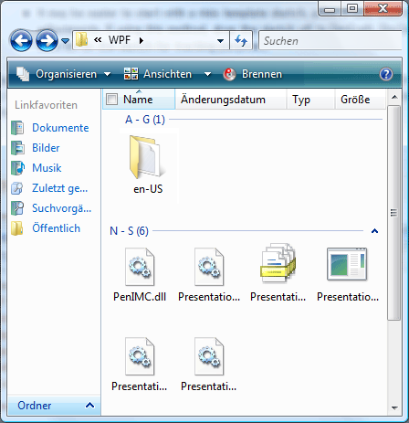

# Implementieren des Grid-Steuerelementmusters der Benutzeroberflächenautomatisierung

> [!NOTE]
> Diese Dokumentation ist für .NET Framework-Entwickler vorgesehen, die die verwalteten [!INCLUDE[TLA2#tla_uiautomation](../../../includes/tla2sharptla-uiautomation-md.md)]-Klassen verwenden möchten, die im <xref:System.Windows.Automation>-Namespace definiert sind. Aktuelle Informationen zur [!INCLUDE[TLA2#tla_uiautomation](../../../includes/tla2sharptla-uiautomation-md.md)]finden Sie auf der Seite zur [Windows-Automatisierungs-API: UI-Automatisierung](/windows/win32/winauto/entry-uiauto-win32).  
  
 Dieses Thema enthält Richtlinien und Konventionen für das Implementieren von <xref:System.Windows.Automation.Provider.IGridProvider>, einschließlich Informationen über Eigenschaften, Methoden und Ereignissen. Links zu zusätzlichen Referenzen sind am Ende dieser Übersicht aufgelistet.  
  
 Das <xref:System.Windows.Automation.GridPattern> -Steuerelementmuster wird zur Unterstützung von Steuerelementen verwendet, die als Container für eine Auflistung von untergeordneten Elementen dienen. Die untergeordneten Elemente dieses Elements müssen <xref:System.Windows.Automation.Provider.IGridItemProvider> implementieren und in einem zweidimensionalen logischen Koordinatensystem angeordnet sein, das zeilen- und spaltenweise durchlaufen werden kann. Beispiele für Steuerelemente, die dieses Steuerelementmuster implementieren, finden Sie unter [Control Pattern Mapping for UI Automation Clients](control-pattern-mapping-for-ui-automation-clients.md).  
  

## Implementierungsrichtlinien und -konventionen  

 Beachten Sie beim Implementieren des Grid-Steuerelementmusters die folgenden Richtlinien und Konventionen:  
  
- Grid-Koordinaten sind nullbasiert, wobei die obere linke Zelle (oder die obere rechte Zelle, je nach Gebietsschema) die Koordinaten (0,0) aufweist.  
  
- Auch wenn eine Zelle leer ist, muss ein Benutzeroberflächenautomatisierungs-Element zurückgegeben werden, um die <xref:System.Windows.Automation.Provider.IGridItemProvider.ContainingGrid%2A> -Eigenschaft dieser Zelle zu unterstützen. Dies ist möglich, wenn das Layout von untergeordneten Elementen im Raster dem eines unregelmäßigen Arrays entspricht (siehe folgendes Beispiel).  
  
   
Beispiel für ein Grid-Steuerelement mit leeren Koordinaten  
  
- Ein Raster mit einem einzelnen Element muss weiterhin <xref:System.Windows.Automation.Provider.IGridProvider> implementieren, wenn es logisch als Raster gilt. Die Anzahl untergeordneter Elemente im Raster ist unwesentlich.  
  
- Ausgeblendete Zeilen und Spalten können je nach der Anbieterimplementierung in der [!INCLUDE[TLA2#tla_uiautomation](../../../includes/tla2sharptla-uiautomation-md.md)] -Struktur geladen werden. Daher werden sie in den Eigenschaften <xref:System.Windows.Automation.GridPattern.GridPatternInformation.RowCount%2A> und <xref:System.Windows.Automation.GridPattern.GridPatternInformation.ColumnCount%2A> angegeben. Wenn die ausgeblendeten Zeilen und Spalten noch nicht geladen wurden, sollten sie nicht gezählt werden.  
  
- <xref:System.Windows.Automation.Provider.IGridProvider> ermöglicht keine aktive Bearbeitung eines Rasters. <xref:System.Windows.Automation.Provider.ITransformProvider> muss implementiert werden, um diese Funktionalität zu aktivieren.  
  
- Verwenden Sie einen <xref:System.Windows.Automation.StructureChangedEventHandler> , um Änderungen an der Struktur oder am Layout des Raster zu erfassen, z. B. Zellen, die hinzugefügt, entfernt oder zusammengeführt wurden.  
  
- Verwenden Sie einen <xref:System.Windows.Automation.AutomationFocusChangedEventHandler> , um den Durchlauf durch die Elemente oder Zellen eines Rasters zu verfolgen.  
  

## Erforderliche Member für IGridProvider  

 Zum Implementieren der IGridProvider-Schnittstelle werden die folgenden Eigenschaften und Methoden benötigt.  
  
|Erforderliche Member|type|Notizen|  
|----------------------|----------|-----------|  
|<xref:System.Windows.Automation.Provider.IGridProvider.RowCount%2A>|Eigenschaft|Keine|  
|<xref:System.Windows.Automation.Provider.IGridProvider.ColumnCount%2A>|Eigenschaft|Keine|  
|<xref:System.Windows.Automation.Provider.IGridProvider.GetItem%2A>|Methode|Keine|  
  
 Diesem Steuerelementmuster sind keine Ereignisse zugeordnet.  
  

## Ausnahmen  

 Anbieter müssen die folgenden Ausnahmen auslösen.  
  
|Ausnahmetyp|Bedingung|  
|--------------------|---------------|  
|<xref:System.ArgumentOutOfRangeException>|<xref:System.Windows.Automation.Provider.IGridProvider.GetItem%2A>   -, Wenn die angeforderte Zeilen Koordinate größer als ist <xref:System.Windows.Automation.Provider.IGridProvider.RowCount%2A> oder die Spalten Koordinate größer als ist <xref:System.Windows.Automation.Provider.IGridProvider.ColumnCount%2A> .|  
|<xref:System.ArgumentOutOfRangeException>|<xref:System.Windows.Automation.Provider.IGridProvider.GetItem%2A>   -, Wenn eine der angeforderten Zeilen-oder Spalten Koordinaten kleiner als 0 (null) ist.|  
  
## Weitere Informationen

- [Übersicht über Steuerelementmuster für Benutzeroberflächenautomatisierung](ui-automation-control-patterns-overview.md)
- [Unterstützung von Steuerelementmustern in einem Benutzeroberflächenautomatisierungs-Anbieter](support-control-patterns-in-a-ui-automation-provider.md)
- [Steuerelementmuster für Benutzeroberflächenautomatisierung für Clients](ui-automation-control-patterns-for-clients.md)
- [Implementieren des GridItem-Steuerelementmusters der Benutzeroberflächenautomatisierung](implementing-the-ui-automation-griditem-control-pattern.md)
- [Übersicht über die Benutzeroberflächenautomatisierungs-Struktur](ui-automation-tree-overview.md)
- [Verwenden der Zwischenspeicherung in der Benutzeroberflächenautomatisierung](use-caching-in-ui-automation.md)
