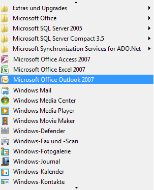

# Implementieren des Scroll-Steuerelementmusters der BenutzeroberflächenautomatisierungImplementing the UI Automation Scroll Control Pattern

> [!NOTE]
> Diese Dokumentation ist für .NET Framework-Entwickler vorgesehen, die die verwalteten [!INCLUDE[TLA2#tla_uiautomation](../../../includes/tla2sharptla-uiautomation-md.md)]-Klassen verwenden möchten, die im <xref:System.Windows.Automation>-Namespace definiert sind.This documentation is intended for .NET Framework developers who want to use the managed [!INCLUDE[TLA2#tla_uiautomation](../../../includes/tla2sharptla-uiautomation-md.md)] classes defined in the <xref:System.Windows.Automation> namespace. Aktuelle Informationen zur [!INCLUDE[TLA2#tla_uiautomation](../../../includes/tla2sharptla-uiautomation-md.md)]finden Sie auf der Seite zur [Windows-Automatisierungs-API: UI-Automatisierung](/windows/win32/winauto/entry-uiauto-win32).For the latest information about [!INCLUDE[TLA2#tla_uiautomation](../../../includes/tla2sharptla-uiautomation-md.md)], see [Windows Automation API: UI Automation](/windows/win32/winauto/entry-uiauto-win32).  
  
 Dieses Thema enthält Richtlinien und Konventionen für das Implementieren von <xref:System.Windows.Automation.Provider.IScrollProvider>, einschließlich Informationen über Ereignisse und Eigenschaften.This topic introduces guidelines and conventions for implementing <xref:System.Windows.Automation.Provider.IScrollProvider>, including information about events and properties. Links zu zusätzlichen Referenzen sind am Ende dieses Themas aufgelistet.Links to additional references are listed at the end of the topic.  
  
 Das <xref:System.Windows.Automation.ScrollPattern> -Steuerelementmuster dient zur Unterstützung eines Steuerelements, das als bildlauffähiger Container für eine Auflistung von untergeordneten Objekten fungiert.The <xref:System.Windows.Automation.ScrollPattern> control pattern is used to support a control that acts as a scrollable container for a collection of child objects. Es ist nicht erforderlich, dass das Steuerelement Bildlaufleisten verwendet, um die Bildlauffunktionen zu unterstützen, obwohl dies häufig der Fall ist.The control is not required to use scrollbars to support the scrolling functionality, although it commonly does.  
  
   
Beispiel für ein Bildlaufsteuerelement, das keine Bildlaufleisten verwendetExample of a Scrolling Control that Does Not Use Scrollbars  
  
 Beispiele für Steuerelemente, die dieses Steuerelement implementieren, finden Sie unter [Control Pattern Mapping for UI Automation Clients](control-pattern-mapping-for-ui-automation-clients.md).For examples of controls that implement this control, see [Control Pattern Mapping for UI Automation Clients](control-pattern-mapping-for-ui-automation-clients.md).  
  

## Implementierungsrichtlinien und -konventionenImplementation Guidelines and Conventions  

 Beachten Sie beim Implementieren des Scroll-Steuerelementmusters die folgenden Richtlinien und Konventionen:When implementing the Scroll control pattern, note the following guidelines and conventions:  
  
- Die untergeordneten Elemente dieses Steuerelements müssen <xref:System.Windows.Automation.Provider.IScrollItemProvider>implementieren.The children of this control must implement <xref:System.Windows.Automation.Provider.IScrollItemProvider>.  
  
- Die Bildlaufleisten eines Containersteuerelements bieten keine Unterstützung für das <xref:System.Windows.Automation.ScrollPattern> -Steuerelementmuster.The scrollbars of a container control do not support the <xref:System.Windows.Automation.ScrollPattern> control pattern. Sie müssen stattdessen die <xref:System.Windows.Automation.RangeValuePattern> -Steuerelementmuster unterstützen.They must support the <xref:System.Windows.Automation.RangeValuePattern> control pattern instead.  
  
- Wenn das Scrollen in Prozentwerten gemessen wird, müssen alle Werte oder Beträge, die sich auf die Einteilung der Bildlaufleiste beziehen, auf einen Bereich von 0 bis 100 normalisiert werden.When scrolling is measured in percentages, all values or amounts related to scroll graduation must be normalized to a range of 0 to 100.  
  
- <xref:System.Windows.Automation.ScrollPatternIdentifiers.HorizontallyScrollableProperty> und <xref:System.Windows.Automation.ScrollPatternIdentifiers.VerticallyScrollableProperty> sind unabhängig von der <xref:System.Windows.Automation.AutomationElement.IsEnabledProperty>.<xref:System.Windows.Automation.ScrollPatternIdentifiers.HorizontallyScrollableProperty> and <xref:System.Windows.Automation.ScrollPatternIdentifiers.VerticallyScrollableProperty> are independent of the <xref:System.Windows.Automation.AutomationElement.IsEnabledProperty>.  
  
- Wenn <xref:System.Windows.Automation.ScrollPatternIdentifiers.HorizontallyScrollableProperty> = `false` ist, dann muss <xref:System.Windows.Automation.ScrollPatternIdentifiers.HorizontalViewSizeProperty> auf 100 % und <xref:System.Windows.Automation.ScrollPatternIdentifiers.HorizontalScrollPercentProperty> auf <xref:System.Windows.Automation.ScrollPatternIdentifiers.NoScroll>.If <xref:System.Windows.Automation.ScrollPatternIdentifiers.HorizontallyScrollableProperty> = `false` then <xref:System.Windows.Automation.ScrollPatternIdentifiers.HorizontalViewSizeProperty> should be set to 100% and <xref:System.Windows.Automation.ScrollPatternIdentifiers.HorizontalScrollPercentProperty> should be set to <xref:System.Windows.Automation.ScrollPatternIdentifiers.NoScroll>. Wenn <xref:System.Windows.Automation.ScrollPatternIdentifiers.VerticallyScrollableProperty> = `false` ist, dann muss <xref:System.Windows.Automation.ScrollPatternIdentifiers.VerticalViewSizeProperty> ebenso auf 100 % und <xref:System.Windows.Automation.ScrollPatternIdentifiers.VerticalScrollPercentProperty> auf <xref:System.Windows.Automation.ScrollPatternIdentifiers.NoScroll>.Likewise, if <xref:System.Windows.Automation.ScrollPatternIdentifiers.VerticallyScrollableProperty> = `false` then <xref:System.Windows.Automation.ScrollPatternIdentifiers.VerticalViewSizeProperty> should be set to 100 percent and <xref:System.Windows.Automation.ScrollPatternIdentifiers.VerticalScrollPercentProperty> should be set to <xref:System.Windows.Automation.ScrollPatternIdentifiers.NoScroll>. Dadurch kann ein Benutzeroberflächenautomatisierungs-Client diese Eigenschaftswerte innerhalb der <xref:System.Windows.Automation.ScrollPattern.SetScrollPercent%2A> -Methode verwenden, während zugleich eine [Racebedingung](https://support.microsoft.com/default.aspx?scid=kb;en-us;317723) vermieden wird, wenn eine Richtung aktiviert wird, die für den Client für einen Bildlauf nicht von Interesse ist.This allows a UI Automation client to use these property values within the <xref:System.Windows.Automation.ScrollPattern.SetScrollPercent%2A> method while avoiding a [race condition](https://support.microsoft.com/default.aspx?scid=kb;en-us;317723) if a direction the client is not interested in scrolling becomes activated.  
  
- <xref:System.Windows.Automation.Provider.IScrollProvider.HorizontalScrollPercent%2A> ist gebietsschemaspezifisch.<xref:System.Windows.Automation.Provider.IScrollProvider.HorizontalScrollPercent%2A> is locale-specific. Bei der Einstellung „HorizontalScrollPercent = 100,0“ muss die Bildlaufposition des Steuerelements auf das Äquivalent seiner äußersten rechten Position für Sprachen wie Englisch festgelegt werden, die von links nach rechts gelesen werden.Setting HorizontalScrollPercent = 100.0 must set the scrolling location of the control to the equivalent of its rightmost position for languages such as English that read left to right. Für Sprachen wie Arabisch, die von rechts nach links gelesen werden, muss die Bildlaufposition bei der Einstellung „HorizontalScrollPercent = 100,0“ auf der äußerste linke Position festgelegt werden.Alternately, for languages such as Arabic that read right to left, setting HorizontalScrollPercent = 100.0 must set the scroll location to the leftmost position.  
  

## Erforderliche Member für IScrollProviderRequired Members for IScrollProvider  

 Die folgenden Eigenschaften und Methoden sind für das Implementieren von <xref:System.Windows.Automation.Provider.IScrollProvider>erforderlich.The following properties and methods are required for implementing <xref:System.Windows.Automation.Provider.IScrollProvider>.  
  
|Erforderlicher MemberRequired member|MemberartMember type|HinweiseNotes|  
|---------------------|-----------------|-----------|  
|<xref:System.Windows.Automation.Provider.IScrollProvider.HorizontalScrollPercent%2A>|EigenschaftProperty|KeineNone|  
|<xref:System.Windows.Automation.Provider.IScrollProvider.VerticalScrollPercent%2A>|EigenschaftProperty|KeineNone|  
|<xref:System.Windows.Automation.Provider.IScrollProvider.HorizontalViewSize%2A>|EigenschaftProperty|KeineNone|  
|<xref:System.Windows.Automation.Provider.IScrollProvider.VerticalViewSize%2A>|EigenschaftProperty|KeineNone|  
|<xref:System.Windows.Automation.Provider.IScrollProvider.HorizontallyScrollable%2A>|EigenschaftProperty|KeineNone|  
|<xref:System.Windows.Automation.Provider.IScrollProvider.VerticallyScrollable%2A>|EigenschaftProperty|KeineNone|  
|<xref:System.Windows.Automation.Provider.IScrollProvider.Scroll%2A>|MethodeMethod|KeineNone|  
|<xref:System.Windows.Automation.Provider.IScrollProvider.SetScrollPercent%2A>|MethodeMethod|KeineNone|  
  
 Diesem Steuerelementmuster sind keine Ereignisse zugeordnet.This control pattern has no associated events.  
  

## AusnahmenExceptions  

 Anbieter müssen die folgenden Ausnahmen auslösen.Providers must throw the following exceptions.  
  
|AusnahmetypException Type|BedingungCondition|  
|--------------------|---------------|  
|<xref:System.ArgumentException>|<xref:System.Windows.Automation.Provider.IScrollProvider.Scroll%2A> löst diese Ausnahme aus, wenn ein Steuerelement <xref:System.Windows.Automation.ScrollAmount.SmallIncrement> -Werte ausschließlich für horizontale oder vertikale Bildläufe unterstützt, aber ein <xref:System.Windows.Automation.ScrollAmount.LargeIncrement> -Wert übergeben wird.<xref:System.Windows.Automation.Provider.IScrollProvider.Scroll%2A> throws this exception if a control supports <xref:System.Windows.Automation.ScrollAmount.SmallIncrement> values exclusively for horizontal or vertical scrolling, but a <xref:System.Windows.Automation.ScrollAmount.LargeIncrement> value is passed in.|  
|<xref:System.ArgumentException>|<xref:System.Windows.Automation.Provider.IScrollProvider.SetScrollPercent%2A> löst diese Ausnahme aus, wenn ein Wert, der nicht in einen Double-Wert konvertiert werden kann, übergeben wird.<xref:System.Windows.Automation.Provider.IScrollProvider.SetScrollPercent%2A> throws this exception when a value that cannot be converted to a double is passed in.|  
|<xref:System.ArgumentOutOfRangeException>|<xref:System.Windows.Automation.Provider.IScrollProvider.SetScrollPercent%2A> löst diese Ausnahme aus, wenn ein Wert größer 100 oder kleiner 0 übergeben wird (außer bei -1, was <xref:System.Windows.Automation.ScrollPatternIdentifiers.NoScroll>entspricht).<xref:System.Windows.Automation.Provider.IScrollProvider.SetScrollPercent%2A> throws this exception when a value greater than 100 or less than 0 is passed in (except -1 which is equivalent to <xref:System.Windows.Automation.ScrollPatternIdentifiers.NoScroll>).|  
|<xref:System.InvalidOperationException>|Sowohl <xref:System.Windows.Automation.Provider.IScrollProvider.Scroll%2A> als auch <xref:System.Windows.Automation.Provider.IScrollProvider.SetScrollPercent%2A> lösen diese Ausnahme aus, wenn versucht wird, in eine nicht unterstützte Richtung zu scrollen.Both <xref:System.Windows.Automation.Provider.IScrollProvider.Scroll%2A> and <xref:System.Windows.Automation.Provider.IScrollProvider.SetScrollPercent%2A> throw this exception when an attempt is made to scroll in an unsupported direction.|  
  
## Weitere InformationenSee also

- [Übersicht über Steuerelementmuster für BenutzeroberflächenautomatisierungUI Automation Control Patterns Overview](ui-automation-control-patterns-overview.md)
- [Unterstützung von Steuerelementmustern in einem Benutzeroberflächenautomatisierungs-AnbieterSupport Control Patterns in a UI Automation Provider](support-control-patterns-in-a-ui-automation-provider.md)
- [Steuerelementmuster für Benutzeroberflächenautomatisierung für ClientsUI Automation Control Patterns for Clients](ui-automation-control-patterns-for-clients.md)
- [Übersicht über die Benutzeroberflächenautomatisierungs-StrukturUI Automation Tree Overview](ui-automation-tree-overview.md)
- [Verwenden der Zwischenspeicherung in der BenutzeroberflächenautomatisierungUse Caching in UI Automation](use-caching-in-ui-automation.md)
