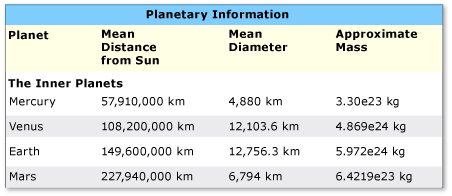
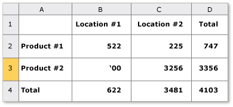

# Implementieren des Table-Steuerelementmusters der BenutzeroberflächenautomatisierungImplementing the UI Automation Table Control Pattern
> [!NOTE]
> Diese Dokumentation ist für .NET Framework-Entwickler vorgesehen, die die verwalteten [!INCLUDE[TLA2#tla_uiautomation](../../../includes/tla2sharptla-uiautomation-md.md)]-Klassen verwenden möchten, die im <xref:System.Windows.Automation>-Namespace definiert sind.This documentation is intended for .NET Framework developers who want to use the managed [!INCLUDE[TLA2#tla_uiautomation](../../../includes/tla2sharptla-uiautomation-md.md)] classes defined in the <xref:System.Windows.Automation> namespace. Aktuelle Informationen zur [!INCLUDE[TLA2#tla_uiautomation](../../../includes/tla2sharptla-uiautomation-md.md)]finden Sie auf der Seite zur [Windows-Automatisierungs-API: UI-Automatisierung](/windows/win32/winauto/entry-uiauto-win32).For the latest information about [!INCLUDE[TLA2#tla_uiautomation](../../../includes/tla2sharptla-uiautomation-md.md)], see [Windows Automation API: UI Automation](/windows/win32/winauto/entry-uiauto-win32).  
  
 Dieses Thema enthält Richtlinien und Konventionen für das Implementieren von <xref:System.Windows.Automation.Provider.ITableProvider>, einschließlich Informationen über Eigenschaften, Methoden und Ereignissen.This topic introduces guidelines and conventions for implementing <xref:System.Windows.Automation.Provider.ITableProvider>, including information about properties, methods, and events. Links zu zusätzlichen Referenzen sind am Ende dieser Übersicht aufgelistet.Links to additional references are listed at the end of the overview.  
  
 Das <xref:System.Windows.Automation.TablePattern> -Steuerelementmuster wird zur Unterstützung von Steuerelementen verwendet, die als Container für eine Auflistung von untergeordneten Elementen dienen.The <xref:System.Windows.Automation.TablePattern> control pattern is used to support controls that act as containers for a collection of child elements. Die untergeordneten Elemente dieses Elements müssen <xref:System.Windows.Automation.Provider.ITableItemProvider> implementieren und in einem zweidimensionalen logischen Koordinatensystem angeordnet sein, das zeilen- und spaltenweise durchlaufen werden kann.The children of this element must implement <xref:System.Windows.Automation.Provider.ITableItemProvider> and be organized in a two-dimensional logical coordinate system that can be traversed by row and column. Dieses Steuerelementmuster entspricht dem <xref:System.Windows.Automation.Provider.IGridProvider>, mit dem Unterschied, dass jedes <xref:System.Windows.Automation.Provider.ITableProvider> implementierende Steuerelement für jedes untergeordnete Element auch eine Beziehung zwischen Spalten- und/oder Zeilenüberschriften verfügbar machen muss.This control pattern is analogous to <xref:System.Windows.Automation.Provider.IGridProvider>, with the distinction that any control implementing <xref:System.Windows.Automation.Provider.ITableProvider> must also expose a column and/or row header relationship for each child element. Beispiele für Steuerelemente, die dieses Steuerelementmuster implementieren, finden Sie unter [Control Pattern Mapping for UI Automation Clients](control-pattern-mapping-for-ui-automation-clients.md).For examples of controls that implement this control pattern, see [Control Pattern Mapping for UI Automation Clients](control-pattern-mapping-for-ui-automation-clients.md).  
  

## Implementierungsrichtlinien und -konventionenImplementation Guidelines and Conventions  
 Beachten Sie beim Implementieren des Table-Steuerelementmusters die folgenden Richtlinien und Konventionen:When implementing the Table control pattern, note the following guidelines and conventions:  
  
- Der Zugriff auf den Inhalt der einzelnen Zellen erfolgt über ein zweidimensionales logisches Koordinatensystem oder über ein Array, das von der erforderlichen gleichzeitigen Implementierung von <xref:System.Windows.Automation.Provider.IGridProvider> bereitgestellt wird.Access to the content of individual cells is through a two-dimensional logical coordinate system or array provided by the required concurrent implementation of <xref:System.Windows.Automation.Provider.IGridProvider>.  
  
- Eine Spalten- oder Zeilenüberschrift kann in einem Tabellenobjekt enthalten sein oder ein separates Headerobjekt darstellen, das einem Tabellenobjekt zugeordnet ist.A column or row header can be contained within a table object or be a separate header object that is associated with a table object.  
  
- Spalten- und Zeilenüberschriften können sowohl eine primäre als auch beliebige unterstützende Überschriften enthalten.Column and row headers may include both a primary header as well as any supporting headers.  
  
> [!NOTE]
> Dieses Konzept wird in einer Microsoft Excel-Tabelle deutlich, in der ein Benutzer eine Spalte "Vorname" definiert hat.This concept becomes evident in a Microsoft Excel spreadsheet where a user has defined a "First name" column. Diese Spalte verfügt jetzt über zwei Überschriften. Die vom Benutzer definierte Überschrift „Vorname“ und die alphanumerische Bezeichnung der Spalte, die von der Anwendung zugewiesen wird.This column now has two headers—the "First name" header defined by the user and the alphanumeric designation for that column assigned by the application.  
  
- Weitere Informationen zur Rasterfunktionalität finden Sie unter [Implementieren des UI Automation Grid Control Pattern.](implementing-the-ui-automation-grid-control-pattern.md)See [Implementing the UI Automation Grid Control Pattern](implementing-the-ui-automation-grid-control-pattern.md) for related grid functionality.  
  
   
Beispiel für eine Tabelle mit komplexen SpaltenüberschriftenExample of a Table with Complex Column Headers  
  
   
Beispiel für eine Tabelle mit mehrdeutiger RowOrColumnMajor-EigenschaftExample of a Table with Ambiguous RowOrColumnMajor Property  
  

## Erforderliche Member für ITableProviderRequired Members for ITableProvider  
 Für die ITableProvider-Schnittstelle werden die folgenden Eigenschaften und Methoden benötigt.The following properties and methods are required for the ITableProvider interface.  
  
|Erforderliche MemberRequired members|MemberartMember type|NotizenNotes|  
|----------------------|-----------------|-----------|  
|<xref:System.Windows.Automation.Provider.ITableProvider.RowOrColumnMajor%2A>|EigenschaftProperty|KeineNone|  
|<xref:System.Windows.Automation.Provider.ITableProvider.GetColumnHeaders%2A>|MethodeMethod|KeineNone|  
|<xref:System.Windows.Automation.Provider.ITableProvider.GetRowHeaders%2A>|MethodeMethod|KeineNone|  
  
 Diesem Steuerelementmuster sind keine Ereignisse zugeordnet.This control pattern has no associated events.  
  

## AusnahmenExceptions  
 Diesem Steuerelementmuster sind keine Ausnahmen zugeordnet.This control pattern has no associated exceptions.  
  
## Weitere InformationenSee also

- [Übersicht über Steuerelementmuster für BenutzeroberflächenautomatisierungUI Automation Control Patterns Overview](ui-automation-control-patterns-overview.md)
- [Unterstützung von Steuerelementmustern in einem Benutzeroberflächenautomatisierungs-AnbieterSupport Control Patterns in a UI Automation Provider](support-control-patterns-in-a-ui-automation-provider.md)
- [Steuerelementmuster für Benutzeroberflächenautomatisierung für ClientsUI Automation Control Patterns for Clients](ui-automation-control-patterns-for-clients.md)
- [Implementieren des TableItem-Steuerelementmusters der BenutzeroberflächenautomatisierungImplementing the UI Automation TableItem Control Pattern](implementing-the-ui-automation-tableitem-control-pattern.md)
- [Implementieren des Grid-Steuerelementmusters der BenutzeroberflächenautomatisierungImplementing the UI Automation Grid Control Pattern](implementing-the-ui-automation-grid-control-pattern.md)
- [UI Automation Tree OverviewUI Automation Tree Overview](ui-automation-tree-overview.md)
- [Verwenden der Zwischenspeicherung in der BenutzeroberflächenautomatisierungUse Caching in UI Automation](use-caching-in-ui-automation.md)
