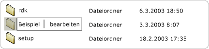

# Implementieren des Value-Steuerelementmusters der Benutzeroberflächenautomatisierung
> [!NOTE]
> Diese Dokumentation ist für .NET Framework-Entwickler vorgesehen, die die verwalteten [!INCLUDE[TLA2#tla_uiautomation](../../../includes/tla2sharptla-uiautomation-md.md)]-Klassen verwenden möchten, die im <xref:System.Windows.Automation>-Namespace definiert sind. Aktuelle Informationen zur [!INCLUDE[TLA2#tla_uiautomation](../../../includes/tla2sharptla-uiautomation-md.md)]finden Sie auf der Seite zur [Windows-Automatisierungs-API: UI-Automatisierung](/windows/win32/winauto/entry-uiauto-win32).  
  
 Dieses Thema enthält Richtlinien und Konventionen für das Implementieren von <xref:System.Windows.Automation.Provider.IValueProvider>, einschließlich Informationen zu Ereignissen und Eigenschaften. Links zu zusätzlichen Referenzen sind am Ende dieses Themas aufgelistet.  
  
 Das <xref:System.Windows.Automation.ValuePattern> -Steuerelementmuster wird verwendet, um Steuerelemente zu unterstützen, die einen systeminternen Wert haben, der keinen Bereich umfasst und als Zeichenfolge dargestellt werden kann. Diese Zeichenfolge kann je nach Steuerelement und dessen Einstellungen bearbeitet werden. Beispiele für Steuerelemente, die dieses Muster implementieren, finden Sie unter [Control Pattern Mapping for UI Automation Clients](control-pattern-mapping-for-ui-automation-clients.md).  
  

## Implementierungsrichtlinien und -konventionen  
 Beachten Sie beim Implementieren des Value-Steuerelementmusters die folgenden Richtlinien und Konventionen:  
  
- Steuerelemente wie <xref:System.Windows.Automation.ControlType.ListItem> und <xref:System.Windows.Automation.ControlType.TreeItem> müssen, unabhängig vom aktuellen Bearbeitungsmodus des Steuerelements, <xref:System.Windows.Automation.ValuePattern> unterstützen, wenn der Wert irgendeines der Elemente bearbeitet werden kann. Das übergeordnete Steuerelement muss außerdem <xref:System.Windows.Automation.ValuePattern> unterstützen, wenn die untergeordneten Elemente bearbeitbar sind.  
  
   
Beispiel eines bearbeitbaren Listenelements  
  
- Einzeilige Bearbeitungssteuerelemente unterstützen programmgesteuerten Zugriff auf ihren Inhalt, indem <xref:System.Windows.Automation.Provider.IValueProvider>für sie implementiert wird. Für mehrzeilige Bearbeitungssteuerelemente wird <xref:System.Windows.Automation.Provider.IValueProvider>jedoch nicht implementiert. Stattdessen wird Zugriff auf ihre Inhalte geboten, indem <xref:System.Windows.Automation.Provider.ITextProvider>für sie implementiert wird.  
  
- Um den Textinhalt eines mehrzeiligen Bearbeitungssteuerelements abzurufen, muss <xref:System.Windows.Automation.Provider.ITextProvider>für das Steuerelement implementiert sein. <xref:System.Windows.Automation.Provider.ITextProvider> bietet aber nicht die Möglichkeit, den Wert eines Steuerelements festzulegen.  
  
- Mit<xref:System.Windows.Automation.Provider.IValueProvider> ist es nicht möglich, Formatierungsinformationen oder Teilzeichenfolgen abzurufen. Implementieren Sie <xref:System.Windows.Automation.Provider.ITextProvider> in diesen Fällen.  
  
- <xref:System.Windows.Automation.Provider.IValueProvider>muss durch Steuerelemente wie das **Farb** Auswahl-Auswahl Steuerelement von Microsoft Word (unten dargestellt) implementiert werden, das Zeichen folgen Zuordnung zwischen einem Farbwert (z. b. "gelb") und einer äquivalenten internen RGB-Struktur unterstützt.  
  
   
Beispiel für eine Zuordnung zwischen Farbmustern und Zeichenfolgen  
  
- Für ein Steuerelement sollte dessen <xref:System.Windows.Automation.AutomationElement.IsEnabledProperty> auf `true` und dessen <xref:System.Windows.Automation.ValuePattern.IsReadOnlyProperty> auf `false` festgelegt sein, bevor ein Aufruf von <xref:System.Windows.Automation.Provider.IValueProvider.SetValue%2A>zugelassen wird.  
  

## Erforderliche Member für IValueProvider  
 Die folgenden Eigenschaften und Methoden sind für das Implementieren von <xref:System.Windows.Automation.Provider.IValueProvider>erforderlich.  
  
|Erforderliche Member|Memberart|Hinweise|  
|----------------------|-----------------|-----------|  
|<xref:System.Windows.Automation.ValuePattern.IsReadOnlyProperty>|Eigenschaft|Keine|  
|<xref:System.Windows.Automation.ValuePattern.ValueProperty>|Eigenschaft|Keine|  
|<xref:System.Windows.Automation.ValuePattern.SetValue%2A>|Methode|Keine|  
  

## Ausnahmen  
 Anbieter müssen die folgenden Ausnahmen auslösen.  
  
|Ausnahmetyp|Bedingung|  
|--------------------|---------------|  
|<xref:System.InvalidOperationException>|<xref:System.Windows.Automation.ValuePattern.SetValue%2A>   : Wenn Gebiets Schema spezifische Informationen in einem falschen Format an ein Steuerelement übermittelt werden, z. b. ein falsch formatiertes Datum.|  
|<xref:System.ArgumentException>|<xref:System.Windows.Automation.ValuePattern.SetValue%2A>   : Wenn ein neuer Wert nicht von einer Zeichenfolge in ein Format konvertiert werden kann, das vom Steuerelement erkannt wird.|  
|<xref:System.Windows.Automation.ElementNotEnabledException>|<xref:System.Windows.Automation.ValuePattern.SetValue%2A>   : Beim Versuch, ein nicht aktiviertes Steuerelement zu bearbeiten.|  
  
## Weitere Informationen

- [Übersicht über Steuerelementmuster für Benutzeroberflächenautomatisierung](ui-automation-control-patterns-overview.md)
- [Unterstützung von Steuerelementmustern in einem Benutzeroberflächenautomatisierungs-Anbieter](support-control-patterns-in-a-ui-automation-provider.md)
- [Steuerelementmuster für Benutzeroberflächenautomatisierung für Clients](ui-automation-control-patterns-for-clients.md)
- [Beispiel für ValuePattern Insert Text](https://github.com/Microsoft/WPF-Samples/tree/master/Accessibility/InsertText)
- [Übersicht über die Benutzeroberflächenautomatisierungs-Struktur](ui-automation-tree-overview.md)
- [Verwenden der Zwischenspeicherung in der Benutzeroberflächenautomatisierung](use-caching-in-ui-automation.md)
