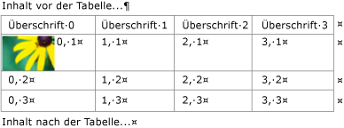
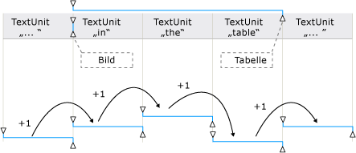
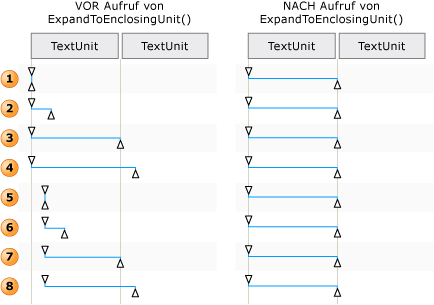

# Übersicht über TextPattern und eingebettete ObjekteTextPattern and Embedded Objects Overview
> [!NOTE]
> Diese Dokumentation ist für .NET Framework-Entwickler vorgesehen, die die verwalteten [!INCLUDE[TLA2#tla_uiautomation](../../../includes/tla2sharptla-uiautomation-md.md)]-Klassen verwenden möchten, die im <xref:System.Windows.Automation>-Namespace definiert sind.This documentation is intended for .NET Framework developers who want to use the managed [!INCLUDE[TLA2#tla_uiautomation](../../../includes/tla2sharptla-uiautomation-md.md)] classes defined in the <xref:System.Windows.Automation> namespace. Aktuelle Informationen zur [!INCLUDE[TLA2#tla_uiautomation](../../../includes/tla2sharptla-uiautomation-md.md)]finden Sie auf der Seite zur [Windows-Automatisierungs-API: UI-Automatisierung](/windows/win32/winauto/entry-uiauto-win32).For the latest information about [!INCLUDE[TLA2#tla_uiautomation](../../../includes/tla2sharptla-uiautomation-md.md)], see [Windows Automation API: UI Automation](/windows/win32/winauto/entry-uiauto-win32).  
  
 In dieser Übersicht wird beschrieben, wie von der [!INCLUDE[TLA#tla_uiautomation](../../../includes/tlasharptla-uiautomation-md.md)] eingebettete Objekte oder untergeordnete Elemente innerhalb eines Textdokuments oder Containers verfügbar gemacht werden.This overview describes how [!INCLUDE[TLA#tla_uiautomation](../../../includes/tlasharptla-uiautomation-md.md)] exposes embedded objects, or child elements, within a text document or container.  
  
 In [!INCLUDE[TLA2#tla_uiautomation](../../../includes/tla2sharptla-uiautomation-md.md)] ein eingebettetes Objekt ein beliebiges Element mit nicht-Text Begrenzungen. beispielsweise ein Bild, ein Hyperlink, eine Tabelle oder ein Dokumenttyp, z. b. ein Microsoft Excel-Arbeitsblatt oder eine Microsoft Windows-Mediendatei.In [!INCLUDE[TLA2#tla_uiautomation](../../../includes/tla2sharptla-uiautomation-md.md)] an embedded object is any element that has non-textual boundaries; for example, an image, hyperlink, table, or document type such as an Microsoft Excel spreadsheet or Microsoft Windows Media file. Dies weicht von der Standarddefinition ab, in der Elemente in einer Anwendung erstellt und einer anderen eingebettet bzw. mit einer anderen verknüpft sind.This differs from the standard definition, where an element is created in one application and embedded, or linked, within another. Ob das Objekt innerhalb der ursprünglichen Anwendung bearbeitet werden kann, ist im Kontext der [!INCLUDE[TLA2#tla_uiautomation](../../../includes/tla2sharptla-uiautomation-md.md)]nicht relevant.Whether the object can be edited within its original application is irrelevant in the context of [!INCLUDE[TLA2#tla_uiautomation](../../../includes/tla2sharptla-uiautomation-md.md)].  
  
   
## Eingebettete Objekte und die Benutzeroberflächenautomatisierungs-StrukturEmbedded Objects and the UI Automation Tree  
 Eingebettete Objekte werden als einzelne Elemente innerhalb der Steuerelementansicht der [!INCLUDE[TLA2#tla_uiautomation](../../../includes/tla2sharptla-uiautomation-md.md)] -Struktur behandelt.Embedded objects are treated as individual elements within the control view of the [!INCLUDE[TLA2#tla_uiautomation](../../../includes/tla2sharptla-uiautomation-md.md)] tree. Sie werden als untergeordnete Elemente des Textcontainers verfügbar gemacht, sodass über dasselbe Model wie bei anderen Steuerelementen in der [!INCLUDE[TLA2#tla_uiautomation](../../../includes/tla2sharptla-uiautomation-md.md)]auf diese zugegriffen werden kann.They are exposed as children of the text container so that they can be accessed through the same model as other controls in [!INCLUDE[TLA2#tla_uiautomation](../../../includes/tla2sharptla-uiautomation-md.md)].  
  
   
Beispiel für einen Textcontainer mit Tabelle, Bild und eingebetteten LinkobjektenExample of a Text Container with Table, Image, and Hyperlink Embedded Objects  
  
   
Beispiel der Inhaltsansicht für einen Teil des vorherigen TextcontainersExample of the Content View for a Portion of the Preceding Text Container  
  
   
## Verfügbarmachen von eingebetteten Objekten mithilfe von TextPattern und TextPatternRangeExpose Embedded Objects Using TextPattern and TextPatternRange  
 Die <xref:System.Windows.Automation.TextPattern> -Steuerelementmuster-Klasse wird in Verbindung mit der <xref:System.Windows.Automation.Text.TextPatternRange> -Klasse verwendet, um Methoden und Eigenschaften verfügbar zu machen, die das Navigieren und Abfragen von eingebetteten Objekten erleichtern.Used in conjunction, the <xref:System.Windows.Automation.TextPattern> control pattern class and the <xref:System.Windows.Automation.Text.TextPatternRange> class expose methods and properties that facilitate navigation and querying of embedded objects.  
  
 Der Textinhalt (oder innere Text) eines Textcontainers und ein eingebettetes Objekt, z. B. ein Link oder eine Tabellenzelle, werden in der Steuerelementansicht und der Inhaltsansicht der [!INCLUDE[TLA2#tla_uiautomation](../../../includes/tla2sharptla-uiautomation-md.md)] -Struktur als einzelner, kontinuierlicher Textstream verfügbar gemacht, Objektgrenzen werden dabei ignoriert.The textual content (or inner text) of a text container and an embedded object, such as a hyperlink or table cell, is exposed as a single, continuous text stream in both the control view and the content view of the [!INCLUDE[TLA2#tla_uiautomation](../../../includes/tla2sharptla-uiautomation-md.md)] tree; object boundaries are ignored. Wenn ein Benutzeroberflächenautomatisierungs-Client den Text abruft, um ihn zu lesen, zu interpretieren oder zu analysieren, sollte der Textbereich auf bestimmte Fälle überprüft werden, z. B. auf Tabellen mit Textinhalt oder andere eingebettete Objekte.If a UI Automation client is retrieving the text for the purpose of reciting, interpreting, or analyzing in some manner, the text range should be checked for special cases, such as a table with textual content or other embedded objects. Dies geschieht durch Aufrufen von <xref:System.Windows.Automation.Text.TextPatternRange.GetChildren%2A> , um ein <xref:System.Windows.Automation.AutomationElement> für alle eingebetteten Elemente abzurufen, und anschließend durch Aufrufen von <xref:System.Windows.Automation.TextPattern.RangeFromChild%2A> , um einen Textbereich für alle Elemente abzurufen.This can be accomplished by calling <xref:System.Windows.Automation.Text.TextPatternRange.GetChildren%2A> to obtain an <xref:System.Windows.Automation.AutomationElement> for each embedded object and then calling <xref:System.Windows.Automation.TextPattern.RangeFromChild%2A> to obtain a text range for each element. Dies wird rekursiv ausgeführt, bis der gesamte Textinhalt abgerufen wurde.This is done recursively until all textual content has been retrieved.  
  
   
Beispiel für einen Textstream mit eingebetteten Objekten und deren BereichsabschnittenExample of a text stream with embedded objects and their range spans  
  
 Wenn der Inhalt eines Textbereichs durchlaufen werden muss, ist eine Reihe von Hintergrundschritten erforderlich, um die <xref:System.Windows.Automation.Text.TextPatternRange.Move%2A> -Methode erfolgreich auszuführen.When it is necessary to traverse the content of a text range, a series of steps are involved behind the scenes in order for the <xref:System.Windows.Automation.Text.TextPatternRange.Move%2A> method to execute successfully.  
  
1. Der Textbereich ist normalisiert. Dies bedeutet, dass dieser auf einen degenerierten Bereich am <xref:System.Windows.Automation.Text.TextPatternRangeEndpoint.Start> -Endpunkt reduziert ist, wodurch der <xref:System.Windows.Automation.Text.TextPatternRangeEndpoint.End> -Endpunkt überflüssig wird.The text range is normalized; that is, the text range is collapsed to a degenerate range at the <xref:System.Windows.Automation.Text.TextPatternRangeEndpoint.Start> endpoint, which makes the <xref:System.Windows.Automation.Text.TextPatternRangeEndpoint.End> endpoint superfluous. Dieser Schritt ist erforderlich, um Mehrdeutigkeit in Situationen zu beseitigen, in denen ein Textbereich <xref:System.Windows.Automation.Text.TextUnit> Grenzen umfasst, z. b. `{The URL https://www.microsoft.com is embedded in text`, wobei "{" und "}" die Endpunkte des Text Bereichs sind.This step is necessary to remove ambiguity in situations where a text range spans <xref:System.Windows.Automation.Text.TextUnit> boundaries: for example, `{The URL https://www.microsoft.com is embedded in text` where "{" and "}" are the text range endpoints.  
  
2. Der resultierende Bereich wird im <xref:System.Windows.Automation.TextPattern.DocumentRange%2A> zurück an den Anfang der angeforderten <xref:System.Windows.Automation.Text.TextUnit> -Grenze verschoben.The resulting range is moved backward in the <xref:System.Windows.Automation.TextPattern.DocumentRange%2A> to the beginning of the requested <xref:System.Windows.Automation.Text.TextUnit> boundary.  
  
3. Der Bereich wird um die angeforderte Anzahl von <xref:System.Windows.Automation.TextPattern.DocumentRange%2A> -Grenzen nach vorne oder nach hinten im <xref:System.Windows.Automation.Text.TextUnit> verschoben.The range is moved forward or backward in the <xref:System.Windows.Automation.TextPattern.DocumentRange%2A> by the requested number of <xref:System.Windows.Automation.Text.TextUnit> boundaries.  
  
4. Anschließend wird der Bereich von einem degenerierten Bereichszustand erweitert, indem der <xref:System.Windows.Automation.Text.TextPatternRangeEndpoint.End> -Endpunkt um eine angeforderte <xref:System.Windows.Automation.Text.TextUnit> -Grenze verschoben wird.The range is then expanded from a degenerate range state by moving the <xref:System.Windows.Automation.Text.TextPatternRangeEndpoint.End> endpoint by one requested <xref:System.Windows.Automation.Text.TextUnit> boundary.  
  
   
Beispiele für die Anpassung eines Textbereichs für Move() und ExpandToEnclosingUnit()Examples of how a text range is adjusted for Move() and ExpandToEnclosingUnit()  
  
   
## Allgemeine SzenarienCommon Scenarios  
 In den folgenden Abschnitten sind Beispiele für die häufigsten Szenarien dargestellt, in denen eingebettete Objekte verwendet werden.The following sections present examples of the most common scenarios that involve embedded objects.  
  
 Legende für die dargestellten Beispiele:Legend for the examples shown:  
  
 { = <xref:System.Windows.Automation.Text.TextPatternRangeEndpoint.Start>{ = <xref:System.Windows.Automation.Text.TextPatternRangeEndpoint.Start>  
  
 } = <xref:System.Windows.Automation.Text.TextPatternRangeEndpoint.End>} = <xref:System.Windows.Automation.Text.TextPatternRangeEndpoint.End>  
  
### LinkHyperlink  

**Beispiel 1: Ein Textbereich, der einen eingebetteten Textlink enthält****Example 1 - A text range that contains an embedded text hyperlink**
  
`{The URL https://www.microsoft.com is embedded in text}.`
  
|Aufgerufene MethodeMethod called|ErgebnisResult|  
|-------------------|------------|  
|<xref:System.Windows.Automation.Text.TextPatternRange.GetText%2A>|Gibt die Zeichenfolge `The URL https://www.microsoft.com is embedded in text` zurück.Returns the string `The URL https://www.microsoft.com is embedded in text`.|  
|<xref:System.Windows.Automation.Text.TextPatternRange.GetEnclosingElement%2A>|Gibt das den Textbereich einschließende, innerste <xref:System.Windows.Automation.AutomationElement> zurück, in diesem Fall das <xref:System.Windows.Automation.AutomationElement> , das den Textanbieter darstellt.Returns the innermost <xref:System.Windows.Automation.AutomationElement> that encloses the text range; in this case, the <xref:System.Windows.Automation.AutomationElement> that represents the text provider itself.|  
|<xref:System.Windows.Automation.Text.TextPatternRange.GetChildren%2A>|Gibt ein <xref:System.Windows.Automation.AutomationElement> zurück, das das Linksteuerelement darstellt.Returns an <xref:System.Windows.Automation.AutomationElement> representing the hyperlink control.|  
|<xref:System.Windows.Automation.TextPattern.RangeFromChild%2A> , wobei <xref:System.Windows.Automation.AutomationElement> das von der vorherigen `GetChildren` -Methode zurückgegebene Objekt ist.<xref:System.Windows.Automation.TextPattern.RangeFromChild%2A> where <xref:System.Windows.Automation.AutomationElement> is the object returned by the previous `GetChildren` method.|Gibt den Bereich zurück, der "https://www.microsoft.com" darstellt.Returns the range that represents "https://www.microsoft.com".|  
  
 **Beispiel 2: Ein Textbereich, der einen eingebetteten Textlink nur teilweise enthält****Example 2 - A text range that partially spans an embedded text hyperlink**  
  
 Die URL-`https://{[www]}` ist in den Text eingebettet.The URL `https://{[www]}` is embedded in text.  
  
|Aufgerufene MethodeMethod called|ErgebnisResult|  
|-------------------|------------|  
|<xref:System.Windows.Automation.Text.TextPatternRange.GetText%2A>|Gibt die Zeichenfolge „www“ zurück.Returns the string "www".|  
|<xref:System.Windows.Automation.Text.TextPatternRange.GetEnclosingElement%2A>|Gibt das den Textbereich einschließende, innerste <xref:System.Windows.Automation.AutomationElement> zurück, in diesem Fall das Linksteuerelement.Returns the innermost <xref:System.Windows.Automation.AutomationElement> that encloses the text range; in this case, the hyperlink control.|  
|<xref:System.Windows.Automation.Text.TextPatternRange.GetChildren%2A>|Gibt `null` zurück, da der Textbereich nicht die gesamte URL-Zeichenfolge umfasst.Returns `null` since the text range doesn't span the entire URL string.|  
  
**Beispiel 3: ein Textbereich, der den Inhalt eines Text Containers teilweise umfasst. Der Text Container enthält einen eingebetteten Text Hyperlink, der nicht Teil des Text Bereichs ist.****Example 3 - A text range that partially spans the content of a text container. The text container has an embedded text hyperlink that is not part of the text range.**  
  
`{The URL} [https://www.microsoft.com](https://www.microsoft.com) is embedded in text.`
  
|Aufgerufene MethodeMethod called|ErgebnisResult|  
|-------------------|------------|  
|<xref:System.Windows.Automation.Text.TextPatternRange.GetText%2A>|Gibt die Zeichenfolge „Die URL“ zurück.Returns the string "The URL".|  
|<xref:System.Windows.Automation.Text.TextPatternRange.GetEnclosingElement%2A>|Gibt das den Textbereich einschließende, innerste <xref:System.Windows.Automation.AutomationElement> zurück, in diesem Fall das <xref:System.Windows.Automation.AutomationElement> , das den Textanbieter darstellt.Returns the innermost <xref:System.Windows.Automation.AutomationElement> that encloses the text range; in this case, the <xref:System.Windows.Automation.AutomationElement> that represents the text provider itself.|  
|<xref:System.Windows.Automation.Text.TextPatternRange.Move%2A> mit den Parametern (TextUnit.Word, 1).<xref:System.Windows.Automation.Text.TextPatternRange.Move%2A> with parameters of (TextUnit.Word, 1).|Verschiebt den Textbereichsabschnitt nach „http“, da der Text des Links aus einzelnen Wörtern besteht.Moves the text range span to "http" since the text of the hyperlink is comprised of individual words. In diesem Fall wird der Link nicht als einzelnes Objekt behandelt.In this case, the hyperlink is not treated as a single object.   Die URL {[http]} ist in den Text eingebettet.The URL {[http]} is embedded in text.|  
  
   
### BildImage  
 **Beispiel 1: Ein Textbereich, der ein eingebettetes Bild enthält****Example 1 - A text range that contains an embedded image**  
  
 {Das  ist in Text eingebettet.{The image  is embedded in text}.  
  
|Aufgerufene MethodeMethod called|ErgebnisResult|  
|-------------------|------------|  
|<xref:System.Windows.Automation.Text.TextPatternRange.GetText%2A>|Gibt die Zeichenfolge „Das Bild ist in den Text eingebettet“ zurück.Returns the string "The is embedded in text". Ein dem Bild zugeordneter Alternativtext (ALT) kann nicht im Textstream miteingeschlossen werden.Any ALT text associated with the image cannot be expected to be included in the text stream.|  
|<xref:System.Windows.Automation.Text.TextPatternRange.GetEnclosingElement%2A>|Gibt das den Textbereich einschließende, innerste <xref:System.Windows.Automation.AutomationElement> zurück, in diesem Fall das <xref:System.Windows.Automation.AutomationElement> , das den Textanbieter darstellt.Returns the innermost <xref:System.Windows.Automation.AutomationElement> that encloses the text range; in this case, the <xref:System.Windows.Automation.AutomationElement> that represents the text provider itself.|  
|<xref:System.Windows.Automation.Text.TextPatternRange.GetChildren%2A>|Gibt ein <xref:System.Windows.Automation.AutomationElement> zurück, das das Bildsteuerelement darstellt.Returns an <xref:System.Windows.Automation.AutomationElement> representing the image control.|  
|<xref:System.Windows.Automation.TextPattern.RangeFromChild%2A> , wobei <xref:System.Windows.Automation.AutomationElement> das von der vorherigen <xref:System.Windows.Automation.Text.TextPatternRange.GetChildren%2A> -Methode zurückgegebene Objekt ist.<xref:System.Windows.Automation.TextPattern.RangeFromChild%2A> where <xref:System.Windows.Automation.AutomationElement> is the object returned by the previous <xref:System.Windows.Automation.Text.TextPatternRange.GetChildren%2A> method.|Gibt den degenerierten Bereich zurück, der "" darstellt.Returns the degenerate range that represents "".|  
  
 **Beispiel 2: ein Textbereich, der den Inhalt eines Text Containers teilweise umfasst. Der Text Container verfügt über ein eingebettetes Bild, das nicht Teil des Text Bereichs ist.****Example 2 - A text range that partially spans the content of a text container. The text container has an embedded image that is not part of the text range.**  
  
 {Das Image} Das  ist in den Text eingebettet.{The image}  is embedded in text.  
  
|Aufgerufene MethodeMethod called|ErgebnisResult|  
|-------------------|------------|  
|<xref:System.Windows.Automation.Text.TextPatternRange.GetText%2A>|Gibt die Zeichenfolge „Das Bild“ zurück.Returns the string "The image".|  
|<xref:System.Windows.Automation.Text.TextPatternRange.GetEnclosingElement%2A>|Gibt das den Textbereich einschließende, innerste <xref:System.Windows.Automation.AutomationElement> zurück, in diesem Fall das <xref:System.Windows.Automation.AutomationElement> , das den Textanbieter darstellt.Returns the innermost <xref:System.Windows.Automation.AutomationElement> that encloses the text range; in this case, the <xref:System.Windows.Automation.AutomationElement> that represents the text provider itself.|  
|<xref:System.Windows.Automation.Text.TextPatternRange.Move%2A> mit den Parametern (TextUnit.Word, 1).<xref:System.Windows.Automation.Text.TextPatternRange.Move%2A> with parameters of (TextUnit.Word, 1).|Verschiebt den Textbereichsabschnitt nach „ist“.Moves the text range span to "is ". Da nur textbasierte eingebettete Objekte als Teil des Textstreams betrachtet werden, hat das Bild in diesem Beispiel keine Auswirkungen auf das Move-Objekt oder dessen Rückgabewert (in diesem Fall 1).Because only text-based embedded objects are considered part of the text stream, the image in this example does not affect Move or its return value (1 in this case).|  
  
   
### TabelleTable  
  
### Für Beispiele verwendete TabelleTable used for examples  
  
|Zelle mit BildCell with Image|Zelle mit TextCell with Text|  
|---------------------|--------------------|  
||XX|  
||YY|  
|   Bild für ZImage for Z|ZZ|  
  
 **Beispiel 1: Abrufen des Textcontainers aus dem Inhalt einer Zelle****Example 1 - Get the text container from the content of a cell.**  
  
|Aufgerufene MethodeMethod Called|ErgebnisResult|  
|-------------------|------------|  
|<xref:System.Windows.Automation.GridPattern.GetItem%2A> mit den Parametern (0,0)<xref:System.Windows.Automation.GridPattern.GetItem%2A> with parameters (0,0)|Gibt das <xref:System.Windows.Automation.AutomationElement> zurück, das den Inhalt der Tabellenzelle darstellt; in diesem Fall ist das Element ein Textsteuerelement.Returns the <xref:System.Windows.Automation.AutomationElement> representing the content of the table cell; in this case, the element is a text control.|  
|<xref:System.Windows.Automation.TextPattern.RangeFromChild%2A> , wobei <xref:System.Windows.Automation.AutomationElement> das von der vorherigen `GetItem` -Methode zurückgegebene Objekt ist.<xref:System.Windows.Automation.TextPattern.RangeFromChild%2A> where <xref:System.Windows.Automation.AutomationElement> is the object returned by the previous `GetItem` method.|Gibt den Bereich zurück, der das Bildbeispiel für Bild umfasst.Returns the range that spans the image .|  
|<xref:System.Windows.Automation.Text.TextPatternRange.GetEnclosingElement%2A> für das von der vorherigen `RangeFromChild` -Methode zurückgegebene Objekt.<xref:System.Windows.Automation.Text.TextPatternRange.GetEnclosingElement%2A> for the object returned by the previous `RangeFromChild` method.|Gibt das <xref:System.Windows.Automation.AutomationElement> zurück, das die Tabellenzelle darstellt; in diesem Fall ist das Element ein Textsteuerelement, das TableItemPattern unterstützt.Returns the <xref:System.Windows.Automation.AutomationElement> representing the table cell; in this case, the element is a text control that supports TableItemPattern.|  
|<xref:System.Windows.Automation.Text.TextPatternRange.GetEnclosingElement%2A> für das von der vorherigen `GetEnclosingElement` -Methode zurückgegebene Objekt.<xref:System.Windows.Automation.Text.TextPatternRange.GetEnclosingElement%2A> for the object returned by the previous `GetEnclosingElement` method.|Gibt das <xref:System.Windows.Automation.AutomationElement> zurück, das die Tabelle darstellt.Returns the <xref:System.Windows.Automation.AutomationElement> representing the table.|  
|<xref:System.Windows.Automation.Text.TextPatternRange.GetEnclosingElement%2A> für das von der vorherigen `GetEnclosingElement` -Methode zurückgegebene Objekt.<xref:System.Windows.Automation.Text.TextPatternRange.GetEnclosingElement%2A> for the object returned by the previous `GetEnclosingElement` method.|Gibt das <xref:System.Windows.Automation.AutomationElement> zurück, das den Textanbieter darstellt.Returns the <xref:System.Windows.Automation.AutomationElement> that represents the text provider itself.|  
  
 **Beispiel 2: Abrufen des Textinhalts einer Zelle****Example 2 - Get the text content of a cell.**  
  
|Aufgerufene MethodeMethod Called|ErgebnisResult|  
|-------------------|------------|  
|<xref:System.Windows.Automation.GridPattern.GetItem%2A> mit den Parametern {1,1}.<xref:System.Windows.Automation.GridPattern.GetItem%2A> with parameters of (1,1).|Gibt das <xref:System.Windows.Automation.AutomationElement> zurück, das den Inhalt der Tabellenzelle darstellt; in diesem Fall ist das Element ein Textsteuerelement.Returns the <xref:System.Windows.Automation.AutomationElement> representing the content of the table cell; in this case, the element is a text control.|  
|<xref:System.Windows.Automation.TextPattern.RangeFromChild%2A> , wobei <xref:System.Windows.Automation.AutomationElement> das von der vorherigen `GetItem` -Methode zurückgegebene Objekt ist.<xref:System.Windows.Automation.TextPattern.RangeFromChild%2A> where <xref:System.Windows.Automation.AutomationElement> is the object returned by the previous `GetItem` method.|Gibt „Y“ zurück.Returns "Y".|  
  
## Siehe auchSee also

- <xref:System.Windows.Automation.TextPattern>
- <xref:System.Windows.Automation.Text.TextPatternRange>
- <xref:System.Windows.Automation.Provider.ITextProvider>
- <xref:System.Windows.Automation.Provider.ITextRangeProvider>
- [Zugreifen auf eingebettete Objekte mit BenutzeroberflächenautomatisierungAccess Embedded Objects Using UI Automation](access-embedded-objects-using-ui-automation.md)
- [Expose the Content of a Table Using UI AutomationExpose the Content of a Table Using UI Automation](expose-the-content-of-a-table-using-ui-automation.md)
- [Durchlaufen von Text mit BenutzeroberflächenautomatisierungTraverse Text Using UI Automation](traverse-text-using-ui-automation.md)
- [Beispiel für TextPattern-Suche und-AuswahlTextPattern Search and Selection Sample](https://github.com/Microsoft/WPF-Samples/tree/master/Accessibility/FindText)
