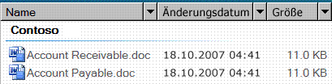

# Benutzeroberflächenautomatisierungs-Unterstützung für den DataGrid-Steuerelementtyp
> [!NOTE]
> Diese Dokumentation ist für .NET Framework-Entwickler vorgesehen, die die verwalteten [!INCLUDE[TLA2#tla_uiautomation](../../../includes/tla2sharptla-uiautomation-md.md)]-Klassen verwenden möchten, die im <xref:System.Windows.Automation>-Namespace definiert sind. Aktuelle Informationen zur [!INCLUDE[TLA2#tla_uiautomation](../../../includes/tla2sharptla-uiautomation-md.md)]finden Sie auf der Seite zur [Windows-Automatisierungs-API: UI-Automatisierung](/windows/win32/winauto/entry-uiauto-win32).  
  
 Dieses Thema enthält Informationen über [!INCLUDE[TLA#tla_uiautomation](../../../includes/tlasharptla-uiautomation-md.md)] -Unterstützung für den Steuerelementtyp „DataGrid“. In [!INCLUDE[TLA2#tla_uiautomation](../../../includes/tla2sharptla-uiautomation-md.md)]umfasst ein Steuerelementtyp eine Reihe von Bedingungen, die ein Steuerelement erfüllen muss, damit die `ControlType` -Eigenschaft verwendet werden kann. Die Bedingungen schließen bestimmte Richtlinien für [!INCLUDE[TLA2#tla_uiautomation](../../../includes/tla2sharptla-uiautomation-md.md)] -Struktur, [!INCLUDE[TLA2#tla_uiautomation](../../../includes/tla2sharptla-uiautomation-md.md)] -Eigenschaftswerte und Steuerelementmuster ein.  
  
 Der DataGrid-Steuerelementtyp ermöglicht dem Benutzer einfaches Arbeiten mit Elementen, die Metadaten enthalten, die in Spalten dargestellt werden. Datenraster-Steuerelemente enthalten Zeilen mit Elementen und Spalten mit Informationen über diese Elemente. Ein Listenansicht-Steuerelement in Microsoft Vista Explorer ist ein Beispiel, für das der DataGrid-Steuerelementtyp unterstützt wird.  
  
 In den folgenden Abschnitten werden die [!INCLUDE[TLA2#tla_uiautomation](../../../includes/tla2sharptla-uiautomation-md.md)] -Struktur, -Eigenschaften, -Steuerelementmuster und -Ereignisse definiert, die für den Steuerelementtyp „DataGrid“ erforderlich sind. Die [!INCLUDE[TLA2#tla_uiautomation](../../../includes/tla2sharptla-uiautomation-md.md)] -Anforderungen gelten für alle Datenraster-Steuerelemente, egal ob [!INCLUDE[TLA#tla_winclient](../../../includes/tlasharptla-winclient-md.md)], [!INCLUDE[TLA#tla_win32](../../../includes/tlasharptla-win32-md.md)]oder [!INCLUDE[TLA#tla_winforms](../../../includes/tlasharptla-winforms-md.md)].  
  
## Erforderliche Benutzeroberflächenautomatisierungs-Struktur  
 In der folgenden Tabelle werden die Steuerelementansicht und die Inhaltsansicht der [!INCLUDE[TLA2#tla_uiautomation](../../../includes/tla2sharptla-uiautomation-md.md)] -Struktur für Datenraster-Steuerelemente sowie die möglichen Inhalte dieser Ansichten beschrieben. Weitere Informationen über die [!INCLUDE[TLA2#tla_uiautomation](../../../includes/tla2sharptla-uiautomation-md.md)] -Struktur finden Sie unter [UI Automation Tree Overview](ui-automation-tree-overview.md).  
  
|[!INCLUDE[TLA2#tla_uiautomation](../../../includes/tla2sharptla-uiautomation-md.md)] -Struktur – Steuerelementansicht|[!INCLUDE[TLA2#tla_uiautomation](../../../includes/tla2sharptla-uiautomation-md.md)] -Struktur – Inhaltsansicht|  
|------------------------------------------------------------------------------------------------|------------------------------------------------------------------------------------------------|  
|DataGrid   <ul><li>Header (0, 1 oder 2)   <ul><li>HeaderItem (Anzahl von Spalten oder Zeilen)</li></ul></li><li>DataItem (0 oder mehr, kann hierarchisch strukturiert werden)</li></ul>|DataGrid   -DataItem (0 oder mehr; kann in der Hierarchie strukturiert werden)|  
  
   
## Erforderliche Benutzeroberflächenautomatisierungs-Eigenschaften  
 In der folgenden Tabelle werden die Eigenschaften aufgelistet, deren Werte oder Definitionen für Datenratser-Steuerelemente besonders relevant sind. Weitere Informationen zu [!INCLUDE[TLA2#tla_uiautomation](../../../includes/tla2sharptla-uiautomation-md.md)] Eigenschaften finden Sie unter [Benutzeroberflächenautomatisierungs-Eigenschaften für Clients](ui-automation-properties-for-clients.md).  
  
|Die Eigenschaften-|Wert|Hinweise|  
|--------------|-----------|-----------|  
|<xref:System.Windows.Automation.AutomationElementIdentifiers.AutomationIdProperty>|Siehe Hinweise.|Der Wert dieser Eigenschaft muss für alle Steuerelemente in einer Anwendung eindeutig sein.|  
|<xref:System.Windows.Automation.AutomationElementIdentifiers.BoundingRectangleProperty>|Siehe Hinweise.|Das äußere Rechteck, das das gesamte Steuerelement enthält.|  
|<xref:System.Windows.Automation.AutomationElementIdentifiers.ClickablePointProperty>|Siehe Hinweise.|Unterstützt, wenn es ein umschließendes Rechteck gibt. Wenn nicht auf jeden Punkt innerhalb des umschließenden Rechtecks geklickt werden kann, und Sie spezielle Treffertests ausführen, setzen Sie einen Punkt, auf den geklickt werden kann, außer Kraft und stellen ihn anschließend bereit.|  
|<xref:System.Windows.Automation.AutomationElementIdentifiers.ControlTypeProperty>|DataGrid|Dieser Wert ist für alle Benutzeroberflächenframeworks gleich.|  
|<xref:System.Windows.Automation.AutomationElementIdentifiers.IsContentElementProperty>|True|Diese Eigenschaft muss immer den Wert „True“ haben. Dies bedeutet, dass das Datenraster-Steuerelement immer in der Inhaltsansicht der [!INCLUDE[TLA2#tla_uiautomation](../../../includes/tla2sharptla-uiautomation-md.md)] Struktur enthalten sein muss.|  
|<xref:System.Windows.Automation.AutomationElementIdentifiers.IsControlElementProperty>|True|Diese Eigenschaft muss immer den Wert „True“ haben. Dies bedeutet, dass das Datenraster-Steuerelement immer in der Steuerelementansicht der [!INCLUDE[TLA2#tla_uiautomation](../../../includes/tla2sharptla-uiautomation-md.md)] Struktur enthalten sein muss.|  
|<xref:System.Windows.Automation.AutomationElementIdentifiers.IsKeyboardFocusableProperty>|Siehe Hinweise.|Wenn das Steuerelement den Tastaturfokus erhalten kann, muss es diese Eigenschaft unterstützen.|  
|<xref:System.Windows.Automation.AutomationElementIdentifiers.LabeledByProperty>|Siehe Hinweise.|Wenn eine statische Textbezeichnung vorhanden ist, muss diese Eigenschaft einen Verweis auf das entsprechende Steuerelement verfügbar machen.|  
|<xref:System.Windows.Automation.AutomationElementIdentifiers.LocalizedControlTypeProperty>|„Datenraster“|Lokalisierte Zeichenfolge für den Steuerelementtyp „DataGrid“.|  
|<xref:System.Windows.Automation.AutomationElementIdentifiers.NameProperty>|Siehe Hinweise.|Das Datenraster-Steuerelement ruft in der Regel den Wert für seine `Name` -Eigenschaft aus einer statischen Textbezeichnung ab. Ist keine statische Textbezeichnung vorhanden, muss ein Anwendungsentwickler einen Wert für die `Name` -Eigenschaft zuweisen. Der Wert der `Name` -Eigenschaft darf nie der Textinhalt des Bearbeitungssteuerelements sein.|  
  
## Erforderliche Benutzeroberflächenautomatisierungs-Steuerelementmuster  
 In der folgenden Tabelle werden die Steuerelementmuster aufgelistet, die von allen Datenraster-Steuerelementen unterstützt werden müssen. Weitere Informationen über Steuerelementmuster finden Sie unter [UI Automation Control Patterns Overview](ui-automation-control-patterns-overview.md).  
  
|Steuerelementmuster|Unterstützungswert|Hinweise|  
|---------------------|-------------|-----------|  
|<xref:System.Windows.Automation.Provider.IGridProvider>|Ja|Das Datenraster-Steuerelement selbst unterstützt immer das Raster-Steuerelementmuster (Grid), da die in ihm enthaltenen Elemente Metadaten sind, die in einem Raster angeordnet sind.|  
|<xref:System.Windows.Automation.Provider.IScrollProvider>|Variabel|Die Möglichkeit, im Datenraster zu scrollen, hängt vom Inhalt und davon ab, ob Scrollleisten vorhanden sind.|  
|<xref:System.Windows.Automation.Provider.ISelectionProvider>|Variabel|Die Möglichkeit, das Datenraster auszuwählen, hängt vom Inhalt ab.|  
|<xref:System.Windows.Automation.Provider.ITableProvider>|Ja|Das Datenrarster-Steuerelement hat immer einen Header in seiner Unterstruktur, sodass das Table-Steuerelementmuster unterstützt werden muss.|  
  
 Datenelemente im Datenrastercontainer unterstützen mindestens Folgendes:  
  
- SelectionItem-Steuerelementmuster (wenn das Datenraster ausgewählt werden kann)  
  
- ScrollItem-Steuerelementmuster (wenn im Datenraster gescrollt werden kann)  
  
- GridItem-Steuerelementmuster  
  
- TableItem-Steuerelementmuster  
  
   
## Erforderliche Benutzeroberflächenautomatisierungs-Ereignisse  
 In der folgenden Tabelle sind die [!INCLUDE[TLA2#tla_uiautomation](../../../includes/tla2sharptla-uiautomation-md.md)] -Ereignisse aufgelistet, die von allen Datenraster-Steuerelementen unterstützt werden müssen. Weitere Informationen zu Ereignissen finden Sie unter [UI Automation Events Overview](ui-automation-events-overview.md).  
  
|[!INCLUDE[TLA2#tla_uiautomation](../../../includes/tla2sharptla-uiautomation-md.md)] -Ereignis|Unterstützungswert|Hinweise|  
|---------------------------------------------------------------------------------|-------------|-----------|  
|<xref:System.Windows.Automation.AutomationElementIdentifiers.AutomationFocusChangedEvent>|Erforderlich|Keiner|  
|Durch geänderte<xref:System.Windows.Automation.AutomationElementIdentifiers.BoundingRectangleProperty> -Eigenschaft ausgelöstes Ereignis.|Erforderlich|Keiner|  
|Durch geänderte<xref:System.Windows.Automation.AutomationElementIdentifiers.IsEnabledProperty> -Eigenschaft ausgelöstes Ereignis.|Erforderlich|Keiner|  
|Durch geänderte<xref:System.Windows.Automation.AutomationElementIdentifiers.IsOffscreenProperty> -Eigenschaft ausgelöstes Ereignis.|Erforderlich|Keiner|  
|<xref:System.Windows.Automation.AutomationElementIdentifiers.LayoutInvalidatedEvent>|Variabel|Keiner|  
|<xref:System.Windows.Automation.AutomationElementIdentifiers.StructureChangedEvent>|Erforderlich|Keiner|  
|Durch geänderte<xref:System.Windows.Automation.MultipleViewPatternIdentifiers.CurrentViewProperty> -Eigenschaft ausgelöstes Ereignis.|Variabel|Keiner|  
|Durch geänderte<xref:System.Windows.Automation.ScrollPatternIdentifiers.HorizontallyScrollableProperty> -Eigenschaft ausgelöstes Ereignis.|Variabel|Wenn das Steuerelement das Scroll-Muster unterstützt, muss es dieses Ereignis unterstützen.|  
|Durch geänderte<xref:System.Windows.Automation.ScrollPatternIdentifiers.HorizontalScrollPercentProperty> -Eigenschaft ausgelöstes Ereignis.|Variabel|Wenn das Steuerelement das Scroll-Muster unterstützt, muss es dieses Ereignis unterstützen.|  
|Durch geänderte<xref:System.Windows.Automation.ScrollPatternIdentifiers.HorizontalViewSizeProperty> -Eigenschaft ausgelöstes Ereignis.|Variabel|Wenn das Steuerelement das Scroll-Muster unterstützt, muss es dieses Ereignis unterstützen.|  
|Durch geänderte<xref:System.Windows.Automation.ScrollPatternIdentifiers.VerticalScrollPercentProperty> -Eigenschaft ausgelöstes Ereignis.|Variabel|Wenn das Steuerelement das Scroll-Muster unterstützt, muss es dieses Ereignis unterstützen.|  
|Durch geänderte<xref:System.Windows.Automation.ScrollPatternIdentifiers.VerticallyScrollableProperty> -Eigenschaft ausgelöstes Ereignis.|Variabel|Wenn das Steuerelement das Scroll-Muster unterstützt, muss es dieses Ereignis unterstützen.|  
|Durch geänderte<xref:System.Windows.Automation.ScrollPatternIdentifiers.VerticalViewSizeProperty> -Eigenschaft ausgelöstes Ereignis.|Variabel|Wenn das Steuerelement das Scroll-Muster unterstützt, muss es dieses Ereignis unterstützen.|  
|<xref:System.Windows.Automation.SelectionPatternIdentifiers.InvalidatedEvent>|Erforderlich|Keiner|  
  
## Beispiel für DataGrid-Steuerelementtyp  
 Das folgende Bild zeigt ein Listenansicht-Steuerelement, für das der DataGrid-Steuerelementtyp implementiert ist.  
  
   
  
 Die Steuerelementansicht und die Inhaltsansicht der [!INCLUDE[TLA2#tla_uiautomation](../../../includes/tla2sharptla-uiautomation-md.md)] -Struktur, die zum Listenansicht-Steuerelement gehört, werden unten dargestellt. Die Steuerelementmuster für jedes Automatisierungselement sind in Klammern aufgeführt.  
  
|[!INCLUDE[TLA2#tla_uiautomation](../../../includes/tla2sharptla-uiautomation-md.md)] -Struktur – Steuerelementansicht|[!INCLUDE[TLA2#tla_uiautomation](../../../includes/tla2sharptla-uiautomation-md.md)] -Struktur – Inhaltsansicht|  
|------------------------------------------------------------------------------------------------|------------------------------------------------------------------------------------------------|  
|<ul><li>DataGrid (Table, Grid, Selection)</li><li>Header   <ul><li>HeaderItem „Name“ (Invoke)</li><li>HeaderItem „Änderungsdatum“ (Invoke)</li><li>HeaderItem „Größe“ (Invoke)</li></ul></li><li>Gruppe "Configuration Manager" (TableItem, GridItem, SelectionItem, Tabelle *, Raster\*)   <ul><li>DataItem "Accounts Receivable. doc" (SelectionItem, Aufruf, TableItem\*, GridItem\*)</li><li>DataItem "Accounts bezahlbar. doc" (SelectionItem, Aufruf, TableItem\*, GridItem\*)</li></ul></li></ul>|<ul><li>DataGrid (Table, Grid, Selection)</li><li>Gruppe "Configuration Manager" (TableItem, GridItem, SelectionItem, Tabelle *, Raster\*)   <ul><li>DataItem "Accounts Receivable. doc" (SelectionItem, Aufruf, TableItem\*, GridItem\*)</li><li>DataItem "Accounts bezahlbar. doc" (SelectionItem, Aufruf, TableItem\*, GridItem\*)</li></ul></li></ul>|  
  
 \* im vorherigen Beispiel wird ein DataGrid-Steuerelement gezeigt, das mehrere Ebenen von Steuerelementen enthält. Das Gruppensteuerelement („Contoso“) enthält zwei Datenelement-Steuerelemente („Accounts Receivable.doc“ und „Accounts Payable.doc“). Ein DataGrid/GridItem-Paar ist unabhängig von einem Paar auf einer anderen Ebene. Die Datenelement-Steuerelemente (DataItem) unter einer Gruppe können auch, statt als einfache Datenelemente, als ListItem-Steuerelementtyp verfügbar gemacht werden, wodurch sie deutlicher als auswählbare Objekte dargestellt werden können. Dieses Beispiel enthält nicht die Unterelemente der gruppierten Datenelemente.  
  
## Siehe auch

- <xref:System.Windows.Automation.ControlType.DataGrid>
- [Übersicht über Steuerelementtypen für Benutzeroberflächenautomatisierung](ui-automation-control-types-overview.md)
- [Übersicht über die Benutzeroberflächenautomatisierung](ui-automation-overview.md)
