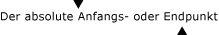

# Übersicht über TextPattern für die Benutzeroberflächenautomatisierung

> [!NOTE]
> Diese Dokumentation ist für .NET Framework-Entwickler vorgesehen, die die verwalteten [!INCLUDE[TLA2#tla_uiautomation](../../../includes/tla2sharptla-uiautomation-md.md)]-Klassen verwenden möchten, die im <xref:System.Windows.Automation>-Namespace definiert sind. Aktuelle Informationen zur [!INCLUDE[TLA2#tla_uiautomation](../../../includes/tla2sharptla-uiautomation-md.md)]finden Sie auf der Seite zur [Windows-Automatisierungs-API: UI-Automatisierung](/windows/win32/winauto/entry-uiauto-win32).

In dieser Übersicht wird beschrieben, wie [!INCLUDE[TLA#tla_uiautomation](../../../includes/tlasharptla-uiautomation-md.md)] verwendet wird, um den Textinhalt (einschließlich Format- und Stilattributen) von Textsteuerelementen auf Plattformen mit [!INCLUDE[TLA2#tla_uiautomation](../../../includes/tla2sharptla-uiautomation-md.md)]-Unterstützung verfügbar zu machen. Zu diesen Steuerelementen gehören das Microsoft .NET Framework <xref:System.Windows.Controls.TextBox> und <xref:System.Windows.Controls.RichTextBox> sowie die zugehörigen Win32-Entsprechungen.

Das Verfügbarmachen des Textinhalt eines Steuerelements wird erreicht, indem das <xref:System.Windows.Automation.TextPattern> -Steuerelementmuster verwendet wird, das den Inhalt eines Textcontainer als Textstream darstellt. Zusätzlich erfordert <xref:System.Windows.Automation.TextPattern> , dass die <xref:System.Windows.Automation.Text.TextPatternRange> -Klasse unterstützt wird, um Format-und Stilattribute verfügbar zu machen. <xref:System.Windows.Automation.Text.TextPatternRange> unterstützt <xref:System.Windows.Automation.TextPattern> dadurch, dass es zusammenhängende oder mehrere unzusammenhängende Textabschnitte in einem Textcontainer mit einer Auflistung von <xref:System.Windows.Automation.Text.TextPatternRangeEndpoint.Start> - und <xref:System.Windows.Automation.Text.TextPatternRangeEndpoint.End> -Endpunkten darstellt. <xref:System.Windows.Automation.Text.TextPatternRange> unterstützt Funktionen wie Auswahl, Vergleich, Abruf und Durchlauf.

> [!NOTE]
> Die <xref:System.Windows.Automation.TextPattern> -Klassen bieten keine Möglichkeit zum Einfügen oder Bearbeiten von Text. Abhängig vom Steuerelement kann dies jedoch durch die [!INCLUDE[TLA2#tla_uiautomation](../../../includes/tla2sharptla-uiautomation-md.md)] <xref:System.Windows.Automation.ValuePattern> oder durch direkte Tastatureingabe erreicht werden. Ein Beispiel finden Sie im [TextPattern Insert Text Sample](https://github.com/Microsoft/WPF-Samples/tree/master/Accessibility/InsertText) .

Die in dieser Übersicht beschriebene Funktionalität ist entscheidend für Hilfstechnologieanbieter und deren Endbenutzer. In Hilfstechnologien kann [!INCLUDE[TLA2#tla_uiautomation](../../../includes/tla2sharptla-uiautomation-md.md)] verwendet werden, um vollständige Textformatierungsinformationen für den Benutzer zu erfassen und programmgesteuerte Navigation sowie Textauswahl gemäß <xref:System.Windows.Automation.Text.TextUnit> (Zeichen, Wort, Zeile oder Absatz) zu verwenden.

## Benutzeroberflächenautomatisierung-TextPattern im Vergleich zu Textdienstframework

Das Text Services-Framework (TSF) ist ein einfaches und skalierbares System Framework, das Dienste für natürliche Sprache und erweiterte Texteingaben auf dem Desktop und innerhalb von Anwendungen ermöglicht. Zusätzlich zur Bereitstellung von Schnittstellen für Anwendungen , um deren Textspeicher verfügbar zu machen, unterstützt es auch Metadaten für diesen Textspeicher.

TSF wurde jedoch für Anwendungen entwickelt, die Eingaben in kontextabhängige Szenarien einfügen müssen, während <xref:System.Windows.Automation.TextPattern> eine schreibgeschützte Lösung ist (mit der oben beschriebenen eingeschränkten Problem Umgehung), die optimierten Zugriff auf einen Text Speicher für Sprachausgaben und Braille-Geräte ermöglichen soll.

Kurz gesagt können barrierefreie Technologien, die schreibgeschützten Zugriff auf einen Text Speicher erfordern, <xref:System.Windows.Automation.TextPattern>verwenden, benötigen jedoch die komplexere Funktionalität von TSF für kontextabhängige Eingaben.

## Steuerelementtypen

### Text

Das Textsteuerelement ist das Grundelement, das einen Text auf dem Bildschirm darstellt.

Ein eigenständiges Textsteuerelement kann als Bezeichnung oder statischer Text in einem Formular verwendet werden. Textsteuerelemente können auch in der Struktur eines <xref:System.Windows.Automation.ControlType.ListItem>-, <xref:System.Windows.Automation.ControlType.TreeItem> - oder <xref:System.Windows.Automation.ControlType.DataItem>- Felds enthalten sein.

> [!NOTE]
> Textsteuerelemente werden möglicherweise nicht in der Inhaltsansicht der [!INCLUDE[TLA2#tla_uiautomation](../../../includes/tla2sharptla-uiautomation-md.md)] -Struktur angezeigt (weitere Informationen finden Sie unter [UI Automation Tree Overview](ui-automation-tree-overview.md)). Dies liegt daran, dass Textsteuerelemente häufig durch die Name-Eigenschaft eines anderen Steuerelements angezeigt werden. Beispielsweise wird der Text für die Bezeichnung eines Bearbeitungssteuerelements über die Name-Eigenschaft des Bearbeitungssteuerelements verfügbar gemacht. Da sich das Bearbeitungssteuerelement in der Inhaltsansicht der [!INCLUDE[TLA2#tla_uiautomation](../../../includes/tla2sharptla-uiautomation-md.md)] -Struktur befindet, muss das Textelement selbst nicht in dieser Ansicht der [!INCLUDE[TLA2#tla_uiautomation](../../../includes/tla2sharptla-uiautomation-md.md)] -Struktur vorhanden sein. In der Inhaltsansicht wird nur Text angezeigt, der kein Text mit redundanten Informationen ist. Dadurch kann jede Hilfstechnologie schnell genau die Informationen herausfiltern, die die Benutzer benötigen.

### Edit

Mit einem Bearbeitungssteuerelement kann ein Benutzer eine einzelne Textzeile anzeigen und bearbeiten

> [!NOTE]
> Die einzelne Textzeile wird in bestimmten Layoutszenarien möglicherweise umbrochen.

### Dokumentieren

Mit einem Dokumentsteuerelement kann ein Benutzer in mehreren Textseiten navigieren und Informationen aus diesen Textseiten abrufen.

## TextPattern-Client-APIs

|||
|-|-|
|`System.Windows.Automation.TextPattern Class`|Der Einstiegspunkt für das [!INCLUDE[TLA#tla_uiautomation](../../../includes/tlasharptla-uiautomation-md.md)] -Textmodell.   Diese Klasse enthält auch die beiden <xref:System.Windows.Automation.TextPattern> -Ereignislistener <xref:System.Windows.Automation.TextPattern.TextSelectionChangedEvent> und <xref:System.Windows.Automation.TextPattern.TextChangedEvent>.|
|`System.Windows.Automation.Text.TextPatternRange Class`|Die Darstellung eines Textabschnitts in einem Textcontainer, der <xref:System.Windows.Automation.TextPattern>unterstützt.   Benutzeroberflächenautomatisierungs-Clients müssen die aktuelle Gültigkeit eines Textbereichs berücksichtigen, der mit <xref:System.Windows.Automation.Text.TextPatternRange>erstellt wurde. Wenn der ursprüngliche Text im Textsteuerelement vollständig durch neuen Text ersetzt wird, verliert der aktuelle Textbereich seine Gültigkeit. Der Textbereich kann jedoch weiterhin teilweise nutzbar sein, wenn nur ein Teil des ursprünglichen Texts geändert wird und das zugrunde liegende Textsteuerelement seinen Text-"Zeiger" mit Ankern (oder Endpunkten) anstatt mit absoluter Zeichenpositionierung verwaltet.   Clients können eine <xref:System.Windows.Automation.TextPattern.TextChangedEvent> überwachen, um Benachrichtigungen über Änderungen zu erhalten, die an dem von ihnen verwendeten Textinhalt vorgenommen wurden.|
|`System.Windows.Automation.AutomationTextAttribute Class`|Wird verwendet, um die Formatierungsattribute eines Textbereichs zu identifizieren.|

## TextPattern-Anbieter-APIs

Benutzeroberflächenelemente oder Steuerelemente, die <xref:System.Windows.Automation.TextPattern> durch Implementieren der <xref:System.Windows.Automation.Provider.ITextProvider> - und der <xref:System.Windows.Automation.Provider.ITextRangeProvider> -Schnittstelle entweder direkt oder über [!INCLUDE[TLA#tla_uiautomation](../../../includes/tlasharptla-uiautomation-md.md)] -Proxys unterstützen, können ausführliche Attributinformationen zu jedem Text verfügbar machen, den sie enthalten, und bieten zusätzlich stabile Navigationsfunktionen.

Ein <xref:System.Windows.Automation.TextPattern> -Anbieter muss nicht alle Textattribute unterstützen, wenn das Steuerelement bestimmte Attribute nicht unterstützt.

Wenn das Steuerelement Textauswahl oder Platzierung des Textcursors (bzw. Systemeinfügezeichens) innerhalb des Textbereichs unterstützt, muss ein <xref:System.Windows.Automation.TextPattern> -Anbieter die <xref:System.Windows.Automation.TextPattern.GetSelection%2A> - und die <xref:System.Windows.Automation.Text.TextPatternRange.Select%2A> -Funktion unterstützen. Wenn das Steuerelement diese Funktionalität nicht unterstützt, muss es diese beiden Methoden nicht unterstützen. Das Steuerelement muss jedoch den von ihm unterstützten Typ der Textauswahl durch Implementieren der <xref:System.Windows.Automation.Provider.ITextProvider.SupportedTextSelection%2A> -Eigenschaft verfügbar machen.

Ein <xref:System.Windows.Automation.TextPattern> -Anbieter muss immer die <xref:System.Windows.Automation.Text.TextUnit> -Konstanten <xref:System.Windows.Automation.Text.TextUnit.Character> und <xref:System.Windows.Automation.Text.TextUnit.Document> sowie jede andere <xref:System.Windows.Automation.Text.TextUnit> -Konstante unterstützen, die er unterstützen kann.

> [!NOTE]
> Der Anbieter kann die Unterstützung für eine bestimmte <xref:System.Windows.Automation.Text.TextUnit> überspringen, indem er in der folgenden Reihenfolge zur nächstgrößeren unterstützten <xref:System.Windows.Automation.Text.TextUnit> wechselt: <xref:System.Windows.Automation.Text.TextUnit.Character>, <xref:System.Windows.Automation.Text.TextUnit.Format>, <xref:System.Windows.Automation.Text.TextUnit.Word>, <xref:System.Windows.Automation.Text.TextUnit.Line>, <xref:System.Windows.Automation.Text.TextUnit.Paragraph>, <xref:System.Windows.Automation.Text.TextUnit.Page>und <xref:System.Windows.Automation.Text.TextUnit.Document>.

|||
|-|-|
|`ITextProvider Interface`|Macht Methoden, Eigenschaften und Attribute verfügbar, die <xref:System.Windows.Automation.TextPattern> in Clientanwendungen unterstützen (weitere Informationen finden Sie unter <xref:System.Windows.Automation.Provider.ITextProvider>).|
|`ITextRangeProvider Interface`|Stellt einen Textabschnitt in einem Textanbieter dar (weitere Informationen finden Sie unter <xref:System.Windows.Automation.Provider.ITextRangeProvider>).|
|`System.Windows.Automation.TextPatternIdentifiers Class`|Enthält Werte, die als Bezeichner für Textanbieter verwendet werden (weitere Informationen finden Sie unter <xref:System.Windows.Automation.TextPatternIdentifiers>).|

## Sicherheit

Die [!INCLUDE[TLA2#tla_uiautomation](../../../includes/tla2sharptla-uiautomation-md.md)] -Architektur wurde unter Berücksichtigung von Sicherheitsaspekten entwickelt (weitere Informationen finden Sie unter [UI Automation Security Overview](ui-automation-security-overview.md)). Die in dieser Übersicht beschriebenen TextPattern-Klassen erfordern jedoch einige besondere Sicherheitsüberlegungen.

- [!INCLUDE[TLA#tla_uiautomation](../../../includes/tlasharptla-uiautomation-md.md)] - Textanbieter stellen schreibgeschützte Schnittstellen und bieten keine Möglichkeit, den vorhandenen Text in einem Steuerelement zu ändern.

- Benutzeroberflächenautomatisierungs-Clients können [!INCLUDE[TLA#tla_uiautomation](../../../includes/tlasharptla-uiautomation-md.md)] nur verwenden, wenn sie vollständig „vertrauenswürdig“ sind. Ein Beispiel hierfür ist der geschützte Anmeldedesktop, in dem nur bekannte und vertrauenswürdige Anwendungen ausgeführt werden können.

- Entwickler von Benutzeroberflächenautomatisierungs-Anbietern sollten sich bewusst sein, dass alle Informationen, die sie in ihren Steuerelementen über [!INCLUDE[TLA#tla_uiautomation](../../../includes/tlasharptla-uiautomation-md.md)] verfügbar machen, grundsätzlich öffentlich und für anderen Code vollständig zugänglich sind. [!INCLUDE[TLA#tla_uiautomation](../../../includes/tlasharptla-uiautomation-md.md)] ermittelt nicht die Vertrauenswürdigkeit irgendeines Benutzeroberflächenautomatisierungs-Clients, und daher sollte der Benutzeroberflächenautomatisierungs-Anbieter weder geschützte Inhalte noch vertrauliche Textinformationen (z. B. Kennwortfelder) verfügbar machen.

- Eine der signifikantesten Änderungen an der Sicherheit für Windows Vista wird im Allgemeinen als "sichere Eingabe" bezeichnet. Diese umfasst Technologien wie z. b. die Benutzerkonten mit den geringsten Rechten (oder beschränkten) Benutzerkonten (LUA) und die Isolation auf Benutzeroberflächen Ebene (UIPI).

  - UIPI hindert ein Programm daran, ein anderes Programm, das mehr Berechtigungen hat, zu steuern und/oder zu überwachen. Dadurch verhindert UIPI Angriffe durch prozessübergreifende Fenstermeldungen, die Benutzereingaben vortäuschen.

  - LUA begrenzt die Berechtigungen von Anwendungen, die von Benutzern der Gruppe "Administratoren" ausgeführt werden. Anwendungen haben nicht notwendigerweise Administratorberechtigungen, sondern werden stattdessen mit den niedrigsten erforderlichen Berechtigungen ausgeführt. Hierdurch werden in LUA-Szenarien möglicherweise einige Beschränkungen erzwungen. Dies ist insbesondere die Kürzung von Zeichenfolgen (einschließlich TextPattern-Zeichenfolgen), wobei es erforderlich sein kann, die Länge der Zeichenfolgen zu beschränken, die von einer Anwendung auf Administratorebene abgerufen werden, sodass die Anwendung nicht gezwungen ist, bis zu ihrer Deaktivierung Arbeitsspeicher zuzuordnen.

## Leistung

Da der überwiegende Teil der TextPattern-Funktionalität auf prozessübergreifenden Aufrufen basiert, stellt diese Klasse keinen Mechanismus zum Zwischenspeichern bereit, um die Leistung beim Verarbeiten von Inhalten zu verbessern. Hierin besteht ein Unterschied zu anderen Steuerelementmustern in [!INCLUDE[TLA#tla_uiautomation](../../../includes/tlasharptla-uiautomation-md.md)] , auf die über die <xref:System.Windows.Automation.AutomationElement.GetCachedPattern%2A> - oder die <xref:System.Windows.Automation.AutomationElement.TryGetCachedPattern%2A> -Methode zugegriffen werden kann.

Zum Verbessern der Leistung ist eine Möglichkeit, durch Verwenden von <xref:System.Windows.Automation.Text.TextPatternRange.GetText%2A>sicherzustellen, dass Benutzeroberflächenautomatisierungs-Clients versuchen, mäßig große Textblöcke abzurufen. Beispielsweise ergeben GetText(1)-Aufrufe prozessübergreifende Treffer für jedes Zeichen, wogegen ein GetText(-1)-Aufruf einen prozessübergreifenden Treffer ergibt, der aber abhängig von der Größe des Textanbieters eine lange Wartezeit haben kann.

## TextPattern-Terminologie

**Attribut**\
Eine Formatierungseigenschaft eines Textbereichs (z. B. <xref:System.Windows.Automation.TextPattern.IsItalicAttribute> oder <xref:System.Windows.Automation.TextPattern.FontNameAttribute>).

**Degenerierter Bereich**\
Ein degenerierter Bereich ist ein leerer Bereich bzw. ein Textbereich mit 0 (null) Zeichen. Im Zusammenhang mit TextPattern-Steuerelementmustern wird die Einfügemarke (bzw. das Systemeinfügezeichen) als degenerierter Bereich angesehen. Wenn kein Text ausgewählt ist, gibt <xref:System.Windows.Automation.TextPattern.GetSelection%2A> einen degenerierten Bereich an der Texteinfügemarke und <xref:System.Windows.Automation.TextPattern.RangeFromPoint%2A> einen degenerierten Bereich als seinen Startpunkt zurück. <xref:System.Windows.Automation.TextPattern.RangeFromChild%2A> und <xref:System.Windows.Automation.TextPattern.GetVisibleRanges%2A> können degenerierte Bereiche zurückgeben, wenn der Anbieter keine Textbereiche findet, die der angegebenen Bedingung entsprechen. Dieser degenerierte Bereich kann als Startpunkt im Textanbieter verwendet werden. <xref:System.Windows.Automation.Text.TextPatternRange.FindText%2A> und <xref:System.Windows.Automation.Text.TextPatternRange.FindAttribute%2A> geben einen NULL-Verweis (`Nothing` in Microsoft Visual Basic .net) zurück, um Verwechslungen mit einem ermittelten Bereich und einem degenerierten Bereich zu vermeiden.

**Eingebettetes Objekt**\
Es gibt zwei Typen von eingebetteten Objekten im [!INCLUDE[TLA2#tla_uiautomation](../../../includes/tla2sharptla-uiautomation-md.md)] -Textmodell. Diese umfassen textbasierte Inhaltselemente, z. B. Links oder Tabellen, und Steuerelemente, z. B. Bilder und Schaltflächen. Ausführlichere Informationen finden Sie unter [Access Embedded Objects Using UI Automation](access-embedded-objects-using-ui-automation.md).

**Endpunkt**\
Der absolute <xref:System.Windows.Automation.Text.TextPatternRangeEndpoint.Start> - oder <xref:System.Windows.Automation.Text.TextPatternRangeEndpoint.End> -Punkt eines Textbereichs in einem Textcontainer.

Die folgende Abbildung veranschaulicht einen Start- und einen Endpunkt.

**TextRange** -\
Eine Darstellung eines Textabschnitts samt Start- und Endpunkt in einem Textcontainer einschließlich aller zugeordneten Attribute und Funktionen.

<xref:System.Windows.Automation.Text.TextUnit>\
Eine vordefinierte Texteinheit (Zeichen, Wort, Zeile oder Absatz), die zum Navigieren durch logische Segmente eines Textbereichs verwendet.

## Siehe auch

- [Steuerelementmuster für Benutzeroberflächenautomatisierung für Clients](ui-automation-control-patterns-for-clients.md)
- [Übersicht über Steuerelementmuster für Benutzeroberflächenautomatisierung](ui-automation-control-patterns-overview.md)
- [Übersicht über die Benutzeroberflächenautomatisierungs-Struktur](ui-automation-tree-overview.md)
- [Verwenden der Zwischenspeicherung in der Benutzeroberflächenautomatisierung](use-caching-in-ui-automation.md)
- [Unterstützung von Steuerelementmustern in einem Benutzeroberflächenautomatisierungs-Anbieter](support-control-patterns-in-a-ui-automation-provider.md)
- [Zuordnen von Steuerelementmustern für Benutzeroberflächenautomatisierungs-Clients](control-pattern-mapping-for-ui-automation-clients.md)
- [Textdienstframework](/windows/desktop/api/_tsf/)
