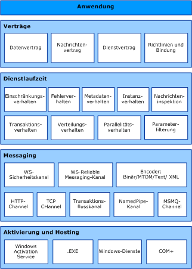

# Windows Communication Foundation-Architektur
In der folgenden Abbildung werden die Hauptebenen der Windows Communication Foundation (WCF)-Architektur veranschaulicht.  
  
## WCF-Architektur  
   
  
### Verträge und Beschreibungen  
 Verträge definieren verschiedene Aspekte des Nachrichtensystems. Der Datenvertrag beschreibt alle Parameter, aus denen die einzelnen Nachrichten bestehen, die ein Dienst erstellen oder verarbeiten kann. Die Nachrichtenparameter werden in XSD-Dokumenten (XML-Schemadefinitionssprache) definiert. Dadurch kann jedes XML-fähige System die Dokumente verarbeiten. Der Nachrichtenvertrag definiert anhand von SOAP-Protokollen bestimmte Nachrichtenteile und ermöglicht eine detailliertere Steuerung der Teile einer Nachricht, wenn die Interoperabilität diese Genauigkeit verlangt. Der Dienstvertrag gibt die tatsächlichen Methodensignaturen des Dienstes an und wird als Schnittstelle in einer der unterstützten Programmiersprachen verteilt (z.&#160;B. Visual Basic oder Visual C#).  
  
 Richtlinien und Bindungen legen die zur Kommunikation mit einem Dienst erforderlichen Bedingungen fest.  Beispielsweise muss die Bindung (mindestens) den verwendeten Transport (z.&#160;B. HTTP oder TCP) und eine Codierung angeben. Richtlinien schließen Sicherheitsanforderungen und andere Bedingungen ein, die für die Kommunikation mit einem Dienst erfüllt werden müssen.  
  
### Dienstlaufzeit  
 Die Dienstlaufzeitebene umfasst Verhaltensweisen, die nur während der tatsächlichen Ausführung des Dienstes auftreten, d.&#160;h. das Laufzeitverhalten des Dienstes. Die Drosselung steuert, wie viele Nachrichten verarbeitet werden. Diese Zahl kann geändert werden, wenn die Nachfrage nach dem Dienst ein voreingestelltes Limit erreicht. Für den Fall eines internen Dienstfehlers gibt das Fehlerverhalten die zu ergreifenden Maßnahmen an, z.&#160;B. indem es steuert, welche Informationen an den Client übermittelt werden. (Zu viele Informationen können einem böswilligen Benutzer einen Vorteil beim Bereitstellen eines Angriffs verschaffen.) Das Metadatenverhalten steuert, wie und ob Metadaten der Außenwelt zur Verfügung gestellt werden. Wie viele Instanzen des Dienstes ausgeführt werden können, wird vom Instanzenverhalten angegeben (Singleton gibt z. B. nur eine Instanz zur Verarbeitung aller Nachrichten an). Das Transaktionsverhalten ermöglicht einen Rollback von durchgeführten Vorgängen im Fall eines Fehlers. Mit dem Dispatchverhalten wird gesteuert, wie eine Nachricht von der WCF-Infrastruktur verarbeitet wird.  
  
 Die Erweiterbarkeit ermöglicht eine Anpassung der Laufzeitprozesse. Beispielsweise werden mit der Nachrichteninspektion Teile einer Nachricht überprüft, und mit der Parameterfilterung finden anhand von Filtern, die auf Nachrichtenheader angewendet werden, voreingestellte Aktionen statt.  
  
### Nachrichten  
 Die Messaging Schicht besteht aus *Kanälen*. Ein Kanal ist eine Komponete, die eine Nachricht in bestimmter Weise verarbeitet, z.&#160;B. durch Authentifizierung. Ein Satz von Kanälen wird auch als *Kanal Stapel*bezeichnet. Kanäle arbeiten mit Nachrichten und Nachrichtenheadern. Die Dienstlaufzeitebene hingegen verarbeitet hauptsächlich den Inhalt des Nachrichtentexts.  
  
 Es gibt zwei Arten von Kanälen: Transportkanäle und Protokollkanäle.  
  
 Transportkanäle lesen und schreiben Nachrichten aus dem Netzwerk (oder einem Kommunikationspunkt zur Außenwelt). Bei einigen Transporten wird ein Encoder verwendet, um Nachrichten (die als XML-Infosets dargestellt werden) in und aus der Bytestreamdarstellung des Netzwerks zu konvertieren. HTTP, benannte Pipes, TCP und MSMQ sind Beispiele für Transporte. Beispiele für Codierungen sind XML und optimierte Binärdateien.  
  
 Protokollkanäle implementieren Nachrichtenverarbeitungsprotokolle. Das erfolgt häufig durch Lesen oder Schreiben zusätzlicher Header in die Nachricht. Zu diesen Protokollen gehören beispielsweise WS-Security und WS-Reliability.  
  
 Die Messagingebene stellt die möglichen Formate und die Austauschmuster der Daten dar. WS-Security ist eine Implementierung der WS-Security-Spezifikation, die die Sicherheit auf der Nachrichtenebene aktiviert. Der WS-Reliable Messaging-Kanal stellt die Nachrichtenübermittlung sicher. Mit einer Vielzahl von Codierungen ermöglichen es Encoder, die Nachrichtenanforderungen zu erfüllen. Der HTTP-Kanal gibt die Verwendung des Hypertextübertragungsprotokolls zur Nachrichtenübermittlung an. Entsprechend gibt der TCP-Kanal die Verwendung des TCP-Protokolls an. Der Transaktionsflusskanal bestimmt die Muster von Transaktionsnachrichten. Der Kanal für benannte Pipes ermöglicht die prozessübergreifende Kommunikation. Der MSMQ-Kanal ermöglicht die Interoperation zwischen MSMQ-Anwendungen.  
  
### Hosting und Aktivierung  
 Ein Dienst ist letztendlich ein Programm. Wie andere Programme muss ein Dienst in einer ausführbaren Datei ausgeführt werden. Dies wird als *selbstgeh osteter* Dienst bezeichnet.  
  
 Dienste können auch *gehostet*werden oder in einer ausführbaren Datei ausgeführt werden, die von einem externen Agent verwaltet wird, z. b. IIS oder Windows Activation Service (was). Was ermöglicht die automatische Aktivierung von WCF-Anwendungen bei der Bereitstellung auf einem Computer mit was. Sie können Dienste gegebenenfalls manuell als ausführbare Dateien (EXE-Dateien) ausführen. Ein Dienst kann auch automatisch als Windows-Dienst ausgeführt werden. Com+-Komponenten können auch als WCF-Dienste gehostet werden.  
  
## Weitere Informationen

- [Was ist die Windows Communication Foundation?](whats-wcf.md)
- [Wesentliche Windows Communication Foundation-Begriffe](fundamental-concepts.md)
